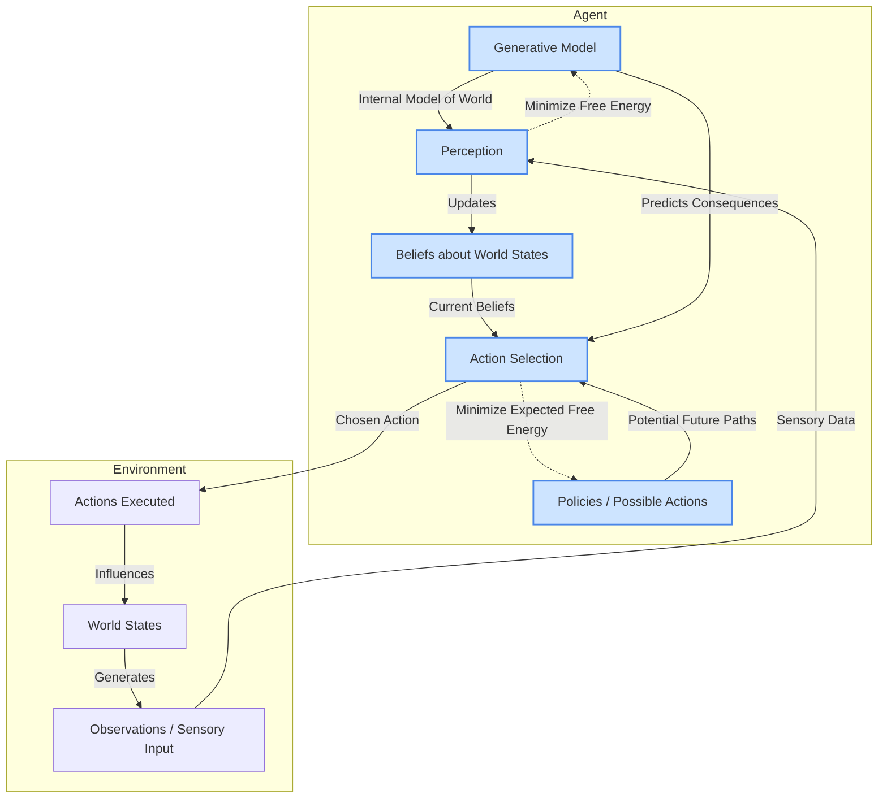

# GEO-INFER-ACT

**Active Inference Modeling for Geospatial Systems**

## Overview

GEO-INFER-ACT is the premier Active Inference module within the GEO-INFER framework, implementing **state-of-the-art mathematical and computational machinery** for designing, implementing, and analyzing intelligent agents and systems that perceive, learn, and act in complex, dynamic geospatial environments. 

Built on the **Free Energy Principle** from theoretical neuroscience and biology, this module provides a first-principles approach that models sentient behavior as a process of minimizing variational free energy, equivalent to maximizing Bayesian model evidence or minimizing surprise. The implementation integrates the latest research from the [**Active Inference Institute**](https://www.activeinference.institute/) and peer-reviewed literature to deliver cutting-edge capabilities for nested and interacting systems.

### 🌟 Advanced Capabilities

- **Hierarchical Active Inference** with message passing between multiple timescales
- **Markov Blanket Architectures** for conditional independence and self-organization  
- **Modern Tool Integration** with [RxInfer.jl](https://github.com/biaslab/RxInfer.jl), [Bayeux](https://github.com/jax-ml/bayeux), [pymdp](https://github.com/infer-actively/pymdp)
- **Spatial-Temporal Extensions** for geospatial applications with H3 integration
- **Neural Field Dynamics** for large-scale spatial modeling
- **Multi-Agent Coordination** with consensus and hierarchical protocols

## Core Principles of Active Inference

-   **Generative Model:** Agents possess an internal model of how their sensory inputs are generated by states of the world (including their own actions).
-   **Free Energy Principle:** All biological systems (and by extension, intelligent agents) resist the natural tendency to disorder by minimizing the long-term average of surprise (or maximizing sensory evidence for their model of the world). This is achieved by minimizing variational free energy, an information-theoretic quantity that bounds surprise.
-   **Action as Inference:** Action is not merely a response to stimuli but an inferential process. Agents select actions that they expect will minimize their future expected free energy (i.e., actions that lead to preferred states and resolve uncertainty).
-   **Perception as Inference:** Perception involves inverting the generative model to infer the hidden causes of sensory inputs, effectively updating beliefs about the state of the world.

## Key Features

-   **Generative Models for Spatial-Temporal Dynamics:** Tools for defining and implementing probabilistic generative models that capture the causal structure of geospatial processes, including how states evolve over time and vary across space.
    -   Includes support for discrete and continuous state-space models, (Partially Observable) Markov Decision Processes (POMDPs), and dynamic Bayesian networks.
-   **Free-Energy Minimization Frameworks:** Algorithmic implementations for both perceptual inference (belief updating via free energy minimization) and action selection (policy selection via expected free energy minimization).
-   **Probabilistic Programming Integration:** Interfaces with probabilistic programming languages (PPLs) and libraries (e.g., PyMC, Stan, Pyro) to facilitate the specification of complex generative models and the use of advanced variational inference techniques.
-   **Multi-Scale & Multi-Agent Active Inference:** Capabilities for designing models where multiple agents interact, or where individual agents model their environment at different levels of abstraction or scales (nested inference).
-   **Belief Propagation & Message Passing:** Algorithms for efficient belief updating in complex, factorized generative models.
-   **Sophisticated Sensation and Action Models:** Flexible ways to define how agents sense their environment (observation likelihoods) and the consequences of their actions (transition dynamics).

## Active Inference Agent Architecture (Conceptual)



-   **Generative Model (GM):** The agent's internal probabilistic model of how observations are generated from hidden world states and its own actions.
-   **Beliefs (BEL):** The agent's current probability distribution over possible world states, updated via perception.
-   **Perception (PER):** The process of inverting the generative model to update beliefs based on new sensory input, aiming to minimize variational free energy.
-   **Policies (POL):** A set of possible sequences of future actions available to the agent.
-   **Action Selection (ACT):** The process of choosing a policy that is expected to minimize future expected free energy (balancing epistemic value - resolving uncertainty, and pragmatic value - reaching preferred states).

## Mathematical Framework

GEO-INFER-ACT leverages and provides tools for working with advanced mathematical concepts:

-   **Bayesian Statistics & Probability Theory:** Foundation for belief representation and updating.
-   **Information Theory:** Concepts like entropy, KL-divergence, mutual information are central to free energy formulations.
-   **Variational Inference:** Techniques (e.g., mean-field approximation, message passing) for approximating intractable posterior distributions.
-   **Markov Decision Processes (MDPs) & POMDPs:** Formalisms for modeling decision-making in stochastic environments.
-   **Dynamic Causal Modeling (DCM):** A Bayesian framework for inferring the parameters and structure of dynamic systems, often used for specifying generative models of interconnected systems.
-   **Predictive Coding Networks:** Neural network architectures inspired by the principle of minimizing prediction error, which can be seen as a specific implementation of active inference.
-   **Stochastic Optimal Control:** Provides a link between expected free energy minimization and established control theory principles.

## Data Flow

### Inputs
- **Primary Data Sources**:
  - Observations and sensory data from geospatial environments
  - Prior beliefs and generative model specifications
  - Policy spaces and action repertoires
  - Historical data for model training and validation
  - Environmental state information from GEO-INFER-SPACE/TIME

- **Configuration Requirements**:
  - `active_inference_config.yaml`: Model parameters, learning rates
  - `generative_models/`: Pre-defined model architectures
  - Precision parameters and uncertainty specifications

- **Dependencies**:
  - **Required**: GEO-INFER-MATH (optimization), GEO-INFER-BAYES (inference)
  - **Optional**: GEO-INFER-AI (neural architectures), GEO-INFER-AGENT (multi-agent), GEO-INFER-SIM (environments)

### Processes
- **Perception (Belief Updating)**:
  - Inverting generative models to update posterior beliefs
  - Minimizing variational free energy for belief updates
  - Processing sensory evidence and environmental observations
  - Handling uncertainty and prediction errors

- **Action Selection (Policy Optimization)**:
  - Expected free energy minimization for policy selection
  - Balancing epistemic value (exploration) and pragmatic value (exploitation)
  - Planning under uncertainty with temporal horizons
  - Multi-scale decision making across spatial-temporal scales

- **Model Learning & Adaptation**:
  - Updating generative model parameters
  - Learning new environmental dynamics
  - Adapting to changing conditions
  - Meta-learning across similar environments

### Outputs
- **Belief States**:
  - Updated posterior distributions over environmental states
  - Uncertainty estimates and confidence measures
  - Predictive distributions for future states
  - Model evidence and surprise measures

- **Actions & Policies**:
  - Selected actions and policy sequences
  - Expected free energy calculations
  - Exploration-exploitation trade-offs
  - Adaptive decision strategies

- **Integration Points**:
  - Belief states inform GEO-INFER-AGENT behaviors
  - Actions feed into GEO-INFER-SIM environments
  - Models support GEO-INFER-AI predictive systems
  - Decision frameworks guide domain-specific modules

## Directory Structure
```
GEO-INFER-ACT/
├── docs/               # Detailed documentation, theoretical background
├── examples/           # Example implementations and use cases
├── src/                # Source code
│   └── geo_infer_act/  # Main Python package
│       ├── api/        # Programmatic interfaces for the module
│       ├── core/       # Core algorithms (free energy, belief updating, policy selection)
│       ├── models/     # Definitions for generative models, agent structures
│       └── utils/      # Utility functions, math helpers, visualization tools
└── tests/              # Unit and integration tests
```

## Getting Started

### Prerequisites
- Python 3.9+
- NumPy, SciPy
- Optionally, a PPL like PyMC or Pyro for advanced model specification.

### Installation
```bash
# From the monorepo root
pip install -e ./GEO-INFER-ACT
```

### Configuration
Configuration for specific models or experiments (e.g., prior distributions, state-space definitions, learning rates) can be managed via YAML files in the `config/` directory (create if not present) or directly within Python scripts.
```bash
# Example: cp examples/config/example_model_config.yaml config/my_experiment_config.yaml
# Then edit my_experiment_config.yaml
```

### Running Tests
```bash
pytest tests/
```

## Integration with Other Modules

GEO-INFER-ACT is designed to deeply integrate with other GEO-INFER modules:

-   **GEO-INFER-SPACE & GEO-INFER-TIME:** These modules provide the foundational spatial and temporal data, structures (e.g., grids, networks), and dynamics that are incorporated into the generative models used by ACT agents. ACT agents perceive and act within these spatio-temporal contexts.
-   **GEO-INFER-AI:** While ACT is a specific type of AI, it can leverage general AI tools (e.g., deep learning for complex likelihood functions within generative models) from GEO-INFER-AI. Conversely, active inference models can provide a principled basis for more explainable and robust AI systems.
-   **GEO-INFER-AGENT:** ACT provides the core decision-making and learning framework (the "brain") for intelligent agents defined in the AGENT module. AGENT handles higher-level agent abstractions and multi-agent coordination, while ACT focuses on the inferential machinery.
-   **GEO-INFER-SIM:** Simulations from SIM can be used as "virtual environments" for training and testing ACT agents. Furthermore, ACT agents can be embedded within SIM simulations to model complex adaptive behaviors.
-   **GEO-INFER-ANT:** For specialized complex systems like ant colonies, ANT may provide specific ecological or behavioral models that can be integrated as components within a broader active inference framework managed by ACT.
-   **GEO-INFER-COG:** Cognitive concepts from COG (e.g., attention, memory models) can inform the design of more sophisticated generative models and inference processes within ACT.
-   **GEO-INFER-BAYES & GEO-INFER-MATH:** Provide fundamental Bayesian inference algorithms and mathematical tools that are specialized and extended by ACT for active inference.

## Use Cases

-   **Adaptive Ecological Niche Modeling:** Agents actively explore environments to refine their models of resource availability and habitat suitability, adapting their foraging or migration strategies.
-   **Autonomous Environmental Monitoring & Sampling:** Robots or drones equipped with active inference decide where to sample next to maximize information gain about pollutant distribution or biodiversity hotspots.
-   **Urban Planning & Traffic Management with Multi-Agent Active Inference:** Simulating how individual agents (pedestrians, vehicles) make decisions to navigate and how these interact to create emergent city-scale dynamics. Planners could use this to test interventions.
-   **Climate Adaptation Policy Optimization:** Modeling how communities or organizations perceive climate risks and adapt their policies (e.g., water usage, agricultural practices) to minimize expected future adverse outcomes.
-   **Decentralized Resource Allocation under Uncertainty:** A network of agents coordinating the use of shared resources (e.g., energy, water) by inferring collective needs and resource availability, and acting to maintain system stability.
-   **Resilient Infrastructure Management:** Active inference agents monitoring critical infrastructure (e.g., power grids, water networks) and making proactive maintenance or rerouting decisions in response to predicted failures or demand surges.

## Contributing

We welcome contributions from researchers, developers, and domain experts. Areas for contribution include:
-   Development of new types of generative models for geospatial applications.
-   Implementation of advanced variational inference schemes.
-   Efficient algorithms for expected free energy calculation.
-   Novel applications and case studies in ecological and civic domains.
-   Extending multi-agent active inference capabilities.

Follow the contribution guidelines in the main GEO-INFER documentation (`CONTRIBUTING.md` in the root repository) and any specific guidelines in `GEO-INFER-ACT/docs/CONTRIBUTING_ACT.md` (to be created).

## License

This module is licensed under the Creative Commons Attribution-NoDerivatives-ShareAlike 4.0 International License (CC BY-ND-SA 4.0). Please see the `LICENSE` file in the root of the GEO-INFER repository for full details. 