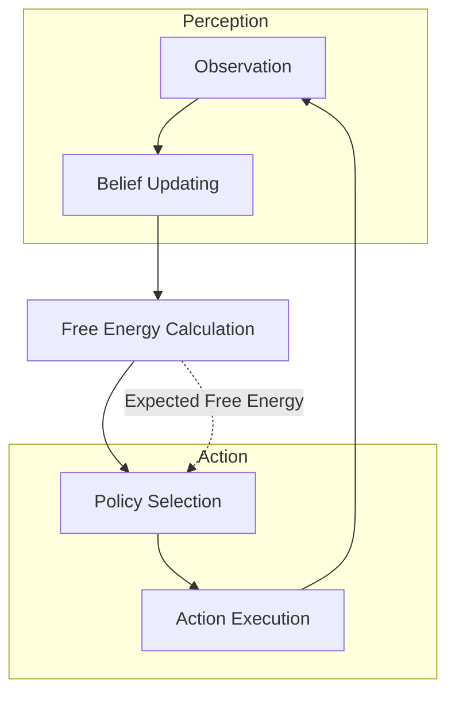

# Active Inference Overview

## Introduction

Active inference is a theoretical framework derived from the free energy principle, proposed by Karl Friston. It provides a unified account of perception, action, and learning in biological and artificial systems. In the context of GEO-INFER-ACT, active inference is applied to geospatial problems, enabling intelligent decision-making in spatial-temporal environments.

### Key Concepts

1. **Free Energy Principle**: Systems minimize variational free energy to maintain homeostasis.
   - Variational Free Energy: \( F = D_{KL}[q(\mathbf{s}) || p(\mathbf{s}|\mathbf{o})] - \ln p(\mathbf{o}) \)
   - This bounds the surprise (negative log evidence) of observations.

2. **Generative Model**: A probabilistic model of how sensations are generated from hidden causes.
   - \( p(\mathbf{o}, \mathbf{s}) = p(\mathbf{o}|\mathbf{s}) p(\mathbf{s}) \)

3. **Approximate Posterior**: \( q(\mathbf{s}) \) approximates the true posterior \( p(\mathbf{s}|\mathbf{o}) \).

4. **Belief Updating**: Perception as inference, minimizing free energy via gradient descent or message passing.

5. **Policy Selection**: Action as inference, selecting policies that minimize expected free energy.
   - Expected Free Energy: \( G(\pi) = \sum_{\tau} \mathbb{E}_{Q} [\ln Q(\tilde{\mathbf{o}}_\tau|\pi) - \ln P(\tilde{\mathbf{o}}_\tau)] + \mathbb{E}_{Q} [H[Q(\tilde{\mathbf{s}}_\tau|\pi)]] \)

## Geospatial Applications in GEO-INFER

In geospatial settings, active inference enables agents to:
- Perceive spatial patterns and temporal dynamics.
- Predict environmental changes.
- Make decisions for resource allocation, path planning, etc.

### Examples
- **Urban Planning**: Agents coordinate resource distribution while minimizing expected free energy [as demonstrated in urban_planning.py].
- **Ecological Modeling**: Predicting species distribution in changing environments.
- **Disaster Response**: Real-time path optimization in dynamic spatial fields.

## Implementation in GEO-INFER-ACT

The module provides:
- Categorical and Gaussian models for state estimation.
- Hierarchical structures for multi-scale geospatial analysis.
- Integration with H3 for spatial indexing.

For mathematical details, see [mathematical_framework.md].

## Active Inference Cycle

The following Mermaid flowchart depicts the core active inference process:

This diagram shows the perception-action loop, where observations update beliefs, free energy is minimized, policies are selected, and actions generate new observations.

References:
- Friston, K. (2010). The free-energy principle: a unified brain theory? Nature Reviews Neuroscience.
- Active Inference Institute resources. 