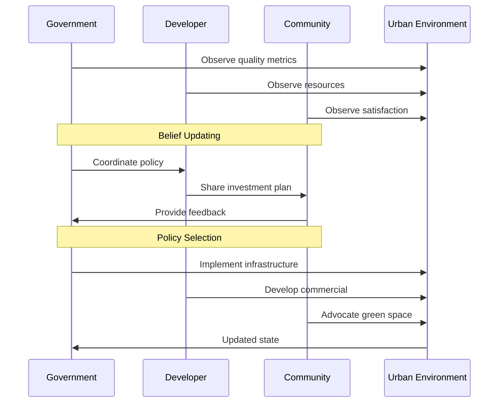

# Geospatial Applications of Active Inference

## Introduction

Active inference provides powerful tools for geospatial inference, enabling predictive modeling, decision-making, and uncertainty quantification in spatial-temporal domains. GEO-INFER integrates these with geospatial data structures.

## Key Applications

### 1. Urban Planning and Development
- Multi-agent coordination for resource allocation.
- Predictive modeling of urban growth patterns.
- Example: See urban_planning.py for simulation of stakeholder interactions.

### 2. Environmental Monitoring
- Real-time anomaly detection in sensor networks.
- Predictive ecology using hierarchical models.
- Integration with IOT module for sensor data fusion.

### 3. Disaster Management
- Path optimization in dynamic environments.
- Uncertainty-aware resource deployment.
- Spatial risk assessment using free energy minimization.

### 4. Transportation and Logistics
- Adaptive routing with traffic prediction.
- Fleet management using multi-agent active inference.

## Integration with GEO-INFER Modules

- **SPACE**: H3-based spatial indexing for efficient free energy computations.
- **TIME**: Temporal hierarchies for multi-scale forecasting.
- **DATA**: Probabilistic data fusion for belief updating.
- **AGENT**: Multi-agent coordination protocols.

## Case Study: Urban Resource Allocation

In urban_planning.py, agents minimize expected free energy to optimize investments:

- Observations: Spatial quality metrics.
- Actions: Resource investments in H3 cells.
- Beliefs: Hierarchical representations of urban states.

This demonstrates convergence to equitable development patterns.

### Urban Planning Sequence

This sequence shows multi-agent interactions in urban resource allocation, with observation, coordination, and action phases. 