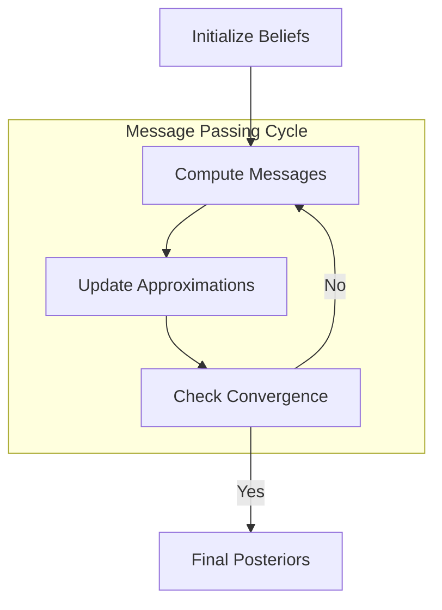

# GEO-INFER-ACT Mathematical Framework

## Overview

This document describes the mathematical foundations of active inference as implemented in the GEO-INFER-ACT module. Active inference is a framework that unifies perception, learning, and decision-making under a single theoretical construct based on free energy minimization. This implementation integrates the latest research from the Active Inference Institute and modern probabilistic programming methodologies.

## Theoretical Foundations

### Free Energy Principle

The free energy principle posits that all adaptive systems (biological or artificial) resist a natural tendency to disorder by minimizing their variational free energy. In information-theoretic terms, this is equivalent to maximizing the evidence for their model of the world.

The variational free energy is defined as:

$$F = \mathbb{E}_{q(s)} \left[ \ln q(s) - \ln p(s, o) \right]$$

Where:
- $q(s)$ is the approximate posterior distribution over hidden states
- $p(s, o)$ is the generative model of states $s$ and observations $o$

This can be decomposed into:

$$F = \underbrace{D_{KL}[q(s) \parallel p(s|o)]}_{\text{Complexity}} - \underbrace{\ln p(o)}_{\text{Accuracy}}$$

### Hierarchical Active Inference

Following recent advances in hierarchical modeling (Friston et al., 2017; Parr & Friston, 2019), we implement nested generative models where each level predicts the level below:

$$F = \sum_{i=1}^{N} F^{(i)}$$

Where $F^{(i)}$ is the free energy at hierarchical level $i$:

$$F^{(i)} = \mathbb{E}_{q^{(i)}(s^{(i)})} \left[ \ln q^{(i)}(s^{(i)}) - \ln p^{(i)}(s^{(i)}, o^{(i)}) \right]$$

### Markov Blankets and Conditional Independence

The framework implements Markov blankets as fundamental units of self-organization:

$$p(s_i | s_{\neg i}) = p(s_i | \text{mb}(s_i))$$

Where $\text{mb}(s_i)$ represents the Markov blanket of state $s_i$, ensuring conditional independence from all other states.

## Belief Updating

### Categorical Distributions

For categorical distributions, belief updating follows Bayes' rule with precision-weighted updates:

$$q(s) \propto \exp(\ln p(o|s) + \ln p(s) - \gamma \cdot \epsilon)$$

Where $\gamma$ is the precision parameter and $\epsilon$ represents prediction error.

### Gaussian Distributions

For Gaussian distributions, belief updating follows the predictive coding framework:

$$\dot{\mu} = \kappa \cdot \epsilon_\mu$$
$$\dot{\Sigma} = \kappa \cdot (\epsilon_\Sigma - \frac{1}{2}\Sigma)$$

Where $\kappa$ is the learning rate and $\epsilon$ terms represent prediction errors.

### Variational Message Passing

Following the RxInfer methodology (cited in Active Inference Institute resources), we implement constrained Forney Factor Graphs (FFGs):

$$q(s) = \prod_{i} q_i(s_i)$$

With message passing updates:

$$q_i(s_i) \leftarrow \prod_{j \in \text{ne}(i)} m_{j \rightarrow i}(s_i)$$

### Variational Message Passing Flow



This flowchart outlines the iterative process of variational message passing for belief updating.

## Expected Free Energy

For policy selection, active inference uses the expected free energy, incorporating both epistemic and pragmatic value:

$$G(\pi) = \sum_{\tau} G(\pi, \tau)$$

$$G(\pi, \tau) = \underbrace{\mathbb{E}_{q(o_\tau, s_\tau|\pi)} \left[ D_{KL}[q(s_\tau|\pi, o_\tau) \parallel q(s_\tau|\pi)] \right]}_{\text{Epistemic value}} + \underbrace{\mathbb{E}_{q(o_\tau|\pi)} \left[ D_{KL}[q(o_\tau|\pi) \parallel p(o_\tau)] \right]}_{\text{Pragmatic value}}$$

### Policy Space and Planning

The framework supports multiple policy representations:

1. **Sequential policies**: $\pi = \{a_1, a_2, \ldots, a_T\}$
2. **Hierarchical policies**: $\pi = \{\pi^{(1)}, \pi^{(2)}, \ldots, \pi^{(N)}\}$
3. **Continuous policies**: $\pi(t) = f(s_t, \theta)$

## Spatial-Temporal Extensions

### Spatial Active Inference

For geospatial applications, we extend the framework with spatial priors and dynamics:

$$p(s_{t+1}^{spatial} | s_t^{spatial}, a_t) = \mathcal{N}(s_t^{spatial} + v_t \cdot \Delta t, \Sigma_{spatial})$$

Where $v_t$ represents velocity and $\Sigma_{spatial}$ captures spatial uncertainty.

### Temporal Hierarchies

Temporal hierarchies are implemented using different timescales:

$$\tau^{(i)} = \alpha^i \cdot \tau^{(0)}$$

Where $\alpha > 1$ creates exponential separation between timescales.

## Dynamic Causal Modeling

For continuous-time dynamics, we implement stochastic differential equations:

$$\frac{dx}{dt} = f(x, v, \theta) + \omega$$
$$y = g(x, v, \theta) + z$$

Where:
- $x$ are hidden states
- $v$ are inputs  
- $\theta$ are parameters
- $\omega, z$ are random fluctuations

### Neural Field Extensions

For large-scale spatial modeling:

$$\frac{\partial u(r,t)}{\partial t} = -u(r,t) + \int w(r,r') \sigma(u(r',t)) dr' + I(r,t)$$

Where $u(r,t)$ represents neural activity at location $r$ and time $t$.

## Modern Inference Algorithms

### Constrained Bethe Free Energy

Following recent advances in approximate inference:

$$F_{Bethe} = \sum_i F_i - \sum_{i,j} I_{ij}$$

Where $F_i$ are local free energies and $I_{ij}$ are mutual information terms.

### Stein Variational Gradient Descent

For non-parametric inference:

$$\phi^* = \arg\max_{\phi \in \mathcal{F}} \{ \langle \nabla_x \log p(x), \phi(x) \rangle_{\mathcal{H}} - \frac{\lambda}{2} \|\phi\|_{\mathcal{H}}^2 \}$$

### Normalizing Flows

For flexible posterior approximations:

$$q(z) = q_0(f^{-1}(z)) \left| \det \frac{\partial f^{-1}}{\partial z} \right|$$

## Integration with Modern Tools

### RxInfer Integration

The framework supports probabilistic programming through RxInfer FFGs:

```julia
@model function spatial_inference(observations)
    # Define spatial priors
    μ ~ NormalMeanVariance(0.0, 1.0)
    τ ~ Gamma(1.0, 1.0)
    
    # Spatial dynamics
    for i in 1:length(observations)
        x[i] ~ NormalMeanPrecision(μ, τ)
        observations[i] ~ NormalMeanPrecision(x[i], 1.0)
    end
end
```

### Bayeux Compatibility

Support for JAX-based inference:

```python
import bayeux as bx

def spatial_log_density(params):
    prior = -0.5 * jnp.sum(params['location']**2)
    likelihood = compute_spatial_likelihood(params, observations)
    return prior + likelihood

model = bx.Model(
    log_density=spatial_log_density,
    test_point={'location': jnp.zeros(2)},
    transform_fn=spatial_transform
)
```

## Performance Considerations

### Scalability

The framework implements several scalability optimizations:

1. **Sparse representations** for large spatial domains
2. **Hierarchical factorization** to reduce computational complexity
3. **Parallelizable message passing** for distributed computation
4. **Adaptive mesh refinement** for spatial discretization

### Numerical Stability

Key numerical considerations:

1. **Log-space computations** to prevent underflow
2. **Precision parameterization** instead of covariance
3. **Damped updates** for stability
4. **Regularization** to prevent overfitting

## Applications in GEO-INFER

### Ecological Systems

Active inference for ecological niche modeling:

$$G_{ecological} = \underbrace{I(a; r|s)}_{\text{Resource info}} + \underbrace{H(r|s)}_{\text{Resource uncertainty}} - \underbrace{D_{KL}[q(r|s) \parallel p(r)]}_{\text{Resource preference}}$$

### Urban Planning

Multi-agent active inference for urban dynamics:

$$F_{urban} = \sum_{agents} F_{agent} + \sum_{interactions} F_{interaction}$$

### Climate Adaptation

Hierarchical modeling of climate responses:

$$F_{climate} = F_{local} + F_{regional} + F_{global}$$

## Validation and Testing

### Information-Theoretic Metrics

1. **Mutual information** between beliefs and true states
2. **Entropy reduction** during inference
3. **KL divergence** between approximate and true posteriors

### Predictive Performance

1. **Log-likelihood** of held-out observations
2. **Calibration** of uncertainty estimates
3. **Generalization** to novel environments

## Future Directions

### Quantum Active Inference

Integration with quantum information theory:

$$F_{quantum} = -\text{Tr}[\rho \log \rho] + \text{Tr}[\rho \log \sigma]$$

### Machine Learning Integration

1. **Neural active inference** with deep networks
2. **Reinforcement learning** connections
3. **Meta-learning** for adaptive priors

## References

1. Friston, K. (2010). The free-energy principle: a unified brain theory? Nature Reviews Neuroscience, 11(2), 127-138.
2. Friston, K., et al. (2017). Active inference: a process theory. Neural Computation, 29(1), 1-49.
3. Parr, T., & Friston, K. J. (2019). Generalised free energy and active inference. Biological Cybernetics, 113(5), 495-513.
4. Heins, C., et al. (2022). pymdp: A Python library for active inference in discrete state spaces. arXiv:2201.03904.
5. Bagaev, D., & de Vries, B. (2021). Reactive message passing for scalable Bayesian inference. arXiv:2112.13251.
6. Active Inference Institute. (2024). Active Inference Textbook. https://www.activeinference.org/
7. Tschantz, A., et al. (2022). Scaling active inference. arXiv:2201.05465.
8. Millidge, B., et al. (2021). Whence the expected free energy? Neural Computation, 33(2), 447-482. 