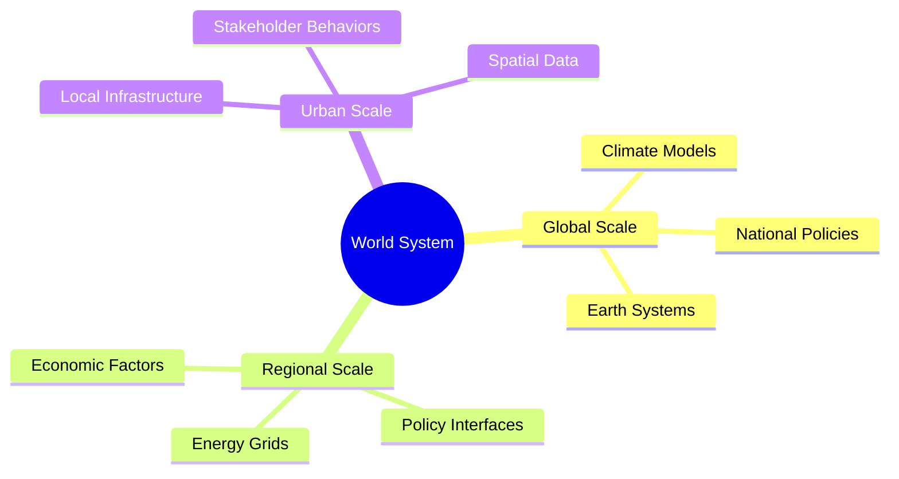

# Active Inference for World Systems Modeling in GEO-INFER-ACT

## Introduction

The GEO-INFER-ACT module enables professional, flexible active inference modeling for complex world systems. By applying active inference principles through the ACT modules, users can create nested, multi-level models that bridge local and global scales. This facilitates sophisticated simulations of interconnected systems, such as energy transitions, climate adaptation, and socio-technical dynamics, with built-in uncertainty quantification and adaptive learning.

Active inference in GEO-INFER treats systems as self-organizing entities that minimize free energy across hierarchies, allowing for dynamic integration of data, policies, and behaviors at various scales.

[See active_inference_overview.md for foundational concepts]

## Core Principles

### Hierarchical Active Inference

Models are structured hierarchically, with Markov blankets defining system boundaries:

\[ p(s_i | s_{\neg i}) = p(s_i | \text{mb}(s_i)) \]

This enables nested modeling where local (e.g., urban) systems interface with national or global levels.

### Free Energy Minimization

Systems minimize variational free energy:

\[ F = D_{KL}[q(s) || p(s|o)] - \ln p(o) \]

In world systems, this extends to multi-scale optimization, incorporating epistemic (information-seeking) and pragmatic (goal-directed) values.

[Details in free_energy_principle.md]

### Adaptive Belief Updating

Using Bayesian inference with message passing, models self-update based on new evidence, ideal for evolving world systems like energy markets or climate scenarios.

## Multi-Level Modeling Capabilities

GEO-INFER-ACT supports bidirectional scaling:

- **Downscaling**: From global/national models to urban/local contexts, incorporating granular data like grid infrastructure and local policies.
- **Upscaling**: Aggregating local insights to inform higher-level strategies, e.g., national decarbonization plans.

### Integration of Constraints

Models incorporate policy, permitting, finance, and behavioral factors:
- Regulatory alignment using reinforcement learning for scenario simulation.
- Finance optimization with uncertainty-aware investment pathways.
- Behavioral modeling for stakeholder coordination.

### Multi-Level Hierarchy Mindmap

This mindmap represents the nested scales in world systems modeling, showing bidirectional information flow.

## Applications to Energy Transition and Decarbonization

### Bridging Urban and National Scales

Active inference agents nest urban energy models within national frameworks, enabling:
- Dynamic forecasting of decarbonization pathways.
- Uncertainty quantification in climate impacts and policy effects.
- Optimization of infrastructure permitting and finance.

### Socio-Technical Dynamics

Incorporate geospatial data for spatialized modeling:
- Energy demand projections with climate forecasts.
- Multi-agent coordination for stakeholders (governments, utilities, investors).

[Example: urban_planning.py demonstrates multi-agent resource allocation]

### Decision Support

Generate interactive dashboards for policymakers, with visualizations of scenarios, risks, and opportunities.

## Integration with GEO-INFER Modules

- **SPACE**: Spatial indexing (e.g., H3) for geospatial dynamics [geospatial_applications.md].
- **TIME**: Temporal hierarchies for multi-scale forecasting.
- **AGENT**: Multi-agent systems for coordination.
- **DATA**: Probabilistic data fusion.
- **API**: Programmatic access [api_schema.yaml].

## Case Studies

1. **Urban Decarbonization**: Nested models linking city GHG inventories to national NDCs.
2. **Climate Adaptation**: Predictive modeling of infrastructure vulnerabilities.
3. **Energy Finance**: RL-based simulation of investment risks and policy impacts.

## Mathematical Foundations

Extended from core active inference equations to multi-level systems:

\[ F_{multi} = \sum_{levels} F^{(l)} + \sum_{interfaces} D_{KL}[q^{(l)} || p^{(l+1)}] \]

[Full details in mathematical_framework.md]

## Best Practices

- Start with hierarchical model definition.
- Validate via backcasting and inter-model comparisons.
- Use Monte Carlo methods for uncertainty analysis.

## References

[See references.md for key papers and resources] 