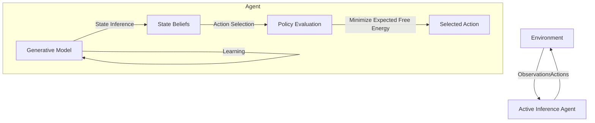

# Active Inference Agent Module

The Active Inference module implements cognitive agents based on the Free Energy Principle and Active Inference framework. These agents perceive and act to minimize surprise by continuously refining their internal models of the world.

## Table of Contents

- [Theoretical Background](#theoretical-background)
- [Architecture](#architecture)
- [Key Components](#key-components)
- [Usage Examples](#usage-examples)
- [Configuration Options](#configuration-options)
- [Advanced Usage](#advanced-usage)
- [Integration with Geospatial Data](#integration-with-geospatial-data)

## Theoretical Background

Active Inference is a neuroscientific framework that unifies perception, learning, and decision-making under a single objective: minimizing surprise (or maximizing model evidence). This is formalized through the Free Energy Principle, which states that biological systems resist a natural tendency to disorder by minimizing variational free energy.

In this framework:
- **Perception** is the process of inferring hidden states from sensory data
- **Learning** is the process of updating the generative model to better predict observations
- **Decision-making** is the process of selecting actions that minimize expected free energy

Active Inference agents maintain a generative model of the world that encodes:
1. Beliefs about how hidden states generate observations (likelihood)
2. Beliefs about how hidden states evolve over time (transition dynamics)
3. Preferences over observations (prior preferences)

## Architecture



## Key Components

### GenerativeModel

The `GenerativeModel` class implements the agent's internal model of the world, with these key matrices:

- **A matrix**: Likelihood mapping (observation given state)
- **B matrix**: Transition probabilities (next state given current state and action)
- **C vector**: Prior preferences over observations
- **D vector**: Prior beliefs about initial states

Methods include:
- `update_likelihood`: Update how states generate observations
- `update_transition`: Update state transition dynamics
- `infer_state`: Infer hidden states from observations
- `expected_free_energy`: Calculate expected free energy for policy evaluation
- `select_action`: Choose actions to minimize expected free energy

### ActiveInferenceState

The `ActiveInferenceState` class maintains the agent's current state, including:

- Current generative model
- History of observations and actions
- Current state beliefs
- Methods for updating state based on new observations

### ActiveInferenceAgent

The `ActiveInferenceAgent` class implements a complete active inference agent with:

- Perception cycle (observing the environment)
- Decision cycle (selecting actions)
- Action cycle (executing actions)
- Learning processes (updating the generative model)

## Usage Examples

### Basic Usage

```python
from geo_infer_agent.models.active_inference import ActiveInferenceAgent

# Create an agent with default parameters
agent = ActiveInferenceAgent(agent_id="geo_agent_1")

# Initialize the agent
await agent.initialize()

# Run the agent's perception-decision-action cycle
while True:
    observations = await agent.perceive()
    action = await agent.decide()
    if action:
        result = await agent.act(action)
```

### Custom Observation Processing

```python
from geo_infer_agent.models.active_inference import ActiveInferenceAgent

# Define a custom perception handler
async def handle_geospatial_data(agent, perception):
    # Process geospatial data into a format suitable for the generative model
    processed_data = process_geospatial_data(perception)
    agent.state.update_with_observation(processed_data)

# Create an agent and register the custom handler
agent = ActiveInferenceAgent(agent_id="geo_agent_spatial")
agent._perception_handlers["geospatial"] = handle_geospatial_data

# Initialize and use the agent
await agent.initialize()
```

## Configuration Options

The Active Inference agent can be configured with these parameters:

| Parameter | Description | Default |
|-----------|-------------|---------|
| `state_dimensions` | Dimensions of the state space | 10 |
| `observation_dimensions` | Dimensions of the observation space | 10 |
| `control_dimensions` | Number of possible control actions | 5 |
| `learning_rate` | Rate at which model updates with new evidence | 0.01 |
| `planning_horizon` | Steps to look ahead when planning | 1 |

Example configuration:

```python
config = {
    "state_dimensions": 20,
    "observation_dimensions": 15,
    "control_dimensions": 8,
    "learning_rate": 0.05,
    "planning_horizon": 3
}

agent = ActiveInferenceAgent(agent_id="high_dim_agent", config=config)
```

## Advanced Usage

### Preference Learning

```python
# Update the agent's preferences based on rewards
preferred_observations = [0, 1, 0, 0, 0]  # Example preference vector
agent.state.update_preferences(preferred_observations)
```

### Model Persistence

```python
# Save the agent's model
agent._save_model("path/to/model.json")

# Load the agent's model
agent._load_model("path/to/model.json")
```

## Integration with Geospatial Data

Active Inference agents can be used for geospatial reasoning by:

1. Encoding geospatial observations into state space representations
2. Defining preferences over spatial states (e.g., proximity to targets)
3. Defining spatial actions (e.g., move, search, sample)

Example geospatial application:

```python
# Define a geospatial state encoder
def encode_geospatial_state(lat, lon, features):
    # Convert geographical coordinates and features to a state vector
    state_vector = np.zeros(state_dimensions)
    # ... encoding logic ...
    return state_vector

# Define a geospatial action decoder
def decode_geospatial_action(action_idx):
    actions = [
        {"type": "move", "direction": "north", "distance": 100},
        {"type": "move", "direction": "south", "distance": 100},
        {"type": "move", "direction": "east", "distance": 100},
        {"type": "move", "direction": "west", "distance": 100},
        {"type": "sample", "location": "current"}
    ]
    return actions[action_idx]
``` 