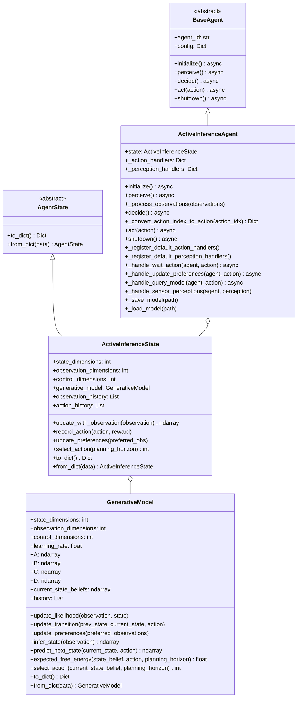
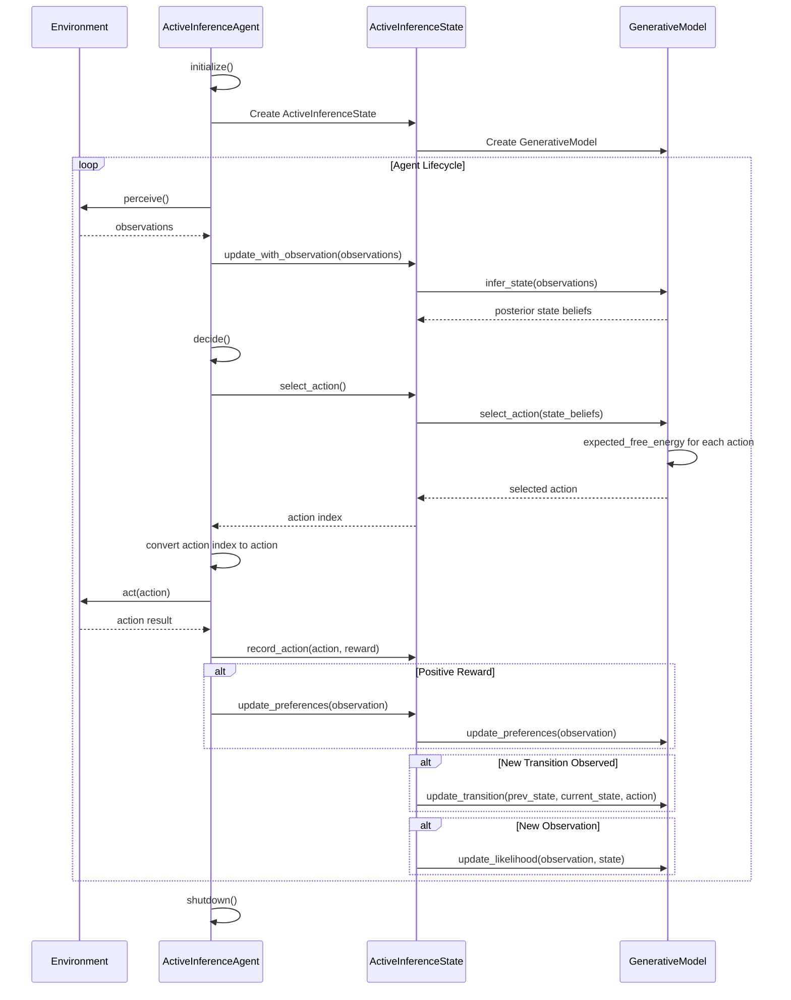
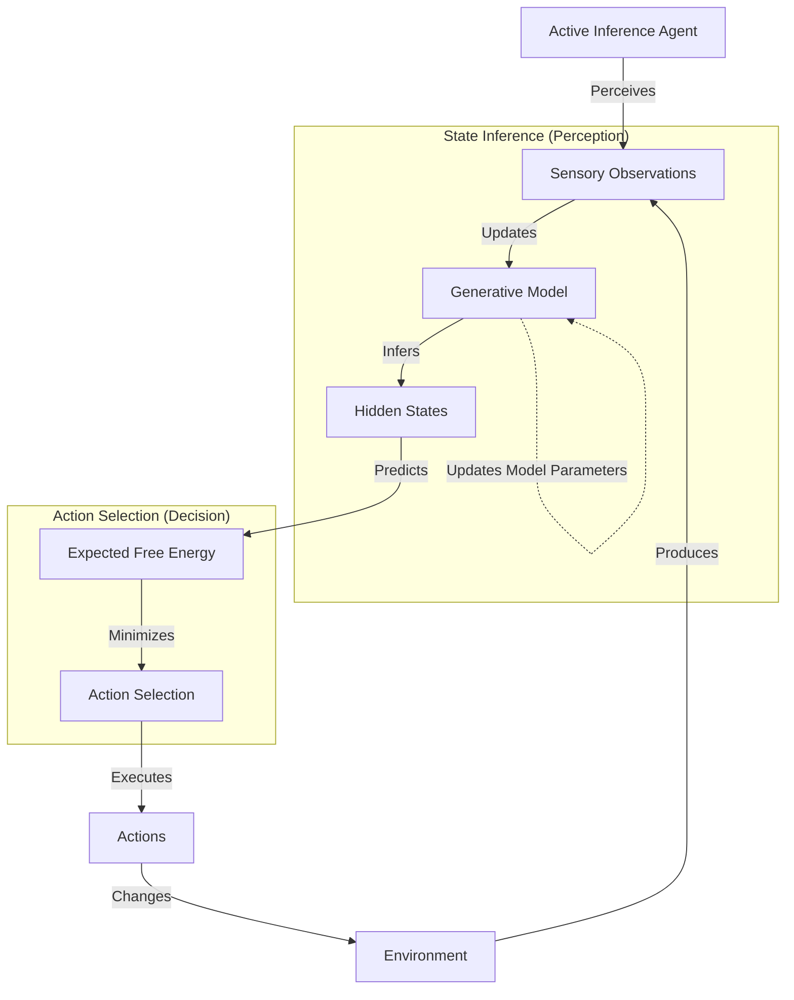
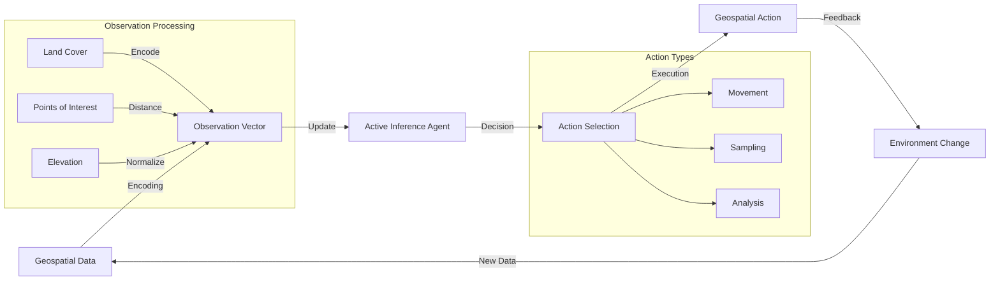
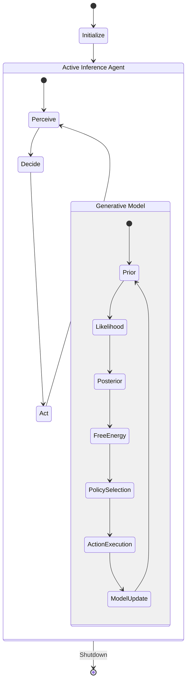

# Active Inference Module Diagrams

This document provides visual representations of the Active Inference architecture and workflows.

## Class Diagram

## Active Inference Process

## Free Energy Minimization

## Geospatial Integration

## Model Components Interaction

