# GEO-INFER-AGENT Architectures

This document provides an overview of the agent architectures implemented in the GEO-INFER-AGENT module.

## Table of Contents

1. [Overview](#overview)
2. [Common Architecture](#common-architecture)
3. [BDI Agent Architecture](#bdi-agent-architecture)
4. [Active Inference Agent Architecture](#active-inference-agent-architecture)
5. [Reinforcement Learning Agent Architecture](#reinforcement-learning-agent-architecture)
6. [Rule-Based Agent Architecture](#rule-based-agent-architecture)
7. [Hybrid Agent Architecture](#hybrid-agent-architecture)
8. [Integration with GEO-INFER-APP](#integration-with-geo-infer-app)

## Overview

GEO-INFER-AGENT provides several agent architectures for building intelligent geospatial agents:

- **BDI (Belief-Desire-Intention)**: Models agents based on beliefs about the world, desires (goals), and intentions (plans)
- **Active Inference**: Based on the free energy principle, agents perceive and act to minimize surprise
- **Reinforcement Learning**: Agents learn optimal behavior through trial and error
- **Rule-Based**: Simple condition-action rules for reactive behavior
- **Hybrid**: Combines multiple architectures to leverage the strengths of each approach

## Common Architecture

All agent implementations share a common base architecture:

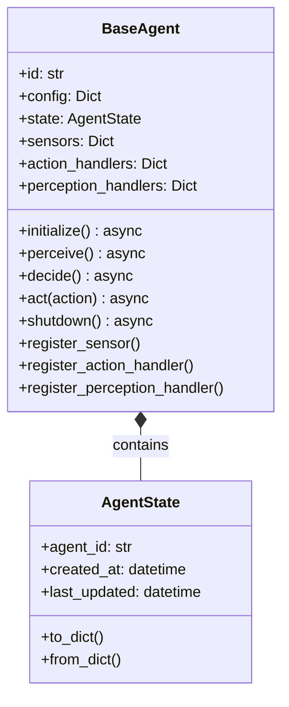

The agent lifecycle follows this pattern:

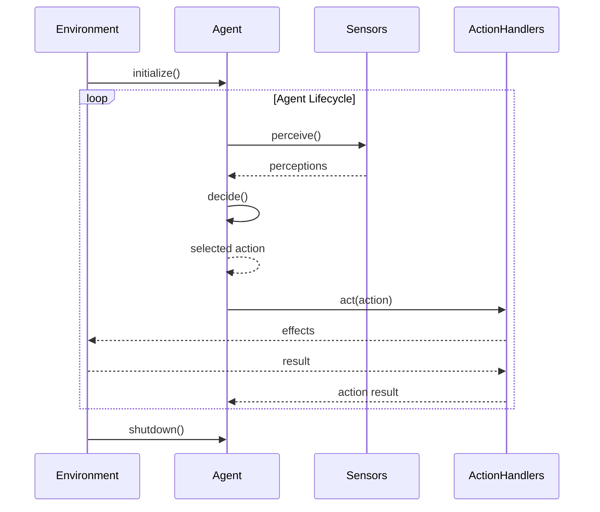

## BDI Agent Architecture

The Belief-Desire-Intention architecture models agents in terms of:
- **Beliefs**: What the agent knows about the world
- **Desires**: Goals the agent wants to achieve
- **Intentions**: Plans the agent has committed to

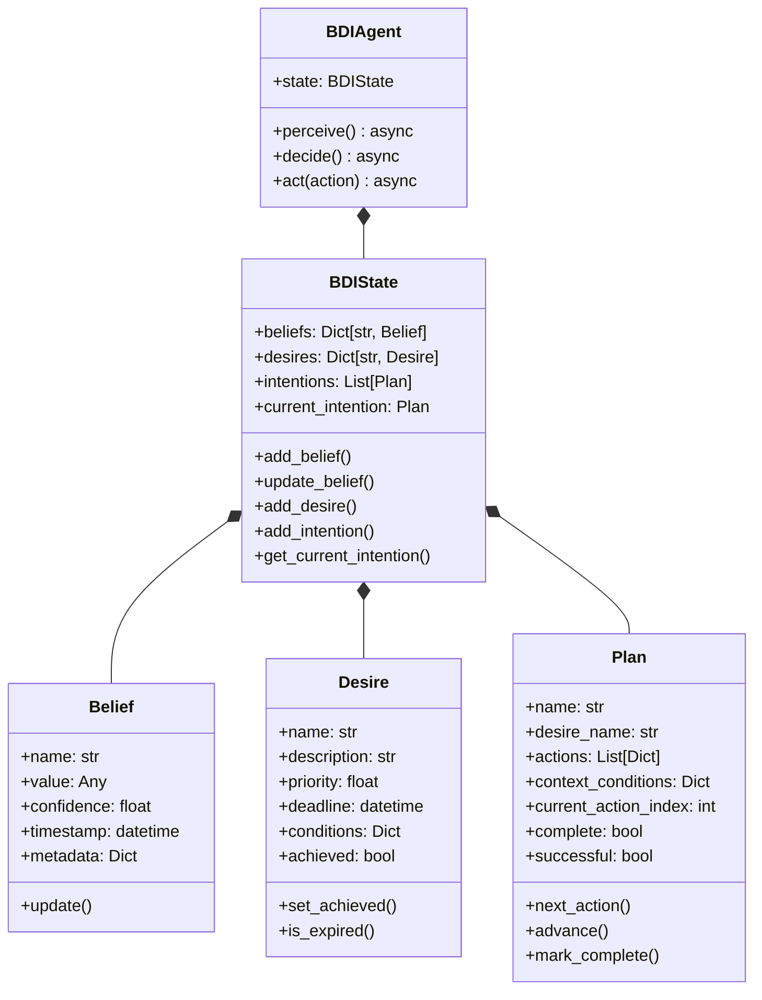

BDI Agent Decision Flow:

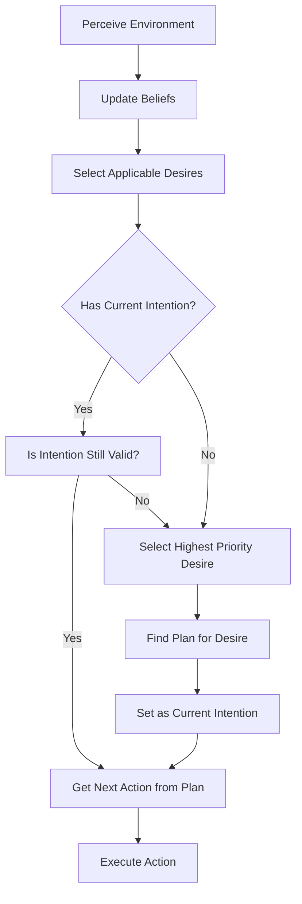

## Active Inference Agent Architecture

The Active Inference architecture is based on the free energy principle:
- Agents maintain a generative model of the world
- Actions are selected to minimize expected free energy
- Learning occurs by updating the model based on observations

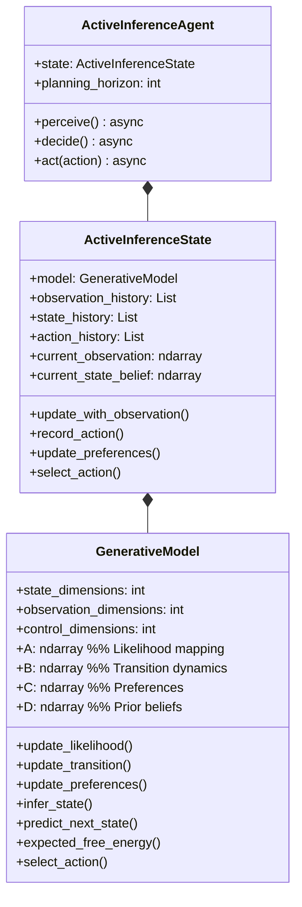

Active Inference Decision Flow:

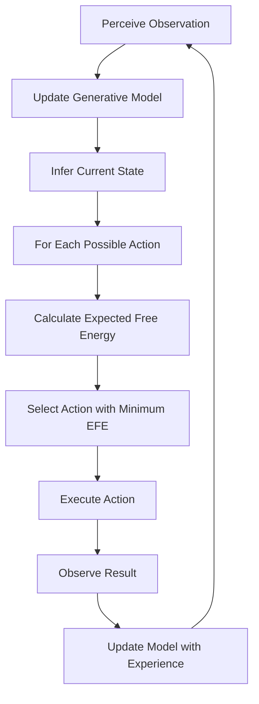

## Reinforcement Learning Agent Architecture

The Reinforcement Learning architecture:
- Agents learn from experience through rewards
- Q-learning maintains a table of state-action values
- Experience replay helps with efficient learning

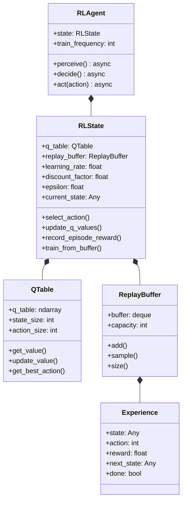

Reinforcement Learning Decision Flow:

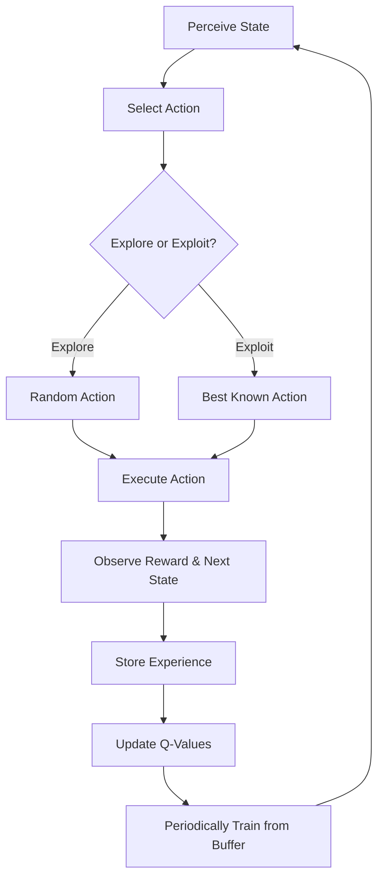

## Rule-Based Agent Architecture

The Rule-Based architecture:
- Simple condition-action rules
- Rules have priorities for conflict resolution
- Fast, reactive behavior

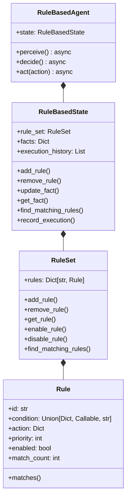

Rule-Based Decision Flow:

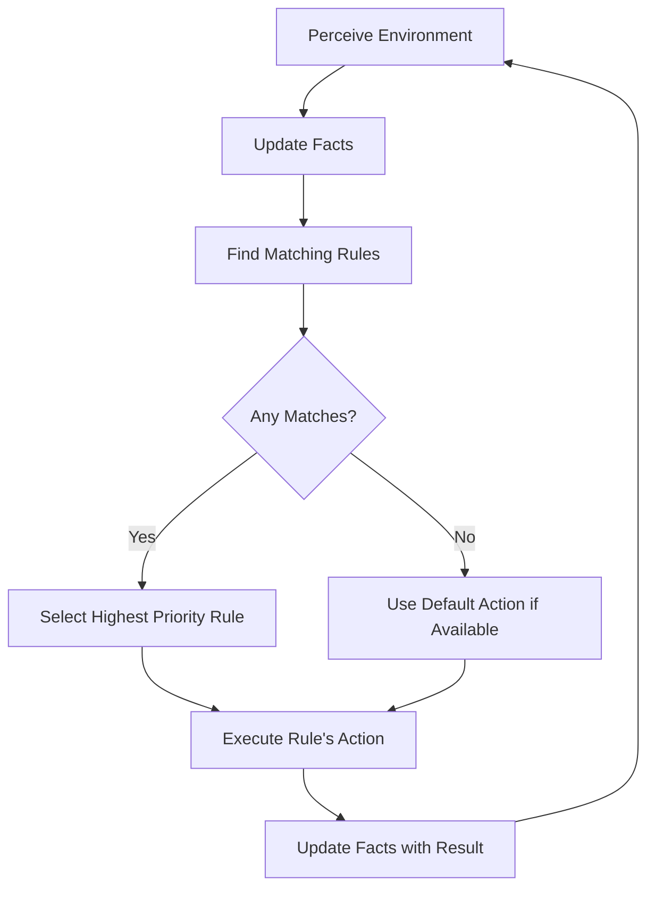

## Hybrid Agent Architecture

The Hybrid architecture:
- Combines multiple agent types
- Uses policy to select between sub-agents
- Shares information across architectures

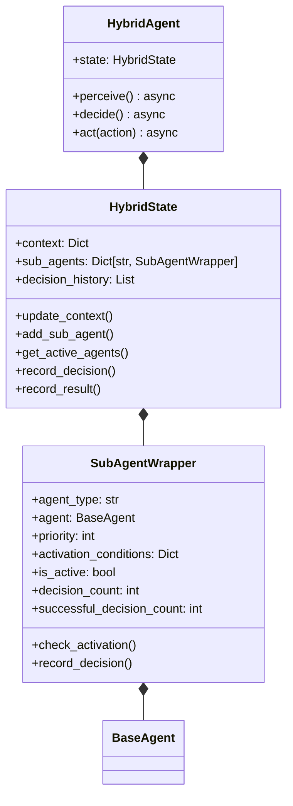

Hybrid Agent Decision Flow:

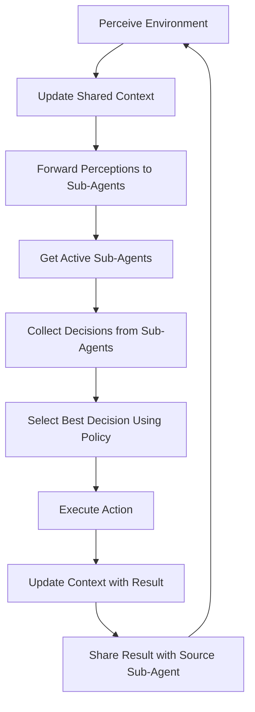

## Integration with GEO-INFER-APP

GEO-INFER-AGENT integrates with GEO-INFER-APP to provide intelligent agent capabilities within the application:

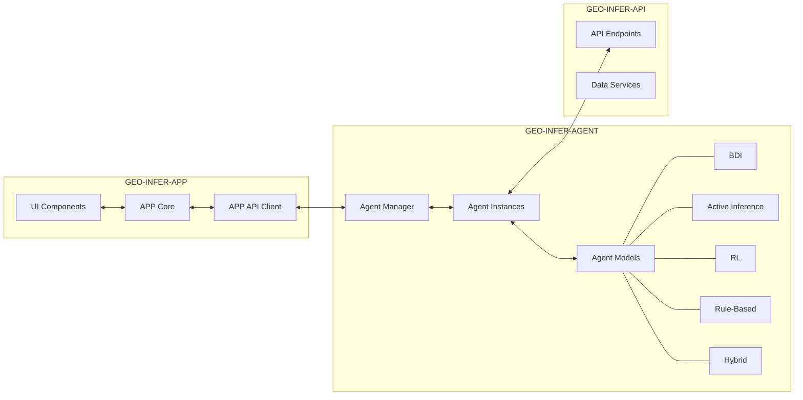

Agent components can be integrated into the app interface:

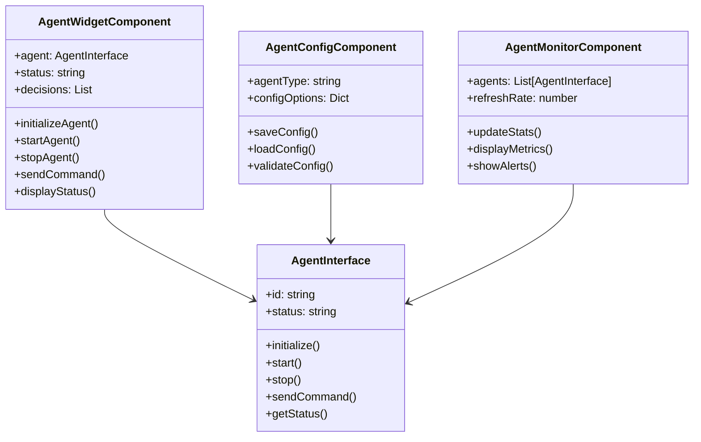

The integration architecture for the GEO-INFER-APP uses a bridge pattern:

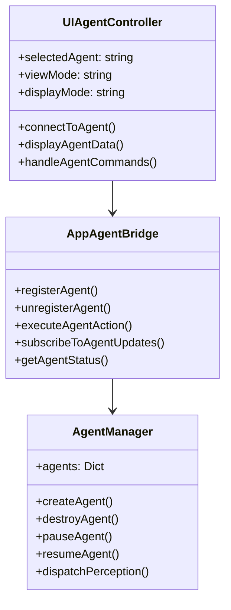