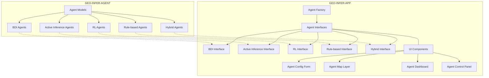
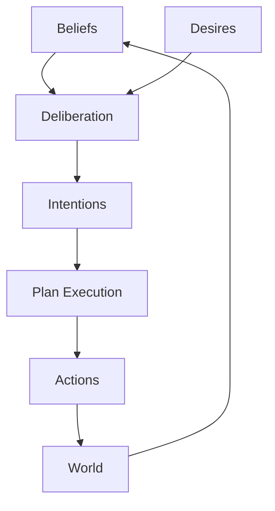

# GEO-INFER-APP Agent Integration Guide

This guide explains how to integrate geospatial agents from GEO-INFER-AGENT into your GEO-INFER-APP application.

## Overview

GEO-INFER-APP provides a comprehensive framework for integrating intelligent geospatial agents into user interfaces. The integration is based on a modular architecture that separates agent logic from UI components, allowing for flexible and extensible applications.



## Key Components

The agent integration architecture consists of the following key components:

1. **Agent Interface**: Abstract class defining the common interface for all agent types
2. **Agent Factory**: Factory pattern for creating and managing agent interfaces
3. **Agent Visualization**: Utilities for visualizing agents in different contexts
4. **Agent Configuration**: Schema-based configuration system for agents

## Getting Started

### 1. Import Required Modules

```python
from geo_infer_app.models.agent_interface import AgentType
from geo_infer_app.models.agent_factory import AgentFactory
from geo_infer_app.models.agent_visualization import AgentVisualization
from geo_infer_app.models.agent_configuration import AgentConfiguration
```

### 2. Create and Configure Agents

```python
# Create an agent factory
factory = AgentFactory()

# Get the configuration schema for a BDI agent
bdi_schema = AgentConfiguration.get_schema(AgentType.BDI)

# Create a BDI agent with the default configuration
config = AgentConfiguration.get_default_config(AgentType.BDI)
config["name"] = "Exploration Agent"
config["initial_location"] = {"lat": 40.7128, "lng": -74.0060}

# Create the agent
agent_interface = factory.create_interface(AgentType.BDI)
agent_id = agent_interface.create_agent(AgentType.BDI, config)
```

### 3. Interact with Agents

```python
# Get the agent's current state
state = agent_interface.get_agent_state(agent_id)

# Send a command to the agent
response = agent_interface.send_command(agent_id, "add_belief", {
    "belief": {"temperature": 25, "humidity": 60}
})

# Register an event handler
def on_agent_updated(event_data):
    print(f"Agent {event_data['agent_id']} was updated")
    print(f"New state: {event_data['state']}")

agent_interface.register_event_handler("agent_updated", on_agent_updated)
```

### 4. Visualize Agents

```python
# Convert agent state to a map feature
map_feature = AgentVisualization.state_to_map_feature(state)

# Convert agent state to dashboard data
dashboard_data = AgentVisualization.state_to_dashboard_data(state)
```

## UI Components

GEO-INFER-APP provides several React components for integrating agents into your UI:

### Agent Configuration Form

```jsx
import { AgentConfigForm } from 'geo_infer_app/components/agent';

function AgentCreator() {
  const [schema, setSchema] = useState(null);
  
  useEffect(() => {
    // Fetch the schema from the backend
    fetch('/api/agent/schema/bdi')
      .then(res => res.json())
      .then(data => setSchema(data));
  }, []);
  
  const handleSubmit = (values) => {
    // Create the agent
    fetch('/api/agent/create', {
      method: 'POST',
      headers: { 'Content-Type': 'application/json' },
      body: JSON.stringify({
        type: 'bdi',
        config: values
      })
    });
  };
  
  if (!schema) return <div>Loading...</div>;
  
  return (
    <AgentConfigForm
      schema={schema}
      onSubmit={handleSubmit}
    />
  );
}
```

### Agent Map Layer

```jsx
import { AgentMapLayer } from 'geo_infer_app/components/agent';
import { Map } from 'geo_infer_app/components/map';

function AgentMap() {
  const [agents, setAgents] = useState([]);
  
  useEffect(() => {
    // Fetch agents from the backend
    fetch('/api/agents')
      .then(res => res.json())
      .then(data => setAgents(data));
  }, []);
  
  return (
    <Map>
      <AgentMapLayer agents={agents} />
    </Map>
  );
}
```

### Agent Dashboard

```jsx
import { AgentDashboard } from 'geo_infer_app/components/agent';

function AgentMonitor({ agentId }) {
  const [state, setState] = useState(null);
  
  useEffect(() => {
    // Fetch agent state from the backend
    fetch(`/api/agent/${agentId}/state`)
      .then(res => res.json())
      .then(data => setState(data));
      
    // Set up real-time updates
    const socket = new WebSocket('ws://localhost:8000/ws/agent');
    socket.onmessage = (event) => {
      const data = JSON.parse(event.data);
      if (data.agent_id === agentId) {
        setState(data.state);
      }
    };
    
    return () => socket.close();
  }, [agentId]);
  
  if (!state) return <div>Loading...</div>;
  
  return (
    <AgentDashboard state={state} />
  );
}
```

## Agent Types

GEO-INFER-APP supports the following agent types:

### BDI Agents

Belief-Desire-Intention agents are based on a cognitive model that represents the agent's mental state as beliefs (knowledge about the world), desires (goals), and intentions (committed plans).



### Active Inference Agents

Active inference agents are based on the free energy principle, where agents minimize surprise by either updating their models of the world (perception) or changing the world to match their predictions (action).

### RL Agents

Reinforcement Learning agents learn optimal behavior through interaction with the environment, based on rewards and penalties.

### Rule-based Agents

Rule-based agents follow predefined if-then rules to make decisions and take actions.

### Hybrid Agents

Hybrid agents combine multiple agent architectures to leverage their respective strengths.

## Best Practices

1. **Separate agent logic from UI components**: Use the agent interfaces to decouple agent implementation from UI representation
2. **Use appropriate agent types**: Choose the agent architecture that best fits your use case
3. **Implement event handlers**: Use event-based communication for real-time updates
4. **Validate configurations**: Always validate agent configurations against their schemas
5. **Provide meaningful visualizations**: Use appropriate visualizations for different agent types

## API Reference

See the full API reference in the [API Documentation](./api/agent_api.md).

## Examples

Explore complete examples in the [examples directory](../examples/agent_examples). 