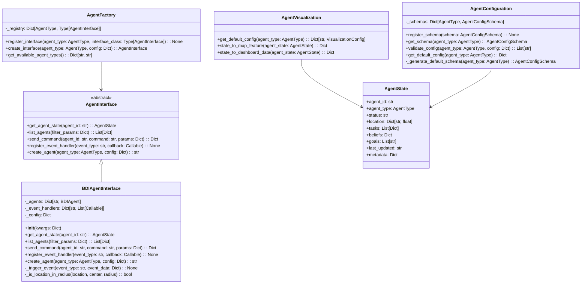

# GEO-INFER-APP Models

This directory contains the model layer for GEO-INFER-APP, including agent model integration with GEO-INFER-AGENT.

## Architecture

The models system follows a modular, layered architecture to provide flexibility and extensibility:



## Core Components

### 1. Agent Interface (`agent_interface.py`)

- Defines the abstract base interface for all agent types
- Provides standardized methods for agent interaction
- Defines the `AgentState` data structure for representing agent state

### 2. Agent Factory (`agent_factory.py`)

- Factory pattern for creating agent interfaces
- Registry of available agent implementations
- Dynamic loading of agent interface modules

### 3. Agent Visualization (`agent_visualization.py`)

- Converts agent states to visualization formats (maps, dashboards, etc.)
- Provides default visualization configurations
- Customization based on agent type and properties

### 4. Agent Configuration (`agent_configuration.py`)

- Schema-based configuration system for agents
- Validation of agent configurations
- Default configurations for different agent types
- UI-friendly configuration helpers

## Agent Types

GEO-INFER-APP supports all agent types implemented in GEO-INFER-AGENT:

1. **BDI Agents**: Belief-Desire-Intention model
2. **Active Inference Agents**: Based on free energy principle
3. **RL Agents**: Reinforcement learning agents
4. **Rule-based Agents**: If-then rule-based decision making
5. **Hybrid Agents**: Combinations of multiple agent architectures

## Interface Implementations

Each agent type has a concrete implementation of the `AgentInterface` in the `interfaces/` directory:

- `bdi_interface.py`: Implements interface for BDI agents
- `active_inference_interface.py`: Implements interface for Active Inference agents
- `rl_interface.py`: Implements interface for RL agents
- `rule_based_interface.py`: Implements interface for Rule-based agents
- `hybrid_interface.py`: Implements interface for Hybrid agents

## Event System

Agents communicate with the UI via an event-based architecture:

1. UI components register event handlers with the agent interface
2. Agent changes trigger events through the interface
3. UI components update based on received events

Common events include:
- `agent_created`: When a new agent is created
- `agent_updated`: When an agent's state changes
- `agent_removed`: When an agent is removed
- `agent_error`: When an error occurs with an agent

## Configuration Schema

Agent configurations follow a schema-based approach:

```json
{
  "title": "BDI Agent Configuration",
  "description": "Configuration schema for BDI agents",
  "fields": [
    {
      "name": "name",
      "field_type": "string",
      "label": "Agent Name",
      "description": "A unique name for this agent",
      "required": true
    },
    {
      "name": "beliefs",
      "field_type": "object",
      "label": "Initial Beliefs",
      "description": "Initial beliefs for the BDI agent",
      "group": "BDI Components"
    },
    {
      "name": "desires",
      "field_type": "array",
      "label": "Desires",
      "description": "List of agent desires",
      "group": "BDI Components"
    },
    {
      "name": "initial_location",
      "field_type": "geolocation",
      "label": "Initial Location",
      "description": "Starting location for this agent",
      "group": "Spatial Parameters"
    }
  ],
  "groups": [
    {
      "name": "Basic",
      "label": "Basic Information",
      "order": 1
    },
    {
      "name": "BDI Components",
      "label": "BDI Components",
      "order": 2
    },
    {
      "name": "Spatial Parameters",
      "label": "Spatial Parameters",
      "order": 3
    }
  ]
}
```

## Usage Example

```python
from geo_infer_app.models.agent_interface import AgentType
from geo_infer_app.models.agent_factory import AgentFactory
from geo_infer_app.models.agent_visualization import AgentVisualization
from geo_infer_app.models.agent_configuration import AgentConfiguration

# Get configuration schema
schema = AgentConfiguration.get_schema(AgentType.BDI)

# Create agent with default configuration
config = AgentConfiguration.get_default_config(AgentType.BDI)
config["name"] = "Exploration Agent"
config["initial_location"] = {"lat": 40.7128, "lng": -74.0060}

# Validate configuration
errors = AgentConfiguration.validate_config(AgentType.BDI, config)
if errors:
    print(f"Configuration errors: {errors}")
    exit(1)

# Create agent
factory = AgentFactory()
interface = factory.create_interface(AgentType.BDI)
agent_id = interface.create_agent(AgentType.BDI, config)

# Interact with agent
state = interface.get_agent_state(agent_id)
interface.send_command(agent_id, "add_belief", {
    "belief": {"temperature": 25}
})

# Register event handler
def on_agent_updated(event_data):
    print(f"Agent {event_data['agent_id']} was updated")
    
interface.register_event_handler("agent_updated", on_agent_updated)

# Visualize agent
map_feature = AgentVisualization.state_to_map_feature(state)
dashboard_data = AgentVisualization.state_to_dashboard_data(state)
```

## Integration with GEO-INFER-AGENT

GEO-INFER-APP integrates with GEO-INFER-AGENT through the agent interface layers. Each interface implementation:

1. Imports the corresponding agent implementation from GEO-INFER-AGENT
2. Creates and manages agent instances
3. Converts between agent state and AgentState format
4. Handles agent commands and events

## Further Documentation

For more details, see:
- [Agent Integration Guide](../../../docs/agent_integration_guide.md)
- [API Documentation](../../../docs/api/agent_api.md)
- [Examples](../../../examples/agent_examples/) 