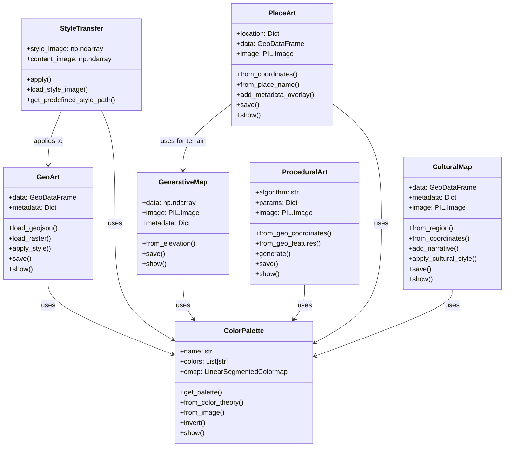
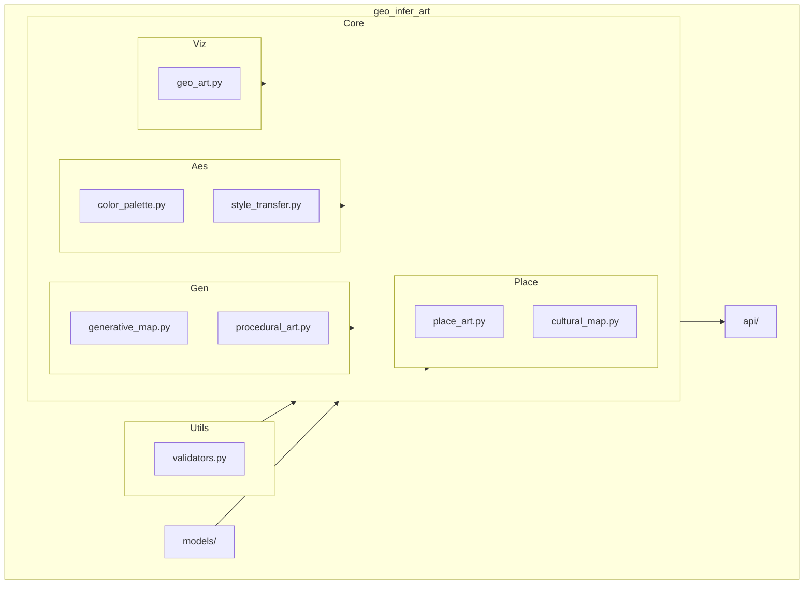
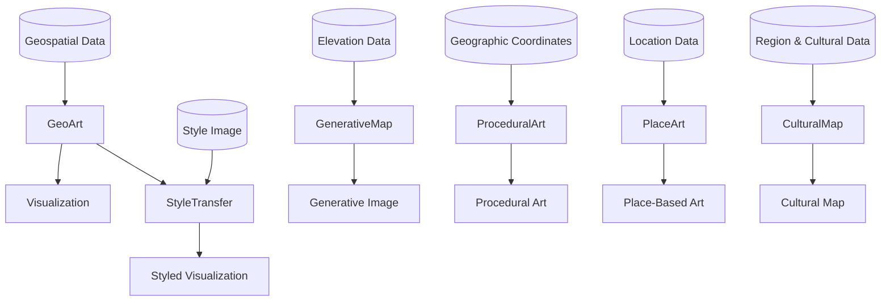
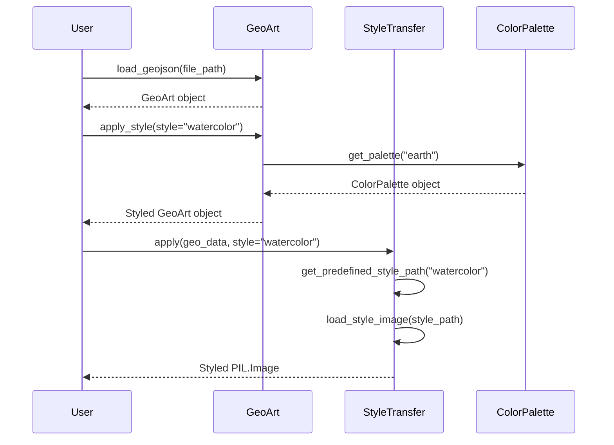

# GEO-INFER-ART Architecture

This document provides an overview of the GEO-INFER-ART module architecture, component relationships, and data flow.

## Component Structure

The GEO-INFER-ART module is organized into the following core components:

## Module Structure

The overall module structure is organized as follows:

## Data Flow

The following diagram illustrates the typical data flow through the GEO-INFER-ART components:

## Component Interactions

The interactions between different components in the system:

## Implementation Details

### Core Components

- **GeoArt**: Responsible for loading, visualizing, and styling geospatial data (vector and raster).
- **ColorPalette**: Manages color schemes based on predefined palettes, color theory, or extracted from images.
- **StyleTransfer**: Applies artistic styles to geospatial visualizations using neural style transfer.
- **GenerativeMap**: Creates artistic visualizations from elevation data with various styles.
- **ProceduralArt**: Generates procedural art using geographic coordinates or features as seeds.
- **PlaceArt**: Creates art based on specific locations and their characteristics.
- **CulturalMap**: Integrates cultural and historical contexts into artistic map representations.

### Utility Components

- **validators.py**: Provides input validation functions for file paths, geospatial data, coordinates, etc.

## External Dependencies

- **geopandas**: Handling geospatial vector data
- **numpy**: Numerical operations and array handling
- **matplotlib**: Visualization and color management
- **PIL/Pillow**: Image processing
- **tensorflow**: Neural style transfer implementation
- **rasterio**: Handling geospatial raster data
- **scipy**: Various scientific computing utilities
- **scikit-image**: Image processing algorithms 