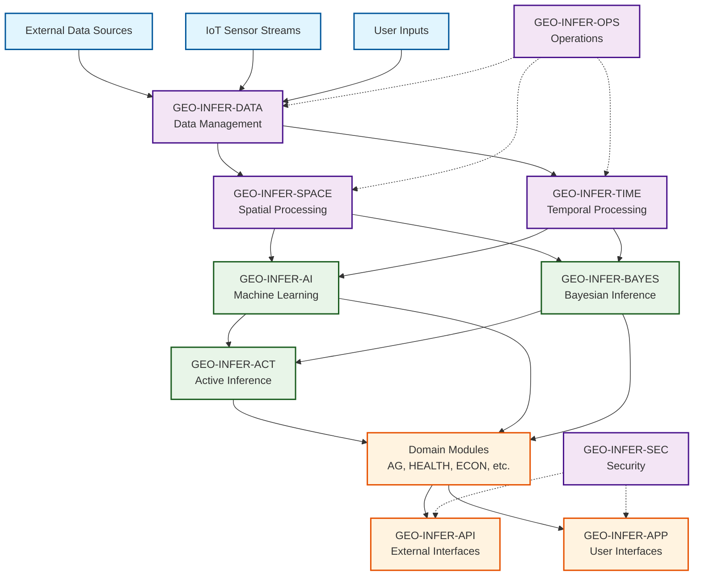

# GEO-INFER Cross-Module Integration Guide 🔗

[]()
[]()
[]()

## 🎯 **Overview**

This guide provides **the definitive reference** for understanding and implementing cross-module integrations within the GEO-INFER ecosystem. Every integration pattern, data flow, and best practice is documented here.

> **🎯 Core Principle**: The power of GEO-INFER comes from combining modules, not using them in isolation. This guide shows you how to unlock that power.

## 📊 **Integration Architecture**

### **Module Dependency Matrix**

| Module | Core Dependencies | Optional Dependencies | Provides Services To | Integration Complexity |
|--------|------------------|--------------------|-------------------|----------------------|
| **OPS** | - | SEC | ALL modules | ⭐ Simple |
| **DATA** | OPS, SEC | - | ALL modules | ⭐⭐ Moderate |
| **SPACE** | DATA, MATH | TIME, AI, IOT | Domain modules | ⭐⭐ Moderate |
| **TIME** | DATA, MATH | SPACE, AI, IOT | Domain modules | ⭐⭐ Moderate |
| **IOT** | SPACE, DATA | BAYES, TIME, AI | Sensor modules | ⭐⭐⭐ Complex |
| **AI** | DATA, SPACE | TIME, AGENT | Analytical modules | ⭐⭐⭐ Complex |
| **ACT** | MATH, BAYES | AI, AGENT, SIM | Decision systems | ⭐⭐⭐⭐ Advanced |
| **BAYES** | MATH | SPACE, TIME | Statistical modules | ⭐⭐⭐ Complex |
| **AGENT** | ACT, AI | SPACE, TIME, SIM | Autonomous systems | ⭐⭐⭐⭐ Advanced |
| **SIM** | SPACE, TIME | AI, AGENT, ACT | Decision support | ⭐⭐⭐⭐ Advanced |

### **Data Flow Patterns**



## 🏗️ **Integration Patterns**

### **Pattern 1: Linear Data Pipeline**
```python
# Simple sequential processing
DATA → SPACE → TIME → AI → DOMAIN → API → APP

# Example: Basic spatial analysis
from geo_infer_data import DataManager
from geo_infer_space import SpatialProcessor
from geo_infer_ai import MLPredictor
from geo_infer_api import APIManager

# Initialize components
data_mgr = DataManager()
spatial = SpatialProcessor()
ml_engine = MLPredictor()
api = APIManager()

# Sequential processing
raw_data = data_mgr.load_dataset("example.geojson")
spatial_features = spatial.extract_features(raw_data)
predictions = ml_engine.predict(spatial_features)
api.serve_results(predictions)
```

### **Pattern 2: Parallel Processing with Convergence**
```python
# Parallel processing that converges
DATA → [SPACE, TIME] → AI → DOMAIN

# Example: Spatio-temporal analysis
from geo_infer_examples.core import ParallelProcessor

processor = ParallelProcessor([
    ('spatial', SpatialProcessor()),
    ('temporal', TimeProcessor())
])

# Parallel processing
results = processor.process_parallel(data, modules=['SPACE', 'TIME'])
combined = processor.merge_results(results)
predictions = ml_engine.analyze(combined)
```

### **Pattern 3: Feedback Loop (Active Inference)**
```python
# Iterative processing with feedback
ACT ↔ BAYES ↔ AI ↔ SIM → AGENT

# Example: Adaptive learning system
from geo_infer_act import ActiveInferenceEngine
from geo_infer_agent import AutonomousAgent

act_engine = ActiveInferenceEngine()
agent = AutonomousAgent()

for iteration in range(max_iterations):
    # Belief update
    beliefs = act_engine.update_beliefs(observations)
    
    # Policy selection
    action = act_engine.select_action(beliefs)
    
    # Execute action
    result = agent.execute(action)
    
    # Update observations
    observations = result.get_observations()
```

### **Pattern 4: Hub-and-Spoke (Centralized Coordination)**
```python
# Central coordinator managing multiple modules
OPS → [SPACE, TIME, AI, DOMAIN] → APP

# Example: Multi-module dashboard
from geo_infer_examples.core import ModuleOrchestrator

orchestrator = ModuleOrchestrator([
    'GEO-INFER-SPACE',
    'GEO-INFER-TIME', 
    'GEO-INFER-AI',
    'GEO-INFER-HEALTH'
])

# Coordinated execution
results = orchestrator.execute_workflow({
    'data_source': 'health_surveillance_data.csv',
    'analysis_type': 'outbreak_detection',
    'output_format': 'dashboard'
})
```

## 🔧 **Integration Implementation**

### **Module Connection Patterns**

#### **1. Direct API Integration**
```python
# Direct REST API calls between modules
import requests
from geo_infer_examples.utils import APIConnector

class ModuleIntegrator:
    def __init__(self):
        self.connector = APIConnector()
    
    def integrate_space_time(self, spatial_data):
        # Send spatial data to TIME module
        response = self.connector.post(
            module='TIME',
            endpoint='/analyze/temporal-patterns',
            data=spatial_data
        )
        return response.json()
```

#### **2. Shared Data Layer Integration**
```python
# Integration through shared data structures
from geo_infer_examples.models import SpatialTemporalData

class SharedDataIntegrator:
    def __init__(self):
        self.shared_data = SpatialTemporalData()
    
    def process_with_multiple_modules(self, input_data):
        # Store in shared format
        self.shared_data.add_observations(input_data)
        
        # Process with SPACE module
        spatial_results = space_module.analyze(self.shared_data.spatial_view)
        
        # Process with TIME module  
        temporal_results = time_module.analyze(self.shared_data.temporal_view)
        
        # Combine results
        return self.shared_data.merge_results(spatial_results, temporal_results)
```

#### **3. Event-Driven Integration**
```python
# Integration via event messaging
from geo_infer_examples.core import EventBus

class EventDrivenIntegrator:
    def __init__(self):
        self.event_bus = EventBus()
        self.setup_listeners()
    
    def setup_listeners(self):
        self.event_bus.subscribe('spatial_analysis_complete', self.handle_spatial_complete)
        self.event_bus.subscribe('temporal_analysis_complete', self.handle_temporal_complete)
    
    def handle_spatial_complete(self, event):
        # Trigger dependent analysis
        self.event_bus.publish('trigger_ai_analysis', event.data)
```

## 📚 **Common Integration Scenarios**

### **Scenario 1: Health Surveillance Pipeline**
```yaml
Scenario: Disease Outbreak Detection
Modules: [DATA, SPACE, TIME, HEALTH, RISK, AI, API, APP]
Pattern: Linear → Parallel → Convergence
Flow: |
  1. DATA: Ingest health records, environmental data
  2. SPACE: Geocode addresses, create spatial indexes
  3. TIME: Identify temporal patterns and trends
  4. HEALTH: Apply epidemiological models
  5. AI: Detect anomalies and predict spread
  6. RISK: Assess outbreak probability
  7. API: Serve alerts to external systems
  8. APP: Display dashboard for health officials

Integration Points:
  - DATA → SPACE: Geocoding pipeline
  - SPACE → TIME: Spatio-temporal clustering
  - HEALTH → AI: Model training and prediction
  - AI → RISK: Uncertainty quantification
  - RISK → API: Alert generation
  - API → APP: Real-time updates
```

### **Scenario 2: Precision Agriculture System**
```yaml
Scenario: Crop Health Monitoring
Modules: [IOT, DATA, SPACE, TIME, AG, AI, SIM, API]
Pattern: Sensor → Processing → Analysis → Action
Flow: |
  1. IOT: Collect sensor data (soil, weather, imagery)
  2. DATA: Store and quality-check sensor streams
  3. SPACE: Process satellite/drone imagery
  4. TIME: Analyze temporal trends in growth
  5. AG: Apply agricultural models and algorithms
  6. AI: Predict pest/disease outbreaks
  7. SIM: Model intervention scenarios
  8. API: Send recommendations to farm management

Integration Points:
  - IOT → DATA: Real-time data streaming
  - DATA → SPACE: Image processing pipeline
  - SPACE → AG: Crop health assessment
  - AG → AI: Predictive modeling
  - AI → SIM: Scenario simulation
  - SIM → API: Decision support
```

### **Scenario 3: Urban Planning Platform**
```yaml
Scenario: Participatory Urban Development
Modules: [CIV, APP, SPACE, NORMS, ORG, SIM, ECON]
Pattern: Community → Analysis → Simulation → Governance
Flow: |
  1. CIV: Collect community input and preferences
  2. APP: Provide interactive planning interface
  3. SPACE: Analyze existing urban infrastructure
  4. NORMS: Check zoning and regulatory compliance
  5. SIM: Model development scenarios
  6. ECON: Assess economic impacts
  7. ORG: Coordinate stakeholder decision-making

Integration Points:
  - CIV → APP: Community engagement portal
  - APP → SPACE: Interactive mapping
  - SPACE → NORMS: Compliance checking
  - NORMS → SIM: Constraint-based modeling
  - SIM → ECON: Impact assessment
  - ECON → ORG: Decision support
```

## 🛠️ **Best Practices**

### **1. Configuration Management**
```python
# Centralized configuration for multi-module workflows
from geo_infer_examples.core import ConfigManager

config = ConfigManager()
config.load_integration_profile('health_surveillance')

# Access module-specific configs
space_config = config.get_module_config('SPACE')
health_config = config.get_module_config('HEALTH')

# Ensure consistent settings across modules
config.synchronize_common_settings()
```

### **2. Error Handling and Resilience**
```python
from geo_infer_examples.utils import ResilientIntegrator

class HealthSurveillanceWorkflow(ResilientIntegrator):
    def __init__(self):
        super().__init__()
        self.required_modules = ['DATA', 'SPACE', 'HEALTH', 'AI']
        self.optional_modules = ['RISK', 'SIM']
    
    def execute(self, input_data):
        try:
            # Required processing
            data = self.modules['DATA'].process(input_data)
            spatial = self.modules['SPACE'].analyze(data)
            health = self.modules['HEALTH'].assess(spatial)
            predictions = self.modules['AI'].predict(health)
            
            # Optional enhancements
            if self.is_available('RISK'):
                predictions = self.modules['RISK'].quantify_uncertainty(predictions)
            
            return predictions
            
        except ModuleError as e:
            return self.handle_module_failure(e)
```

### **3. Performance Optimization**
```python
from geo_infer_examples.utils import PerformanceOptimizer

class OptimizedWorkflow:
    def __init__(self):
        self.optimizer = PerformanceOptimizer()
    
    def execute_parallel(self, data):
        # Identify parallelizable operations
        parallel_tasks = [
            ('spatial_analysis', self.analyze_spatial, data),
            ('temporal_analysis', self.analyze_temporal, data),
            ('environmental_analysis', self.analyze_environmental, data)
        ]
        
        # Execute in parallel
        results = self.optimizer.execute_parallel(parallel_tasks)
        
        # Merge results efficiently
        return self.optimizer.merge_results(results)
```

### **4. Data Quality and Validation**
```python
from geo_infer_examples.utils import DataValidator

class IntegrationValidator:
    def __init__(self):
        self.validator = DataValidator()
    
    def validate_integration_data(self, data, source_module, target_module):
        # Check data compatibility
        compatibility = self.validator.check_compatibility(
            data, source_module, target_module
        )
        
        if not compatibility.is_valid:
            # Attempt automatic conversion
            converted_data = self.validator.convert_format(
                data, compatibility.required_format
            )
            return converted_data
        
        return data
```

## 🧪 **Testing Integration Patterns**

### **Integration Testing Framework**
```python
from geo_infer_examples.testing import IntegrationTestSuite

class HealthSurveillanceIntegrationTest(IntegrationTestSuite):
    def setUp(self):
        self.modules = ['DATA', 'SPACE', 'TIME', 'HEALTH', 'AI']
        self.test_data = self.load_test_dataset('health_surveillance_sample.json')
    
    def test_end_to_end_workflow(self):
        """Test complete health surveillance workflow"""
        result = self.execute_workflow(
            modules=self.modules,
            data=self.test_data,
            expected_outputs=['outbreak_alerts', 'risk_maps', 'predictions']
        )
        
        self.assertWorkflowSuccess(result)
        self.assertOutputsPresent(result, ['outbreak_alerts', 'risk_maps'])
    
    def test_module_failure_resilience(self):
        """Test workflow resilience to module failures"""
        # Simulate AI module failure
        self.simulate_module_failure('AI')
        
        result = self.execute_workflow(
            modules=self.modules,
            data=self.test_data,
            fallback_enabled=True
        )
        
        self.assertWorkflowDegradedSuccess(result)
```

## 📊 **Performance Monitoring**

### **Integration Metrics Dashboard**
```python
from geo_infer_examples.monitoring import IntegrationMonitor

class WorkflowMonitor:
    def __init__(self):
        self.monitor = IntegrationMonitor()
    
    def track_workflow_performance(self, workflow_id):
        return {
            'module_latencies': self.monitor.get_module_latencies(workflow_id),
            'data_transfer_rates': self.monitor.get_transfer_rates(workflow_id),
            'error_rates': self.monitor.get_error_rates(workflow_id),
            'resource_utilization': self.monitor.get_resource_usage(workflow_id)
        }
```

## 🔗 **External Integration**

### **Third-Party System Integration**
```python
from geo_infer_examples.external import ExternalSystemConnector

class ExternalIntegrator:
    def __init__(self):
        self.connector = ExternalSystemConnector()
    
    def integrate_with_external_gis(self, results):
        # Connect to ArcGIS, QGIS, etc.
        gis_connector = self.connector.get_gis_connector('ArcGIS')
        return gis_connector.upload_results(results)
    
    def integrate_with_iot_platform(self, sensor_config):
        # Connect to IoT platforms
        iot_connector = self.connector.get_iot_connector('AWS_IoT')
        return iot_connector.setup_sensor_pipeline(sensor_config)
```

## 📖 **Learning Pathways**

### **Progressive Integration Learning**

#### **Level 1: Basic Integration (Beginner)**
- Two-module integration (SPACE + TIME)
- Simple data passing
- Linear workflows
- **Examples**: `basic_spatio_temporal_analysis`

#### **Level 2: Multi-Module Workflows (Intermediate)**
- 3-5 module integration
- Parallel processing
- Configuration management
- **Examples**: `health_surveillance_basic`, `precision_agriculture_simple`

#### **Level 3: Complex Orchestration (Advanced)**
- 5+ module integration
- Event-driven patterns
- Error handling and resilience
- **Examples**: `smart_city_platform`, `climate_adaptation_system`

#### **Level 4: Custom Integration Patterns (Expert)**
- Novel integration architectures
- Performance optimization
- Custom middleware development
- **Examples**: `custom_active_inference_system`, `distributed_sensor_network`

## 🎯 **Next Steps**

1. **Choose Your Integration Level**: Start with Level 1 examples
2. **Select Domain**: Pick a domain that matches your interests
3. **Follow Examples**: Use provided templates and patterns
4. **Experiment**: Modify examples for your specific use case
5. **Contribute**: Share your integration patterns with the community

---

> **🚀 Ready to start?** Head to the [Getting Started Examples](../examples/getting_started/) to begin your cross-module integration journey! 