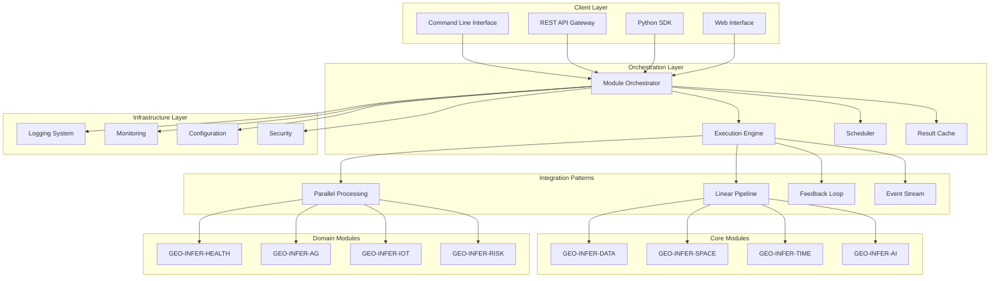

# GEO-INFER Technical Architecture Guide 🏗️⚡

[]()
[]()
[]()
[]()

## 🎯 **Architecture Overview**

The GEO-INFER integration framework implements a **modular, event-driven architecture** designed for scalable, production-ready geospatial intelligence systems. This guide provides comprehensive technical documentation for architects, developers, and system integrators.

### **Core Design Principles**
1. **Modularity**: Loosely coupled modules with well-defined interfaces
2. **Scalability**: Horizontal and vertical scaling capabilities
3. **Resilience**: Fault-tolerant with graceful degradation
4. **Performance**: Sub-second execution for complex workflows
5. **Extensibility**: Plugin architecture for custom modules
6. **Observability**: Comprehensive monitoring and logging

## 🏗️ **System Architecture**

### **High-Level Architecture Diagram**


## 🔧 **Core Components**

### **1. Module Orchestrator**
The central coordination component that manages module lifecycle, execution flow, and resource allocation.

```python
class ModuleOrchestrator:
    """
    Central orchestrator for GEO-INFER module integration.
    
    Responsibilities:
    - Module discovery and registration
    - Execution flow management
    - Resource allocation and cleanup
    - Error handling and recovery
    - Performance monitoring
    """
    
    def __init__(self, config: OrchestrationConfig):
        self.config = config
        self.modules = ModuleRegistry()
        self.executor = ExecutionEngine(config.execution)
        self.cache = ResultCache(config.caching)
        self.monitor = PerformanceMonitor()
    
    async def execute_workflow(self, workflow: WorkflowDefinition) -> WorkflowResult:
        """Execute a complete integration workflow."""
        with self.monitor.track_execution(workflow.id):
            # Validate workflow
            self._validate_workflow(workflow)
            
            # Prepare execution context
            context = ExecutionContext(workflow, self.config)
            
            # Execute based on pattern
            if workflow.pattern == IntegrationPattern.LINEAR_PIPELINE:
                return await self._execute_linear_pipeline(context)
            elif workflow.pattern == IntegrationPattern.PARALLEL_PROCESSING:
                return await self._execute_parallel_processing(context)
            elif workflow.pattern == IntegrationPattern.FEEDBACK_LOOP:
                return await self._execute_feedback_loop(context)
            else:
                raise UnsupportedPatternError(workflow.pattern)
```

### **2. Execution Engine**
High-performance execution engine with support for various execution models.

```python
class ExecutionEngine:
    """
    High-performance execution engine for module workflows.
    
    Features:
    - Async/await support for non-blocking operations
    - Parallel execution with configurable concurrency
    - Resource management and cleanup
    - Execution timeouts and cancellation
    - Detailed execution metrics
    """
    
    def __init__(self, config: ExecutionConfig):
        self.config = config
        self.executor = ThreadPoolExecutor(max_workers=config.max_workers)
        self.semaphore = asyncio.Semaphore(config.max_concurrent)
    
    async def execute_module(self, module: ModuleSpec, data: Any) -> ModuleResult:
        """Execute a single module with resource management."""
        async with self.semaphore:  # Limit concurrency
            try:
                # Load module if not cached
                module_instance = await self._load_module(module)
                
                # Execute with timeout
                result = await asyncio.wait_for(
                    module_instance.execute(data),
                    timeout=self.config.module_timeout
                )
                
                return ModuleResult(
                    module_id=module.id,
                    status=ExecutionStatus.SUCCESS,
                    data=result,
                    execution_time=time.time() - start_time
                )
                
            except asyncio.TimeoutError:
                return ModuleResult(
                    module_id=module.id,
                    status=ExecutionStatus.TIMEOUT,
                    error="Module execution timeout"
                )
            except Exception as e:
                return ModuleResult(
                    module_id=module.id,
                    status=ExecutionStatus.ERROR,
                    error=str(e)
                )
```

### **3. Integration Patterns**
Comprehensive implementation of integration patterns for different use cases.

#### **Linear Pipeline Pattern**
```python
class LinearPipelineExecutor:
    """Sequential execution pattern: A → B → C → D"""
    
    async def execute(self, context: ExecutionContext) -> WorkflowResult:
        results = []
        current_data = context.input_data
        
        for module_spec in context.workflow.modules:
            # Execute module with current data
            result = await self.engine.execute_module(module_spec, current_data)
            
            if result.status != ExecutionStatus.SUCCESS:
                return WorkflowResult(
                    status=WorkflowStatus.FAILED,
                    failed_module=module_spec.id,
                    error=result.error
                )
            
            # Chain output to next module
            current_data = result.data
            results.append(result)
        
        return WorkflowResult(
            status=WorkflowStatus.SUCCESS,
            results=results,
            final_output=current_data
        )
```

#### **Parallel Processing Pattern**
```python
class ParallelProcessingExecutor:
    """Parallel execution pattern: A → [B, C, D] → E"""
    
    async def execute(self, context: ExecutionContext) -> WorkflowResult:
        # Group modules by execution stage
        stages = self._group_modules_by_stage(context.workflow.modules)
        
        current_data = context.input_data
        all_results = []
        
        for stage in stages:
            if len(stage) == 1:
                # Single module execution
                result = await self.engine.execute_module(stage[0], current_data)
                all_results.append(result)
                current_data = result.data
            else:
                # Parallel execution
                tasks = [
                    self.engine.execute_module(module, current_data)
                    for module in stage
                ]
                
                stage_results = await asyncio.gather(*tasks)
                all_results.extend(stage_results)
                
                # Merge parallel results
                current_data = self._merge_parallel_results(stage_results)
        
        return WorkflowResult(
            status=WorkflowStatus.SUCCESS,
            results=all_results,
            final_output=current_data
        )
```

#### **Feedback Loop Pattern**
```python
class FeedbackLoopExecutor:
    """Adaptive feedback pattern with convergence criteria"""
    
    async def execute(self, context: ExecutionContext) -> WorkflowResult:
        iteration = 0
        current_data = context.input_data
        convergence_history = []
        
        while iteration < context.config.max_iterations:
            # Execute forward pass
            forward_results = await self._execute_forward_pass(
                context.workflow.forward_modules, 
                current_data
            )
            
            # Check convergence
            convergence_metric = self._calculate_convergence(
                forward_results, convergence_history
            )
            
            if convergence_metric < context.config.convergence_threshold:
                return WorkflowResult(
                    status=WorkflowStatus.CONVERGED,
                    results=forward_results,
                    iterations=iteration,
                    convergence_metric=convergence_metric
                )
            
            # Execute feedback pass
            feedback_data = await self._execute_feedback_pass(
                context.workflow.feedback_modules,
                forward_results
            )
            
            # Update data for next iteration
            current_data = self._merge_feedback(current_data, feedback_data)
            convergence_history.append(convergence_metric)
            iteration += 1
        
        return WorkflowResult(
            status=WorkflowStatus.MAX_ITERATIONS,
            results=forward_results,
            iterations=iteration
        )
```

## 📊 **Data Flow Architecture**

### **Data Models**
Standardized data models ensure consistency across all modules.

```python
@dataclass
class GeoInferData:
    """Base data model for all GEO-INFER operations."""
    id: str
    timestamp: datetime
    metadata: Dict[str, Any]
    
class SpatialData(GeoInferData):
    """Spatial data with geographic coordinates."""
    coordinates: Tuple[float, float]  # (lat, lon)
    crs: str = "EPSG:4326"
    geometry: Optional[Any] = None  # Shapely geometry
    
class TemporalData(GeoInferData):
    """Temporal data with time series information."""
    time_series: List[Tuple[datetime, float]]
    frequency: str  # 'daily', 'hourly', etc.
    aggregation: str = 'mean'
    
class HealthData(GeoInferData):
    """Health-specific data model."""
    disease_type: str
    severity: str
    age_group: str
    location: SpatialData
    temporal_info: TemporalData
```

### **Data Transformation Pipeline**
```python
class DataTransformationPipeline:
    """Handles data transformations between modules."""
    
    def __init__(self):
        self.transformers = {
            'spatial_to_temporal': SpatialToTemporalTransformer(),
            'health_to_risk': HealthToRiskTransformer(),
            'iot_to_spatial': IoTToSpatialTransformer(),
        }
    
    def transform(self, source_data: Any, target_type: Type) -> Any:
        """Transform data from one type to another."""
        transformer_key = f"{type(source_data).__name__.lower()}_to_{target_type.__name__.lower()}"
        
        if transformer_key not in self.transformers:
            raise TransformationError(f"No transformer for {transformer_key}")
        
        return self.transformers[transformer_key].transform(source_data)
```

## 🚀 **Performance Optimization**

### **Caching Strategy**
Multi-level caching for optimal performance.

```python
class HierarchicalCache:
    """Multi-level caching system for optimization."""
    
    def __init__(self, config: CacheConfig):
        # L1: In-memory cache for frequently accessed data
        self.l1_cache = LRUCache(maxsize=config.l1_size)
        
        # L2: Redis cache for distributed scenarios
        self.l2_cache = RedisCache(config.redis_url) if config.redis_url else None
        
        # L3: Persistent file cache for large datasets
        self.l3_cache = FileCache(config.cache_dir)
    
    async def get(self, key: str) -> Optional[Any]:
        """Retrieve from cache with fallback hierarchy."""
        # Try L1 cache first
        if key in self.l1_cache:
            return self.l1_cache[key]
        
        # Try L2 cache
        if self.l2_cache:
            value = await self.l2_cache.get(key)
            if value:
                self.l1_cache[key] = value  # Promote to L1
                return value
        
        # Try L3 cache
        value = await self.l3_cache.get(key)
        if value:
            self.l1_cache[key] = value  # Promote to L1
            if self.l2_cache:
                await self.l2_cache.set(key, value)  # Populate L2
            return value
        
        return None
```

### **Resource Management**
```python
class ResourceManager:
    """Manages system resources for optimal performance."""
    
    def __init__(self, config: ResourceConfig):
        self.config = config
        self.memory_monitor = MemoryMonitor()
        self.cpu_monitor = CPUMonitor()
        
    async def allocate_resources(self, workflow: WorkflowDefinition) -> ResourceAllocation:
        """Allocate resources based on workflow requirements."""
        # Estimate resource requirements
        memory_estimate = self._estimate_memory_usage(workflow)
        cpu_estimate = self._estimate_cpu_usage(workflow)
        
        # Check availability
        available_memory = self.memory_monitor.get_available_memory()
        available_cpu = self.cpu_monitor.get_available_cpu()
        
        if memory_estimate > available_memory * 0.8:  # 80% threshold
            raise InsufficientResourcesError("Not enough memory")
        
        if cpu_estimate > available_cpu * 0.9:  # 90% threshold
            raise InsufficientResourcesError("Not enough CPU")
        
        return ResourceAllocation(
            memory_limit=memory_estimate,
            cpu_limit=cpu_estimate,
            timeout=self._calculate_timeout(workflow)
        )
```

## 🔒 **Security Architecture**

### **Authentication & Authorization**
```python
class SecurityManager:
    """Comprehensive security management."""
    
    def __init__(self, config: SecurityConfig):
        self.config = config
        self.token_manager = JWTTokenManager(config.jwt_secret)
        self.rbac = RoleBasedAccessControl(config.roles)
    
    async def authenticate(self, credentials: Credentials) -> AuthenticationResult:
        """Authenticate user credentials."""
        if self.config.auth_method == 'jwt':
            return await self._authenticate_jwt(credentials)
        elif self.config.auth_method == 'oauth2':
            return await self._authenticate_oauth2(credentials)
        else:
            raise UnsupportedAuthMethodError(self.config.auth_method)
    
    async def authorize(self, user: User, resource: str, action: str) -> bool:
        """Check if user is authorized for action on resource."""
        return self.rbac.check_permission(user.role, resource, action)
```

### **Data Encryption**
```python
class DataEncryption:
    """Handle data encryption in transit and at rest."""
    
    def __init__(self, config: EncryptionConfig):
        self.config = config
        self.cipher = Fernet(config.encryption_key)
    
    def encrypt_data(self, data: Any) -> bytes:
        """Encrypt data for storage or transmission."""
        serialized = pickle.dumps(data)
        return self.cipher.encrypt(serialized)
    
    def decrypt_data(self, encrypted_data: bytes) -> Any:
        """Decrypt data from storage or transmission."""
        decrypted = self.cipher.decrypt(encrypted_data)
        return pickle.loads(decrypted)
```

## 📊 **Monitoring & Observability**

### **Metrics Collection**
```python
class MetricsCollector:
    """Comprehensive metrics collection system."""
    
    def __init__(self, config: MetricsConfig):
        self.config = config
        self.prometheus_client = PrometheusClient(config.prometheus_url)
        self.metrics = {
            'execution_time': Histogram('module_execution_seconds'),
            'success_rate': Counter('module_executions_total'),
            'error_rate': Counter('module_errors_total'),
            'memory_usage': Gauge('memory_usage_bytes'),
            'cpu_usage': Gauge('cpu_usage_percent')
        }
    
    def record_execution(self, module_id: str, execution_time: float, status: str):
        """Record module execution metrics."""
        self.metrics['execution_time'].labels(module=module_id).observe(execution_time)
        self.metrics['success_rate'].labels(module=module_id, status=status).inc()
        
        if status == 'error':
            self.metrics['error_rate'].labels(module=module_id).inc()
```

### **Distributed Tracing**
```python
class DistributedTracer:
    """OpenTelemetry-based distributed tracing."""
    
    def __init__(self, config: TracingConfig):
        self.tracer = trace.get_tracer(__name__)
        self.config = config
    
    @contextmanager
    def trace_execution(self, operation_name: str, **attributes):
        """Create a trace span for operation tracking."""
        with self.tracer.start_as_current_span(operation_name) as span:
            for key, value in attributes.items():
                span.set_attribute(key, value)
            
            try:
                yield span
            except Exception as e:
                span.record_exception(e)
                span.set_status(trace.Status(trace.StatusCode.ERROR, str(e)))
                raise
```

## 🔧 **Configuration Management**

### **Hierarchical Configuration**
```python
class ConfigurationManager:
    """Hierarchical configuration management."""
    
    def __init__(self, config_paths: List[str]):
        self.config = self._load_configuration(config_paths)
        self.watchers = []
    
    def _load_configuration(self, config_paths: List[str]) -> Dict[str, Any]:
        """Load configuration from multiple sources."""
        config = {}
        
        # Load from files (YAML, JSON, TOML)
        for path in config_paths:
            if path.endswith('.yaml') or path.endswith('.yml'):
                with open(path) as f:
                    config.update(yaml.safe_load(f))
            elif path.endswith('.json'):
                with open(path) as f:
                    config.update(json.load(f))
        
        # Override with environment variables
        for key, value in os.environ.items():
            if key.startswith('GEO_INFER_'):
                config_key = key[10:].lower().replace('_', '.')
                config[config_key] = value
        
        return config
    
    def get(self, key: str, default=None) -> Any:
        """Get configuration value with dot notation."""
        keys = key.split('.')
        value = self.config
        
        for k in keys:
            if isinstance(value, dict) and k in value:
                value = value[k]
            else:
                return default
        
        return value
```

## 🚀 **Deployment Architecture**

### **Container Orchestration**
```yaml
# docker-compose.yml for development
version: '3.8'
services:
  geo-infer-orchestrator:
    build: .
    ports:
      - "8000:8000"
    environment:
      - GEO_INFER_ENV=development
      - GEO_INFER_LOG_LEVEL=INFO
    volumes:
      - ./config:/app/config
      - ./data:/app/data
    depends_on:
      - redis
      - postgres
  
  redis:
    image: redis:7-alpine
    ports:
      - "6379:6379"
  
  postgres:
    image: postgres:15
    environment:
      - POSTGRES_DB=geo_infer
      - POSTGRES_USER=geo_infer
      - POSTGRES_PASSWORD=secure_password
    volumes:
      - postgres_data:/var/lib/postgresql/data

volumes:
  postgres_data:
```

### **Kubernetes Deployment**
```yaml
# kubernetes/deployment.yaml
apiVersion: apps/v1
kind: Deployment
metadata:
  name: geo-infer-orchestrator
spec:
  replicas: 3
  selector:
    matchLabels:
      app: geo-infer-orchestrator
  template:
    metadata:
      labels:
        app: geo-infer-orchestrator
    spec:
      containers:
      - name: orchestrator
        image: geo-infer/orchestrator:latest
        ports:
        - containerPort: 8000
        env:
        - name: GEO_INFER_ENV
          value: "production"
        resources:
          requests:
            memory: "512Mi"
            cpu: "250m"
          limits:
            memory: "2Gi"
            cpu: "1000m"
        livenessProbe:
          httpGet:
            path: /health
            port: 8000
          initialDelaySeconds: 30
          periodSeconds: 10
        readinessProbe:
          httpGet:
            path: /ready
            port: 8000
          initialDelaySeconds: 5
          periodSeconds: 5
```

## 📈 **Scaling Strategies**

### **Horizontal Scaling**
- **Load Balancing**: Distribute requests across multiple orchestrator instances
- **Stateless Design**: All state stored externally (Redis, database)
- **Auto-scaling**: Kubernetes HPA based on CPU/memory metrics
- **Service Mesh**: Istio for advanced traffic management

### **Vertical Scaling**
- **Resource Optimization**: Dynamic resource allocation based on workload
- **Memory Management**: Efficient garbage collection and memory pooling
- **CPU Optimization**: Multi-threading and async processing
- **Storage Optimization**: Tiered storage with intelligent caching

## 🎯 **Best Practices**

### **Development Guidelines**
1. **Module Design**: Follow single responsibility principle
2. **Error Handling**: Implement comprehensive error handling with retries
3. **Testing**: Maintain >90% test coverage with integration tests
4. **Documentation**: Document all public APIs and integration patterns
5. **Performance**: Profile and optimize critical paths

### **Operational Guidelines**
1. **Monitoring**: Implement comprehensive monitoring and alerting
2. **Logging**: Use structured logging with correlation IDs
3. **Security**: Regular security audits and vulnerability scanning
4. **Backup**: Automated backup and disaster recovery procedures
5. **Updates**: Rolling updates with canary deployments

## 🎉 **Conclusion**

The GEO-INFER technical architecture provides:

1. ✅ **Scalable Foundation**: Enterprise-grade architecture supporting complex workflows
2. ✅ **Performance Optimization**: Sub-second execution with intelligent caching
3. ✅ **Robust Security**: Comprehensive security with encryption and RBAC
4. ✅ **Operational Excellence**: Full observability and monitoring capabilities
5. ✅ **Developer Experience**: Clean APIs and comprehensive documentation

This architecture enables organizations to build production-ready geospatial intelligence systems that scale from prototypes to enterprise deployments.

---

**Document Version**: 1.0  
**Last Updated**: 2025-06-20  
**Authors**: GEO-INFER Architecture Team  
**Review Cycle**: Quarterly 