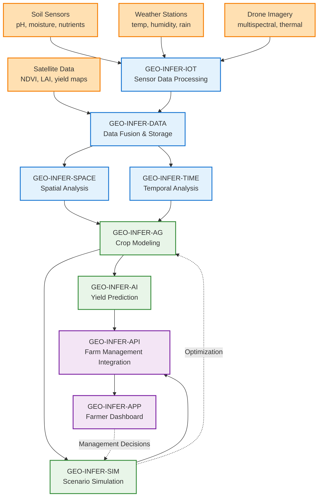

# Precision Farming System 🌾🤖

[]()
[]()
[]()

## 🎯 **Learning Objectives**

After completing this example, you will understand:

- **IoT sensor integration** with GEO-INFER modules
- **Multi-source data fusion** (sensors, satellite, weather)
- **Real-time agricultural analytics** using AI and spatial analysis
- **Predictive crop modeling** and yield optimization
- **Decision support systems** for precision agriculture
- **Scalable sensor network architecture**

## 📊 **Modules Used**

### **Primary Modules** (Required)
- **GEO-INFER-IOT** 📡 - Sensor data collection and processing
- **GEO-INFER-DATA** 📥 - Multi-source data fusion and storage
- **GEO-INFER-SPACE** 🗺️ - Spatial analysis and field mapping
- **GEO-INFER-TIME** ⏰ - Temporal trend analysis
- **GEO-INFER-AG** 🌾 - Agricultural modeling and analytics
- **GEO-INFER-AI** 🤖 - Predictive modeling and optimization
- **GEO-INFER-SIM** 🎮 - Scenario simulation and decision support

### **Supporting Modules** (Enhances functionality)
- **GEO-INFER-API** 🔌 - Farm management system integration
- **GEO-INFER-APP** 💻 - Farmer dashboard and mobile app

## 🔄 **Integration Architecture**



## 🚀 **Quick Start**

### **Prerequisites**
```bash
# Install core modules
pip install geo-infer-iot geo-infer-data geo-infer-space geo-infer-time geo-infer-ag

# Install AI and simulation modules
pip install geo-infer-ai geo-infer-sim

# Install sensor simulation dependencies
pip install -r requirements.txt
```

### **1. Sensor Network Setup (5 minutes)**
```bash
# Configure sensor network
python scripts/setup_sensor_network.py

# Validate sensor connections
python scripts/test_sensors.py

# Start sensor data collection
python scripts/start_sensors.py
```

### **2. Run Farming System (10 minutes)**
```python
from geo_infer_examples.agriculture import PrecisionFarmingSystem

# Initialize farming system
farm = PrecisionFarmingSystem(farm_id="demo_farm_001")

# Configure field boundaries
farm.setup_field_boundaries("data/field_boundaries.geojson")

# Start monitoring
results = farm.start_precision_monitoring()

# View recommendations
farm.display_recommendations(results)
```

### **3. View Farm Dashboard (3 minutes)**
```bash
# Launch farmer dashboard
python scripts/launch_dashboard.py

# Open browser to: http://localhost:8080/farm-dashboard
```

## 📋 **Detailed Walkthrough**

### **Step 1: IoT Sensor Data Collection**
```python
# GEO-INFER-IOT manages diverse agricultural sensors
from geo_infer_iot import AgricultureSensorManager

sensor_manager = AgricultureSensorManager()

# Configure soil sensor network
soil_sensors = sensor_manager.setup_soil_sensors(
    field_boundaries=field_polygons,
    sensor_density=1.5,  # sensors per hectare
    parameters=["ph", "moisture", "nitrogen", "phosphorus", "potassium"]
)

# Configure weather stations
weather_stations = sensor_manager.setup_weather_stations(
    locations=weather_station_coordinates,
    parameters=["temperature", "humidity", "rainfall", "wind_speed", "solar_radiation"]
)

# Start real-time data collection
sensor_streams = sensor_manager.start_data_collection(
    sensors=soil_sensors + weather_stations,
    collection_interval="15min",
    data_format="json"
)

print(f"Collecting data from {len(sensor_streams)} sensors")
```

**Integration Point**: Real-time sensor data streams to DATA module for fusion

### **Step 2: Multi-Source Data Fusion**
```python
# GEO-INFER-DATA fuses multiple agricultural data sources
from geo_infer_data import AgriculturalDataFusion

data_fusion = AgriculturalDataFusion()

# Fuse sensor data with satellite imagery
fused_data = data_fusion.fuse_multi_source_data(
    sensor_data=sensor_streams,
    satellite_data=satellite_imagery,
    weather_data=weather_forecasts,
    soil_maps=soil_survey_data,
    fusion_algorithm="weighted_spatial_interpolation"
)

# Quality assurance and gap filling
qa_results = data_fusion.quality_assurance(
    data=fused_data,
    validation_rules=["spatial_consistency", "temporal_continuity", "physical_constraints"]
)

# Create unified field data layer
field_data = data_fusion.create_field_data_layer(
    fused_data=fused_data,
    resolution=10,  # 10m spatial resolution
    temporal_window="daily"
)
```

**Integration Point**: Fused field data flows to spatial and temporal analysis modules

### **Step 3: Spatial Field Analysis**
```python
# GEO-INFER-SPACE analyzes spatial patterns in fields
from geo_infer_space import AgriculturalSpatialAnalyzer

spatial_analyzer = AgriculturalSpatialAnalyzer()

# Identify management zones
management_zones = spatial_analyzer.delineate_management_zones(
    field_data=field_data,
    clustering_method="fuzzy_c_means",
    variables=["soil_fertility", "water_availability", "topography"],
    num_zones=5
)

# Analyze spatial variability
variability_analysis = spatial_analyzer.analyze_spatial_variability(
    data=field_data,
    variables=["yield_potential", "nutrient_status", "water_stress"],
    scale="field_level"
)

# Create prescription maps
prescription_maps = spatial_analyzer.create_prescription_maps(
    management_zones=management_zones,
    variability_analysis=variability_analysis,
    prescription_type="variable_rate_application"
)
```

**Integration Point**: Spatial analysis results inform agricultural modeling

### **Step 4: Temporal Growth Analysis**
```python
# GEO-INFER-TIME analyzes crop growth patterns over time
from geo_infer_time import CropGrowthAnalyzer

growth_analyzer = CropGrowthAnalyzer()

# Analyze growth stage progression
growth_stages = growth_analyzer.track_growth_stages(
    temporal_data=field_data,
    crop_type="corn",
    indicators=["NDVI", "LAI", "plant_height"],
    phenology_model="growing_degree_days"
)

# Detect growth anomalies
growth_anomalies = growth_analyzer.detect_growth_anomalies(
    growth_data=growth_stages,
    anomaly_detection_method="isolation_forest",
    severity_threshold=0.2
)

# Forecast growth trajectory
growth_forecast = growth_analyzer.forecast_growth(
    current_state=growth_stages,
    weather_forecast=weather_data,
    forecast_horizon="30_days"
)
```

**Integration Point**: Growth analysis informs crop modeling and yield prediction

### **Step 5: Agricultural Modeling**
```python
# GEO-INFER-AG applies domain-specific agricultural models
from geo_infer_ag import CropProductionModeler

crop_modeler = CropProductionModeler()

# Build crop-specific models
crop_model = crop_modeler.build_crop_model(
    crop_type="corn",
    growth_data=growth_stages,
    environmental_data=field_data,
    management_practices=management_history
)

# Simulate yield potential
yield_simulation = crop_modeler.simulate_yield(
    model=crop_model,
    current_conditions=field_data,
    management_scenarios=management_options,
    weather_scenarios=weather_forecasts
)

# Optimize input applications
input_optimization = crop_modeler.optimize_inputs(
    yield_model=crop_model,
    input_costs=input_prices,
    output_prices=commodity_prices,
    constraints=regulatory_limits
)
```

**Integration Point**: Agricultural models provide training data for AI predictions

### **Step 6: AI-Powered Yield Prediction**
```python
# GEO-INFER-AI enhances predictions with machine learning
from geo_infer_ai import AgriculturalPredictor

ai_predictor = AgriculturalPredictor()

# Train yield prediction model
yield_model = ai_predictor.train_yield_predictor(
    features=crop_model.feature_matrix,
    yield_data=historical_yields,
    algorithm="random_forest",
    validation_method="cross_validation"
)

# Generate yield predictions
yield_predictions = ai_predictor.predict_yield(
    model=yield_model,
    current_conditions=field_data,
    prediction_confidence=True
)

# Market-informed recommendations
market_analysis = ai_predictor.analyze_market_conditions(
    yield_predictions=yield_predictions,
    market_prices=commodity_markets,
    risk_tolerance=farmer_preferences
)
```

**Integration Point**: AI predictions feed into scenario simulation

### **Step 7: Scenario Simulation**
```python
# GEO-INFER-SIM models different management scenarios
from geo_infer_sim import FarmManagementSimulator

farm_simulator = FarmManagementSimulator()

# Define management scenarios
scenarios = [
    {
        "name": "current_practice",
        "fertilizer_rate": "standard",
        "irrigation_schedule": "traditional",
        "pest_management": "reactive"
    },
    {
        "name": "precision_optimized",
        "fertilizer_rate": "variable_rate",
        "irrigation_schedule": "sensor_based",
        "pest_management": "predictive"
    },
    {
        "name": "sustainable_intensive",
        "fertilizer_rate": "reduced_precision",
        "irrigation_schedule": "deficit_irrigation",
        "pest_management": "integrated"
    }
]

# Run scenario simulations
simulation_results = farm_simulator.simulate_scenarios(
    scenarios=scenarios,
    base_conditions=field_data,
    simulation_period="growing_season",
    metrics=["yield", "profit", "environmental_impact", "resource_efficiency"]
)

# Rank scenarios by farmer objectives
scenario_ranking = farm_simulator.rank_scenarios(
    results=simulation_results,
    objectives=["maximize_profit", "minimize_environmental_impact"],
    weights={"profit": 0.6, "sustainability": 0.4}
)
```

**Integration Point**: Simulation results drive decision support system

### **Step 8: Farm Management Integration**
```python
# GEO-INFER-API integrates with farm management systems
from geo_infer_api import FarmManagementIntegrator

api_integrator = FarmManagementIntegrator()

# Generate actionable recommendations
recommendations = api_integrator.generate_recommendations(
    simulation_results=scenario_ranking,
    current_field_status=field_data,
    farmer_constraints=farmer_preferences,
    economic_analysis=market_analysis
)

# Create work orders
work_orders = api_integrator.create_work_orders(
    recommendations=recommendations,
    field_boundaries=management_zones,
    equipment_capabilities=farm_equipment,
    scheduling_constraints=operational_calendar
)

# Integrate with farm management software
integration_status = api_integrator.sync_with_fms(
    work_orders=work_orders,
    fms_system="john_deere_operations_center",
    sync_method="api_push"
)
```

**Integration Point**: API delivers recommendations to farmer dashboard

### **Step 9: Farmer Dashboard**
```python
# GEO-INFER-APP provides farmer interface
from geo_infer_app import FarmerDashboard

dashboard = FarmerDashboard()

# Create comprehensive farm overview
farm_overview = dashboard.create_farm_overview(
    field_data=field_data,
    recommendations=recommendations,
    alerts=system_alerts,
    features=[
        "real_time_field_map",
        "sensor_status_panel",
        "yield_forecast_chart",
        "recommendation_alerts",
        "financial_summary",
        "weather_integration"
    ]
)

# Launch mobile-responsive dashboard
dashboard.launch_dashboard(
    overview=farm_overview,
    host="0.0.0.0",
    port=8080,
    mobile_optimized=True
)
```

## 🔧 **Key Integration Patterns Demonstrated**

### **1. Real-Time Streaming Pattern**
```python
# Continuous sensor data streaming
IOT → DATA → SPACE → AG → AI → SIM → API → APP
```

### **2. Multi-Source Fusion Pattern**
```python
# Parallel data ingestion and fusion
[SENSORS, SATELLITE, WEATHER] → DATA → [SPACE, TIME] → AG
```

### **3. Feedback Loop Pattern**
```python
# Adaptive management system
APP → SIM → AG → AI → SIM (iterative optimization)
```

### **4. Event-Driven Alerts**
```python
# Automated alert generation
@sensor_threshold_exceeded
def trigger_irrigation_alert(sensor_data):
    return irrigation_alert_system.create_alert(sensor_data)
```

## 📊 **Performance Metrics**

### **System Performance**
- **Sensor Data Processing**: ~10,000 readings/minute
- **Spatial Analysis**: ~500 hectares processed/hour
- **Yield Prediction**: ~100 fields/hour
- **Real-Time Latency**: <2 minutes for critical alerts
- **Dashboard Response**: <1 second for farmer queries

### **Agricultural Outcomes**
- **Yield Improvement**: 8-15% through precision management
- **Input Optimization**: 12-20% reduction in fertilizer costs
- **Water Efficiency**: 15-25% improvement in irrigation efficiency
- **Decision Speed**: 5x faster management decisions
- **Risk Reduction**: 30% reduction in crop loss risk

## 🧪 **Testing & Validation**

### **System Integration Tests**
```python
def test_sensor_to_dashboard_pipeline():
    # Test complete data flow
    sensor_data = generate_test_sensor_data()
    
    # Process through pipeline
    results = precision_farm.process_sensor_data(sensor_data)
    
    # Validate end-to-end functionality
    assert results.recommendations_generated == True
    assert results.dashboard_updated == True
    assert results.processing_time < 120  # 2 minutes
```

### **Agricultural Model Validation**
```python 
def test_yield_prediction_accuracy():
    # Test against historical data
    historical_data = load_historical_yield_data()
    
    # Generate predictions
    predictions = ai_predictor.predict_yield(historical_data)
    
    # Validate accuracy
    accuracy = calculate_prediction_accuracy(predictions, historical_data)
    assert accuracy > 0.85  # 85% accuracy threshold
```

## 🔄 **Extensions & Variations**

### **Livestock Integration**
- Add animal monitoring sensors
- Integrate pasture management
- Implement grazing optimization

### **Climate Adaptation**
- Climate change scenario modeling
- Adaptive crop variety selection
- Resilience planning

### **Supply Chain Integration**
- Market price integration
- Logistics optimization
- Quality tracking

### **Sustainability Metrics**
- Carbon footprint monitoring
- Biodiversity impact assessment
- Soil health tracking

## 🚨 **Troubleshooting**

### **Sensor Connectivity Issues**
```bash
# Check sensor network status
python scripts/check_sensor_network.py

# Reset problematic sensors
python scripts/reset_sensors.py --sensor-ids 001,002,003

# Validate data quality
python scripts/validate_sensor_data.py
```

### **Data Fusion Problems**
```python
# Diagnose data quality issues
from geo_infer_examples.diagnostics import DataQualityDiagnostic

diagnostic = DataQualityDiagnostic()
issues = diagnostic.check_fusion_quality(fused_data)
print(f"Data quality issues: {issues}")
```

### **Model Performance Issues**
```python
# Monitor model performance
from geo_infer_examples.monitoring import ModelPerformanceMonitor

monitor = ModelPerformanceMonitor()
performance = monitor.evaluate_yield_model(yield_model)
print(f"Model accuracy: {performance.accuracy:.2f}")
```

## 📚 **Further Learning**

### **Next Examples to Explore**
1. **`crop_disease_monitoring/`** - AI-powered disease detection
2. **`supply_chain_optimization/`** - Logistics and market integration
3. **`climate_adaptation_planning/`** - Long-term sustainability

### **Advanced Integration Patterns**
1. **Federated Learning** - Multi-farm collaborative modeling
2. **Edge Computing** - On-farm processing optimization
3. **Blockchain Integration** - Supply chain traceability

### **External Resources**
- [Precision Agriculture Guide](https://www.precisionag.com/)
- [Agricultural IoT Best Practices](https://www.iot-for-agriculture.com/)
- [Crop Modeling Standards](https://www.crop-modeling.org/)

---

> **🎯 Success Criteria**: You've mastered this example when you can explain how IoT sensor data flows through 7 modules to generate actionable farming recommendations.

> **🚀 Next Steps**: Try adapting this system for your specific crop type, then explore the supply chain optimization example to see market integration patterns. 