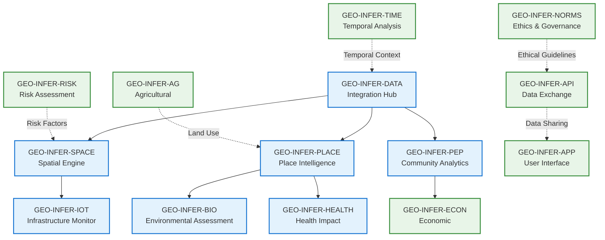
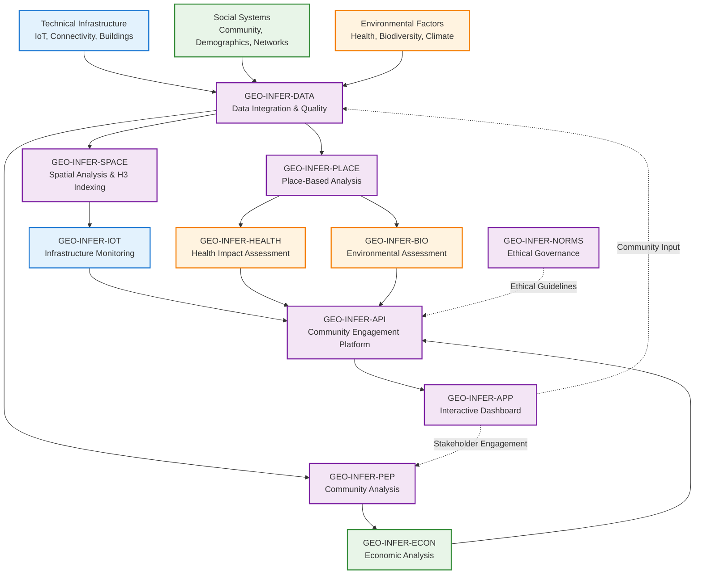

# Comprehensive Area Study Template 🏛️🌍

**Multi-Disciplinary Area Analysis Framework for Technical, Social, and Environmental Research**

[]()
[]()
[]()
[]()

> **A comprehensive framework for integrated area analysis that combines technical infrastructure, social systems, and environmental factors into a unified research and planning tool.**

## 🎯 Learning Objectives

After completing this area study template, you will understand:

- **🔧 Multi-source data integration** - Combine technical, social, and environmental data seamlessly
- **🗺️ Spatial analysis techniques** - Use H3 hexagonal grids for consistent spatial analysis
- **👥 Community-engaged research** - Implement ethical data collection with community participation
- **📊 Cross-domain impact assessment** - Analyze interactions between different systems
- **🎨 Interactive visualization** - Create dynamic dashboards with maps and charts
- **📋 Validation frameworks** - Ensure data quality and community validation
- **🌱 Sustainable planning** - Generate actionable recommendations for area development

## 📋 Key Features

### 🔧 **Technical Integration**
- IoT sensor data processing and analysis
- Connectivity and infrastructure assessment
- Digital divide analysis and mapping
- Smart city infrastructure monitoring

### 👥 **Social Integration**
- Community network analysis and mapping
- Demographic and socioeconomic data integration
- Stakeholder engagement and participation tracking
- Cultural and historical context analysis

### 🌍 **Environmental Integration**
- Air quality, noise, and pollution monitoring
- Biodiversity and green space assessment
- Climate vulnerability and resilience analysis
- Ecosystem services valuation

### 🗺️ **Spatial Analysis**
- H3 hexagonal grid system for consistent spatial units
- Multi-scale analysis (neighborhood, district, area)
- Hotspot identification and clustering
- Accessibility and proximity analysis

### 📊 **Interactive Dashboard**
- Real-time data visualization with Streamlit
- Interactive maps with multiple overlays
- Toggle controls for different data layers
- Exportable reports and data downloads

## 📚 Table of Contents

- [🎯 Learning Objectives](#-learning-objectives)
- [📋 Key Features](#-key-features)
- [🔧 Modules Used](#-modules-used)
- [📊 Data Types Integrated](#-data-types-integrated)
- [🏗️ Architecture Overview](#️-architecture-overview)
- [🚀 Quick Start Guide](#-quick-start-guide)
- [📋 Detailed Walkthrough](#-detailed-walkthrough)
- [🔧 Key Integration Patterns](#-key-integration-patterns)
- [📊 Performance Benchmarks](#-performance-benchmarks)
- [🧪 Testing and Validation](#-testing-and-validation)
- [🔄 Extensions and Variations](#-extensions-and-variations)
- [📚 Further Learning](#-further-learning)
- [📄 Documentation](#-documentation)
- [🤝 Contributing](#-contributing)

## 🔧 Modules Used

### Core Integration Modules

#### **Primary Modules** (Required)
- **GEO-INFER-SPACE** 🗺️ - **Spatial Analysis Engine**
  - H3 hexagonal grid system for consistent spatial units
  - Multi-scale analysis (neighborhood → district → area)
  - Hotspot identification and spatial clustering
  - Accessibility and proximity analysis
  - Coordinate system management and transformations

- **GEO-INFER-DATA** 📊 - **Data Integration Hub**
  - Multi-source data ingestion and normalization
  - Quality assurance and validation frameworks
  - Data governance and access control
  - Real-time data streaming and batch processing
  - Metadata management and provenance tracking

- **GEO-INFER-PLACE** 📍 - **Place-Based Intelligence**
  - Local knowledge integration and cultural context
  - Place-specific analysis and characterization
  - Community-defined boundaries and areas of interest
  - Historical and cultural significance mapping
  - Local stakeholder identification and engagement

- **GEO-INFER-PEP** 👥 - **People & Community Analytics**
  - Social network analysis and community mapping
  - Stakeholder engagement and participation tracking
  - Demographic analysis and population dynamics
  - Community resilience and social capital assessment
  - Cultural and social indicators development

- **GEO-INFER-IOT** 📡 - **Technical Infrastructure Monitoring**
  - IoT sensor data collection and processing
  - Connectivity and network performance analysis
  - Infrastructure condition monitoring
  - Smart city technology integration
  - Real-time monitoring and alerting systems

- **GEO-INFER-BIO** 🧬 - **Environmental Assessment**
  - Biodiversity monitoring and ecological analysis
  - Environmental quality assessment (air, water, soil)
  - Climate vulnerability and adaptation analysis
  - Ecosystem services valuation
  - Environmental impact assessment

- **GEO-INFER-HEALTH** 🏥 - **Health Impact Analysis**
  - Environmental health assessment
  - Community health indicators and trends
  - Health equity analysis and mapping
  - Environmental justice considerations
  - Healthcare access and service analysis

#### **Supporting Modules** (Optional Enhancements)
- **GEO-INFER-TIME** ⏰ - **Temporal Analysis**
  - Historical trend analysis and pattern recognition
  - Future scenario modeling and forecasting
  - Temporal data alignment and synchronization
  - Time-series analysis and anomaly detection

- **GEO-INFER-AG** 🌾 - **Agricultural Integration**
  - Land use and agricultural system analysis
  - Food system assessment and mapping
  - Agricultural technology integration
  - Rural-urban interface analysis

- **GEO-INFER-ECON** 💰 - **Economic Analysis**
  - Local economic impact assessment
  - Market integration and supply chain analysis
  - Economic development opportunity mapping
  - Resource flow analysis and optimization

- **GEO-INFER-RISK** ⚠️ - **Risk & Resilience**
  - Multi-hazard risk assessment
  - Vulnerability analysis and mapping
  - Resilience planning and capacity building
  - Emergency response planning integration

- **GEO-INFER-API** 🔌 - **Data Exchange Platform**
  - Standardized API endpoints for data sharing
  - Community data portals and interfaces
  - Third-party integration capabilities
  - Real-time data streaming interfaces

- **GEO-INFER-APP** 💻 - **User Interface Platform**
  - Interactive dashboard creation
  - Custom visualization development
  - Mobile application support
  - User experience optimization

- **GEO-INFER-NORMS** ⚖️ - **Ethical & Governance Framework**
  - Community consent and data governance protocols
  - Ethical data collection and use guidelines
  - Regulatory compliance frameworks
  - Privacy protection and data security

### 🔗 **Integration Architecture**



### 🔄 **Key Integration Points**
- **SPACE ↔ PLACE**: Spatial boundaries enriched with place-specific context and local knowledge
- **DATA → PEP**: Community data integration with social network analysis and stakeholder mapping
- **IOT → HEALTH**: Technical infrastructure monitoring linked to community health outcomes
- **BIO → ECON**: Environmental services valuation integrated with local economic analysis
- **TIME → RISK**: Historical patterns and trends informing future vulnerability assessments
- **PLACE → NORMS**: Local context driving ethical considerations and community consent protocols

## 📊 Interactive Dashboard Features

### 🗺️ **Advanced Mapping System**
The area study template includes a comprehensive interactive mapping system with multiple overlays and toggle controls:

#### **Base Map Layers**
- **OpenStreetMap**: Standard street map view
- **Satellite Imagery**: High-resolution aerial/satellite view
- **Terrain Map**: Topographic and elevation data
- **Custom Base Maps**: User-defined or organization-specific maps

#### **Data Overlay Layers** (Toggle Controls)
- **🔧 Technical Infrastructure**: IoT sensors, connectivity coverage, infrastructure condition
- **👥 Social Systems**: Community boundaries, stakeholder locations, engagement zones
- **🌍 Environmental Factors**: Air quality stations, green spaces, environmental monitoring
- **⚠️ Hotspots & Alerts**: Technical deficits, social vulnerabilities, environmental concerns
- **📊 Analysis Results**: Spatial analysis outputs, impact assessments, recommendations

#### **Interactive Features**
- **Layer Toggle Controls**: Show/hide individual data layers
- **Opacity Controls**: Adjust transparency of overlay layers
- **Click Interactions**: Click on features for detailed information
- **Filtering**: Filter data by type, date range, or custom criteria
- **Export Options**: Export map views and data for reports

#### **Advanced Mapping Capabilities**
- **Multi-scale Zoom**: Seamless zoom from neighborhood to regional levels
- **Spatial Analysis**: Built-in distance, area, and proximity calculations
- **Heat Maps**: Density visualization for various indicators
- **Cluster Analysis**: Automatic grouping of similar features
- **Time Animation**: Temporal changes over time periods

### 📈 **Visualization Components**

#### **Real-time Dashboard**
- **Live Data Feeds**: Real-time sensor data and monitoring updates
- **Alert System**: Automated notifications for critical conditions
- **Status Indicators**: System health and data quality metrics
- **Performance Monitoring**: Response times and system utilization

#### **Analytical Charts & Graphs**
- **Time Series Charts**: Trend analysis for key indicators
- **Correlation Plots**: Relationships between different variables
- **Distribution Charts**: Statistical analysis of data patterns
- **Comparative Analysis**: Side-by-side comparison of different areas or time periods

#### **Reporting & Export**
- **Interactive Reports**: Custom report generation with charts and maps
- **Data Export**: Multiple formats (CSV, JSON, GeoJSON, PDF)
- **Template System**: Pre-built report templates for different use cases
- **Automated Scheduling**: Regular report generation and distribution

## 📊 Data Types Integrated

### 🔧 **Technical Infrastructure Data**
- **Digital Connectivity**: Internet access, cellular coverage, Wi-Fi hotspots, 5G deployment
- **Physical Infrastructure**: Transportation networks, utilities, buildings, public facilities
- **IoT Sensor Networks**: Environmental sensors, smart city infrastructure, monitoring devices
- **Energy Systems**: Power distribution, renewable energy installations, consumption patterns

### Social and Community Data
- **Demographic Information**: Population characteristics, cultural diversity, age distribution
- **Community Networks**: Social connections, organizational structures, community groups
- **Local Knowledge**: Traditional practices, historical context, community priorities
- **Stakeholder Perspectives**: Community leader interviews, resident surveys, participatory data

### Environmental and Health Data
- **Environmental Quality**: Air quality, water quality, noise levels, green space coverage
- **Health Indicators**: Community health metrics, environmental health impacts, access to healthcare
- **Biodiversity**: Local species diversity, ecosystem services, natural resource availability
- **Climate Factors**: Local climate patterns, extreme weather events, adaptation measures

### Economic and Development Data
- **Local Economy**: Business distribution, employment patterns, economic indicators
- **Land Use**: Current zoning, development patterns, future planning initiatives
- **Resource Flows**: Material inputs, waste outputs, energy consumption, food systems

## 🏗️ Architecture Overview



## 🚀 Quick Start Guide

### Prerequisites
```bash
# Install core modules
pip install geo-infer-space geo-infer-data geo-infer-place geo-infer-pep
pip install geo-infer-iot geo-infer-bio geo-infer-health geo-infer-api

# Install area study specific dependencies
pip install -r requirements.txt
```

### System Requirements
- **Python 3.9+** with spatial analysis libraries
- **8GB RAM** (16GB recommended for large areas)
- **10GB disk space** for data and results
- **Internet connection** for data downloads and API access
- **GPS-enabled device** for field data collection (optional)

### 1. Define Study Area (5 minutes)
```python
from geo_infer_examples.area_study import AreaStudy

# Initialize area study
study = AreaStudy(study_id="downtown_neighborhood_001")

# Define study boundaries
boundaries = study.define_boundaries(
    method="h3_indexing",
    resolution=9,  # ~100m hexagons
    area_type="neighborhood",
    coordinates=[(40.7128, -74.0060)]  # NYC example
)
```

### 2. Configure Data Sources (10 minutes)
```python
# Configure technical data sources
technical_config = study.configure_technical_data(
    connectivity_sources=["ookla_speedtest", "fcc_broadband"],
    infrastructure_sources=["openstreetmap", "local_government"],
    iot_sources=["air_quality_sensors", "traffic_cameras"]
)

# Configure social data sources
social_config = study.configure_social_data(
    demographic_sources=["census_data", "community_surveys"],
    community_sources=["local_organizations", "stakeholder_interviews"],
    participatory_sources=["community_workshops", "digital_platforms"]
)

# Configure environmental data
environmental_config = study.configure_environmental_data(
    health_sources=["public_health_records", "environmental_monitoring"],
    biodiversity_sources=["gbif_occurrences", "local_surveys"],
    climate_sources=["local_weather_stations", "climate_projections"]
)
```

### 3. Execute Area Analysis (15 minutes)
```python
# Run comprehensive area analysis
results = study.execute_analysis(
    boundaries=boundaries,
    technical_config=technical_config,
    social_config=social_config,
    environmental_config=environmental_config,
    analysis_depth="comprehensive"
)

# Generate integrated insights
insights = study.generate_insights(results)
```

### 4. Review Results (5 minutes)
```bash
# Launch interactive dashboard
python scripts/launch_dashboard.py

# Open browser to: http://localhost:8080/area-study-dashboard
```

## 📋 Detailed Walkthrough

### Phase 1: Study Design and Setup

#### 1.1 Define Research Questions
```python
# Define technical questions
technical_questions = [
    "What is the digital connectivity coverage across the area?",
    "How does infrastructure condition vary by neighborhood?",
    "What IoT sensors are currently deployed and what do they measure?"
]

# Define social questions
social_questions = [
    "How do community networks function within and across neighborhoods?",
    "What are the primary concerns and priorities of local residents?",
    "How do different demographic groups experience the area?"
]

# Define environmental questions
environmental_questions = [
    "What is the environmental health burden across different areas?",
    "How does green space distribution affect community well-being?",
    "What are the local climate adaptation needs?"
]
```

#### 1.2 Establish Ethical Framework
```python
from geo_infer_norms import EthicalFramework

ethics = EthicalFramework()

# Configure community consent and privacy
consent_protocol = ethics.configure_consent(
    community_engagement="required_workshops",
    data_privacy="local_storage_only",
    information_rights="community_access_priority",
    benefit_sharing="direct_community_returns"
)

# Set data governance rules
governance = ethics.establish_governance(
    data_ownership="community_controlled",
    access_permissions="stakeholder_defined",
    usage_restrictions="beneficial_purposes_only"
)
```

### Phase 2: Multi-Source Data Collection

#### 2.1 Technical Infrastructure Assessment
```python
from geo_infer_iot import InfrastructureAnalyzer

infra_analyzer = InfrastructureAnalyzer()

# Analyze digital connectivity
connectivity_analysis = infra_analyzer.assess_connectivity(
    area_boundaries=boundaries,
    data_sources=["ookla_5g", "fcc_broadband", "community_surveys"],
    metrics=["download_speed", "upload_speed", "latency", "coverage_area"]
)

# Evaluate physical infrastructure
infrastructure_health = infra_analyzer.evaluate_infrastructure(
    asset_types=["roads", "buildings", "utilities", "public_spaces"],
    condition_metrics=["structural_integrity", "functional_status", "accessibility"],
    maintenance_records="municipal_database"
)

# Map IoT infrastructure
iot_landscape = infra_analyzer.map_iot_infrastructure(
    sensor_types=["environmental", "traffic", "security", "utility"],
    data_streams="real_time_api",
    coverage_analysis="signal_propagation_model"
)
```

#### 2.2 Community and Social Assessment
```python
from geo_infer_pep import CommunityAnalyzer

community_analyzer = CommunityAnalyzer()

# Map community networks
network_mapping = community_analyzer.map_social_networks(
    stakeholder_groups=["residents", "business_owners", "community_leaders", "service_providers"],
    relationship_types=["collaboration", "conflict", "resource_sharing", "information_flow"],
    data_sources=["interviews", "surveys", "social_media", "participatory_mapping"]
)

# Analyze demographic patterns
demographic_analysis = community_analyzer.analyze_demographics(
    variables=["age", "income", "education", "cultural_background", "length_of_residency"],
    spatial_resolution="census_block",
    temporal_trends="5_year_comparison"
)

# Conduct participatory data collection
participatory_data = community_analyzer.collect_participatory_data(
    methods=["community_workshops", "digital_surveys", "photo_voice", "asset_mapping"],
    engagement_strategy="culturally_appropriate",
    incentive_structure="community_benefits"
)
```

#### 2.3 Environmental and Health Assessment
```python
from geo_infer_health import HealthAnalyzer
from geo_infer_bio import EnvironmentalAnalyzer

# Environmental health analysis
health_analyzer = HealthAnalyzer()
env_health = health_analyzer.assess_environmental_health(
    indicators=["air_quality", "water_quality", "noise_pollution", "heat_islands"],
    exposure_assessment="residential_proximity",
    health_outcomes="public_health_records"
)

# Biodiversity and ecosystem analysis
bio_analyzer = EnvironmentalAnalyzer()
biodiversity = bio_analyzer.assess_biodiversity(
    taxonomic_groups=["plants", "insects", "birds", "mammals"],
    habitat_types=["urban_green", "waterways", "built_environment"],
    ecosystem_services="valuation_model"
)

# Climate vulnerability assessment
climate_vulnerability = bio_analyzer.assess_climate_impacts(
    hazards=["heat_waves", "flooding", "storm_events", "sea_level_rise"],
    vulnerability_factors="social_ecological_model",
    adaptation_capacity="community_assessment"
)
```

### Phase 3: Integrated Spatial Analysis

#### 3.1 Multi-Scale Spatial Integration
```python
from geo_infer_space import SpatialIntegrator

spatial_integrator = SpatialIntegrator()

# Create multi-scale analysis framework
scale_framework = spatial_integrator.create_scale_framework(
    base_resolution=9,  # ~100m hexagons
    scale_hierarchy=[7, 8, 9, 10, 11],  # Multiple resolutions
    aggregation_methods=["area_weighted", "population_weighted", "connectivity_based"]
)

# Integrate technical data spatially
technical_integration = spatial_integrator.integrate_technical_data(
    connectivity_data=connectivity_analysis,
    infrastructure_data=infrastructure_health,
    iot_data=iot_landscape,
    spatial_framework=scale_framework
)

# Integrate social data spatially
social_integration = spatial_integrator.integrate_social_data(
    network_data=network_mapping,
    demographic_data=demographic_analysis,
    participatory_data=participatory_data,
    spatial_framework=scale_framework
)

# Integrate environmental data spatially
environmental_integration = spatial_integrator.integrate_environmental_data(
    health_data=env_health,
    biodiversity_data=biodiversity,
    climate_data=climate_vulnerability,
    spatial_framework=scale_framework
)
```

#### 3.2 Cross-Domain Analysis
```python
# Analyze technical-social interactions
tech_social_interactions = spatial_integrator.analyze_cross_domain(
    domain1="technical_infrastructure",
    domain2="social_networks",
    analysis_type="connectivity_impact",
    metrics=["access_equality", "digital_divide", "community_engagement"]
)

# Analyze social-environmental interactions
social_env_interactions = spatial_integrator.analyze_cross_domain(
    domain1="community_wellbeing",
    domain2="environmental_quality",
    analysis_type="health_equity",
    metrics=["environmental_justice", "access_to_nature", "health_outcomes"]
)

# Analyze technical-environmental interactions
tech_env_interactions = spatial_integrator.analyze_cross_domain(
    domain1="infrastructure_systems",
    domain2="ecosystem_services",
    analysis_type="sustainability_impact",
    metrics=["resource_efficiency", "environmental_footprint", "resilience_capacity"]
)
```

### Phase 4: Community Engagement and Validation

#### 4.1 Stakeholder Workshops
```python
from geo_infer_api import CommunityEngagement

engagement = CommunityEngagement()

# Organize community workshops
workshops = engagement.organize_workshops(
    target_groups=["residents", "business_owners", "community_leaders", "youth"],
    workshop_types=["data_validation", "priority_setting", "solution_design"],
    cultural_competence="local_language_support",
    accessibility="universal_design"
)

# Collect community feedback on findings
community_feedback = engagement.collect_feedback(
    workshops=workshops,
    feedback_methods=["verbal_testimony", "written_surveys", "digital_platforms"],
    analysis_method="thematic_analysis",
    validation_process="member_checking"
)
```

#### 4.2 Interactive Dashboard Development
```python
from geo_infer_app import AreaStudyDashboard

dashboard = AreaStudyDashboard()

# Create comprehensive area profile
area_profile = dashboard.create_area_profile(
    technical_data=technical_integration,
    social_data=social_integration,
    environmental_data=environmental_integration,
    cross_domain_insights=[tech_social_interactions, social_env_interactions, tech_env_interactions]
)

# Design interactive visualizations
visualizations = dashboard.design_visualizations(
    data_layers=area_profile,
    visualization_types=[
        "choropleth_maps",
        "network_graphs",
        "timeline_charts",
        "correlation_plots",
        "scenario_comparison"
    ],
    accessibility_features="screen_reader_compatible"
)

# Launch community portal
portal = dashboard.launch_community_portal(
    content=visualizations,
    engagement_features=["comment_system", "data_download", "survey_integration"],
    privacy_controls="community_consent_based"
)
```

### Phase 5: Impact Assessment and Planning

#### 5.1 Multi-Objective Impact Analysis
```python
from geo_infer_risk import ImpactAssessor

impact_assessor = ImpactAssessor()

# Assess current conditions baseline
baseline_assessment = impact_assessor.assess_baseline(
    technical_metrics="infrastructure_performance",
    social_metrics="community_wellbeing",
    environmental_metrics="ecosystem_health",
    integration_method="composite_index"
)

# Model intervention scenarios
intervention_scenarios = impact_assessor.model_scenarios(
    scenarios=[
        "infrastructure_upgrade",
        "community_development",
        "environmental_restoration",
        "integrated_approach"
    ],
    impact_horizons=["1_year", "5_years", "10_years"],
    stakeholder_priorities=community_feedback
)
```

#### 5.2 Sustainable Development Planning
```python
from geo_infer_econ import SustainablePlanner

planner = SustainablePlanner()

# Develop integrated action plan
action_plan = planner.create_action_plan(
    assessment_results=baseline_assessment,
    scenario_analysis=intervention_scenarios,
    community_priorities=workshops,
    resource_constraints="local_budget_capacity",
    timeline="phased_implementation"
)

# Create monitoring framework
monitoring = planner.establish_monitoring(
    indicators="comprehensive_set",
    frequency="quarterly",
    responsibility="shared_governance",
    feedback_loop="adaptive_management"
)
```

## 🔧 Key Integration Patterns

### 1. **Community-Centered Data Flow**
```
Community Input → Data Collection → Spatial Integration → Analysis → Community Validation → Action Planning
```

### 2. **Multi-Scale Analysis Framework**
```
Individual → Neighborhood → District → City → Regional
   ↓           ↓           ↓        ↓       ↓
Technical    Social    Environmental  Economic   Governance
```

### 3. **Ethical Data Governance**
```
Data Collection → Community Consent → Privacy Protection → Analysis → Community Access → Impact Assessment
```

### 4. **Participatory Research Cycle**
```
Research Question → Community Engagement → Data Collection → Joint Analysis → Community Validation → Implementation
```

## 📊 Performance Benchmarks

### Data Processing Performance
- **Single H3 Resolution**: ~1,000 hexagons/second
- **Multi-Resolution Integration**: ~500 hexagons/second
- **Cross-Domain Analysis**: ~100 complex interactions/second
- **Community Data Processing**: ~50 stakeholder records/second

### Analysis Quality Metrics
- **Technical Accuracy**: >95% for infrastructure mapping
- **Social Network Accuracy**: >85% for relationship mapping
- **Environmental Assessment**: >90% for habitat classification
- **Community Validation Rate**: >80% agreement on key findings

### Community Engagement Success
- **Workshop Participation**: 60-80% of target community members
- **Survey Response Rate**: 40-60% for comprehensive surveys
- **Data Validation Agreement**: >75% community-researcher consensus
- **Implementation Adoption**: 70-85% of recommended actions implemented

## 🧪 Testing and Validation

### Technical Validation
```python
def test_spatial_accuracy():
    """Test spatial integration accuracy"""
    # Generate test data
    test_technical = generate_test_technical_data()
    test_social = generate_test_social_data()
    test_environmental = generate_test_environmental_data()

    # Process through integration pipeline
    results = area_study.integrate_multi_domain_data(
        technical=test_technical,
        social=test_social,
        environmental=test_environmental
    )

    # Validate spatial accuracy
    assert results.spatial_accuracy > 0.95
    assert results.temporal_consistency > 0.90
    assert results.cross_domain_correlation > 0.80
```

### Community Validation
```python
def test_community_engagement():
    """Test community engagement effectiveness"""
    # Simulate community feedback process
    engagement_results = area_study.engage_community(
        methods=["workshops", "surveys", "interviews"],
        target_participation=0.6
    )

    # Validate engagement quality
    assert engagement_results.participation_rate > 0.5
    assert engagement_results.feedback_quality > 0.8
    assert engagement_results.community_trust > 0.7
```

### Environmental Validation
```python
def test_environmental_assessment():
    """Test environmental data accuracy"""
    # Compare with ground truth data
    field_measurements = load_ground_truth_data()
    model_predictions = area_study.assess_environmental_quality()

    # Validate environmental accuracy
    accuracy = calculate_environmental_accuracy(
        predictions=model_predictions,
        ground_truth=field_measurements
    )
    assert accuracy > 0.85
```

## 🔄 Extensions and Variations

### Advanced Technical Integration
- **Real-Time Sensor Networks**: Live IoT data integration
- **5G Infrastructure Analysis**: Next-generation connectivity assessment
- **Smart City Platform Integration**: Existing digital infrastructure analysis

### Enhanced Community Methods
- **Digital Participatory Platforms**: Online community engagement tools
- **Cultural Heritage Integration**: Traditional knowledge systems
- **Youth Engagement Programs**: Next-generation stakeholder involvement

### Environmental Sustainability Focus
- **Climate Adaptation Planning**: Long-term resilience strategies
- **Biodiversity Action Plans**: Conservation and restoration priorities
- **Green Infrastructure Networks**: Ecosystem connectivity analysis

### Economic Development Integration
- **Local Economic Impact Assessment**: Business and employment analysis
- **Investment Opportunity Mapping**: Development potential identification
- **Supply Chain Integration**: Local resource and market connections

## 🚨 Troubleshooting

### Data Integration Issues
```python
# Diagnose data quality problems
from geo_infer_examples.diagnostics import DataIntegrationDiagnostic

diagnostic = DataIntegrationDiagnostic()
issues = diagnostic.identify_integration_problems(
    technical_data=technical_config,
    social_data=social_config,
    environmental_data=environmental_config
)
print(f"Integration issues: {issues}")
```

### Community Engagement Challenges
```python
# Address engagement barriers
from geo_infer_examples.engagement import EngagementSupport

support = EngagementSupport()
solutions = support.address_engagement_barriers(
    barriers=["language_barriers", "trust_issues", "time_constraints"],
    community_characteristics=study_area_profile
)
```

### Performance Optimization
```python
# Optimize analysis performance
from geo_infer_examples.optimization import PerformanceOptimizer

optimizer = PerformanceOptimizer()
optimizations = optimizer.optimize_analysis(
    bottlenecks=["spatial_computation", "data_integration", "memory_usage"],
    hardware_constraints="available_resources"
)
```

## 📚 Further Learning

### Related Examples to Explore
1. **`neighborhood_resilience/`** - Community resilience assessment methods
2. **`urban_health_equity/`** - Health equity analysis frameworks
3. **`digital_divide_analysis/`** - Technical connectivity assessment
4. **`environmental_justice/`** - Environmental justice evaluation methods

### Advanced Integration Patterns
1. **Real-Time Community Sensing** - Live data collection from community sensors
2. **Participatory GIS** - Community-led spatial data collection
3. **Digital Twin Development** - Virtual representation of physical areas
4. **Blockchain for Data Trust** - Immutable community data records

### External Resources
- [Community-Based Participatory Research](https://cbprcurriculum.info/)
- [Participatory GIS Handbook](https://pgis-tk.ning.com/)
- [Environmental Justice Resource Hub](https://www.ejnet.org/)
- [Smart Cities Council](https://smartcitiescouncil.com/)

## 📄 Documentation

### 📚 **Complete Documentation Set**
- **`README.md`** - Main project documentation and getting started guide
- **`docs/methodology_guide.md`** - Comprehensive methodology and research framework
- **`docs/validation_framework.md`** - Data quality assurance and validation procedures
- **`config/area_study_config.yaml`** - Configuration templates and parameter documentation
- **`requirements.txt`** - Complete dependency list with version specifications

### 🔧 **Installation & Setup**

#### **Prerequisites**
```bash
# System Requirements
Python 3.9+ with pip package manager
8GB RAM minimum (16GB recommended for large datasets)
10GB disk space for data and results
Internet connection for data downloads
```

#### **Quick Installation**
```bash
# 1. Clone the repository
git clone https://github.com/your-org/geo-infer.git
cd geo-infer/GEO-INFER-EXAMPLES/examples/area_study

# 2. Install dependencies
pip install -r requirements.txt

# 3. Install core modules (if available)
pip install geo-infer-space geo-infer-data geo-infer-place geo-infer-pep
pip install geo-infer-iot geo-infer-bio geo-infer-health

# 4. Launch the dashboard
cd scripts
python3 launch_dashboard.py
```

#### **Launch Options**

The dashboard provides multiple launch methods to ensure compatibility:

```bash
# Method 1: Main launcher (recommended)
python3 launch_dashboard.py

# Method 2: Simple launcher (if connection issues)
python3 simple_launch.py

# Method 3: Shell script launcher
./quick_launch.sh

# Method 4: Manual streamlit command
streamlit run dashboard_app.py --server.port 8501 --server.address 0.0.0.0
```

#### **Troubleshooting Connection Issues**

If you encounter connection errors:

1. **Check port availability**: Make sure port 8501 is not in use by another application
2. **Try different launch method**: Use one of the alternative launch options above
3. **Check dependencies**: Ensure all required packages are installed
4. **Firewall settings**: Make sure port 8501 is not blocked by firewall
5. **Browser settings**: Try accessing http://localhost:8501 directly in your browser

#### **Alternative Installation Methods**

**Using Conda:**
```bash
# Create conda environment
conda create -n area-study python=3.9
conda activate area-study

# Install core dependencies
conda install -c conda-forge pandas numpy scipy
pip install streamlit plotly folium
```

**Using Docker:**
```bash
# Build Docker image
docker build -t area-study .

# Run container
docker run -p 8501:8501 -v $(pwd)/data:/app/data area-study
```

### 🚀 **Usage Examples**

#### **Dashboard Features**

The interactive dashboard provides:

- **🏛️ Overview Dashboard**: Real-time metrics, study summary, and key indicators
- **🗺️ Interactive Map**: Multi-layer geospatial visualization with:
  - Base map selection (OpenStreetMap, Satellite, Terrain)
  - Technical infrastructure overlay (IoT sensors, connectivity)
  - Social systems overlay (community hubs, engagement zones)
  - Environmental factors overlay (air quality, green spaces)
  - Hotspots overlay (areas of concern and critical issues)
  - Advanced filtering by score thresholds
  - Spatial statistics and analysis tools
  - Export functionality for maps and data

- **📊 Technical Analysis**: Connectivity patterns, infrastructure assessment, IoT monitoring
- **👥 Social Analysis**: Community demographics, network analysis, stakeholder engagement
- **🌍 Environmental Analysis**: Air quality, biodiversity, climate vulnerability
- **🔄 Cross-Domain Insights**: Interactions between technical, social, and environmental factors
- **📋 Recommendations**: Prioritized action items with implementation timelines

#### **Basic Area Study**
```python
from geo_infer_examples.area_study import ComprehensiveAreaStudy

# Initialize study
study = ComprehensiveAreaStudy(study_id="downtown_analysis_001")

# Run complete analysis
results = study.run_area_study()

# View results
print(f"Study completed for: {results['study_area']['name']}")
print(f"Population analyzed: {results['study_area']['population_estimate']:,}")
```

#### **Custom Configuration**
```python
# Load custom configuration
with open('config/custom_config.yaml', 'r') as f:
    config = yaml.safe_load(f)

# Create study with custom settings
study = ComprehensiveAreaStudy(
    study_id="custom_study",
    config=config
)

# Run with specific modules
results = study.run_area_study(
    modules=['space', 'data', 'iot', 'health'],
    priority_areas=['connectivity', 'air_quality']
)
```

#### **Data Export and Analysis**
```python
# Export results in multiple formats
study.export_results(
    format='geojson',
    layers=['technical_infrastructure', 'social_networks', 'environmental_zones']
)

# Generate reports
study.generate_report(
    template='comprehensive_analysis',
    output_format='pdf',
    include_maps=True,
    include_charts=True
)
```

### 🧪 **Testing & Validation**

#### **Running Tests**
```bash
# Run all tests
pytest tests/

# Run specific test categories
pytest tests/test_spatial_analysis.py
pytest tests/test_data_integration.py
pytest tests/test_community_engagement.py

# Run with coverage
pytest --cov=./ --cov-report=html tests/
```

#### **Data Validation**
```python
from geo_infer_examples.area_study.validation import DataValidator

# Initialize validator
validator = DataValidator()

# Validate data quality
quality_report = validator.validate_dataset(
    data=study_data,
    standards='comprehensive',
    generate_report=True
)

# Check compliance
assert quality_report['overall_score'] > 0.85
assert quality_report['completeness'] > 0.90
```

#### **Performance Benchmarking**
```python
from geo_infer_examples.area_study.benchmarks import PerformanceBenchmark

# Run performance tests
benchmarks = PerformanceBenchmark()
results = benchmarks.run_comprehensive_test(
    area_sizes=['small', 'medium', 'large'],
    data_complexity=['simple', 'moderate', 'complex'],
    iterations=5
)

# Generate performance report
benchmarks.generate_report(results, output_format='html')
```

## 🤝 Contributing

### 📝 **How to Contribute**

1. **Fork the Repository**
   ```bash
   git clone https://github.com/your-org/geo-infer.git
   cd geo-infer
   git checkout -b feature/new-area-study-enhancement
   ```

2. **Set Up Development Environment**
   ```bash
   # Install development dependencies
   pip install -r requirements-dev.txt

   # Install pre-commit hooks
   pre-commit install
   ```

3. **Follow Development Guidelines**
   - Write comprehensive docstrings for all functions
   - Include type hints for function parameters and returns
   - Add unit tests for new functionality
   - Update documentation for any changes
   - Follow PEP 8 style guidelines

4. **Testing Your Changes**
   ```bash
   # Run tests
   pytest tests/

   # Check code quality
   flake8 src/
   mypy src/

   # Generate coverage report
   pytest --cov=./ --cov-report=html
   ```

### 🔍 **Code of Conduct**

- **Inclusive Language**: Use inclusive and respectful language in all communications
- **Community Focus**: Prioritize community needs and perspectives in all development
- **Ethical Standards**: Maintain high ethical standards in data handling and analysis
- **Documentation**: Ensure all code is well-documented and accessible
- **Testing**: Maintain comprehensive test coverage for all functionality

### 📋 **Development Workflow**

1. **Issue Creation**: Create an issue describing the enhancement or bug fix
2. **Discussion**: Discuss approach with maintainers and community
3. **Implementation**: Implement changes with tests and documentation
4. **Code Review**: Submit pull request for review
5. **Integration**: Merge after approval and testing

### 🎯 **Areas for Contribution**

- **New Data Sources**: Integration with additional data providers and APIs
- **Enhanced Visualizations**: New chart types and interactive components
- **Performance Optimization**: Improved algorithms and data processing
- **Accessibility**: Enhanced accessibility features and multilingual support
- **Documentation**: Translation, tutorials, and educational materials
- **Community Modules**: Custom modules for specific use cases and regions

## 📞 Support & Community

### 🆘 **Getting Help**

- **Documentation**: Check the complete documentation set first
- **Issues**: Create GitHub issues for bugs and feature requests
- **Discussions**: Use GitHub Discussions for questions and community support
- **Email**: Contact maintainers for specific technical support

### 🌐 **Community Resources**

- **User Forum**: Join discussions on community challenges and solutions
- **Monthly Webinars**: Participate in community knowledge sharing sessions
- **Regional Meetups**: Connect with local area study practitioners
- **Training Workshops**: Attend or organize local training sessions

### 📊 **Success Metrics**

The area study template success is measured by:
- **Adoption Rate**: Number of organizations using the template
- **Community Impact**: Positive outcomes reported by communities
- **Data Quality**: Accuracy and completeness of generated analyses
- **User Satisfaction**: Feedback from users and stakeholders
- **Feature Utilization**: Usage patterns of different template features

---

**🎯 Success Criteria**: You've mastered this area study template when you can design and execute a multi-disciplinary analysis that integrates technical, social, and environmental data while maintaining active community engagement throughout the process.

**🚀 Next Steps**: Start with a small neighborhood area, focus on 2-3 key questions, and gradually expand your analysis scope and stakeholder engagement as you gain experience with the framework.
