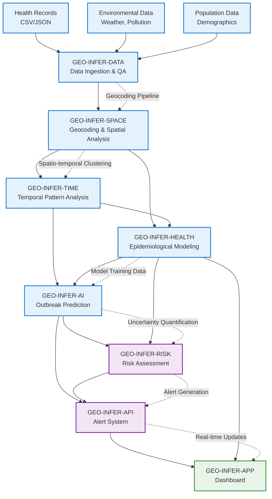

# Disease Surveillance Pipeline 🏥📊

[]()
[]()
[]()

## 🎯 **Learning Objectives**

After completing this example, you will understand:

- **Cross-module integration patterns** for health surveillance systems
- **Data flow orchestration** across 8 GEO-INFER modules
- **Real-time outbreak detection** using spatial-temporal analysis
- **API integration** between health, spatial, and risk assessment modules
- **Error handling and resilience** in multi-module workflows
- **Performance optimization** for time-sensitive health applications

## 📊 **Modules Used**

### **Primary Modules** (Required)
- **GEO-INFER-DATA** 📥 - Health record ingestion and management
- **GEO-INFER-SPACE** 🗺️ - Spatial analysis and geocoding
- **GEO-INFER-TIME** ⏰ - Temporal pattern analysis
- **GEO-INFER-HEALTH** 🏥 - Epidemiological modeling and outbreak detection
- **GEO-INFER-AI** 🤖 - Predictive analytics and anomaly detection

### **Supporting Modules** (Enhances functionality)
- **GEO-INFER-RISK** ⚠️ - Risk assessment and uncertainty quantification  
- **GEO-INFER-API** 🔌 - External system integration and alerts
- **GEO-INFER-APP** 💻 - Dashboard and visualization

### **Infrastructure Modules** (Automatic)
- **GEO-INFER-OPS** ⚙️ - Monitoring and resource management
- **GEO-INFER-SEC** 🔒 - Security and privacy protection

## 🔄 **Integration Architecture**



## 🚀 **Quick Start**

### **Prerequisites**
```bash
# Install required modules
pip install geo-infer-data geo-infer-space geo-infer-time geo-infer-health geo-infer-ai

# Install optional modules for full functionality
pip install geo-infer-risk geo-infer-api geo-infer-app

# Install example dependencies
pip install -r requirements.txt
```

### **1. Basic Setup (3 minutes)**
```bash
# Configure modules
python scripts/configure_modules.py

# Validate environment
python scripts/validate_environment.py

# Run basic integration test
python scripts/test_integration.py
```

### **2. Run Example (5 minutes)**
```python
from geo_infer_examples.health_integration import DiseaseSurveillancePipeline

# Initialize pipeline
pipeline = DiseaseSurveillancePipeline()

# Load sample data
data = pipeline.load_sample_data()

# Execute surveillance workflow
results = pipeline.execute_surveillance(data)

# View results
pipeline.display_results(results)
```

### **3. View Dashboard (2 minutes)**
```bash
# Start interactive dashboard
python scripts/start_dashboard.py

# Open browser to: http://localhost:8080
```

## 📋 **Detailed Walkthrough**

### **Step 1: Data Ingestion & Quality Assurance**
```python
# GEO-INFER-DATA handles multi-source health data
from geo_infer_data import HealthDataManager

data_manager = HealthDataManager()

# Ingest various health data sources
health_records = data_manager.ingest_health_records(
    source="health_surveillance_sample.csv",
    format="csv",
    schema="health_surveillance_v1"
)

# Quality assurance and validation
qa_results = data_manager.validate_data(
    data=health_records,
    validation_rules=["completeness", "accuracy", "consistency"]
)

print(f"Data quality score: {qa_results.overall_score}")
```

**Integration Point**: Clean, validated health data flows to SPACE module

### **Step 2: Spatial Processing & Geocoding**
```python
# GEO-INFER-SPACE provides geocoding and spatial analysis
from geo_infer_space import SpatialHealthProcessor

spatial_processor = SpatialHealthProcessor()

# Geocode patient addresses
geocoded_data = spatial_processor.geocode_addresses(
    addresses=health_records['addresses'],
    geocoding_service="nominatim",
    coordinate_system="EPSG:4326"
)

# Create spatial indexes for fast querying
spatial_index = spatial_processor.create_spatial_index(
    points=geocoded_data,
    index_type="rtree"
)

# Spatial clustering analysis
clusters = spatial_processor.detect_spatial_clusters(
    points=geocoded_data,
    method="dbscan",
    distance_threshold=1000,  # 1km
    min_cluster_size=3
)
```

**Integration Point**: Geocoded data with spatial clusters flows to TIME and HEALTH modules

### **Step 3: Temporal Pattern Analysis**
```python
# GEO-INFER-TIME analyzes temporal patterns in disease data
from geo_infer_time import TemporalHealthAnalyzer

temporal_analyzer = TemporalHealthAnalyzer()

# Temporal trend analysis
trends = temporal_analyzer.analyze_trends(
    temporal_data=geocoded_data,
    time_column="symptom_onset_date",
    aggregation_period="daily",
    smoothing_method="moving_average"
)

# Seasonal pattern detection
seasonality = temporal_analyzer.detect_seasonality(
    time_series=trends,
    decomposition_method="STL"
)

# Anomaly detection in temporal patterns
anomalies = temporal_analyzer.detect_temporal_anomalies(
    time_series=trends,
    method="isolation_forest",
    contamination=0.1
)
```

**Integration Point**: Temporal patterns and anomalies inform epidemiological modeling

### **Step 4: Epidemiological Modeling**
```python
# GEO-INFER-HEALTH applies domain-specific health analytics
from geo_infer_health import EpidemiologicalModeler

epi_modeler = EpidemiologicalModeler()

# Disease transmission modeling
transmission_model = epi_modeler.build_transmission_model(
    spatial_data=clusters,
    temporal_data=trends,
    population_data=population_demographics,
    disease_type="respiratory_illness"
)

# Outbreak detection using epidemiological thresholds
outbreaks = epi_modeler.detect_outbreaks(
    model=transmission_model,
    detection_method="farrington_algorithm",
    threshold_type="adaptive"
)

# Calculate epidemiological indicators
indicators = epi_modeler.calculate_indicators(
    cases=geocoded_data,
    population=population_demographics,
    indicators=["incidence_rate", "attack_rate", "case_fatality_rate"]
)
```

**Integration Point**: Epidemiological models provide training data for AI predictions

### **Step 5: AI-Powered Prediction**
```python
# GEO-INFER-AI provides machine learning and prediction capabilities
from geo_infer_ai import HealthPredictor

ai_predictor = HealthPredictor()

# Train prediction model
model = ai_predictor.train_outbreak_predictor(
    features=transmission_model.feature_matrix,
    labels=outbreaks.outbreak_labels,
    algorithm="random_forest",
    cross_validation=True
)

# Generate predictions
predictions = ai_predictor.predict_outbreak_risk(
    model=model,
    current_conditions=current_health_data,
    prediction_horizon="7_days"
)

# Confidence intervals and uncertainty
uncertainty = ai_predictor.quantify_prediction_uncertainty(
    model=model,
    predictions=predictions,
    method="bootstrap"
)
```

**Integration Point**: AI predictions and uncertainty feed into risk assessment

### **Step 6: Risk Assessment**
```python
# GEO-INFER-RISK quantifies and manages risk
from geo_infer_risk import HealthRiskAssessor

risk_assessor = HealthRiskAssessor()

# Comprehensive risk assessment
risk_assessment = risk_assessor.assess_outbreak_risk(
    predictions=predictions,
    uncertainty=uncertainty,
    vulnerability_factors=population_vulnerability,
    intervention_capacity=healthcare_capacity
)

# Risk categorization
risk_levels = risk_assessor.categorize_risk(
    risk_scores=risk_assessment.risk_scores,
    thresholds={"low": 0.2, "medium": 0.5, "high": 0.8}
)

# Prioritization for intervention
priorities = risk_assessor.prioritize_interventions(
    risk_levels=risk_levels,
    resource_constraints=available_resources,
    cost_effectiveness=intervention_costs
)
```

**Integration Point**: Risk assessments trigger alert generation

### **Step 7: Alert Generation & External Integration**
```python
# GEO-INFER-API manages external communications and alerts
from geo_infer_api import HealthAlertManager

alert_manager = HealthAlertManager()

# Generate alerts based on risk levels
alerts = alert_manager.generate_alerts(
    risk_assessment=risk_assessment,
    alert_criteria={
        "high_risk_threshold": 0.8,
        "cluster_size_threshold": 5,
        "temporal_urgency": "immediate"
    }
)

# Send to external health information systems
external_systems = alert_manager.notify_external_systems(
    alerts=alerts,
    systems=["state_health_dept", "cdc_nndss", "local_hospitals"],
    format="HL7_FHIR"
)

# Public health dashboard integration
dashboard_data = alert_manager.prepare_dashboard_data(
    alerts=alerts,
    visualizations=["risk_maps", "trend_charts", "alert_summaries"]
)
```

**Integration Point**: Alerts and data flow to dashboard application

### **Step 8: Dashboard & Visualization**
```python
# GEO-INFER-APP provides user interfaces and dashboards
from geo_infer_app import HealthDashboard

dashboard = HealthDashboard()

# Create interactive dashboard
app = dashboard.create_surveillance_dashboard(
    data=dashboard_data,
    features=[
        "real_time_map",
        "outbreak_timeline", 
        "risk_indicators",
        "alert_management",
        "prediction_charts"
    ]
)

# Launch dashboard
dashboard.launch(
    app=app,
    host="localhost",
    port=8080,
    debug=False
)
```

## 🔧 **Key Integration Patterns Demonstrated**

### **1. Sequential Processing Pattern**
```python
# Linear data flow with dependencies
DATA → SPACE → TIME → HEALTH → AI → RISK → API → APP
```

### **2. Parallel Processing Pattern**
```python
# Independent processing streams that merge
SPACE ──┐
        ├─→ HEALTH
TIME ──┘

AI ────┐
       ├─→ RISK
HEALTH ─┘
```

### **3. Event-Driven Integration**
```python
# Modules respond to events from other modules
@event_handler("outbreak_detected")
def trigger_risk_assessment(outbreak_data):
    return risk_module.assess_outbreak_risk(outbreak_data)

@event_handler("high_risk_identified") 
def generate_alerts(risk_data):
    return alert_module.create_urgent_alert(risk_data)
```

### **4. API-Based Integration**
```python
# RESTful communication between modules
async def spatial_to_health_integration(spatial_data):
    response = await http_client.post(
        url="http://health-module:8080/api/analyze/spatial-patterns",
        json=spatial_data,
        headers={"Content-Type": "application/json"}
    )
    return response.json()
```

## 📊 **Performance Considerations**

### **Optimization Strategies**
- **Caching**: Spatial indexes and geocoding results cached for performance
- **Parallel Processing**: Independent analyses run concurrently
- **Streaming**: Real-time data processing for urgent alerts
- **Resource Management**: Automatic scaling based on data volume

### **Expected Performance**
- **Data Processing**: ~1000 health records/second
- **Geocoding**: ~500 addresses/second
- **Spatial Analysis**: ~100 clusters/second
- **Outbreak Detection**: ~10 models/second
- **End-to-End Latency**: <30 seconds for urgent alerts

## 🧪 **Testing & Validation**

### **Integration Tests**
```python
# Test complete workflow
def test_end_to_end_surveillance():
    pipeline = DiseaseSurveillancePipeline()
    
    # Load test data
    test_data = pipeline.load_test_data("outbreak_scenario_1.json")
    
    # Execute workflow
    results = pipeline.execute_surveillance(test_data)
    
    # Validate results
    assert results.outbreak_detected == True
    assert results.risk_level == "HIGH"
    assert len(results.alerts) > 0
    assert results.execution_time < 30.0
```

### **Module Integration Tests**
```python
# Test specific module interactions
def test_space_health_integration():
    spatial_results = space_module.analyze(test_spatial_data)
    health_results = health_module.analyze(spatial_results)
    
    assert health_results.data_format == "epidemiological_analysis"
    assert health_results.spatial_clusters is not None
```

## 🔄 **Extensions & Variations**

### **Real-Time Streaming Version**
- Replace batch processing with streaming analytics
- Add Apache Kafka for event streaming
- Implement continuous monitoring dashboard

### **Multi-Disease Support**
- Extend to multiple disease types simultaneously
- Add disease-specific modeling parameters
- Implement comparative analysis features

### **Advanced AI Integration**
- Add deep learning models for image analysis
- Implement ensemble prediction methods
- Include explainable AI for decision support

### **Integration with External Systems**
- Connect to Electronic Health Records (EHR)
- Integrate with laboratory information systems
- Add social media sentiment analysis

## 🚨 **Troubleshooting**

### **Common Issues**

#### **Module Connection Failures**
```bash
# Check module health
curl http://localhost:8001/health  # DATA module
curl http://localhost:8002/health  # SPACE module

# Restart failed modules
docker-compose restart geo-infer-data
```

#### **Data Quality Issues**
```python
# Validate data schema
from geo_infer_examples.utils import DataValidator

validator = DataValidator()
issues = validator.validate_health_data(input_data)
print(f"Data quality issues: {issues}")
```

#### **Performance Bottlenecks**
```python
# Enable performance monitoring
from geo_infer_examples.monitoring import PerformanceMonitor

monitor = PerformanceMonitor()
monitor.enable_profiling()

# Run workflow with monitoring
results = pipeline.execute_surveillance(data)
performance_report = monitor.generate_report()
```

## 📚 **Further Learning**

### **Next Examples to Explore**
1. **`healthcare_accessibility/`** - Spatial accessibility analysis
2. **`environmental_health_assessment/`** - Environmental risk factors
3. **`health_disparities_mapping/`** - Social determinants of health

### **Advanced Integration Patterns**
1. **Active Inference Example** - Adaptive health surveillance using ACT module
2. **Federated Learning Example** - Multi-jurisdictional outbreak detection
3. **Real-Time Streaming Example** - Continuous surveillance pipeline

### **External Resources**
- [WHO Disease Surveillance Guidelines](https://www.who.int/publications/i/item/9789241549861)
- [CDC Surveillance Evaluation Framework](https://www.cdc.gov/evaluation/framework/)
- [Spatial Epidemiology Best Practices](https://spatial-epi.org/best-practices)

---

> **🎯 Success Criteria**: You've mastered this example when you can explain the data flow between all 8 modules and can modify the workflow for a different disease scenario.

> **🚀 Next Steps**: Try running this example with your own health surveillance data, then explore the healthcare accessibility example to see different integration patterns. 