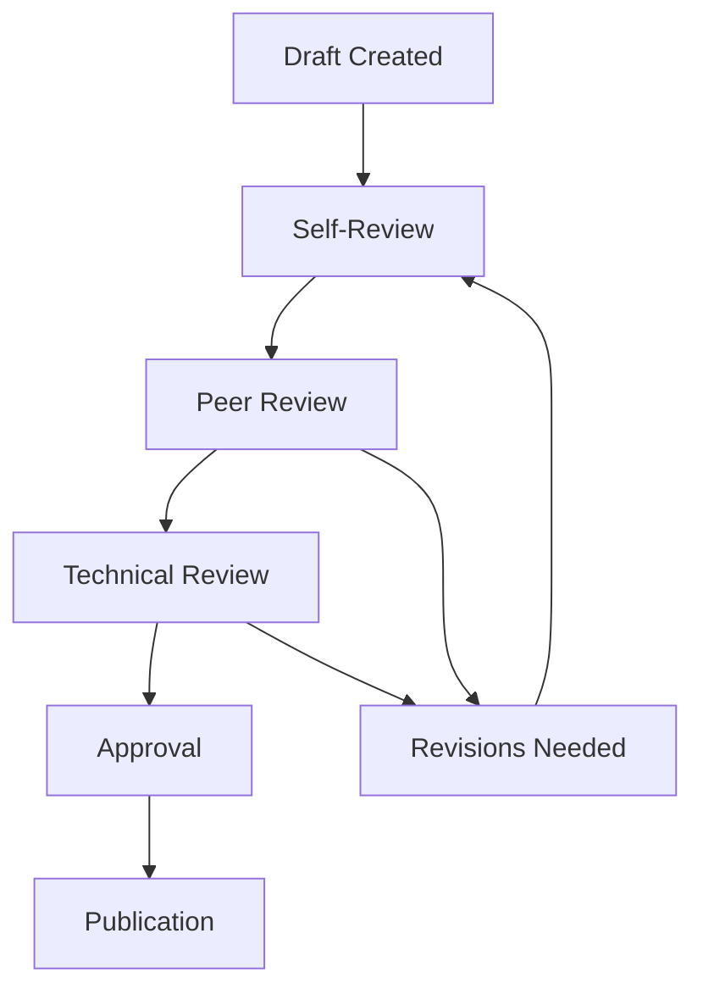

# 📚 GEO-INFER Documentation Standards & Contribution Guidelines

## 🎯 Purpose

This document establishes comprehensive standards for creating, maintaining, and contributing to GEO-INFER documentation. These standards ensure consistency, quality, and usability across all documentation artifacts.

## 📏 Core Standards

### YAML Front Matter Standard

All documentation files must include standardized YAML front matter:

```yaml
---
title: "Descriptive Title"
description: "Brief, searchable description (max 160 characters)"
purpose: "Specific purpose or learning objective"
module_type: "Category (Analytical Core, Domain-Specific, etc.)"
status: "Development status (Complete, In Development, Planning)"
last_updated: "YYYY-MM-DD"
dependencies: ["List", "of", "dependencies"]
compatibility: ["Compatible", "modules"]
tags: ["keyword1", "keyword2"]
difficulty: "Beginner|Intermediate|Advanced|Expert"
estimated_time: "Duration in minutes"
---
```

### Content Structure Standards

#### Required Sections for Module Documentation

1. **Header Section** (YAML front matter + title)
2. **Overview** (What is this module?)
3. **Key Concepts** (Core concepts with examples)
4. **Core Features** (Detailed feature descriptions)
5. **API Reference** (Complete API documentation)
6. **Use Cases** (Practical applications)
7. **Integration** (Cross-module integration patterns)
8. **Troubleshooting** (Common issues and solutions)
9. **Performance** (Optimization guidelines)
10. **Related Documentation** (Links and references)

## 🗂️ Module Documentation Template

### Standard Module Template

```markdown
---
title: "GEO-INFER-MODULE: Module Name"
description: "Brief description of module capabilities"
purpose: "Specific purpose and value proposition"
module_type: "Category"
status: "Development status"
last_updated: "2025-01-19"
dependencies: ["DEP1", "DEP2"]
compatibility: ["GEO-INFER-DEP1", "GEO-INFER-DEP2"]
tags: ["keyword1", "keyword2"]
difficulty: "Beginner|Intermediate|Advanced"
estimated_time: "30"
---

# GEO-INFER-MODULE: Module Name

> **Purpose**: Concise purpose statement
>
> Detailed description of module capabilities and use cases.

## 🎯 What is GEO-INFER-MODULE?

Brief overview and key capabilities list.

### Links
- Module README: ../../GEO-INFER-MODULE/README.md
- API docs: ../../GEO-INFER-MODULE/docs/api_schema.yaml

## 📚 Core Features

### 1. Feature Name

**Purpose**: What this feature does.

```python
# Illustrative code example
from geo_infer_module import FeatureClass

feature = FeatureClass(config)
result = feature.process(data)
```

## 🔧 API Reference

### MainClass

```python
class MainClass:
    def __init__(self, parameter):
        """Initialize with parameters."""

    def method_name(self, input_data):
        """Method description with parameters and return values."""
```

## 🎯 Use Cases

### 1. Use Case Title

**Problem**: Specific problem this solves.

**Solution**: How to use the module to solve it.

```python
# Practical implementation example
```

## 🔗 Integration with Other Modules

### GEO-INFER-DEPENDENCY Integration

*Purpose*: Why these modules work well together.

```python
from geo_infer_module import MainClass
from geo_infer_dependency import DependencyClass

# Integration example
integrated_system = MainClass.integrate_with_dependency(DependencyClass())
```

## 🚨 Troubleshooting

### Common Issues

**Issue description:**
```python
# Solution code
solution = fix_common_issue(problem_data)
```

## 📊 Performance Optimization

```python
# Performance optimization example
optimized = module.enable_optimization(feature='parallel_processing')
```

## 🔗 Related Documentation

### Tutorials
- **[Tutorial Name](../getting_started/tutorial.md)** - Description

### How-to Guides
- **[Guide Name](../examples/guide.md)** - Description

### Technical Reference
- **[API Reference](../api/reference.md)** - Description

### Related Modules
- **[GEO-INFER-RELATED](../modules/geo-infer-related.md)** - Description

---

**Ready to get started?** Check out the **[Tutorial](../getting_started/tutorial.md)** or explore **[Examples](../examples/example.md)**!
```

## ✍️ Content Guidelines

### Language and Style

#### Technical Writing Standards
- **Clarity**: Use simple, direct language
- **Precision**: Be technically accurate and specific
- **Consistency**: Use established terminology
- **Objectivity**: Avoid marketing language and hype
- **Conciseness**: Be comprehensive but not verbose

#### Voice and Tone
- **Professional**: Use formal, technical tone
- **Helpful**: Focus on enabling user success
- **Inclusive**: Use gender-neutral language
- **Direct**: Use active voice when possible

### Content Quality Standards

#### Completeness Checklist
- [ ] All major features documented
- [ ] Working code examples provided
- [ ] Common use cases covered
- [ ] Integration patterns explained
- [ ] Troubleshooting guide included
- [ ] Performance considerations addressed

#### Accuracy Standards
- [ ] Technical information verified
- [ ] Code examples tested and working
- [ ] API signatures match implementation
- [ ] Version information current
- [ ] Links functional and accurate

## 🔧 Technical Specifications

### Markdown Standards

#### Code Block Guidelines
```markdown
# Good: Specify language for syntax highlighting
```python
def example_function():
    return "Hello, World!"
```

# Good: Add descriptive comments
```python
# Calculate the area of a circle
area = math.pi * radius ** 2
```

# Avoid: Generic code blocks without language
```
some code here
```
```

#### Link Standards
```markdown
# Good: Descriptive link text
[Learn about spatial analysis](../getting_started/spatial_analysis.md)

# Good: Reference-style links for readability
[spatial analysis][spatial-ref]

[spatial-ref]: ../getting_started/spatial_analysis.md

# Avoid: Generic link text
[click here](../getting_started/spatial_analysis.md)
```

### Documentation Metadata

#### Required Metadata Fields
- **Title**: Descriptive, unique title
- **Description**: SEO-friendly summary (150-160 characters)
- **Tags**: Relevant keywords for discoverability
- **Last Updated**: ISO date format (YYYY-MM-DD)
- **Version**: Corresponding framework version

#### Optional Metadata Fields
- **Author**: Contributor name(s)
- **Reviewers**: Technical reviewers
- **Difficulty**: Beginner/Intermediate/Advanced/Expert
- **Time**: Estimated reading/completion time
- **Prerequisites**: Required knowledge or tools

## 🔄 Review and Approval Process

### Documentation Review Workflow



### Review Checklist

#### Content Review
- [ ] Completeness of information
- [ ] Technical accuracy
- [ ] Clarity and readability
- [ ] Consistency with other docs
- [ ] Working examples and links

#### Technical Review
- [ ] Code examples functional
- [ ] API documentation current
- [ ] Version information accurate
- [ ] Cross-references valid
- [ ] Performance claims verified

#### Editorial Review
- [ ] Grammar and spelling
- [ ] Style consistency
- [ ] Formatting standards
- [ ] Accessibility compliance
- [ ] SEO optimization

---

## 📝 Quick Reference

### Essential Checklist for New Documentation

**Before Creating:**
- [ ] Check if content already exists
- [ ] Identify target audience and purpose
- [ ] Review related documentation
- [ ] Plan content structure

**During Creation:**
- [ ] Use standard template
- [ ] Include YAML front matter
- [ ] Follow content guidelines
- [ ] Add working examples
- [ ] Include troubleshooting

**Before Submission:**
- [ ] Self-review checklist
- [ ] Test all links and examples
- [ ] Validate YAML metadata
- [ ] Check accessibility
- [ ] Proofread content

**Ready to contribute?** Start with the [Module Template](./templates/module_template.md)!

---

*Last updated: 2025-01-19 | Framework Version: 1.0.0*