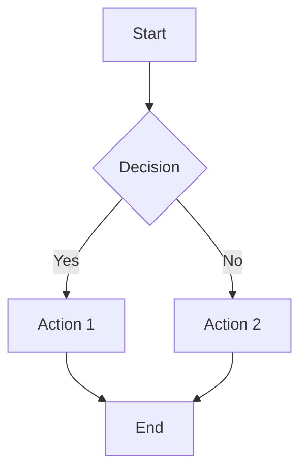

# Documentation Standards

> **Explanation**: Comprehensive guide to GEO-INFER documentation standards
> 
> This document establishes the standards and best practices for creating, maintaining, and organizing documentation across the GEO-INFER framework, incorporating industry best practices from Write the Docs and the Divio documentation system.

## 🎯 Documentation Philosophy

### The Four Types of Documentation

Following the [Divio documentation system](https://documentation.divio.com/), we organize documentation into four distinct types:

1. **Tutorials** - Learning-oriented
2. **How-to guides** - Problem-oriented  
3. **Technical reference** - Information-oriented
4. **Explanation** - Understanding-oriented

### Documentation Principles

- **User-centered**: Focus on what users need to accomplish
- **Progressive disclosure**: Start simple, add complexity gradually
- **Consistent structure**: Follow established patterns and templates
- **Accessible**: Support multiple learning styles and skill levels
- **Maintainable**: Easy to update and extend

## 📚 Documentation Structure

### Tutorials (Learning-Oriented)

**Purpose**: Teach users how to accomplish a goal

**Characteristics**:
- Step-by-step instructions
- Complete working examples
- Minimal explanation of concepts
- Focus on getting users to success quickly

**Examples**:
- [Active Inference Basics](getting_started/active_inference_basics.md)
- [Your First Analysis](getting_started/first_analysis.md)
- [Installation Guide](getting_started/installation_guide.md)

**Template**:
```markdown
# [Task Name]

> **Tutorial**: Learn [task] through hands-on examples
> 
> This tutorial teaches you [concept] by building working examples.

## 🎯 What You'll Learn

By the end of this tutorial, you'll understand:
- [Learning objective 1]
- [Learning objective 2]
- [Learning objective 3]

## 🚀 Quick Start

[Immediate working example]

## 📚 Understanding [Concept]

[Brief explanation of core concepts]

## 🏗️ Building [Something]

### Step 1: [Action]
[Code example with explanation]

### Step 2: [Action]
[Code example with explanation]

## 🎯 What You've Accomplished

[Summary of achievements]

## 🔗 Next Steps

[Links to related content]
```

### How-to Guides (Problem-Oriented)

**Purpose**: Help users solve specific problems

**Characteristics**:
- Focus on solving a particular problem
- Practical, actionable steps
- Assumes some background knowledge
- Includes troubleshooting

**Examples**:
- [Environmental Monitoring](examples/environmental_monitoring.md)
- [Performance Optimization](advanced/performance_optimization.md)
- [Custom Model Development](advanced/custom_models.md)

**Template**:
```markdown
# [Problem Solution]

> **How-to Guide**: [Brief description of what this solves]
> 
> This guide shows you how to [solve specific problem].

## 🎯 Problem Statement

[Clear description of the problem to be solved]

## 🚀 Solution Overview

[High-level description of the solution]

## 📦 Prerequisites

[What users need to know/have before starting]

## 🔧 Implementation

### Step 1: [Action]
[Detailed implementation steps]

### Step 2: [Action]
[Detailed implementation steps]

## 🎯 Results and Analysis

[What users will achieve]

## 🚨 Troubleshooting

[Common issues and solutions]
```

### Technical Reference (Information-Oriented)

**Purpose**: Provide complete technical information

**Characteristics**:
- Comprehensive and detailed
- Organized for quick lookup
- Complete API specifications
- Minimal narrative

**Examples**:
- [API Reference](api/reference.md)
- [Data Dictionary](data_dictionary.md)
- [Terminology](terminology.md)

**Template**:
```markdown
# [Reference Name]

> **Technical Reference**: [Brief description]
> 
> This reference provides [complete technical information].

## 🚀 Quick Start

[Basic usage examples]

## 📚 [Section Name]

### [Subsection]

[Detailed technical information]

**Parameters:**
- `param1` (type): Description
- `param2` (type): Description

**Response:**
```json
{
  "example": "response"
}
```

## 🔧 [Section Name]

[Additional technical details]
```

### Explanation (Understanding-Oriented)

**Purpose**: Help users understand concepts and context

**Characteristics**:
- Explains the "why" behind concepts
- Provides context and background
- Helps users understand the bigger picture
- Includes theory and principles

**Examples**:
- [Active Inference Guide](active_inference_guide.md)
- [Architecture Overview](architecture/overview.md)
- [Geospatial Concepts](geospatial/concepts/index.md)

**Template**:
```markdown
# [Concept Name]

> **Explanation**: Understanding [concept] in context
> 
> This explanation helps you understand [concept] and its role in [domain].

## 🎯 What is [Concept]?

[Clear definition and explanation]

## 📚 Core Concepts

### [Concept 1]
[Detailed explanation with examples]

### [Concept 2]
[Detailed explanation with examples]

## 🔗 How It Fits Together

[Relationship to other concepts]

## 🎯 Key Principles

[Important principles and guidelines]

## 🔗 Related Concepts

[Links to related explanations]
```

## 📝 Writing Standards

### Content Guidelines

#### Clarity and Conciseness

- **Use clear, simple language** - Avoid jargon when possible
- **Be concise** - Say what you need to say, no more
- **Use active voice** - "The system processes data" not "Data is processed by the system"
- **Write for scanning** - Use headings, lists, and formatting to help readers find information quickly

#### Code Examples

```markdown
# Good Example
```python
# Import required libraries
import numpy as np
from geo_infer_space import SpatialAnalyzer

# Create analyzer
analyzer = SpatialAnalyzer()

# Perform analysis
result = analyzer.analyze_points(data)
print(f"Analysis complete: {len(result)} features processed")
```

# Bad Example
```python
import numpy as np
from geo_infer_space import SpatialAnalyzer
analyzer = SpatialAnalyzer()
result = analyzer.analyze_points(data)
print(f"Analysis complete: {len(result)} features processed")
```
```

#### Cross-References

**Standard Format**:
```markdown
## 🔗 Related Documentation

- **[Getting Started](../getting_started/index.md)** - Quick start guide
- **[API Reference](../api/index.md)** - Complete API documentation
- **[Examples Gallery](../examples/index.md)** - Working examples
- **[Tutorials](../tutorials/index.md)** - Step-by-step guides
```

#### Progress Tracking

**Standard Format**:
```markdown
## 📈 Progress Tracking

Track your learning progress:

- [ ] **Installation Complete** - Environment set up successfully
- [ ] **First Analysis Complete** - Successfully ran a basic analysis
- [ ] **Advanced Skills** - Can perform complex operations
- [ ] **Production Ready** - Can deploy to production environments
```

### Accessibility Guidelines

#### Inclusive Language

- **Use inclusive examples** - Diverse names, locations, and scenarios
- **Avoid biased language** - Use neutral, inclusive terminology
- **Provide multiple perspectives** - Show different approaches and viewpoints

#### Multiple Learning Styles

- **Visual learners** - Include diagrams, charts, and screenshots
- **Kinesthetic learners** - Provide hands-on exercises and examples
- **Auditory learners** - Include video tutorials and audio explanations
- **Reading learners** - Provide comprehensive written documentation

#### Accessibility Features

- **Alt text for images** - Describe all images and diagrams
- **Keyboard navigation** - Ensure all interactive elements are keyboard accessible
- **Color contrast** - Use sufficient color contrast for readability
- **Screen reader support** - Structure content for screen readers

## 🎨 Visual Standards

### Diagrams and Charts

#### Mermaid Diagrams

```markdown

```

#### Code Flow Diagrams

```markdown
```python
# Code flow example
def process_data(data):
    # Step 1: Validate input
    if not data:
        raise ValueError("Data cannot be empty")
    
    # Step 2: Transform data
    processed = transform(data)
    
    # Step 3: Return results
    return processed
```
```

### Icons and Emojis

**Standard Usage**:
- 🚀 **Quick Start** - Getting started quickly
- 📚 **Learning** - Educational content
- 🔧 **Implementation** - Technical details
- 🎯 **Goals** - Learning objectives
- 🔗 **Links** - Related content
- 🚨 **Troubleshooting** - Problem solving
- ✅ **Success** - Completed tasks
- ❌ **Errors** - Common issues

## 📋 Documentation Process

### Content Creation Workflow

1. **Identify Documentation Type**
   - Tutorial: Teaching a concept
   - How-to: Solving a problem
   - Reference: Technical information
   - Explanation: Understanding concepts

2. **Choose Appropriate Template**
   - Use the template that matches the documentation type
   - Adapt templates for specific needs
   - Maintain consistency within sections

3. **Write Content**
   - Follow writing standards
   - Include code examples
   - Add cross-references
   - Include progress tracking

4. **Review and Test**
   - Technical accuracy review
   - User experience testing
   - Accessibility review
   - Cross-reference validation

### Quality Assurance

#### Content Review Checklist

- [ ] **Accuracy** - All technical information is correct
- [ ] **Completeness** - Covers all necessary topics
- [ ] **Clarity** - Easy to understand and follow
- [ ] **Consistency** - Follows established patterns
- [ ] **Accessibility** - Inclusive and accessible
- [ ] **Cross-references** - Links to related content
- [ ] **Code examples** - Working, tested examples
- [ ] **Progress tracking** - Clear learning objectives

#### User Testing

- **Beginner testing** - Can new users follow the documentation?
- **Intermediate testing** - Can users with some experience find what they need?
- **Advanced testing** - Do power users find the technical details they need?
- **Accessibility testing** - Is the documentation accessible to users with disabilities?

## 🔄 Maintenance Standards

### Update Procedures

#### Regular Reviews

- **Monthly** - Review high-traffic pages for accuracy
- **Quarterly** - Comprehensive review of all documentation
- **Annually** - Major restructuring and improvement

#### Change Management

- **Version control** - All documentation changes tracked in Git
- **Review process** - All changes reviewed before publication
- **User feedback** - Incorporate user feedback and suggestions
- **Breaking changes** - Clearly document breaking changes

#### Content Lifecycle

1. **Draft** - Initial content creation
2. **Review** - Technical and editorial review
3. **Testing** - User testing and validation
4. **Publication** - Release to users
5. **Maintenance** - Ongoing updates and improvements
6. **Deprecation** - Mark outdated content for removal

### Version Control

#### File Naming Conventions

```
docs/
├── getting_started/
│   ├── index.md
│   ├── installation_guide.md
│   └── first_analysis.md
├── examples/
│   ├── environmental_monitoring.md
│   └── urban_planning.md
├── api/
│   ├── index.md
│   └── reference.md
└── advanced/
    ├── index.md
    └── performance_optimization.md
```

#### Commit Messages

```
docs: Add environmental monitoring tutorial

- Add step-by-step environmental monitoring guide
- Include complete code examples
- Add troubleshooting section
- Cross-reference related documentation

Closes #123
```

## 📊 Success Metrics

### User Engagement Metrics

- **Time to first success** - How quickly can users accomplish their first task?
- **Documentation usage** - Which pages are most/least visited?
- **Search patterns** - What are users searching for?
- **Feedback scores** - User ratings and comments
- **Support ticket reduction** - Fewer questions about documented topics

### Quality Metrics

- **Completeness** - Percentage of features with documentation
- **Accuracy** - Error reports and corrections
- **Accessibility** - Accessibility compliance scores
- **Maintenance** - Documentation freshness and updates
- **Cross-references** - Internal link density and quality

## 🔗 Resources

### External Standards

- **[Write the Docs Guide](https://www.writethedocs.org/guide/index.html)** - Community best practices
- **[Divio Documentation System](https://documentation.divio.com/)** - Documentation structure
- **[MDN Writing Guidelines](https://developer.mozilla.org/en-US/docs/MDN/Writing_guidelines)** - Technical writing standards
- **[Google Technical Writing](https://developers.google.com/tech-writing)** - Technical writing principles

### Internal Resources

- **[Documentation Guide](documentation_guide.md)** - Project-specific guidelines
- **[Contributing Guide](developer_guide/contributing.md)** - How to contribute
- **[Style Guide](style_guide.md)** - Writing style and formatting
- **[Templates](templates/)** - Documentation templates

## 🎯 Implementation

### Getting Started

1. **Review this standards document** - Understand the principles and structure
2. **Choose appropriate templates** - Select templates for your content type
3. **Follow writing guidelines** - Apply clarity and accessibility standards
4. **Test with users** - Validate content with target users
5. **Iterate and improve** - Continuously improve based on feedback

### Training and Support

- **Documentation workshops** - Regular training sessions
- **Peer review system** - Collaborative content review
- **Mentorship program** - Experienced writers mentor newcomers
- **Feedback channels** - Multiple ways to provide feedback

---

**Questions?** Contact the documentation team or ask on the [Community Forum](https://forum.geo-infer.org)! 