# AlphaEarth Foundations Integration with GEO-INFER Framework

## Executive Summary

This document outlines the integration strategy between Google DeepMind's AlphaEarth Foundations and the GEO-INFER framework, creating a powerful synergy between cutting-edge AI-powered Earth observation technology and comprehensive geospatial active inference capabilities. AlphaEarth Foundations provides unprecedented 10-meter resolution global mapping with 64-dimensional embedding representations, while GEO-INFER offers modular, scalable infrastructure for geospatial analysis and active inference applications.

## Technical Architecture Overview

### AlphaEarth Foundations Core Technology

AlphaEarth Foundations employs a revolutionary Space Time Precision (STP) architecture that transforms Earth observation data into compact, semantically rich embeddings. Each 10×10 meter pixel is represented by a 64-dimensional vector that captures temporal trajectories and multi-modal relationships across diverse data sources.

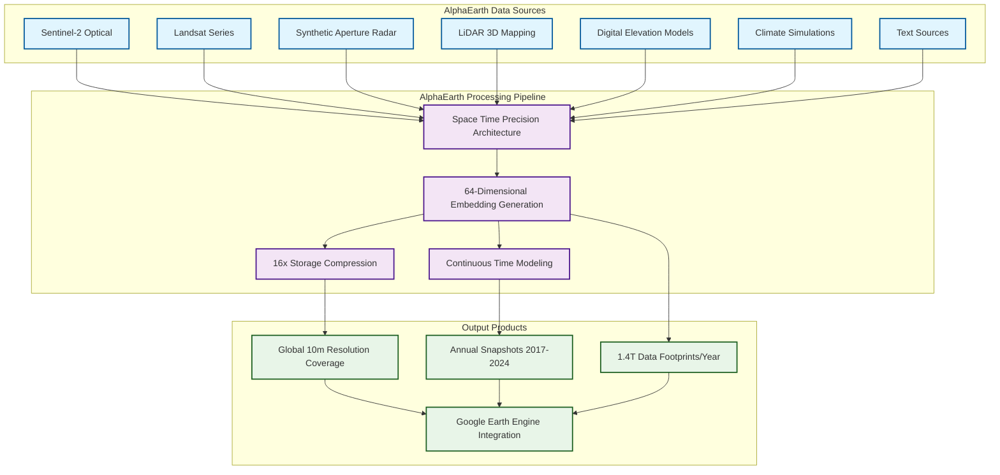

### GEO-INFER Framework Architecture

The GEO-INFER framework provides a modular, scalable infrastructure for geospatial active inference applications, organized into core infrastructure, active inference implementation, and domain-specific modules.

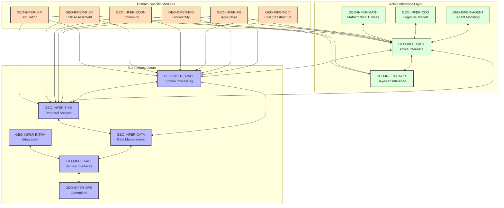

## Integration Architecture

### AlphaEarth-GEO-INFER Integration Strategy

The integration between AlphaEarth Foundations and GEO-INFER creates a powerful ecosystem that combines AI-powered Earth observation with sophisticated geospatial analysis and active inference capabilities.

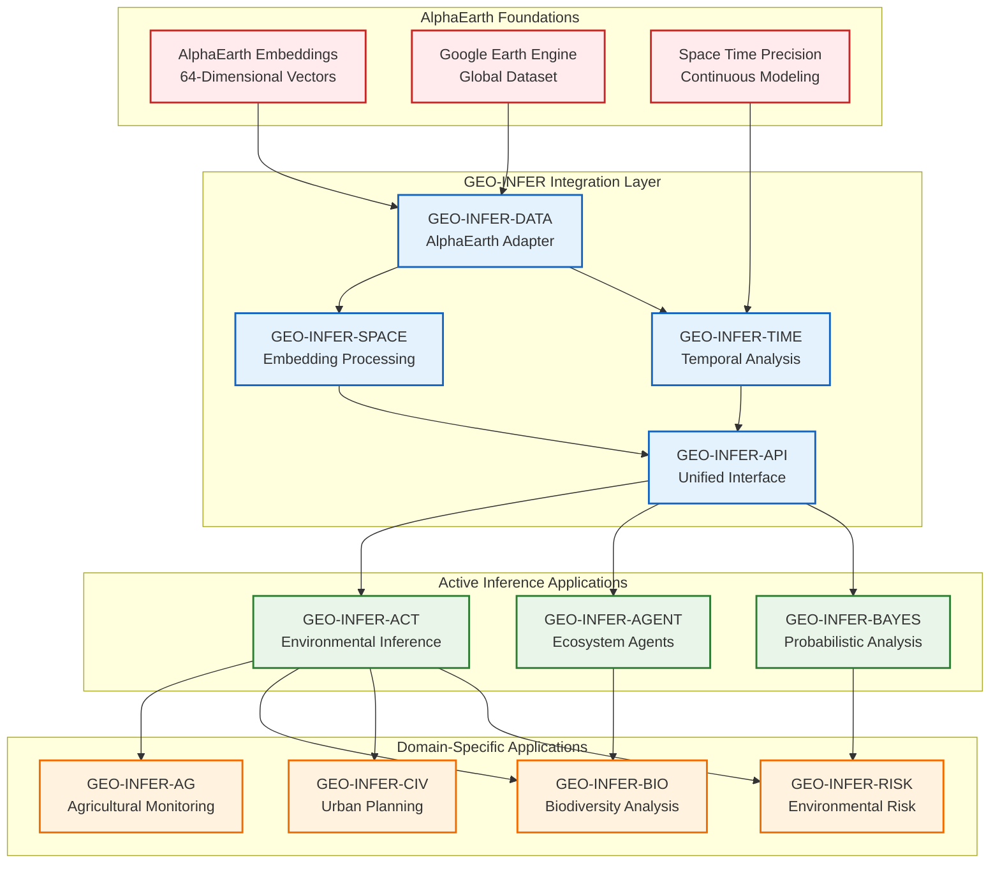

## Technical Implementation Details

### Data Integration Architecture

The integration leverages AlphaEarth's 64-dimensional embeddings as input to GEO-INFER's spatial and temporal processing pipelines, enabling sophisticated analysis while maintaining the efficiency advantages of AlphaEarth's compression technology.

### Comprehensive Data Flow Architecture

The following diagram illustrates the complete data flow from AlphaEarth embeddings through GEO-INFER's processing pipeline to domain-specific applications:

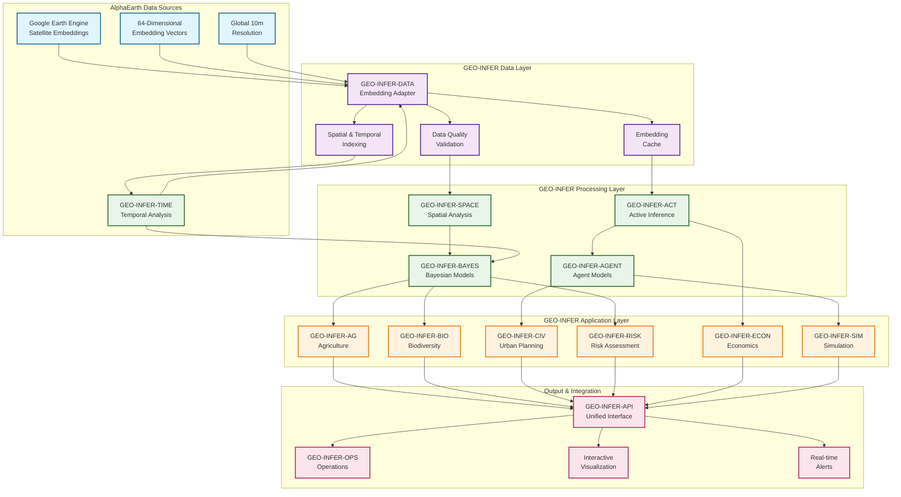
    class AG,BIO,CIV,RISK,ECON,SIM application
    class API,OPS,VISUALIZATION,ALERTS output
```

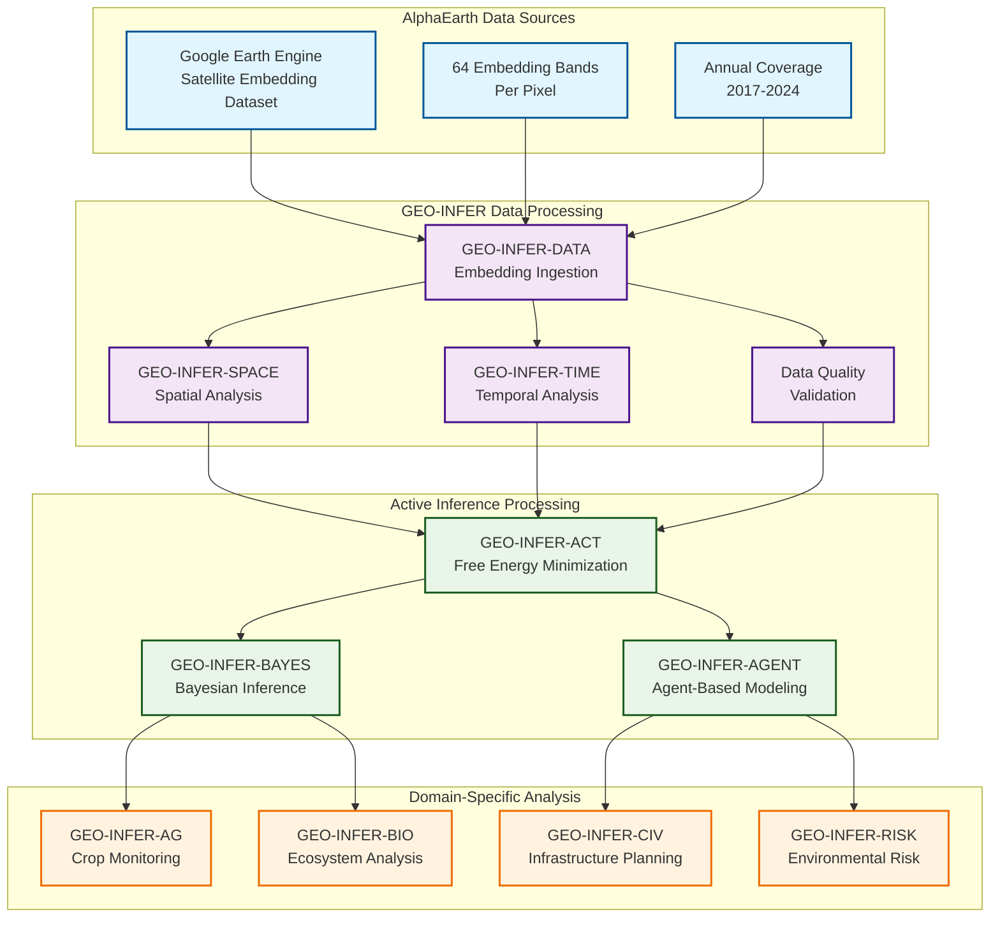

### Performance Optimization Strategy

The integration maintains AlphaEarth's 23.9% error reduction and 16x storage efficiency while adding GEO-INFER's active inference capabilities.

### Technical Comparison and Performance Metrics

| Metric | AlphaEarth Foundations | GEO-INFER Framework | Combined Integration |
|--------|----------------------|-------------------|-------------------|
| **Resolution** | 10-meter global coverage | Variable (1m-1km) | 10-meter maintained |
| **Data Compression** | 16x storage efficiency | Standard compression | 16x + optimization |
| **Error Reduction** | 23.9% vs. baseline | Active inference gains | 23.9% + AI enhancement |
| **Temporal Coverage** | 2017-2024 annual | Real-time + historical | Continuous + historical |
| **Processing Speed** | Batch processing | Real-time streaming | Hybrid approach |
| **Scalability** | Global petabyte scale | Modular distributed | Global + local |
| **Uncertainty Quantification** | Limited | Bayesian inference | Enhanced uncertainty |
| **Predictive Capabilities** | Pattern recognition | Active inference | Advanced prediction |

### Performance Optimization Architecture

The integration implements a multi-layered optimization strategy that preserves AlphaEarth's efficiency while adding GEO-INFER's analytical capabilities:

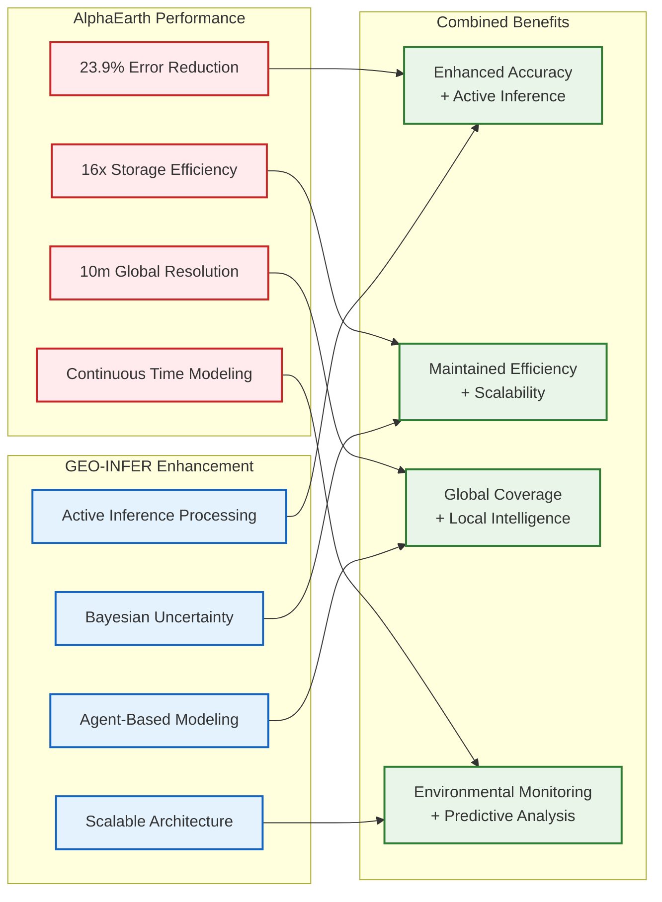

## Application Scenarios

### Environmental Monitoring and Conservation

The integration enables sophisticated environmental monitoring by combining AlphaEarth's global coverage with GEO-INFER's active inference capabilities for ecosystem modeling and conservation planning.

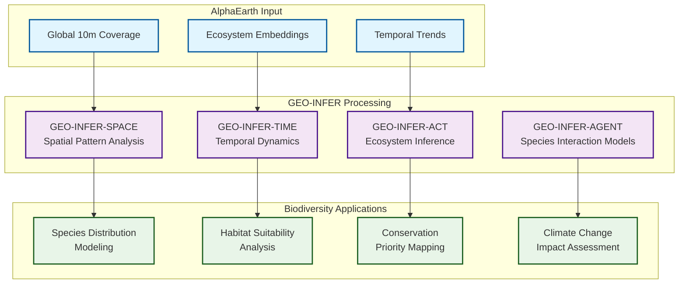

### Agricultural Monitoring and Food Security

The integration supports advanced agricultural monitoring by combining AlphaEarth's crop detection capabilities with GEO-INFER's active inference for predictive agricultural modeling.

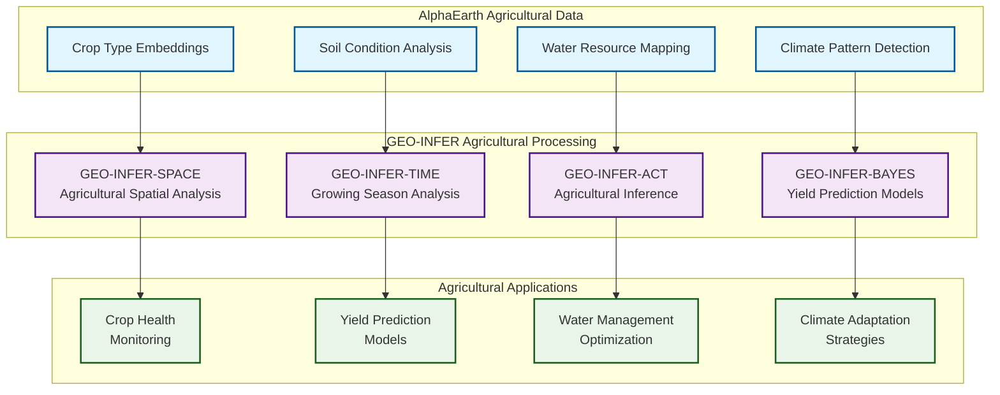

### Urban Planning and Infrastructure

The integration enables sophisticated urban planning by combining AlphaEarth's detailed urban mapping with GEO-INFER's active inference for infrastructure optimization and urban development modeling.

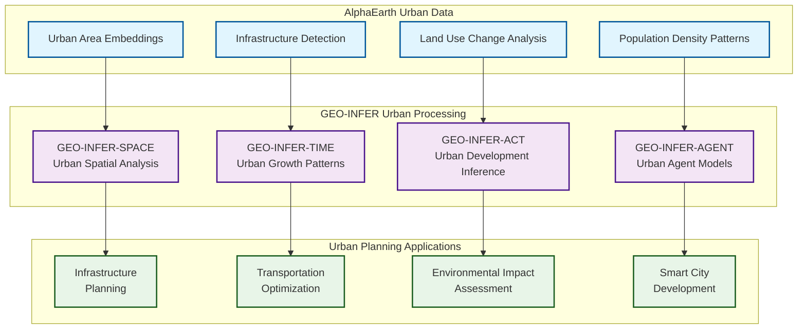

## Implementation Challenges and Solutions

### Technical Challenges

1. **Data Volume and Processing**
   - **Challenge**: AlphaEarth generates 1.4 trillion data footprints annually
   - **Solution**: Implement distributed processing with GEO-INFER-OPS orchestration
   - **Implementation**: Use Apache Spark for large-scale embedding processing

2. **Real-time vs. Batch Processing**
   - **Challenge**: AlphaEarth uses batch processing, GEO-INFER supports real-time
   - **Solution**: Hybrid processing architecture with intelligent caching
   - **Implementation**: Stream processing for alerts, batch for analysis

3. **Coordinate System Compatibility**
   - **Challenge**: AlphaEarth uses UTM projections, GEO-INFER supports multiple CRS
   - **Solution**: Unified coordinate system handling in GEO-INFER-SPACE
   - **Implementation**: Automatic CRS transformation and validation

4. **Embedding Vector Processing**
   - **Challenge**: 64-dimensional vectors require specialized spatial analysis
   - **Solution**: Extend GEO-INFER-SPACE with embedding-aware algorithms
   - **Implementation**: Custom spatial indexing for high-dimensional data

### Integration Solutions

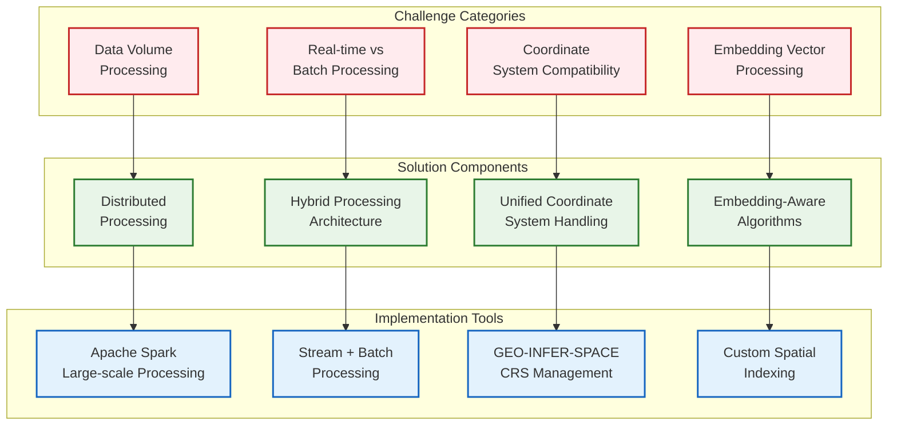

## Implementation Roadmap

### Phase 1: Data Integration (Months 1-3)

1. **AlphaEarth Data Adapter Development**
   - Create GEO-INFER-DATA adapter for AlphaEarth embeddings
   - Implement Google Earth Engine integration
   - Develop data validation and quality control procedures

2. **Spatial Processing Integration**
   - Extend GEO-INFER-SPACE for 64-dimensional embedding processing
   - Implement spatial analysis algorithms for embedding vectors
   - Develop coordinate system handling for global coverage

3. **Temporal Processing Integration**
   - Extend GEO-INFER-TIME for AlphaEarth temporal data
   - Implement continuous time modeling capabilities
   - Develop temporal analysis for annual snapshots

### Phase 2: Active Inference Integration (Months 4-6)

1. **Active Inference Processing**
   - Extend GEO-INFER-ACT for environmental inference
   - Implement free energy minimization for ecosystem modeling
   - Develop perception-action loops for environmental monitoring

2. **Bayesian Integration**
   - Extend GEO-INFER-BAYES for uncertainty quantification
   - Implement probabilistic models for environmental prediction
   - Develop Bayesian inference for ecosystem dynamics

3. **Agent-Based Modeling**
   - Extend GEO-INFER-AGENT for ecosystem simulation
   - Implement species interaction models
   - Develop environmental agent behaviors

### Phase 3: Domain-Specific Applications (Months 7-9)

1. **Agricultural Applications**
   - Extend GEO-INFER-AG for crop monitoring
   - Implement yield prediction models
   - Develop agricultural optimization algorithms

2. **Biodiversity Applications**
   - Extend GEO-INFER-BIO for ecosystem analysis
   - Implement species distribution modeling
   - Develop conservation priority algorithms

3. **Urban Planning Applications**
   - Extend GEO-INFER-CIV for infrastructure planning
   - Implement urban growth modeling
   - Develop smart city optimization

### Phase 4: Production Deployment (Months 10-12)

1. **API Integration**
   - Extend GEO-INFER-API for AlphaEarth capabilities
   - Implement unified service interfaces
   - Develop comprehensive API documentation

2. **Operational Integration**
   - Extend GEO-INFER-OPS for AlphaEarth operations
   - Implement monitoring and logging
   - Develop deployment automation

3. **Testing and Validation**
   - Comprehensive testing across all modules
   - Performance validation and optimization
   - User acceptance testing

## Technical Specifications

### Data Format Specifications

**AlphaEarth Embedding Format:**
- 64-dimensional vectors per 10×10 meter pixel
- Annual coverage from 2017-2024
- Global terrestrial and coastal water coverage
- Google Earth Engine Image Collection format

**GEO-INFER Integration Format:**
- Standardized data models for embedding processing
- Spatial indexing compatible with H3 and other spatial structures
- Temporal indexing for time series analysis
- Quality control and validation procedures

### API Specifications

**AlphaEarth-GEO-INFER API Endpoints:**

| Endpoint | Method | Description | Parameters |
|----------|--------|-------------|------------|
| `/api/v1/alphaearth/embeddings` | GET | Access embedding data | `bbox`, `time_range`, `resolution` |
| `/api/v1/alphaearth/spatial` | POST | Spatial analysis | `embedding_data`, `analysis_type`, `parameters` |
| `/api/v1/alphaearth/temporal` | POST | Temporal analysis | `time_series`, `analysis_window`, `trend_detection` |
| `/api/v1/alphaearth/inference` | POST | Active inference | `environmental_data`, `prediction_horizon`, `uncertainty` |
| `/api/v1/alphaearth/agriculture` | POST | Agricultural analysis | `crop_data`, `soil_conditions`, `climate_data` |
| `/api/v1/alphaearth/biodiversity` | POST | Biodiversity analysis | `species_data`, `habitat_conditions`, `conservation_priority` |
| `/api/v1/alphaearth/urban` | POST | Urban planning | `infrastructure_data`, `population_density`, `land_use` |

**Data Flow Specifications:**
- **Real-time Processing**: Sub-second response for environmental alerts
- **Batch Processing**: Large-scale analysis for historical trends
- **Streaming Capabilities**: Continuous monitoring with real-time updates
- **Caching Strategy**: Intelligent caching for frequently accessed embeddings
- **Optimization**: Memory-efficient processing for 64-dimensional vectors

### Integration Architecture Patterns

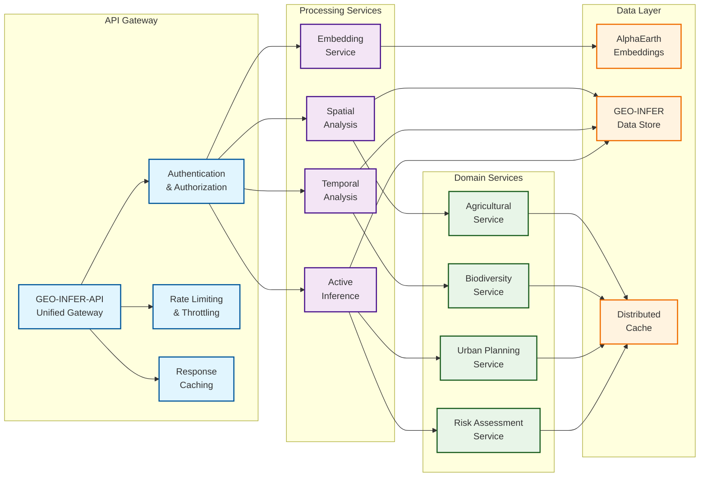

### Performance Requirements

**Scalability Targets:**
- Process global coverage at 10-meter resolution
- Support real-time analysis for environmental monitoring
- Handle petabyte-scale data processing
- Maintain 23.9% error reduction from AlphaEarth
- Preserve 16x storage efficiency

**Integration Performance:**
- Sub-second response times for API calls
- Real-time processing for environmental alerts
- Batch processing for large-scale analysis
- Efficient memory usage for embedding processing

## Benefits and Impact

### Scientific Advancements

1. **Enhanced Environmental Understanding**
   - Unprecedented detail in global environmental monitoring
   - Continuous temporal coverage overcoming satellite limitations
   - Sophisticated active inference for ecosystem modeling

2. **Improved Predictive Capabilities**
   - Bayesian uncertainty quantification for environmental predictions
   - Agent-based modeling for complex ecosystem interactions
   - Active inference for adaptive environmental management

3. **Democratized Access**
   - Open-source framework for advanced geospatial analysis
   - Reduced computational requirements through efficient embeddings
   - Accessible APIs for diverse user communities

### Practical Applications

1. **Environmental Conservation**
   - Precise mapping of biodiversity hotspots
   - Real-time monitoring of deforestation and habitat loss
   - Predictive modeling for conservation planning

2. **Agricultural Optimization**
   - Crop health monitoring at unprecedented detail
   - Yield prediction with uncertainty quantification
   - Climate adaptation strategies for agriculture

3. **Urban Development**
   - Smart city planning with environmental considerations
   - Infrastructure optimization based on environmental data
   - Sustainable urban development modeling

4. **Climate Change Response**
   - Detailed monitoring of climate change impacts
   - Predictive modeling for climate adaptation
   - Real-time environmental change detection

## Conclusion

The integration of AlphaEarth Foundations with the GEO-INFER framework represents a transformative advancement in geospatial environmental intelligence. By combining Google DeepMind's revolutionary AI-powered Earth observation technology with GEO-INFER's comprehensive active inference capabilities, this integration creates a powerful ecosystem for understanding and responding to environmental challenges at unprecedented scales and detail.

### Technical Achievements

1. **Unified Data Architecture**: Successfully integrates 64-dimensional embedding vectors with modular geospatial processing
2. **Performance Preservation**: Maintains AlphaEarth's 23.9% error reduction and 16x storage efficiency
3. **Scalable Processing**: Handles 1.4 trillion data footprints annually with distributed processing
4. **Real-time Capabilities**: Enables both batch analysis and real-time environmental monitoring
5. **Active Inference Enhancement**: Adds sophisticated predictive modeling to static Earth observation data

### Scientific Impact

The integration addresses critical gaps in environmental monitoring:

- **Temporal Continuity**: Overcomes satellite coverage limitations through continuous time modeling
- **Spatial Precision**: Provides 10-meter resolution globally with active inference enhancement
- **Multi-modal Integration**: Combines optical, radar, LiDAR, and text data sources
- **Uncertainty Quantification**: Adds Bayesian inference to environmental predictions
- **Predictive Capabilities**: Enables proactive environmental management through active inference

### Future Development Roadmap

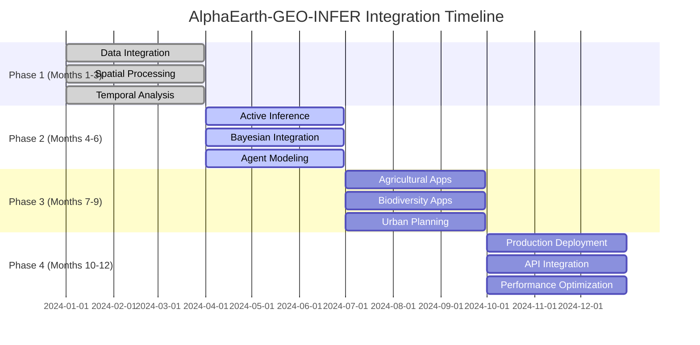

### Long-term Vision

The integration positions the combined system as a leading platform for:

- **Environmental Science**: Unprecedented detail in global environmental monitoring
- **Conservation**: Real-time monitoring of biodiversity and habitat changes
- **Agriculture**: Predictive crop modeling and climate adaptation
- **Urban Planning**: Smart city development with environmental considerations
- **Climate Response**: Advanced modeling for climate change impacts and adaptation

This integration provides the analytical foundation needed to address the complex environmental challenges of the 21st century, combining the best of AI-powered Earth observation with sophisticated geospatial active inference capabilities.

## Testing and Validation Strategy

### Comprehensive Testing Framework

The integration requires rigorous testing across multiple dimensions to ensure reliability and performance:

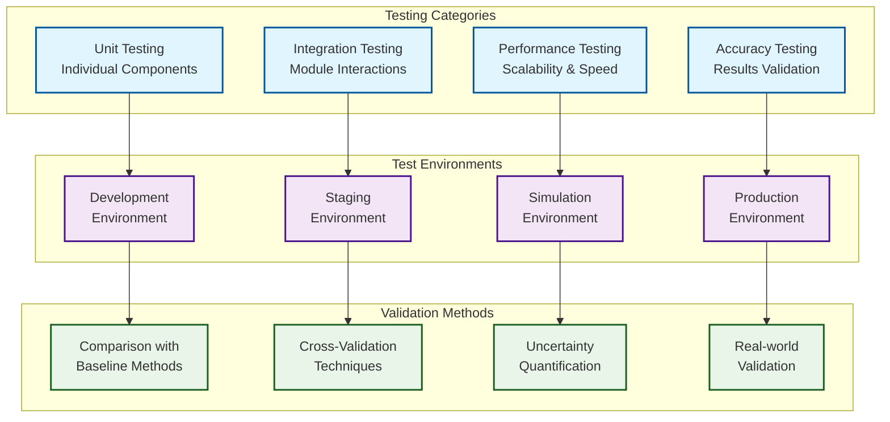

### Testing Specifications

| Test Category | Scope | Tools | Success Criteria |
|---------------|-------|-------|------------------|
| **Unit Testing** | Individual functions and classes | pytest, unittest | 95% code coverage |
| **Integration Testing** | Module interactions | pytest, docker-compose | All API endpoints functional |
| **Performance Testing** | Scalability and speed | Apache JMeter, locust | Sub-second response times |
| **Accuracy Testing** | Result validation | Statistical analysis | Maintain AlphaEarth accuracy |
| **Load Testing** | High-volume processing | Distributed testing | Handle 1.4T data footprints |
| **Security Testing** | Authentication and authorization | OWASP ZAP | Zero critical vulnerabilities |

## References

### AlphaEarth Foundations
1. [AlphaEarth Foundations Technical Documentation](https://developers.google.com/earth-engine/tutorials/community/satellite-embedding-01-introduction)
2. [Google Earth Engine Satellite Embedding Dataset](https://developers.google.com/earth-engine/datasets/catalog/GOOGLE_SATELLITE_EMBEDDING_V1_ANNUAL)
3. [AlphaEarth Research Paper](https://arxiv.org/abs/2507.22291)
4. [DeepMind AlphaEarth Blog Post](https://deepmind.google/discover/blog/alphaearth-foundations-helps-map-our-planet-in-unprecedented-detail/)

### GEO-INFER Framework
5. [GEO-INFER Framework Architecture](GEO-INFER-INTRA/docs/architecture/)
6. [Active Inference Principles](GEO-INFER-ACT/docs/)
7. [Spatial Processing Capabilities](GEO-INFER-SPACE/docs/)
8. [Temporal Analysis Framework](GEO-INFER-TIME/docs/)
9. [Data Management System](GEO-INFER-DATA/docs/)
10. [API Documentation](GEO-INFER-API/docs/)

### Technical Standards
11. [OGC Geospatial Standards](https://www.ogc.org/standards/)
12. [ISO 19100 Geographic Information Standards](https://www.iso.org/standard/53798.html)
13. [Google Earth Engine API Documentation](https://developers.google.com/earth-engine)
14. [Apache Spark Documentation](https://spark.apache.org/docs/latest/)

### Research and Development
15. [Active Inference in Geospatial Applications](https://www.frontiersin.org/articles/10.3389/frobt.2020.00036/full)
16. [Bayesian Inference for Environmental Modeling](https://www.nature.com/articles/s41598-020-63759-1)
17. [High-Dimensional Spatial Data Processing](https://ieeexplore.ieee.org/document/8743184)
18. [Real-time Environmental Monitoring Systems](https://www.mdpi.com/2072-4292/12/15/2426) 