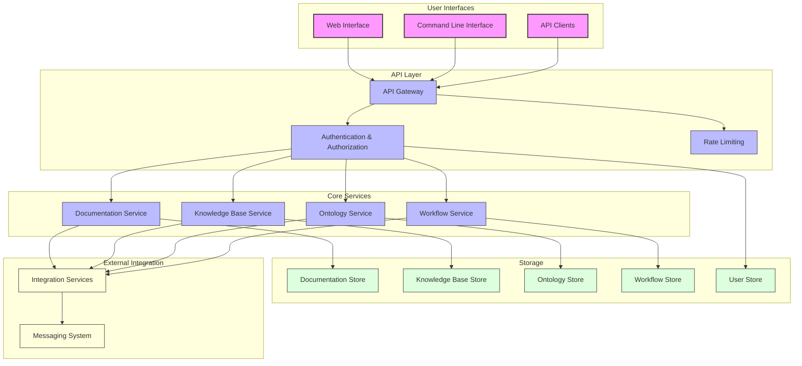
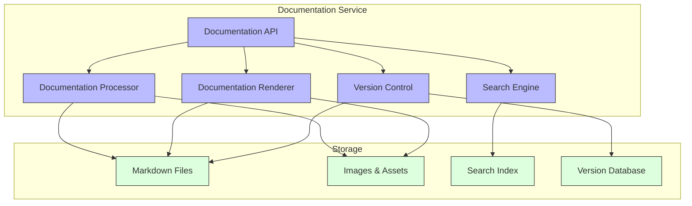
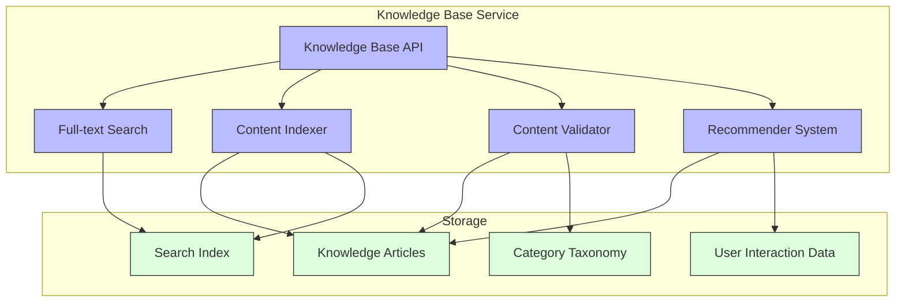
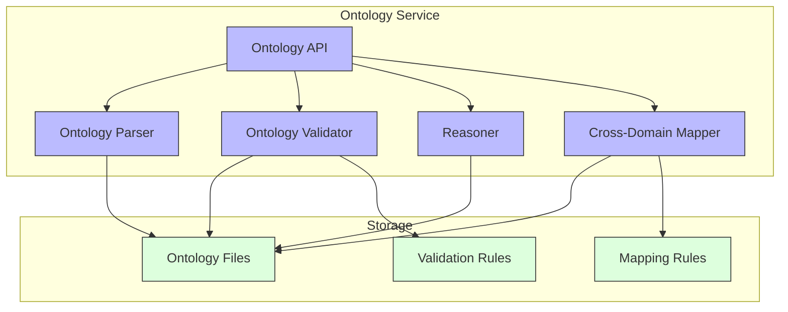
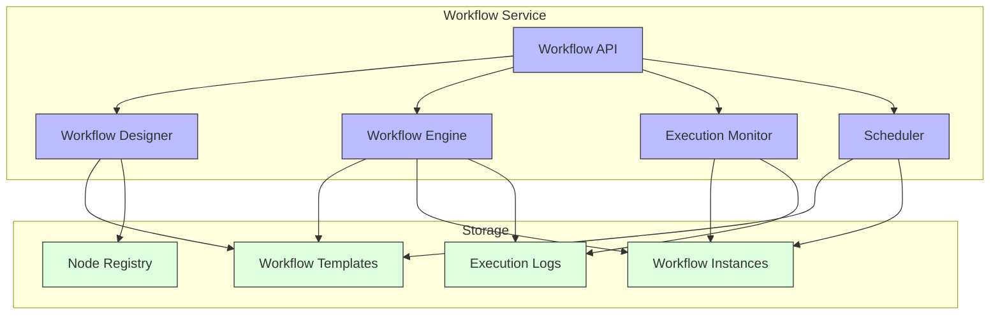
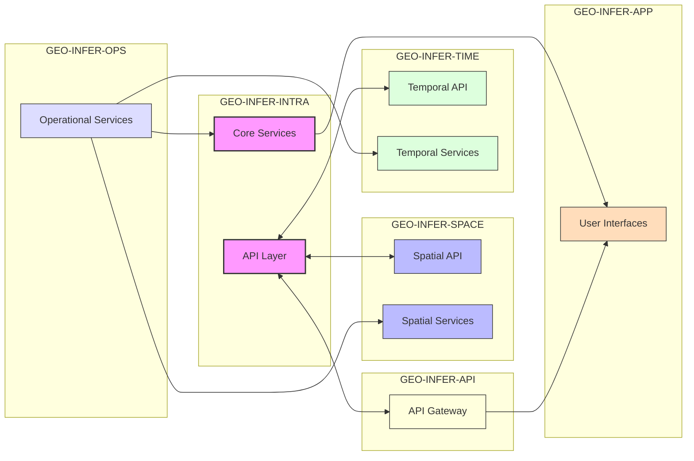
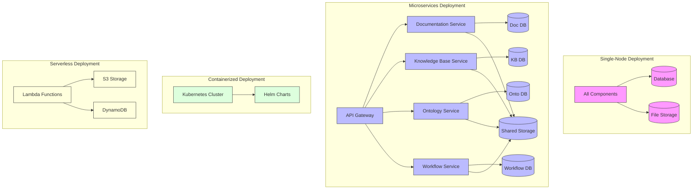
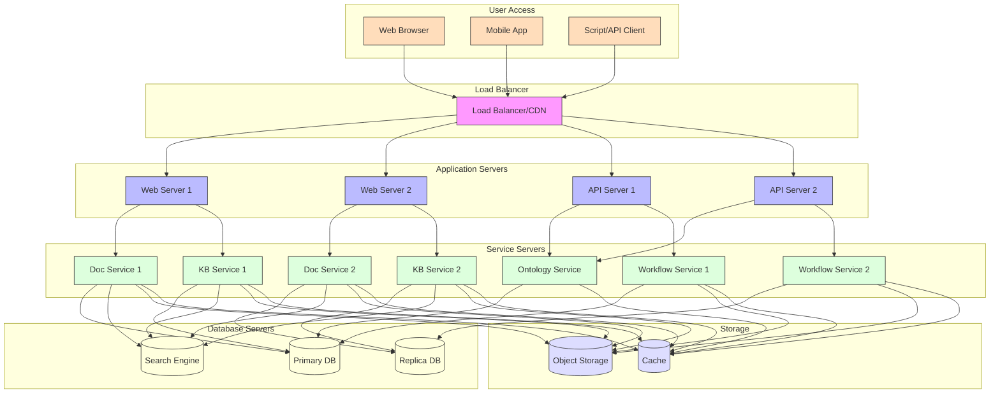

# Component Diagram

This document provides visual representations of the GEO-INFER-INTRA system architecture using component diagrams.

## System Overview

The following diagram shows the high-level components of the GEO-INFER-INTRA system and their relationships:

## Documentation System Components

Detailed view of the Documentation Service components:

## Knowledge Base Components

Detailed view of the Knowledge Base Service components:

## Ontology Management Components

Detailed view of the Ontology Service components:

## Workflow System Components

Detailed view of the Workflow Service components:

## Integration with Other GEO-INFER Modules

The following diagram shows how GEO-INFER-INTRA integrates with other modules in the GEO-INFER framework:

## Deployment Architecture

The following diagram illustrates the deployment options for GEO-INFER-INTRA:

## Physical Architecture

The following diagram shows a typical physical architecture for a production deployment of GEO-INFER-INTRA:

## Further Information

- [Architecture Overview](overview.md)
- [Data Flow Diagram](data_flow.md)
- [Integration Points](integration_points.md)
- [Deployment Architecture](deployment.md) 