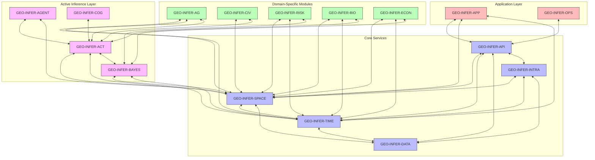
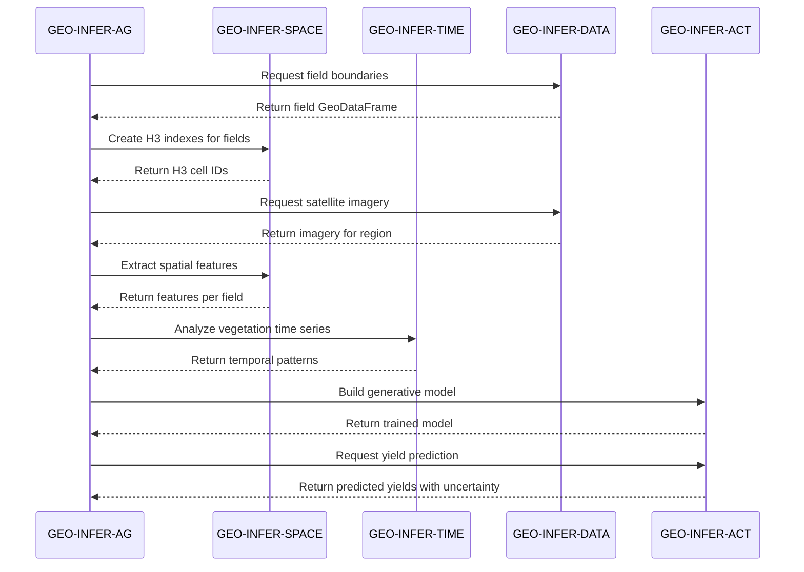
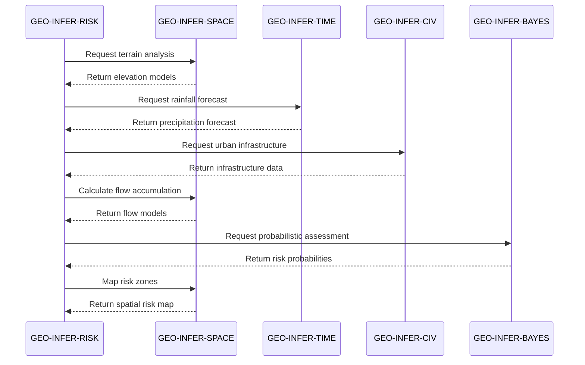

# Cross-Module Interaction in GEO-INFER

This document details how the various modules within the GEO-INFER framework interact with each other to create a cohesive ecosystem for geospatial active inference. Understanding these interactions is crucial for both users and developers working with multiple modules.

## Architecture Overview

The GEO-INFER framework is designed with a modular architecture that enables both independent operation and seamless integration. Modules interact through several mechanisms:



## Interaction Mechanisms

GEO-INFER modules interact through several standardized mechanisms:

### 1. Python API Interfaces

Direct Python imports between modules enable programmatic interaction:

```python
# Example: GEO-INFER-AG using GEO-INFER-SPACE functionality
from geo_infer_space import indexing
from geo_infer_ag import crop_models

# Create spatial indexes for agricultural fields
field_gdf = crop_models.load_field_boundaries("path/to/fields.geojson")
h3_indexes = indexing.geometries_to_h3(field_gdf.geometry, resolution=8)

# Use these indexes in crop modeling
zoned_analysis = crop_models.analyze_by_zones(field_data, h3_indexes)
```

### 2. Standardized Data Structures

Common data structures ensure compatibility across modules:

- **GeospatialDataset**: Core class for handling geospatial data
- **TemporalSeries**: Standard representation for time-series data
- **SpatioTemporalCube**: For data with both spatial and temporal dimensions
- **BeliefDistribution**: Probabilistic representation used in active inference

```python
# Example: Passing data between modules
from geo_infer_data import datasets
from geo_infer_time import temporal_analysis

# Load dataset with standardized structure
dataset = datasets.GeospatialDataset.from_file("climate_data.nc")

# Directly usable in time module
trends = temporal_analysis.detect_trends(dataset.to_temporal_series())
```

### 3. RESTful API Services

For distributed deployment, modules can communicate through the GEO-INFER-API layer:

```python
# Example: Using API for cross-module communication
from geo_infer_api import client

# Connect to API
api = client.GeoInferAPI(base_url="https://api.geo-infer.org/v1")

# Request processing from different modules
spatial_result = api.space.create_h3_index(geometry=some_geometry, resolution=8)
temporal_result = api.time.detect_seasonality(time_series=some_data)

# Combine results from different modules
combined = api.data.merge_results(spatial_result, temporal_result)
```

### 4. Event Bus

For asynchronous processing and notifications, a message bus facilitates communication:

```python
# Example: Event-driven communication
from geo_infer_intra import events

# Subscribe to events from another module
@events.subscribe("geo_infer_data.dataset.updated")
def handle_dataset_update(event_data):
    # Process the updated dataset
    dataset_id = event_data["dataset_id"]
    process_updated_dataset(dataset_id)

# Publish events for other modules
events.publish("geo_infer_risk.risk_assessment.completed", {
    "assessment_id": "123456",
    "risk_level": "high",
    "affected_area": bbox_coordinates
})
```

### 5. Shared Configuration

Modules share configuration through the GEO-INFER-INTRA configuration service:

```python
# Example: Shared configuration
from geo_infer_intra import config

# Get configuration that affects multiple modules
spatial_resolution = config.get("spatial.default_resolution")
temporal_resolution = config.get("temporal.default_resolution")
```

## Core Interaction Patterns

### Spatial + Temporal Integration

The GEO-INFER-SPACE and GEO-INFER-TIME modules frequently work together:

```python
from geo_infer_space import indexing
from geo_infer_time import patterns

# Create spatial grid
h3_cells = indexing.create_h3_grid(bbox, resolution=8)

# Analyze temporal patterns for each cell
for cell_id in h3_cells:
    cell_data = get_data_for_cell(cell_id)
    temporal_patterns = patterns.detect_seasonality(cell_data)
    store_results(cell_id, temporal_patterns)
```

### Active Inference + Spatial Integration

GEO-INFER-ACT provides active inference algorithms that operate on spatial data:

```python
from geo_infer_space import environment
from geo_infer_act import generative_models

# Create spatial environment
spatial_env = environment.SpatialEnvironment(bounds=city_bounds)

# Apply active inference model to spatial data
model = generative_models.SpatialGenerativeModel(
    spatial_resolution=9,  # H3 resolution
    state_dimensions=["temperature", "elevation", "land_use"],
    precision=10.0
)

model.fit(spatial_data)
predictions = model.predict(query_points)
```

### Domain Modules + Core Services

Domain-specific modules build upon core services:

```python
from geo_infer_space import transformations
from geo_infer_time import forecasting
from geo_infer_risk import flood_models

# Prepare spatial data
dem = transformations.reproject_raster(elevation_data, target_crs="EPSG:3857")
rivers = transformations.reproject_vector(river_data, target_crs="EPSG:3857")

# Prepare temporal data
rainfall = forecasting.forecast_precipitation(
    historical_data,
    forecast_horizon=7  # 7-day forecast
)

# Run domain-specific model using core services' outputs
flood_risk = flood_models.estimate_flood_risk(
    dem=dem,
    rivers=rivers,
    precipitation_forecast=rainfall
)
```

## Module-by-Module Integration Guide

### GEO-INFER-SPACE Integrations

| Module | Integration Pattern | Example Use Case |
|--------|---------------------|------------------|
| TIME | Joint spatiotemporal analysis | Analyzing how spatial patterns evolve over time |
| DATA | Spatial data loading and transformation | Loading and processing geospatial datasets |
| ACT | Spatial generative models | Creating belief maps about spatial features |
| AGENT | Environmental representation | Providing environments for agent simulation |
| RISK | Spatial risk assessment | Mapping hazard zones and vulnerability |
| CIV | Urban spatial analysis | Analyzing urban morphology and transportation networks |
| AG | Field boundary processing | Processing agricultural field geometries |

### GEO-INFER-TIME Integrations

| Module | Integration Pattern | Example Use Case |
|--------|---------------------|------------------|
| SPACE | Spatiotemporal analysis | Tracking movement patterns through space |
| DATA | Temporal data loading and transformation | Loading and processing time series data |
| ACT | Temporal generative models | Predicting future states based on historical data |
| BAYES | Temporal Bayesian models | Time series forecasting with uncertainty |
| RISK | Temporal risk evolution | Forecasting how risks evolve over time |
| ECON | Economic time series analysis | Analyzing market trends with spatial context |

### GEO-INFER-DATA Integrations

| Module | Integration Pattern | Example Use Case |
|--------|---------------------|------------------|
| SPACE | Spatial data access | Providing standardized access to geospatial datasets |
| TIME | Temporal data access | Providing standardized access to time series |
| INTRA | Metadata management | Storing and retrieving dataset metadata |
| API | Data access services | Exposing datasets through APIs |
| All Domains | Domain data provision | Supplying domain-specific datasets |

### GEO-INFER-ACT Integrations

| Module | Integration Pattern | Example Use Case |
|--------|---------------------|------------------|
| SPACE | Spatial active inference | Applying active inference to spatial problems |
| TIME | Temporal active inference | Applying active inference to temporal forecasting |
| BAYES | Bayesian computation | Performing variational inference |
| AGENT | Agent cognitive models | Providing cognitive algorithms for agents |
| All Domains | Domain-specific modeling | Supplying active inference algorithms to domains |

## Data Flow Examples

### Example 1: Agricultural Yield Prediction

This example shows how data flows between modules in an agricultural yield prediction workflow:



### Example 2: Urban Risk Assessment

This example shows data flow for an urban flood risk assessment:



## Integration Best Practices

When working with multiple GEO-INFER modules, follow these best practices:

1. **Consistent Coordinate Systems**: Always explicitly specify and transform coordinate reference systems when passing geospatial data between modules.

2. **Memory Management**: For large datasets, use streaming and chunking approaches provided by GEO-INFER-DATA rather than loading entire datasets in memory.

3. **Error Handling**: Implement proper error handling for cross-module calls, especially for asynchronous operations.

4. **Version Compatibility**: Check module version compatibility using GEO-INFER-INTRA's compatibility service before integration.

5. **Documentation**: Document module interactions in your applications, referencing this guide for standard patterns.

## Common Integration Challenges

| Challenge | Solution |
|-----------|----------|
| Coordinate System Mismatches | Use the SPACE.transformations utilities to ensure consistent CRS |
| Data Format Incompatibility | Use standardized GeospatialDataset conversions from DATA module |
| Performance Bottlenecks | Implement spatial indexing via H3 to optimize cross-module operations |
| Dependency Conflicts | Use the recommended version combinations provided by OPS module |
| Distributed Deployment | Leverage the API module for service-based communication |

## Future Integration Roadmap

The GEO-INFER framework is continuously evolving to improve cross-module integration:

1. **Universal Data Objects**: Development of even more standardized data objects for seamless passage between modules
2. **Auto-Discovery**: Enhanced module capability discovery and registration
3. **Integration Templates**: Pre-built integration patterns for common workflows
4. **Cross-Module Caching**: Intelligent caching of intermediate results across module boundaries
5. **Unified Configuration**: Enhanced configuration management across modules

## Module Integration Reference

For detailed information on specific module integrations, see the dedicated integration guides:

- [GEO-INFER-SPACE Integration Guide](../integration/space_integration.md)
- [GEO-INFER-TIME Integration Guide](../integration/time_integration.md)
- [GEO-INFER-ACT Integration Guide](../integration/act_integration.md)
- [GEO-INFER-DATA Integration Guide](../integration/data_integration.md)
- [GEO-INFER-API Integration Guide](../integration/api_integration.md) 