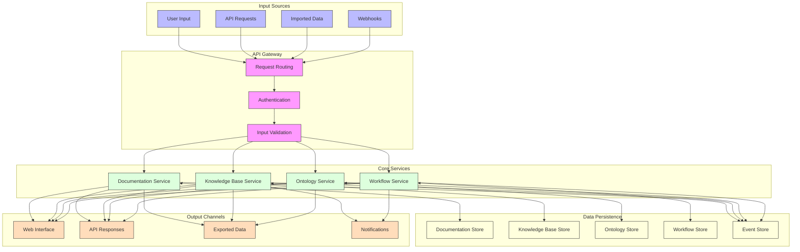
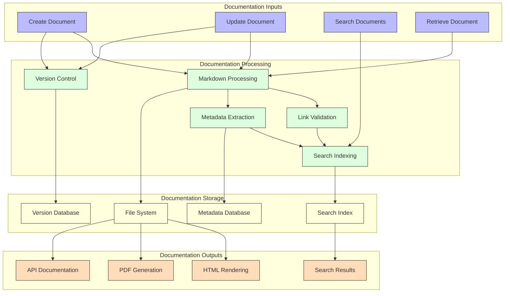
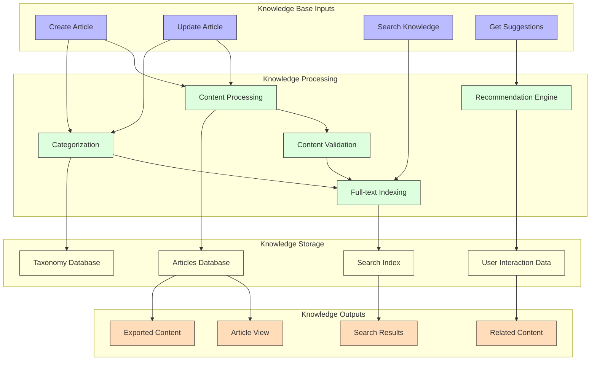
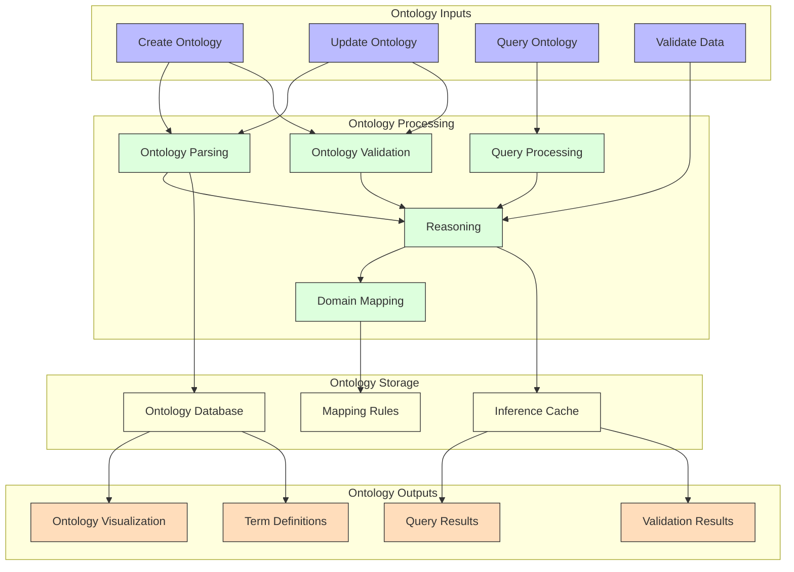
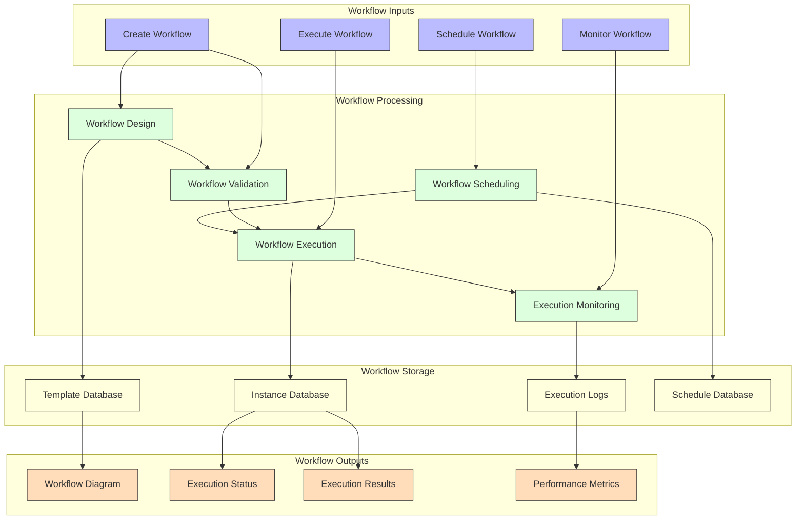
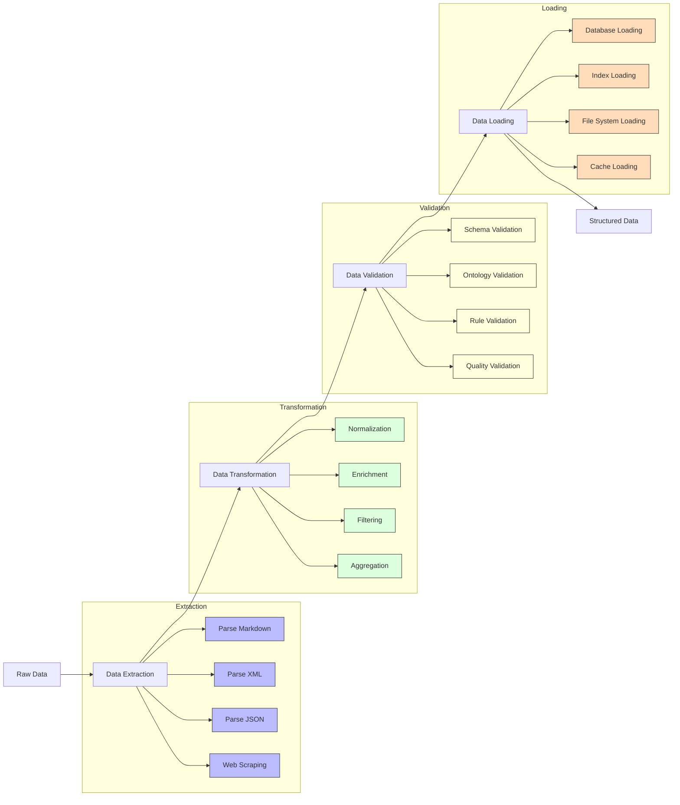
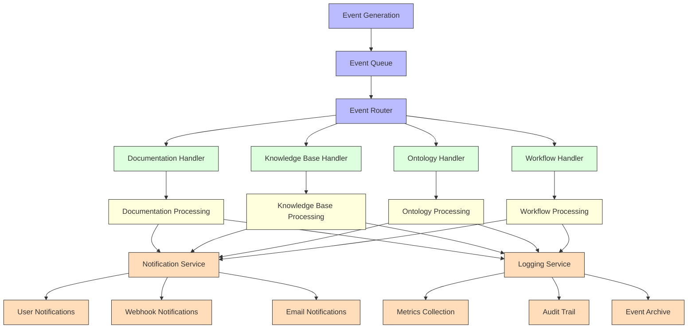

# Data Flow Diagram

This document illustrates the data flows within the GEO-INFER-INTRA system and between GEO-INFER-INTRA and other components of the GEO-INFER framework.

## System-Level Data Flow

The following diagram shows the high-level data flow through the GEO-INFER-INTRA system:

## Documentation Service Data Flow

The following diagram details the data flow within the Documentation Service:

## Knowledge Base Service Data Flow

The following diagram details the data flow within the Knowledge Base Service:

## Ontology Service Data Flow

The following diagram details the data flow within the Ontology Service:

## Workflow Service Data Flow

The following diagram details the data flow within the Workflow Service:

## Integration Data Flow

The following diagram illustrates the data flow between GEO-INFER-INTRA and other GEO-INFER modules:

```mermaid
flowchart TB
    subgraph "GEO-INFER-INTRA"
        DOCS[Documentation Service]
        KB[Knowledge Base Service]
        ONTO[Ontology Service]
        WF[Workflow Service]
    end
    
    subgraph "GEO-INFER-SPACE"
        SPACE_META[Spatial Metadata]
        SPACE_MODEL[Spatial Data Models]
        SPACE_CATALOG[Spatial Data Catalog]
    end
    
    subgraph "GEO-INFER-TIME"
        TIME_META[Temporal Metadata]
        TIME_MODEL[Temporal Data Models]
        TIME_CATALOG[Time Series Catalog]
    end
    
    subgraph "GEO-INFER-API"
        API_SPEC[API Specifications]
        API_DOC[API Documentation]
        API_TEST[API Test Cases]
    end
    
    subgraph "GEO-INFER-APP"
        UI_CONFIG[UI Configuration]
        UI_CONTENT[UI Content]
        HELP[Help System]
    end
    
    subgraph "GEO-INFER-OPS"
        OPS_CONFIG[Operations Config]
        OPS_DOC[Operations Documentation]
        OPS_MONITOR[Monitoring]
    end
    
    %% INTRA to SPACE
    DOCS --> SPACE_META
    ONTO --> SPACE_MODEL
    KB --> SPACE_CATALOG
    
    %% INTRA to TIME
    DOCS --> TIME_META
    ONTO --> TIME_MODEL
    KB --> TIME_CATALOG
    
    %% INTRA to API
    DOCS --> API_DOC
    ONTO --> API_SPEC
    WF --> API_TEST
    
    %% INTRA to APP
    DOCS --> UI_CONTENT
    KB --> HELP
    ONTO --> UI_CONFIG
    
    %% INTRA to OPS
    DOCS --> OPS_DOC
    WF --> OPS_CONFIG
    KB --> OPS_MONITOR
    
    %% Reverse flows
    SPACE_META --> DOCS
    SPACE_MODEL --> ONTO
    SPACE_CATALOG --> KB
    
    TIME_META --> DOCS
    TIME_MODEL --> ONTO
    TIME_CATALOG --> KB
    
    API_SPEC --> ONTO
    API_DOC --> DOCS
    API_TEST --> WF
    
    classDef intra fill:#f9f,stroke:#333,stroke-width:2px
    classDef space fill:#bbf,stroke:#333,stroke-width:1px
    classDef time fill:#dfd,stroke:#333,stroke-width:1px
    classDef api fill:#ffd,stroke:#333,stroke-width:1px
    classDef app fill:#fdb,stroke:#333,stroke-width:1px
    classDef ops fill:#ddf,stroke:#333,stroke-width:1px
    
    class DOCS,KB,ONTO,WF intra
    class SPACE_META,SPACE_MODEL,SPACE_CATALOG space
    class TIME_META,TIME_MODEL,TIME_CATALOG time
    class API_SPEC,API_DOC,API_TEST api
    class UI_CONFIG,UI_CONTENT,HELP app
    class OPS_CONFIG,OPS_DOC,OPS_MONITOR ops
```

## Data Transformation Flow

The following diagram shows the data transformation process within GEO-INFER-INTRA:

## Event Flow

The following diagram illustrates the event flow within GEO-INFER-INTRA:

## Further Information

- [Component Diagram](component_diagram.md)
- [API Data Flows](../api/data_flows.md)
- [Data Storage Architecture](storage_architecture.md)
- [Integration Architecture](integration_points.md) 