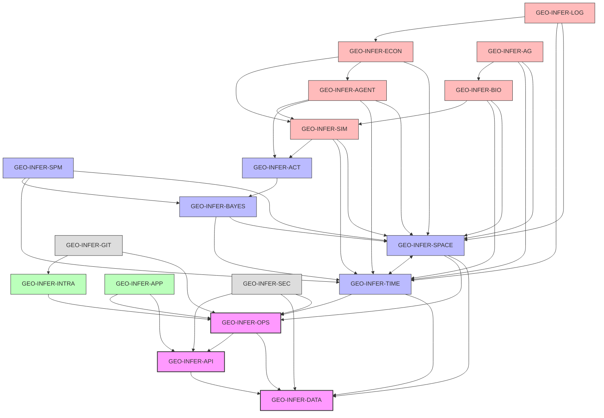

# GEO-INFER Module Catalog

## Overview

This document provides a comprehensive catalog of all modules within the GEO-INFER framework, including their purposes, key capabilities, and their relationships to other modules. This serves as a reference for understanding the overall architecture and finding the appropriate modules for specific tasks.

## Core Infrastructure Modules

### GEO-INFER-OPS

**Purpose**: Operational orchestration and infrastructure management  
**Repository**: `/GEO-INFER-OPS`

GEO-INFER-OPS serves as the central coordination module for the entire GEO-INFER framework. It provides core infrastructure capabilities, including deployment, monitoring, logging, security, and inter-module communication.

**Key Capabilities**:
- Deployment automation and orchestration
- Configuration management
- Monitoring and observability
- Centralized logging
- Security management
- Service discovery
- Inter-module communication

**Primary Integrations**:
- All other modules (provides core services)

### GEO-INFER-DATA

**Purpose**: Data management, storage, and access  
**Repository**: `/GEO-INFER-DATA`

GEO-INFER-DATA provides comprehensive data management capabilities, including data storage, retrieval, ETL processes, and data quality management for geospatial data.

**Key Capabilities**:
- Geospatial data storage and retrieval
- ETL pipelines for various data sources
- Data quality management and validation
- Version control for datasets
- Data catalog and metadata management
- Distributed data processing

**Primary Integrations**:
- GEO-INFER-SPACE (data for spatial analysis)
- GEO-INFER-TIME (data for temporal analysis)
- GEO-INFER-OPS (operational integration)

### GEO-INFER-API

**Purpose**: API gateway and service interfaces  
**Repository**: `/GEO-INFER-API`

GEO-INFER-API provides a unified API gateway for accessing all capabilities across the GEO-INFER framework, implementing various API standards and protocols.

**Key Capabilities**:
- RESTful API endpoints
- GraphQL interface
- OGC-compliant geospatial services
- API documentation
- Authentication and authorization
- Rate limiting and request validation

**Primary Integrations**:
- All modules (exposes capabilities as APIs)
- GEO-INFER-OPS (for security and monitoring)

## Domain-Specific Modules

### GEO-INFER-SPACE

**Purpose**: Spatial data processing and analysis  
**Repository**: `/GEO-INFER-SPACE`

GEO-INFER-SPACE provides comprehensive spatial data processing capabilities, including coordinate systems, spatial indexing, and spatial analysis algorithms.

**Key Capabilities**:
- Coordinate reference system management
- Spatial indexing (quadtree, H3, etc.)
- Vector operations (buffer, intersect, etc.)
- Raster operations
- Geospatial algorithms
- Map projection handling

**Primary Integrations**:
- GEO-INFER-DATA (data access)
- GEO-INFER-TIME (spatiotemporal analysis)
- GEO-INFER-OPS (operational integration)

### GEO-INFER-TIME

**Purpose**: Temporal data processing and analysis  
**Repository**: `/GEO-INFER-TIME`

GEO-INFER-TIME provides temporal data processing capabilities, including time series analysis, temporal indexing, and temporal pattern detection.

**Key Capabilities**:
- Time series representation and analysis
- Temporal indexing
- Seasonality detection
- Trend analysis
- Temporal interpolation
- Time zone handling

**Primary Integrations**:
- GEO-INFER-DATA (data access)
- GEO-INFER-SPACE (spatiotemporal analysis)
- GEO-INFER-OPS (operational integration)

### GEO-INFER-SPM

**Purpose**: Statistical Parametric Mapping for geospatial data  
**Repository**: `/GEO-INFER-SPM`

GEO-INFER-SPM implements statistical parametric mapping techniques for analyzing spatial and spatiotemporal patterns in geospatial data.

**Key Capabilities**:
- General Linear Model for spatial data
- Random Field Theory corrections
- Cluster-level inference
- Spatiotemporal statistical analysis
- Statistical map visualization

**Primary Integrations**:
- GEO-INFER-SPACE (spatial data)
- GEO-INFER-TIME (temporal data)
- GEO-INFER-BAYES (statistical methods)

### GEO-INFER-BAYES

**Purpose**: Bayesian statistical methods for geospatial analysis  
**Repository**: `/GEO-INFER-BAYES`

GEO-INFER-BAYES provides Bayesian statistical methods for geospatial data analysis, enabling uncertainty quantification and probabilistic modeling.

**Key Capabilities**:
- Bayesian statistical models
- MCMC sampling methods
- Variational inference
- Gaussian processes for spatial data
- Uncertainty quantification
- Bayesian model comparison

**Primary Integrations**:
- GEO-INFER-SPACE (spatial data)
- GEO-INFER-TIME (temporal data)
- GEO-INFER-ACT (active inference)

### GEO-INFER-ACT

**Purpose**: Active inference implementation  
**Repository**: `/GEO-INFER-ACT`

GEO-INFER-ACT implements the active inference framework for perception, learning, and decision-making in geospatial contexts.

**Key Capabilities**:
- Generative model implementation
- Variational inference
- Free energy minimization
- Policy selection
- Learning and adaptation
- Decision-making under uncertainty

**Primary Integrations**:
- GEO-INFER-BAYES (statistical methods)
- GEO-INFER-AGENT (agent-based models)
- GEO-INFER-SIM (simulation environment)

## Application Modules

### GEO-INFER-APP

**Purpose**: User-facing applications and interfaces  
**Repository**: `/GEO-INFER-APP`

GEO-INFER-APP provides user interfaces and applications for interacting with the GEO-INFER framework, including web applications, dashboards, and visualization tools.

**Key Capabilities**:
- Web applications
- Dashboards
- Map visualization
- Data exploration interfaces
- Analysis tools
- Interactive reporting

**Primary Integrations**:
- GEO-INFER-API (data and functionality access)
- GEO-INFER-OPS (authentication and deployment)

### GEO-INFER-INTRA

**Purpose**: Documentation, knowledge management, and workflow tools  
**Repository**: `/GEO-INFER-INTRA`

GEO-INFER-INTRA provides documentation, knowledge management, and workflow tools for the GEO-INFER framework, enabling effective use and continuous development.

**Key Capabilities**:
- Comprehensive documentation
- Knowledge base management
- Ontology management
- Workflow definition and execution
- Training materials
- Development guides

**Primary Integrations**:
- All modules (provides documentation)

## Specialized Domain Modules

### GEO-INFER-SIM

**Purpose**: Simulation and modeling environment  
**Repository**: `/GEO-INFER-SIM`

GEO-INFER-SIM provides simulation and modeling capabilities for geospatial systems, enabling scenario analysis and system dynamics modeling.

**Key Capabilities**:
- Agent-based simulation
- System dynamics modeling
- Scenario analysis
- Sensitivity testing
- Monte Carlo simulation
- Synthetic data generation

**Primary Integrations**:
- GEO-INFER-SPACE (spatial context)
- GEO-INFER-TIME (temporal evolution)
- GEO-INFER-ACT (active inference)

### GEO-INFER-AGENT

**Purpose**: Agent-based modeling and analysis  
**Repository**: `/GEO-INFER-AGENT`

GEO-INFER-AGENT provides agent-based modeling capabilities for geospatial systems, enabling the simulation of complex adaptive systems with spatial components.

**Key Capabilities**:
- Agent definition and behavior
- Multi-agent interaction
- Spatial movement and behavior
- Emergence and adaptation
- Agent learning and evolution
- Social network analysis

**Primary Integrations**:
- GEO-INFER-SPACE (spatial environment)
- GEO-INFER-TIME (temporal evolution)
- GEO-INFER-ACT (agent decision making)
- GEO-INFER-SIM (simulation environment)

### GEO-INFER-ECON

**Purpose**: Economic modeling and analysis in spatial contexts  
**Repository**: `/GEO-INFER-ECON`

GEO-INFER-ECON provides economic modeling and analysis capabilities in spatial contexts, enabling the study of spatial economics, resource allocation, and policy impacts.

**Key Capabilities**:
- Spatial economic models
- Market simulation
- Resource allocation optimization
- Policy impact assessment
- Economic risk analysis
- Trade and location modeling

**Primary Integrations**:
- GEO-INFER-SPACE (spatial context)
- GEO-INFER-AGENT (agent behavior)
- GEO-INFER-SIM (simulation environment)

### GEO-INFER-BIO

**Purpose**: Biological and ecological modeling  
**Repository**: `/GEO-INFER-BIO`

GEO-INFER-BIO provides biological and ecological modeling capabilities, enabling the analysis of ecosystems, biodiversity, and environmental processes in spatial contexts.

**Key Capabilities**:
- Ecosystem modeling
- Biodiversity analysis
- Species distribution modeling
- Habitat connectivity analysis
- Environmental process modeling
- Conservation planning

**Primary Integrations**:
- GEO-INFER-SPACE (spatial context)
- GEO-INFER-TIME (temporal dynamics)
- GEO-INFER-SIM (ecological simulation)

### GEO-INFER-AG

**Purpose**: Agricultural analysis and planning  
**Repository**: `/GEO-INFER-AG`

GEO-INFER-AG provides agricultural analysis and planning capabilities, enabling precision agriculture, crop modeling, and sustainable farming practices.

**Key Capabilities**:
- Precision agriculture tools
- Crop modeling
- Soil health assessment
- Water resource optimization
- Climate impact analysis
- Sustainable farming analysis

**Primary Integrations**:
- GEO-INFER-SPACE (spatial context)
- GEO-INFER-TIME (seasonal patterns)
- GEO-INFER-BIO (ecological context)

### GEO-INFER-LOG

**Purpose**: Logistics and supply chain optimization  
**Repository**: `/GEO-INFER-LOG`

GEO-INFER-LOG provides logistics and supply chain optimization capabilities, enabling efficient transportation planning, facility location, and supply chain resilience analysis.

**Key Capabilities**:
- Route optimization
- Supply chain modeling
- Last-mile delivery optimization
- Facility location analysis
- Transportation network analysis
- Supply chain resilience

**Primary Integrations**:
- GEO-INFER-SPACE (spatial networks)
- GEO-INFER-TIME (scheduling)
- GEO-INFER-ECON (economic factors)

## Development Support Modules

### GEO-INFER-GIT

**Purpose**: Version control and repository management  
**Repository**: `/GEO-INFER-GIT`

GEO-INFER-GIT provides version control and repository management capabilities for the GEO-INFER framework, enabling coordinated development across modules.

**Key Capabilities**:
- Repository cloning and management
- Git workflow automation
- Multi-repository synchronization
- Release coordination
- CI/CD integration
- Geospatial data versioning

**Primary Integrations**:
- GEO-INFER-OPS (deployment integration)
- GEO-INFER-INTRA (documentation)

### GEO-INFER-SEC

**Purpose**: Security and privacy framework  
**Repository**: `/GEO-INFER-SEC`

GEO-INFER-SEC provides security and privacy capabilities for geospatial data and applications, ensuring compliance with regulations and protection of sensitive information.

**Key Capabilities**:
- Geospatial data anonymization
- Access control
- Regulatory compliance
- Secure data sharing
- Privacy-preserving analytics
- Security auditing

**Primary Integrations**:
- GEO-INFER-OPS (security operations)
- GEO-INFER-DATA (data protection)
- GEO-INFER-API (API security)

## Module Dependency Graph

## Conclusion

This module catalog provides a comprehensive overview of the GEO-INFER framework's components. Each module is designed to address specific aspects of geospatial data processing, analysis, and application, while maintaining clear boundaries and well-defined interfaces for integration.

When working with the GEO-INFER framework, refer to this catalog to identify the appropriate modules for your specific use case and understand how they interact with other components of the system. 