# GEO-INFER Module Structure

This document outlines the module structure of the GEO-INFER framework, including the organization of each module, standard interfaces, and inter-module relationships.

## Module Categories

The GEO-INFER framework is organized into several categories of modules:

```mermaid
graph TB
    GEO[GEO-INFER Framework]
    
    CORE[Core Modules]
    ACTIVE[Active Inference Modules]
    DOMAIN[Domain-Specific Modules]
    SUPPORT[Support Modules]
    
    GEO --> CORE
    GEO --> ACTIVE
    GEO --> DOMAIN
    GEO --> SUPPORT
    
    %% Core Modules
    CORE --> SPACE[GEO-INFER-SPACE]
    CORE --> TIME[GEO-INFER-TIME]
    CORE --> DATA[GEO-INFER-DATA]
    CORE --> API[GEO-INFER-API]
    CORE --> APP[GEO-INFER-APP]
    CORE --> INTRA[GEO-INFER-INTRA]
    
    %% Active Inference Modules
    ACTIVE --> ACT[GEO-INFER-ACT]
    ACTIVE --> AGENT[GEO-INFER-AGENT]
    ACTIVE --> BAYES[GEO-INFER-BAYES]
    ACTIVE --> COG[GEO-INFER-COG]
    ACTIVE --> MATH[GEO-INFER-MATH]
    
    %% Domain-Specific Modules
    DOMAIN --> AG[GEO-INFER-AG]
    DOMAIN --> BIO[GEO-INFER-BIO]
    DOMAIN --> CIV[GEO-INFER-CIV]
    DOMAIN --> ECON[GEO-INFER-ECON]
    DOMAIN --> RISK[GEO-INFER-RISK]
    DOMAIN --> SIM[GEO-INFER-SIM]
    
    %% Support Modules
    SUPPORT --> OPS[GEO-INFER-OPS]
    SUPPORT --> SEC[GEO-INFER-SEC]
    SUPPORT --> GIT[GEO-INFER-GIT]
    SUPPORT --> LOG[GEO-INFER-LOG]
    SUPPORT --> COMMS[GEO-INFER-COMMS]
    
    classDef framework fill:#f96,stroke:#333,stroke-width:2px
    classDef category fill:#f9f,stroke:#333,stroke-width:2px
    classDef core fill:#bbf,stroke:#333,stroke-width:1px
    classDef active fill:#dfd,stroke:#333,stroke-width:1px
    classDef domain fill:#fdb,stroke:#333,stroke-width:1px
    classDef support fill:#ddf,stroke:#333,stroke-width:1px
    
    class GEO framework
    class CORE,ACTIVE,DOMAIN,SUPPORT category
    class SPACE,TIME,DATA,API,APP,INTRA core
    class ACT,AGENT,BAYES,COG,MATH active
    class AG,BIO,CIV,ECON,RISK,SIM domain
    class OPS,SEC,GIT,LOG,COMMS support
```

## Standard Module Structure

Each GEO-INFER module follows a standardized internal structure:

```mermaid
graph TB
    MODULE[GEO-INFER Module]
    
    MODULE --> CONFIG[Configuration]
    MODULE --> DOCS[Documentation]
    MODULE --> SRC[Source Code]
    MODULE --> TESTS[Tests]
    MODULE --> EXAMPLES[Examples]
    
    SRC --> API[API Package]
    SRC --> CORE[Core Package]
    SRC --> MODELS[Models Package]
    SRC --> UTILS[Utilities Package]
    
    API --> REST[REST Endpoints]
    API --> GRAPHQL[GraphQL Schema]
    API --> CLIENT[Client Libraries]
    
    CORE --> CLASSES[Core Classes]
    CORE --> INTERFACES[Interfaces]
    CORE --> SERVICES[Services]
    
    MODELS --> SCHEMAS[Data Schemas]
    MODELS --> ENTITIES[Domain Entities]
    MODELS --> XFORMS[Transformations]
    
    UTILS --> HELPERS[Helper Functions]
    UTILS --> FORMATS[Format Converters]
    UTILS --> VALIDATION[Validators]
    
    TESTS --> UNIT[Unit Tests]
    TESTS --> INTEGRATION[Integration Tests]
    TESTS --> PERFORMANCE[Performance Tests]
    
    EXAMPLES --> NOTEBOOKS[Jupyter Notebooks]
    EXAMPLES --> SCRIPTS[Example Scripts]
    EXAMPLES --> TUTORIALS[Tutorials]
    
    classDef module fill:#f96,stroke:#333,stroke-width:2px
    classDef toplevel fill:#f9f,stroke:#333,stroke-width:2px
    classDef package fill:#bbf,stroke:#333,stroke-width:1px
    classDef component fill:#dfd,stroke:#333,stroke-width:1px
    
    class MODULE module
    class CONFIG,DOCS,SRC,TESTS,EXAMPLES toplevel
    class API,CORE,MODELS,UTILS package
    class REST,GRAPHQL,CLIENT,CLASSES,INTERFACES,SERVICES,SCHEMAS,ENTITIES,XFORMS,HELPERS,FORMATS,VALIDATION,UNIT,INTEGRATION,PERFORMANCE,NOTEBOOKS,SCRIPTS,TUTORIALS component
```

## Core Module Relationships

The core modules provide the foundation for the entire framework:

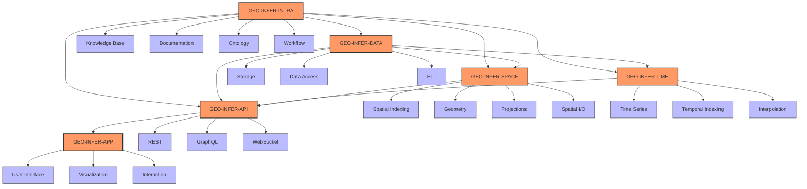

## Active Inference Module Relationships

The active inference modules implement the theoretical foundation of the framework:

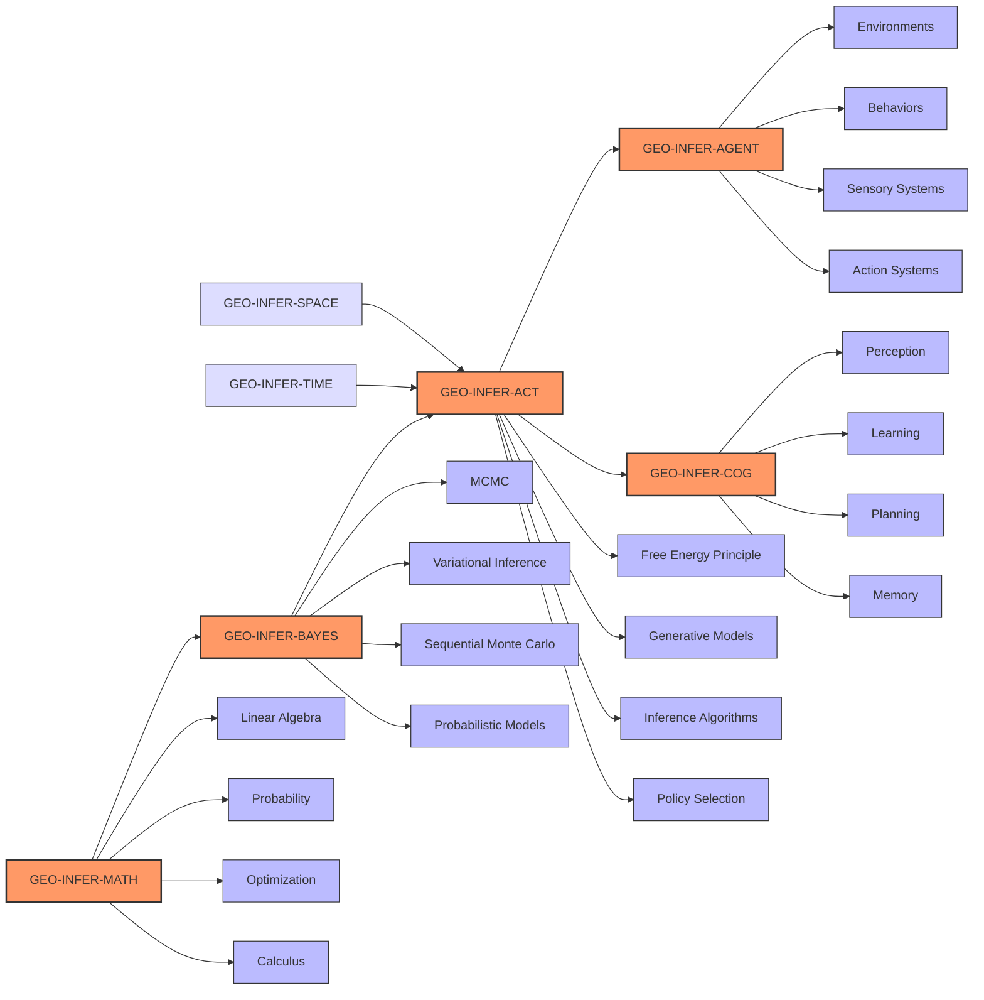

## Domain-Specific Module Integration

The domain-specific modules rely on both core and active inference capabilities:

```mermaid
graph TB
    %% Core modules
    SPACE[GEO-INFER-SPACE]
    TIME[GEO-INFER-TIME]
    DATA[GEO-INFER-DATA]
    
    %% Active Inference modules
    ACT[GEO-INFER-ACT]
    AGENT[GEO-INFER-AGENT]
    
    %% Domain modules
    AG[GEO-INFER-AG]
    BIO[GEO-INFER-BIO]
    CIV[GEO-INFER-CIV]
    ECON[GEO-INFER-ECON]
    RISK[GEO-INFER-RISK]
    SIM[GEO-INFER-SIM]
    
    %% Core dependencies
    SPACE --> AG
    TIME --> AG
    DATA --> AG
    
    SPACE --> BIO
    TIME --> BIO
    DATA --> BIO
    
    SPACE --> CIV
    TIME --> CIV
    DATA --> CIV
    
    SPACE --> ECON
    TIME --> ECON
    DATA --> ECON
    
    SPACE --> RISK
    TIME --> RISK
    DATA --> RISK
    
    SPACE --> SIM
    TIME --> SIM
    DATA --> SIM
    
    %% Active Inference dependencies
    ACT --> AG
    ACT --> BIO
    ACT --> CIV
    ACT --> ECON
    ACT --> RISK
    ACT --> SIM
    
    AGENT --> SIM
    
    %% AG submodules
    AG --> AG_CROP[Crop Models]
    AG --> AG_SOIL[Soil Analysis]
    AG --> AG_WATER[Water Management]
    
    %% BIO submodules
    BIO --> BIO_ECO[Ecosystems]
    BIO --> BIO_SP[Species Distribution]
    BIO --> BIO_DIV[Biodiversity]
    
    %% CIV submodules
    CIV --> CIV_URBAN[Urban Planning]
    CIV --> CIV_TRANS[Transportation]
    CIV --> CIV_INFRA[Infrastructure]
    
    %% ECON submodules
    ECON --> ECON_MARKET[Markets]
    ECON --> ECON_TRADE[Trade]
    ECON --> ECON_GROWTH[Growth Models]
    
    %% RISK submodules
    RISK --> RISK_HAZ[Hazard Analysis]
    RISK --> RISK_VUL[Vulnerability]
    RISK --> RISK_MIT[Mitigation]
    
    %% SIM submodules
    SIM --> SIM_ABM[Agent-Based Models]
    SIM --> SIM_CELL[Cellular Automata]
    SIM --> SIM_PROC[Process Models]
    
    classDef core fill:#ddf,stroke:#333,stroke-width:1px
    classDef active fill:#bbf,stroke:#333,stroke-width:1px
    classDef domain fill:#f96,stroke:#333,stroke-width:2px
    classDef sub fill:#dfd,stroke:#333,stroke-width:1px
    
    class SPACE,TIME,DATA core
    class ACT,AGENT active
    class AG,BIO,CIV,ECON,RISK,SIM domain
    class AG_CROP,AG_SOIL,AG_WATER,BIO_ECO,BIO_SP,BIO_DIV,CIV_URBAN,CIV_TRANS,CIV_INFRA,ECON_MARKET,ECON_TRADE,ECON_GROWTH,RISK_HAZ,RISK_VUL,RISK_MIT,SIM_ABM,SIM_CELL,SIM_PROC sub
```

## Support Module Relationships

The support modules provide operational and integration capabilities:

```mermaid
graph TB
    %% Support modules
    OPS[GEO-INFER-OPS]
    SEC[GEO-INFER-SEC]
    GIT[GEO-INFER-GIT]
    LOG[GEO-INFER-LOG]
    COMMS[GEO-INFER-COMMS]
    
    %% Core modules
    API[GEO-INFER-API]
    INTRA[GEO-INFER-INTRA]
    DATA[GEO-INFER-DATA]
    
    %% Relationships
    OPS --> API
    SEC --> API
    GIT --> INTRA
    LOG --> DATA
    COMMS --> API
    
    %% OPS submodules
    OPS --> OPS_DEPLOY[Deployment]
    OPS --> OPS_MONITOR[Monitoring]
    OPS --> OPS_SCALE[Scaling]
    
    %% SEC submodules
    SEC --> SEC_AUTH[Authentication]
    SEC --> SEC_PERM[Permissions]
    SEC --> SEC_AUDIT[Auditing]
    
    %% GIT submodules
    GIT --> GIT_VER[Version Control]
    GIT --> GIT_CI[CI/CD]
    GIT --> GIT_ISSUES[Issue Tracking]
    
    %% LOG submodules
    LOG --> LOG_COLLECT[Collection]
    LOG --> LOG_STORE[Storage]
    LOG --> LOG_ANALYZE[Analysis]
    
    %% COMMS submodules
    COMMS --> COMMS_MSG[Messaging]
    COMMS --> COMMS_NOTIFY[Notifications]
    COMMS --> COMMS_STREAM[Streaming]
    
    classDef core fill:#ddf,stroke:#333,stroke-width:1px
    classDef support fill:#f96,stroke:#333,stroke-width:2px
    classDef sub fill:#bbf,stroke:#333,stroke-width:1px
    
    class API,INTRA,DATA core
    class OPS,SEC,GIT,LOG,COMMS support
    class OPS_DEPLOY,OPS_MONITOR,OPS_SCALE,SEC_AUTH,SEC_PERM,SEC_AUDIT,GIT_VER,GIT_CI,GIT_ISSUES,LOG_COLLECT,LOG_STORE,LOG_ANALYZE,COMMS_MSG,COMMS_NOTIFY,COMMS_STREAM sub
```

## Module Interface Standards

GEO-INFER modules adhere to consistent interface standards to ensure interoperability:

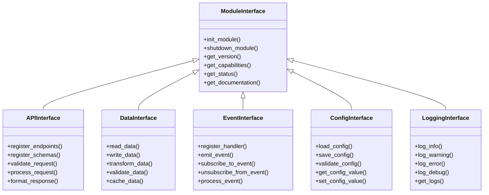

## Cross-Module Data Flow

Data flows between modules in standard patterns:

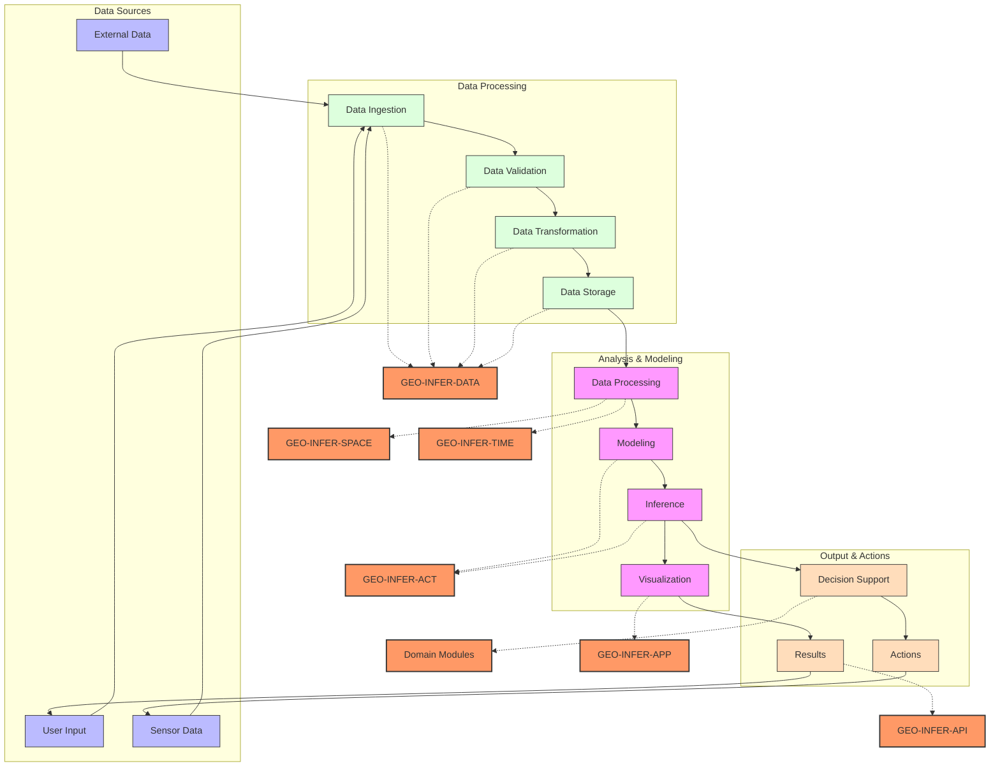

## Module Dependency Rules

To maintain maintainable architecture, the GEO-INFER framework follows specific dependency rules:

1. **Core-Outward Dependency**: Modules can depend only on more core modules, not on modules at the same level or higher
2. **Interface-Based Integration**: Modules interact through defined interfaces, not direct implementation calls
3. **Event-Based Communication**: Asynchronous interactions should use the event system
4. **Explicit Dependencies**: All dependencies must be explicitly declared in the module manifest
5. **Versioned Interfaces**: Module interfaces follow semantic versioning to manage compatibility

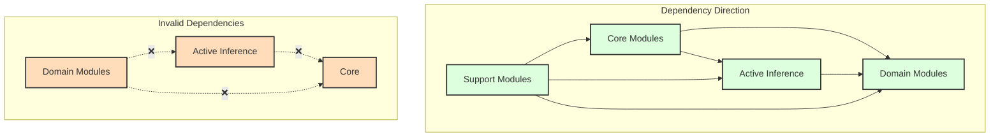

## Module Extension Mechanisms

GEO-INFER provides mechanisms for extending the functionality of modules:

```mermaid
graph TD
    subgraph "Extension Points"
        PLUGIN[Plugin System]
        HOOKS[Hook Points]
        PROVIDERS[Service Providers]
        EXTEND[Class Extensions]
    end
    
    PLUGIN --> PLUGIN_DISC[Plugin Discovery]
    PLUGIN --> PLUGIN_REG[Plugin Registration]
    PLUGIN --> PLUGIN_CONF[Plugin Configuration]
    PLUGIN --> PLUGIN_LIFE[Plugin Lifecycle]
    
    HOOKS --> HOOKS_PRE[Pre-Operation Hooks]
    HOOKS --> HOOKS_POST[Post-Operation Hooks]
    HOOKS --> HOOKS_ERR[Error Handling Hooks]
    
    PROVIDERS --> PROV_REG[Provider Registration]
    PROVIDERS --> PROV_INJECT[Dependency Injection]
    PROVIDERS --> PROV_OVER[Service Overrides]
    
    EXTEND --> EXT_INHE[Inheritance]
    EXTEND --> EXT_DECO[Decorators]
    EXTEND --> EXT_ASPECT[Aspect-Oriented Extensions]
    
    classDef main fill:#f96,stroke:#333,stroke-width:2px
    classDef detail fill:#bbf,stroke:#333,stroke-width:1px
    
    class PLUGIN,HOOKS,PROVIDERS,EXTEND main
    class PLUGIN_DISC,PLUGIN_REG,PLUGIN_CONF,PLUGIN_LIFE,HOOKS_PRE,HOOKS_POST,HOOKS_ERR,PROV_REG,PROV_INJECT,PROV_OVER,EXT_INHE,EXT_DECO,EXT_ASPECT detail
```

## Module Deployment Patterns

GEO-INFER modules can be deployed in various configurations:

```mermaid
graph TD
    subgraph "Deployment Patterns"
        MONO[Monolithic]
        MICRO[Microservices]
        HYBRID[Hybrid]
        EDGE[Edge Computing]
    end
    
    MONO --> MONO_PACK[Single Package]
    MONO --> MONO_PROC[Single Process]
    MONO --> MONO_DB[Shared Database]
    
    MICRO --> MICRO_SVC[Service per Module]
    MICRO --> MICRO_DB[Database per Service]
    MICRO --> MICRO_API[API Gateway]
    
    HYBRID --> HYBRID_CORE[Core Services]
    HYBRID --> HYBRID_DOMAIN[Domain Microservices]
    HYBRID --> HYBRID_COMM[Shared Communication]
    
    EDGE --> EDGE_CORE[Core in Cloud]
    EDGE --> EDGE_AGENTS[Edge Agents]
    EDGE --> EDGE_SYNC[Synchronization]
    
    classDef pattern fill:#f96,stroke:#333,stroke-width:2px
    classDef detail fill:#bbf,stroke:#333,stroke-width:1px
    
    class MONO,MICRO,HYBRID,EDGE pattern
    class MONO_PACK,MONO_PROC,MONO_DB,MICRO_SVC,MICRO_DB,MICRO_API,HYBRID_CORE,HYBRID_DOMAIN,HYBRID_COMM,EDGE_CORE,EDGE_AGENTS,EDGE_SYNC detail
```

## Module Versioning and Compatibility

The GEO-INFER framework uses semantic versioning to manage module compatibility:

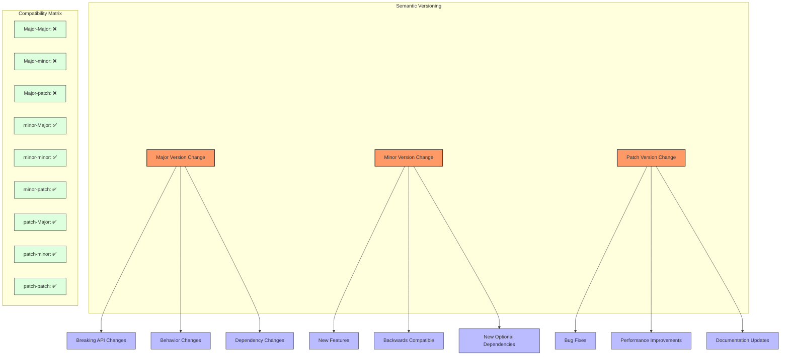