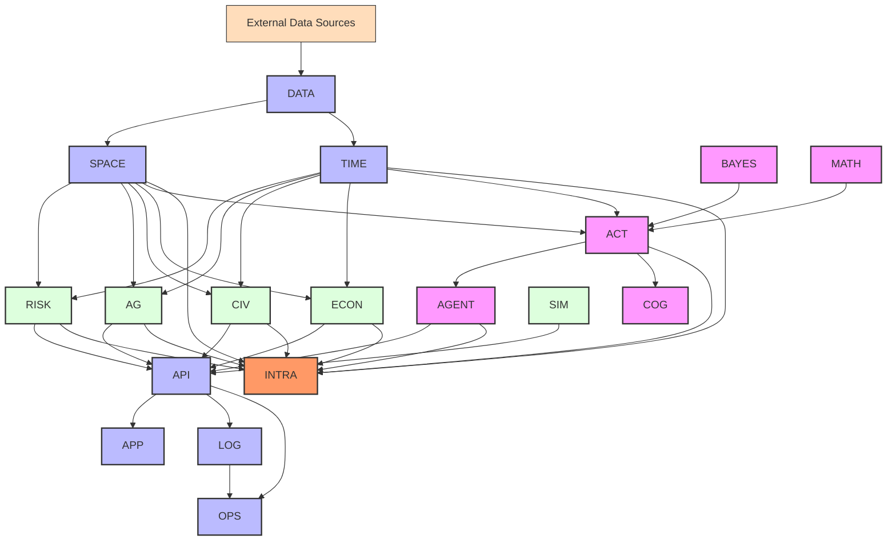
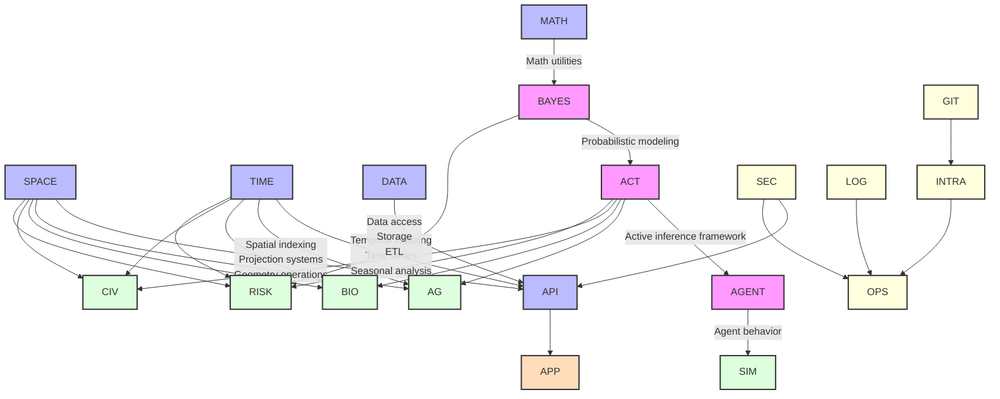
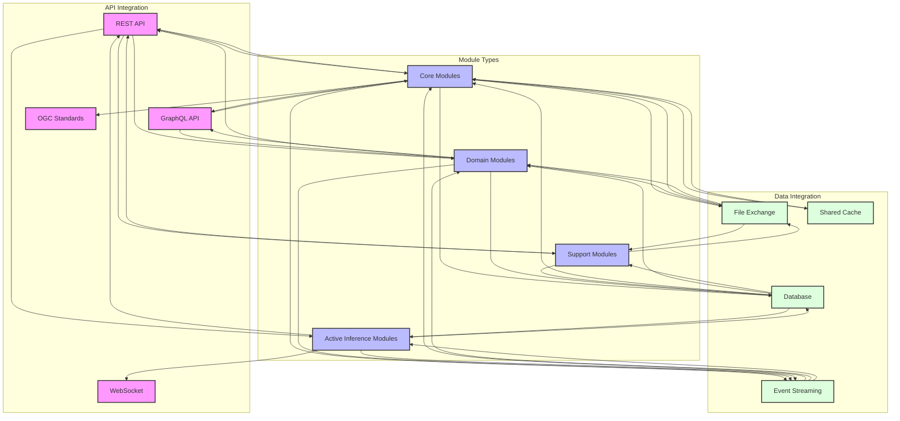
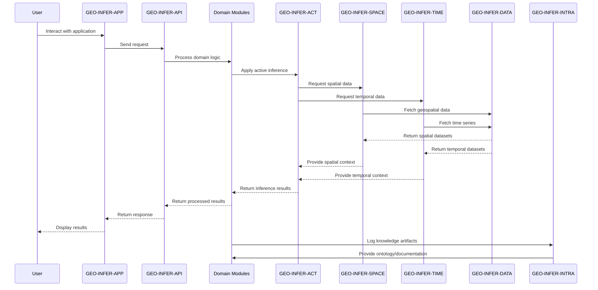
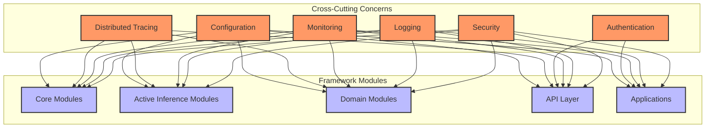
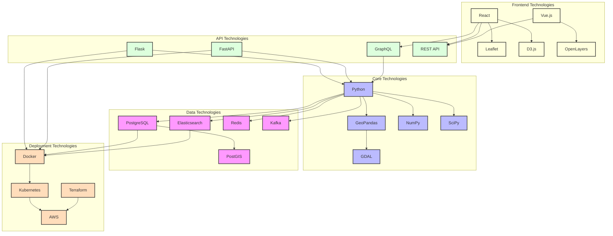

# GEO-INFER System Integration Architecture

This document provides a comprehensive view of how all GEO-INFER modules integrate and interact with each other within the overall framework architecture.

## Framework Integration Overview

The following diagram shows how all major modules in the GEO-INFER framework interconnect:

```mermaid
graph TD
    %% Core Infrastructure Modules
    SPACE[GEO-INFER-SPACE]
    TIME[GEO-INFER-TIME]
    DATA[GEO-INFER-DATA]
    API[GEO-INFER-API]
    APP[GEO-INFER-APP]
    OPS[GEO-INFER-OPS]
    INTRA[GEO-INFER-INTRA]
    GIT[GEO-INFER-GIT]
    
    %% Active Inference Implementation
    ACT[GEO-INFER-ACT]
    AGENT[GEO-INFER-AGENT]
    COG[GEO-INFER-COG]
    BAYES[GEO-INFER-BAYES]
    MATH[GEO-INFER-MATH]
    
    %% Domain-Specific Modules
    AG[GEO-INFER-AG]
    BIO[GEO-INFER-BIO]
    CIV[GEO-INFER-CIV]
    ECON[GEO-INFER-ECON]
    RISK[GEO-INFER-RISK]
    SIM[GEO-INFER-SIM]
    
    %% Support & Integration Modules
    SEC[GEO-INFER-SEC]
    LOG[GEO-INFER-LOG]
    REQ[GEO-INFER-REQ]
    PEP[GEO-INFER-PEP]
    ORG[GEO-INFER-ORG]
    COMMS[GEO-INFER-COMMS]
    
    %% Core Layer Connections
    SPACE <--> TIME
    SPACE <--> DATA
    TIME <--> DATA
    DATA <--> API
    INTRA <--> API
    API <--> APP
    API <--> OPS
    INTRA <--> GIT
    
    %% Active Inference Layer Integration
    ACT <--> AGENT
    ACT <--> COG
    ACT <--> BAYES
    ACT <--> MATH
    
    %% Domain Integration with Core
    AG --> SPACE
    AG --> TIME
    AG --> DATA
    
    BIO --> SPACE
    BIO --> TIME
    BIO --> DATA
    
    CIV --> SPACE
    CIV --> TIME
    CIV --> DATA
    
    ECON --> SPACE
    ECON --> TIME
    ECON --> DATA
    
    RISK --> SPACE
    RISK --> TIME
    RISK --> DATA
    
    SIM --> SPACE
    SIM --> TIME
    SIM --> DATA
    
    %% Active Inference and Domain Integration
    AG --> ACT
    BIO --> ACT
    CIV --> ACT
    ECON --> ACT
    RISK --> ACT
    SIM --> ACT
    
    %% Support Modules Integration
    SEC --> API
    SEC --> OPS
    LOG --> OPS
    LOG --> DATA
    REQ --> INTRA
    PEP --> INTRA
    ORG --> INTRA
    COMMS --> API
    
    %% INTRA at the center
    SPACE --> INTRA
    TIME --> INTRA
    DATA --> INTRA
    ACT --> INTRA
    AGENT --> INTRA
    COG --> INTRA
    BAYES --> INTRA
    MATH --> INTRA
    SEC --> INTRA
    
    %% Styling
    classDef core fill:#bbf,stroke:#333,stroke-width:2px
    classDef activeInf fill:#f9f,stroke:#333,stroke-width:2px
    classDef domain fill:#dfd,stroke:#333,stroke-width:2px
    classDef support fill:#ffd,stroke:#333,stroke-width:2px
    classDef central fill:#f96,stroke:#333,stroke-width:3px
    
    class SPACE,TIME,DATA,API,APP,OPS,GIT core
    class ACT,AGENT,COG,BAYES,MATH activeInf
    class AG,BIO,CIV,ECON,RISK,SIM domain
    class SEC,LOG,REQ,PEP,ORG,COMMS support
    class INTRA central
```



## Data Flow Between Modules

The following diagram shows how data flows between the various modules in the GEO-INFER framework:



## Layer Architecture

The GEO-INFER framework is organized into distinct layers, each with its own responsibilities:

```mermaid
graph BT
    %% Layers
    subgraph "Application Layer"
        APP[GEO-INFER-APP]
        UI[User Interfaces]
        VIZ[Visualization]
    end
    
    subgraph "Service Layer"
        API[GEO-INFER-API]
        SVC[Services]
        OPS[GEO-INFER-OPS]
    end
    
    subgraph "Domain Layer"
        AG[GEO-INFER-AG]
        BIO[GEO-INFER-BIO]
        CIV[GEO-INFER-CIV]
        ECON[GEO-INFER-ECON]
        RISK[GEO-INFER-RISK]
        SIM[GEO-INFER-SIM]
    end
    
    subgraph "Active Inference Layer"
        ACT[GEO-INFER-ACT]
        AGENT[GEO-INFER-AGENT]
        COG[GEO-INFER-COG]
        BAYES[GEO-INFER-BAYES]
        MATH[GEO-INFER-MATH]
    end
    
    subgraph "Core Layer"
        SPACE[GEO-INFER-SPACE]
        TIME[GEO-INFER-TIME]
        DATA[GEO-INFER-DATA]
    end
    
    subgraph "Integration Layer"
        INTRA[GEO-INFER-INTRA]
        COMMS[GEO-INFER-COMMS]
        GIT[GEO-INFER-GIT]
    end
    
    %% Layer Connections
    Core Layer --> Active Inference Layer
    Core Layer --> Domain Layer
    Active Inference Layer --> Domain Layer
    Domain Layer --> Service Layer
    Service Layer --> Application Layer
    Integration Layer --> Core Layer
    Integration Layer --> Active Inference Layer
    Integration Layer --> Domain Layer
    Integration Layer --> Service Layer
    
    %% Styling
    classDef app fill:#fdb,stroke:#333,stroke-width:2px
    classDef service fill:#dfd,stroke:#333,stroke-width:2px
    classDef domain fill:#f9f,stroke:#333,stroke-width:2px
    classDef active fill:#bbf,stroke:#333,stroke-width:2px
    classDef core fill:#f96,stroke:#333,stroke-width:2px
    classDef integration fill:#ffd,stroke:#333,stroke-width:2px
    
    class APP,UI,VIZ app
    class API,SVC,OPS service
    class AG,BIO,CIV,ECON,RISK,SIM domain
    class ACT,AGENT,COG,BAYES,MATH active
    class SPACE,TIME,DATA core
    class INTRA,COMMS,GIT integration
```

## Module Dependencies

The following diagram shows the dependencies between the major modules:



## Integration Patterns

The GEO-INFER framework uses several integration patterns to connect modules:



## Module Communication Flow

This diagram illustrates how the different modules communicate with each other:



## Cross-Cutting Concerns

The following diagram shows how cross-cutting concerns are managed across the framework:



## Implementation View

This diagram provides an implementation view of the GEO-INFER framework, showing the technologies used in different layers:



## Key Integration Points

This section details the key integration points between modules:

1. **Data Flow Integration**: GEO-INFER-DATA provides standardized data access methods to all modules
2. **Spatial Processing**: GEO-INFER-SPACE provides spatial indexing and operations to domain modules
3. **Active Inference Integration**: GEO-INFER-ACT connects theoretical frameworks to practical applications
4. **API Gateway**: GEO-INFER-API provides a unified interface for all services
5. **Knowledge Integration**: GEO-INFER-INTRA connects knowledge, documentation and workflows across all modules
6. **Operational Integration**: GEO-INFER-OPS provides monitoring, deployment, and operational support

## Integration Challenges and Solutions

| Challenge | Solution |
|-----------|----------|
| Version compatibility | Semantic versioning and compatibility matrices |
| Data format standardization | Common exchange formats and conversion utilities |
| API consistency | API documentation standards and contract testing |
| Performance bottlenecks | Caching strategies and asynchronous processing |
| Cross-module dependencies | Clear dependency management and interface contracts |
| Integration testing | Automated integration test suites and CI/CD pipeline | 