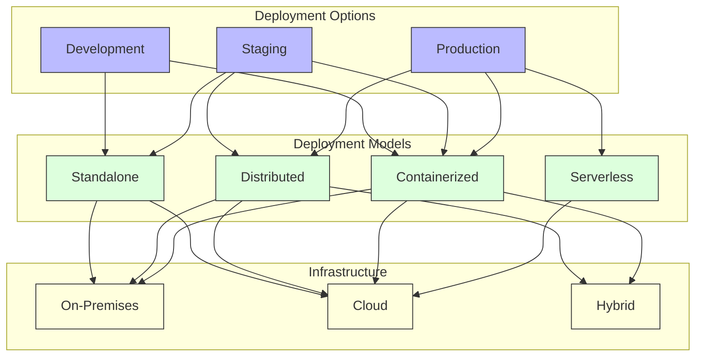
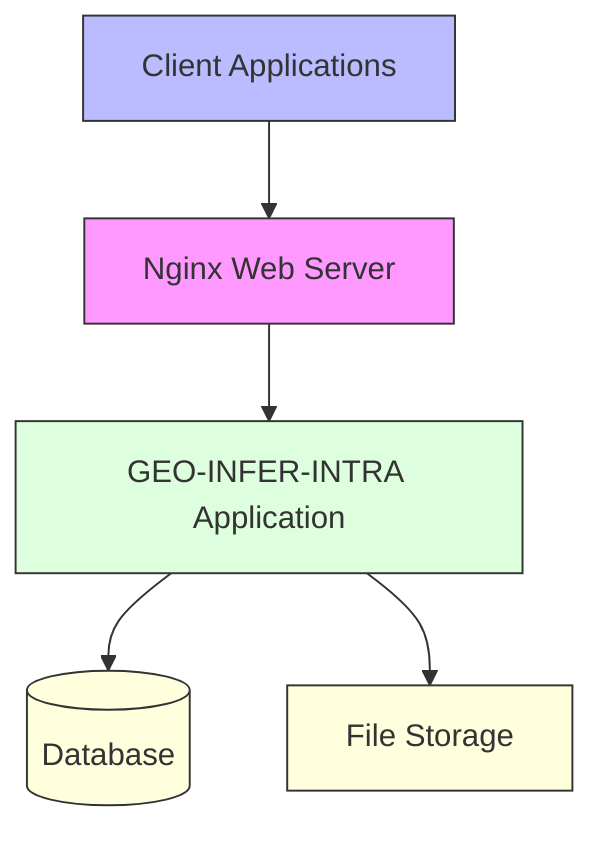
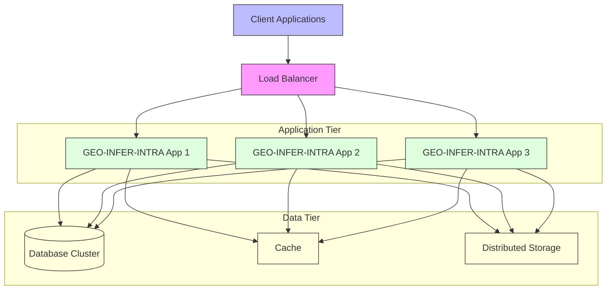
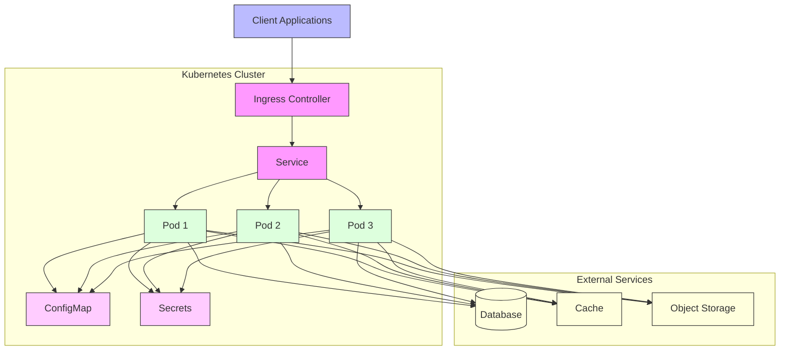
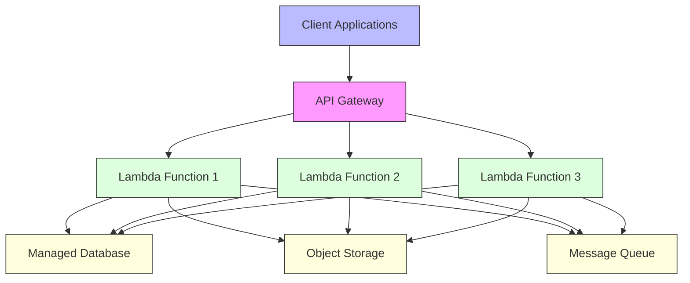
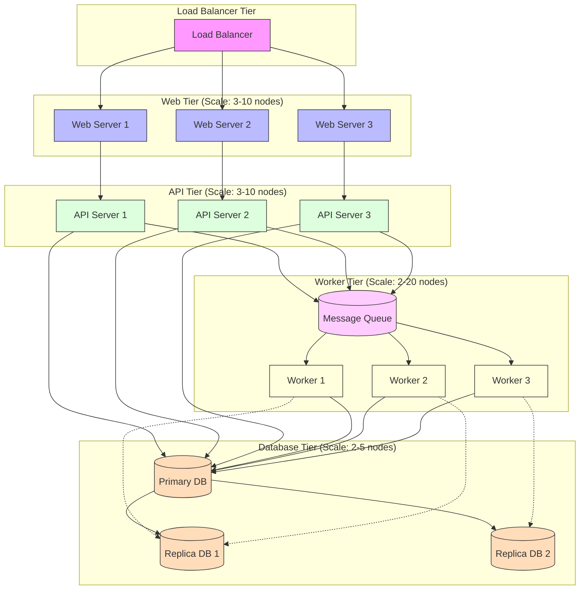

# Deployment Guide

This guide provides comprehensive information about deploying GEO-INFER-INTRA in various environments, from development workstations to production cloud infrastructure.

## Contents

- [Deployment Overview](#deployment-overview)
- [Deployment Architectures](#deployment-architectures)
- [Prerequisites](#prerequisites)
- [Environment Setup](#environment-setup)
- [Installation Methods](#installation-methods)
- [Configuration](#configuration)
- [Security Considerations](#security-considerations)
- [Scaling Strategies](#scaling-strategies)
- [Monitoring and Maintenance](#monitoring-and-maintenance)
- [Troubleshooting](#troubleshooting)

## Deployment Overview

GEO-INFER-INTRA can be deployed in various configurations depending on your requirements. This section provides an overview of deployment options and considerations.



## Deployment Architectures

GEO-INFER-INTRA supports multiple deployment architectures to accommodate different scale and performance requirements.

### Standalone Deployment

Suitable for development, testing, and small-scale production environments.



### Distributed Deployment

Suitable for medium to large-scale production environments requiring high availability and scalability.



### Containerized Deployment

Suitable for cloud-native environments leveraging container orchestration platforms like Kubernetes.



### Serverless Deployment

Suitable for highly scalable, event-driven scenarios with variable workloads.



## Prerequisites

### System Requirements

#### Minimum Requirements

- CPU: 2 cores
- RAM: 4 GB
- Disk: 20 GB
- Operating System: Ubuntu 18.04/20.04, CentOS 7/8, or equivalent

#### Recommended Requirements

- CPU: 4+ cores
- RAM: 8+ GB
- Disk: 50+ GB SSD
- Operating System: Ubuntu 20.04, CentOS 8, or equivalent

### Software Dependencies

- Python 3.8+
- PostgreSQL 12+
- Redis 6+
- Node.js 14+ (for UI components)
- Docker 19+ (for containerized deployment)
- Kubernetes 1.19+ (for orchestrated deployment)

## Environment Setup

### Operating System Configuration

#### Linux (Ubuntu 20.04)

```bash
# Update system packages
sudo apt update && sudo apt upgrade -y

# Install system dependencies
sudo apt install -y build-essential libpq-dev python3-dev python3-pip \
  python3-venv git curl wget nginx redis-server

# Set up firewall
sudo ufw allow ssh
sudo ufw allow http
sudo ufw allow https
sudo ufw enable
```

#### PostgreSQL Installation

```bash
# Install PostgreSQL
sudo apt install -y postgresql postgresql-contrib

# Start PostgreSQL service
sudo systemctl start postgresql
sudo systemctl enable postgresql

# Create database and user
sudo -u postgres psql -c "CREATE USER geo_infer WITH PASSWORD 'secure_password';"
sudo -u postgres psql -c "CREATE DATABASE geo_infer_intra;"
sudo -u postgres psql -c "GRANT ALL PRIVILEGES ON DATABASE geo_infer_intra TO geo_infer;"
```

## Installation Methods

### Method 1: Native Installation

```bash
# Clone the repository
git clone https://github.com/geo-infer/geo-infer-intra.git
cd geo-infer-intra

# Create and activate virtual environment
python3 -m venv venv
source venv/bin/activate

# Install dependencies
pip install -r requirements.txt

# Install the package
pip install -e .

# Initialize the database
geo-infer-intra db init
geo-infer-intra db migrate
geo-infer-intra db upgrade

# Start the application
geo-infer-intra start
```

### Method 2: Docker Installation

```bash
# Clone the repository
git clone https://github.com/geo-infer/geo-infer-intra.git
cd geo-infer-intra

# Build and start containers
docker-compose up -d
```

### Method 3: Kubernetes Deployment

```bash
# Clone the repository
git clone https://github.com/geo-infer/geo-infer-intra.git
cd geo-infer-intra/kubernetes

# Apply Kubernetes manifests
kubectl apply -f namespace.yaml
kubectl apply -f configmap.yaml
kubectl apply -f secrets.yaml
kubectl apply -f postgres.yaml
kubectl apply -f redis.yaml
kubectl apply -f geo-infer-intra.yaml
kubectl apply -f ingress.yaml
```

## Configuration

GEO-INFER-INTRA uses a hierarchical configuration system with multiple sources:

1. Default configuration
2. Configuration file
3. Environment variables
4. Command-line arguments

### Configuration File

The main configuration file is located at `config/config.yaml`:

```yaml
# Application configuration
app:
  name: GEO-INFER-INTRA
  environment: production
  debug: false
  secret_key: change_this_to_a_secure_random_value
  log_level: INFO

# Server configuration
server:
  host: 0.0.0.0
  port: 5000
  workers: 4

# Database configuration
database:
  type: postgresql
  host: localhost
  port: 5432
  name: geo_infer_intra
  user: geo_infer
  password: secure_password
  pool_size: 10

# Cache configuration
cache:
  type: redis
  host: localhost
  port: 6379
  db: 0
  ttl: 3600

# Storage configuration
storage:
  type: file
  path: /var/lib/geo-infer-intra/data
  
# Authentication configuration
auth:
  enabled: true
  jwt_secret: change_this_to_a_secure_random_value
  jwt_expiration: 86400  # 24 hours
  session_expiration: 604800  # 7 days
```

### Environment Variables

Configuration can also be set using environment variables:

```bash
export GEO_INFER_APP_ENVIRONMENT=production
export GEO_INFER_SERVER_PORT=5000
export GEO_INFER_DATABASE_HOST=localhost
export GEO_INFER_DATABASE_PASSWORD=secure_password
```

### Sensitive Configuration

For sensitive configuration (like passwords and API keys), use environment variables or a secrets management system:

```bash
# For native deployment
export GEO_INFER_DATABASE_PASSWORD=secure_password
export GEO_INFER_AUTH_JWT_SECRET=secure_random_value

# For Kubernetes deployment
kubectl create secret generic geo-infer-secrets \
  --from-literal=database-password=secure_password \
  --from-literal=jwt-secret=secure_random_value
```

## Security Considerations

### Authentication and Authorization

GEO-INFER-INTRA uses a multi-layered authentication and authorization system:

1. JWT token-based authentication for API access
2. Role-based access control (RBAC) for permissions
3. API key authentication for service-to-service communication

### Data Protection

To protect sensitive data:

1. Use TLS/SSL for all public-facing services
2. Encrypt sensitive data at rest
3. Implement proper access controls
4. Regularly back up data
5. Implement audit logging

### Network Security

Secure your network with:

1. Firewalls to restrict access
2. VPNs for remote administration
3. Intrusion detection systems
4. DDoS protection

### Secure Configuration

Security-related configuration:

```yaml
security:
  # Enable CORS protection
  cors:
    enabled: true
    allowed_origins: ["https://example.com"]
    allowed_methods: ["GET", "POST", "PUT", "DELETE"]
    
  # CSRF protection
  csrf:
    enabled: true
    
  # Content Security Policy
  csp:
    enabled: true
    
  # Rate limiting
  rate_limiting:
    enabled: true
    requests_per_minute: 60
```

## Scaling Strategies

### Vertical Scaling

Increase resources on existing servers:

- Upgrade CPU, memory, and disk
- Optimize database queries and indexes
- Implement caching
- Reduce unnecessary processing

### Horizontal Scaling

Add more servers to distribute load:

- Use load balancing to distribute requests
- Implement stateless application design
- Use distributed caching
- Use database replication or sharding

### Component-Level Scaling

Scale individual components based on their requirements:



## Monitoring and Maintenance

### Health Checking

Implement health checks for all components:

```bash
# Example health check endpoint
curl -I http://geo-infer-intra.example.com/api/health
```

Health check response should include:

- Overall system status
- Component-level status (database, cache, etc.)
- Resource utilization metrics

### Logging

Configure comprehensive logging:

```yaml
logging:
  level: INFO
  format: json
  output:
    console: true
    file:
      enabled: true
      path: /var/log/geo-infer-intra
    syslog:
      enabled: false
    elasticsearch:
      enabled: false
```

### Metrics and Monitoring

Implement metrics collection and monitoring:

1. Application metrics (requests, errors, latency)
2. System metrics (CPU, memory, disk)
3. Database metrics (queries, connections, latency)
4. Custom business metrics

Recommended monitoring stack:

- Prometheus for metrics collection
- Grafana for visualization
- Alertmanager for alerting

### Backup and Recovery

Implement regular backups:

```bash
# Example database backup script
#!/bin/bash
DATE=$(date +%Y-%m-%d_%H-%M-%S)
pg_dump -U geo_infer -d geo_infer_intra -f /backups/geo_infer_intra_$DATE.sql

# Compress the backup
gzip /backups/geo_infer_intra_$DATE.sql

# Upload to cloud storage
aws s3 cp /backups/geo_infer_intra_$DATE.sql.gz s3://geo-infer-backups/
```

Backup strategy:

- Daily full backups
- Hourly incremental backups
- Replicate backups to multiple locations
- Regularly test restoration process

## Troubleshooting

### Common Issues and Solutions

#### Application Won't Start

Check:
- Log files for errors
- Database connection
- Configuration file syntax
- Required services (database, cache)
- Permissions on files and directories

#### Performance Issues

Check:
- Database query performance
- Cache hit rate
- Application logs for slow operations
- System resources (CPU, memory, disk)
- Network latency

#### Authentication Issues

Check:
- JWT token configuration
- Database connection for user storage
- Authentication service logs
- Network connectivity to authentication services

### Diagnostic Tools

```bash
# Check system resources
htop
df -h
free -m

# Check network connectivity
ping database.example.com
telnet database.example.com 5432
traceroute api.example.com

# Check logs
tail -f /var/log/geo-infer-intra/application.log

# Check database
psql -U geo_infer -d geo_infer_intra -c "SELECT version();"
```

## Related Resources

- [System Architecture](../architecture/index.md)
- [Integration Guide](../integration/index.md)
- [API Documentation](../api/index.md)
- [Development Guide](../development/index.md)
- [Operations Guide](../operations/index.md) 