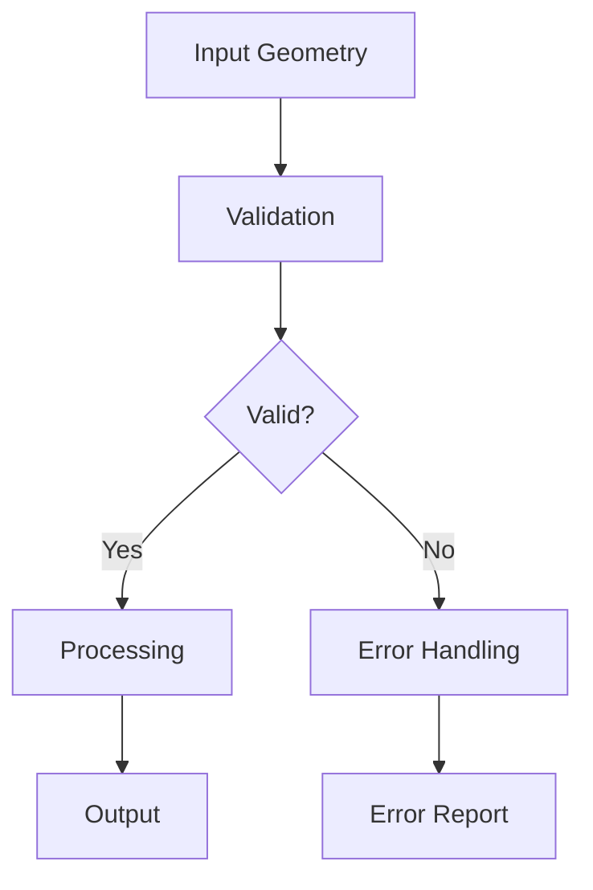

# GEO-INFER Documentation Guide

This guide provides standards and best practices for creating and maintaining documentation across all GEO-INFER modules.

## Documentation Types

The GEO-INFER framework includes several types of documentation:

1. **Code Documentation**: Docstrings, comments, and type hints within the code
2. **API Documentation**: Generated reference documentation for classes, methods, and functions
3. **User Guides**: Conceptual explanations and tutorials
4. **Examples**: Runnable code examples and Jupyter notebooks
5. **Architecture Documentation**: System design, data flow, and component relationships
6. **Geospatial Visualization**: Maps, spatial diagrams, and visual representations of geospatial concepts

## Documentation Standards

### General Principles

- **Completeness**: Document all public APIs, classes, functions, and methods
- **Clarity**: Use clear, concise language and avoid jargon when possible
- **Consistency**: Follow the same format and style across all modules
- **Contextualization**: Explain not just how, but why and when to use features
- **Currency**: Keep documentation up-to-date with code changes

### Code Documentation

#### Python Docstrings

Use Google-style docstrings for all Python code:

```python
def function_name(param1: Type1, param2: Type2 = default_value) -> ReturnType:
    """Short, imperative description of function.
    
    More detailed explanation if needed. Explain any complex algorithms,
    design decisions, or contextual information that helps understand
    the function's purpose.
    
    Args:
        param1: Description of first parameter
        param2: Description of second parameter, including default behavior
            if applicable. For long descriptions, indent continuation lines.
    
    Returns:
        Description of the return value and its type
    
    Raises:
        ExceptionType: When and why this exception is raised
    
    Examples:
        ```python
        result = function_name('value1', 'value2')
        ```
    """
    # Implementation
```

#### Geospatial-Specific Documentation

For functions that process geospatial data, include:

1. **Coordinate System Information**:
   ```python
   def spatial_function(geom: Geometry, crs: str = "EPSG:4326") -> Geometry:
       """Process the geometry.
       
       Args:
           geom: The input geometry
           crs: Coordinate reference system of the input geometry
               (default: EPSG:4326, WGS84 geographic coordinates)
       
       Returns:
           Processed geometry in the same CRS as input
       """
   ```

2. **Spatial Complexity**:
   ```python
   def spatial_index_query(points: List[Point], bbox: BoundingBox) -> List[Point]:
       """Find all points within the bounding box.
       
       This function uses an R-tree spatial index for efficient querying.
       Time complexity: O(log n + k) where n is total number of points
       and k is number of returned points.
       
       Args:
           points: List of Point objects
           bbox: Bounding box for the query
       
       Returns:
           Points that fall within the bounding box
       """
   ```

3. **Edge Cases**:
   ```python
   def calculate_distance(point1: Point, point2: Point) -> float:
       """Calculate the geodesic distance between two points.
       
       Uses Vincenty's formula for calculating distances on an ellipsoid.
       
       Note:
           This function handles the antimeridian (International Date Line)
           correctly. For points near the poles (above 89.5 degrees latitude),
           a specialized polar coordinate approach is used.
       
       Args:
           point1: First point as (latitude, longitude)
           point2: Second point as (latitude, longitude)
       
       Returns:
           Distance in meters
       """
   ```

### Module-Level Documentation

Each module should include a top-level docstring:

```python
"""GEO-INFER-SPACE: Advanced spatial methods for the GEO-INFER framework.

This module provides tools for working with spatial data, including:
- Spatial indexing with H3, QuadTree, and R-Tree
- Vector and raster data processing
- Geospatial analysis and metrics
- Spatial visualization tools

The module integrates with GEO-INFER-DATA for data access and GEO-INFER-TIME
for temporal analysis of spatial data.

Examples:
    Basic spatial indexing:
    ```python
    from geo_infer_space import indexing
    
    # Create H3 index
    h3_index = indexing.create_h3_index(latitude, longitude, resolution=9)
    ```
"""
```

### README Files

All module README files should follow the template in `GEO-INFER-INTRA/docs/module_readme_template.md`. Key sections include:

1. **Module Overview**: Concise description of the module's purpose
2. **Key Features**: Bulleted list of major capabilities
3. **Installation**: Step-by-step installation instructions
4. **Usage Examples**: Code snippets showing common use cases
5. **Architecture**: Diagram and explanation of module components
6. **API Reference**: Summary of key classes and functions
7. **Integration**: How this module works with other GEO-INFER modules
8. **Use Cases**: Real-world applications of the module
9. **Tutorials**: Links to example notebooks

### Diagrams

Use Mermaid diagrams for architectural and workflow documentation. Include these directly in Markdown files:

```markdown
## Data Flow


```

For geospatial concepts, include appropriate maps and visualizations generated with tools like:
- GeoPandas/Matplotlib
- Folium/Leaflet
- Plotly
- deck.gl

### Examples and Tutorials

1. **Basic Examples**: Short, focused examples for specific functionality
2. **Tutorials**: Step-by-step guides for more complex workflows
3. **Integration Examples**: Notebooks showing how to combine multiple modules

Jupyter notebooks should:
- Include clear markdown explanations
- Show expected outputs, including visualizations
- Provide complete, runnable code
- Include metadata about dependencies and environment
- Be structured in a logical progression

## Geospatial Documentation Best Practices

### Coordinate Systems

- Always specify the coordinate reference system (CRS) in documentation
- Use "latitude, longitude" ordering in parameter descriptions
- Specify units (degrees, meters, etc.) for all spatial measurements
- Document how projections may affect analyses

### Spatial Data

- Document expected formats (GeoJSON, Shapefile, GeoPackage, etc.)
- Specify topology requirements (e.g., valid polygons without self-intersections)
- Include resolution information for raster data
- Document memory requirements for large datasets

### Visualization

- Include maps for spatial algorithms when possible
- Use consistent styling for visualization examples
- Document scale, orientation, and projection in maps
- Consider color-blindness accessibility in visualizations

## Documentation Process

### Creating New Documentation

1. Start with the appropriate template from `GEO-INFER-INTRA/docs/templates/`
2. Follow the format and structure of existing documentation
3. Include code examples that are tested and verified
4. Add diagrams for complex concepts
5. Cross-reference related documentation

### Updating Documentation

1. Review documentation during code changes
2. Update examples to reflect API changes
3. Add new sections for new functionality
4. Mark deprecated features clearly
5. Update version numbers and compatibility information

### Documentation Review Checklist

- [ ] All public APIs are documented
- [ ] Examples are complete and work as shown
- [ ] Diagrams accurately represent the system
- [ ] Geospatial concepts are clearly explained
- [ ] Code samples follow project style guidelines
- [ ] Correct cross-references to other modules
- [ ] Documentation builds without errors
- [ ] Spell-check completed

## Tools and Resources

### Documentation Generation

- [Sphinx](https://www.sphinx-doc.org/) for generating API documentation
- [sphinx-autodoc](https://www.sphinx-doc.org/en/master/usage/extensions/autodoc.html) for extracting docstrings
- [myst-parser](https://myst-parser.readthedocs.io/) for Markdown support
- [sphinx-mermaid](https://github.com/mgaitan/sphinxcontrib-mermaid) for Mermaid diagrams

### Geospatial Resources

- [OGC Standards](https://www.ogc.org/standards/)
- [EPSG Registry](https://epsg.org/home.html) for coordinate reference systems
- [STAC Specification](https://stacspec.org/) for Earth observation data
- [GeoJSON Specification](https://geojson.org/)

### Writing Resources

- [Google Style Guide](https://google.github.io/styleguide/pyguide.html) for Python docstrings
- [Write the Docs](https://www.writethedocs.org/guide/) for general documentation guidance
- [Geospatial Data Visualization Best Practices](https://www.esri.com/arcgis-blog/products/arcgis-pro/mapping/mapping-and-visualization/)

## Integration with GEO-INFER Framework

The documentation system integrates with the broader GEO-INFER framework:

- **GEO-INFER-INTRA**: Central storage for documentation templates and guides
- **CI/CD Pipeline**: Automatic documentation building and testing
- **Version Control**: Documentation versioned alongside code
- **Cross-Referencing**: Inter-module documentation linking

## License and Attribution

All documentation is licensed under Creative Commons Attribution-NonCommercial-ShareAlike 4.0 International License.

When including external maps, data visualizations, or diagrams, provide proper attribution to the original sources. 