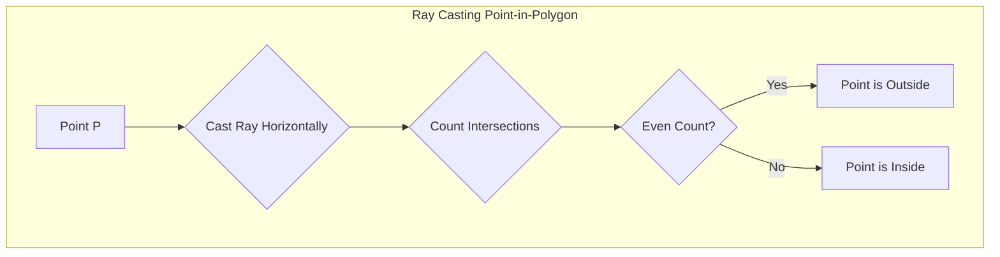
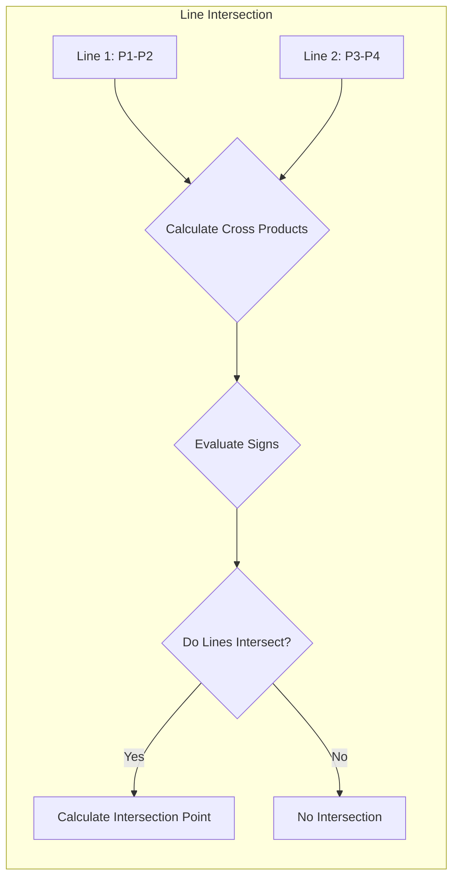
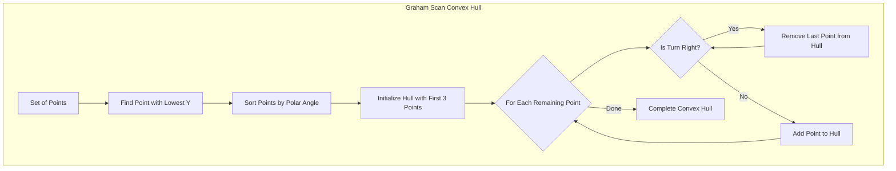
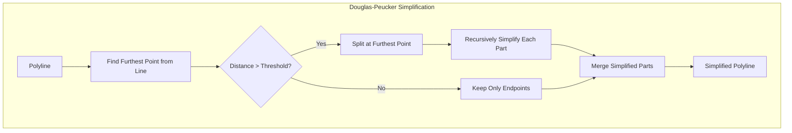
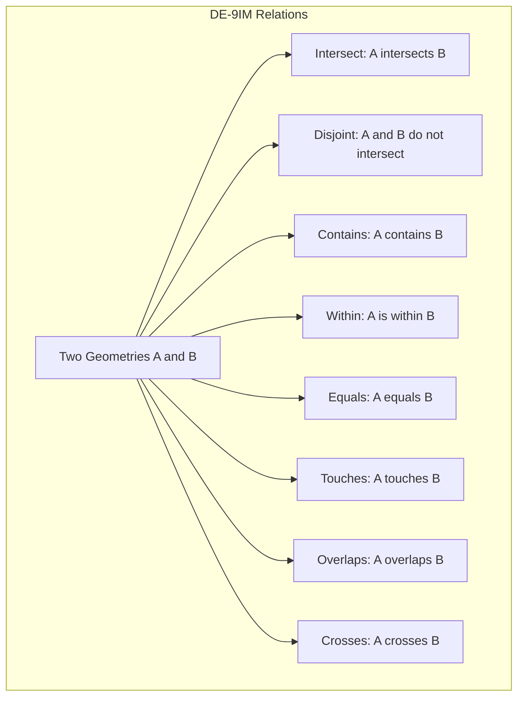
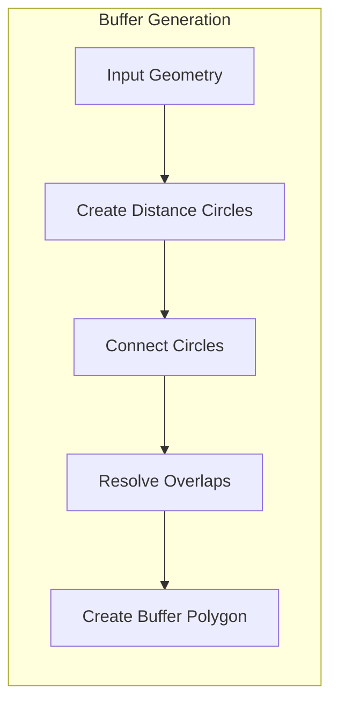
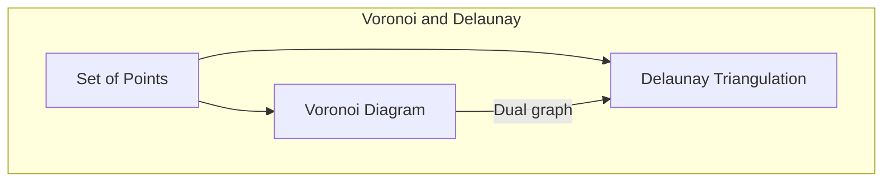

# Geometric Algorithms

This document provides information about fundamental computational geometry algorithms used in geospatial analysis, their implementation, and applications within the GEO-INFER framework.

## Overview

Geometric algorithms form the foundation of many geospatial operations, enabling the manipulation, analysis, and transformation of spatial data. These algorithms operate on basic geometric primitives such as points, lines, and polygons to perform operations like intersection detection, containment tests, and distance calculations.

## Core Geometric Primitives

The basic building blocks for geometric algorithms:

- **Point**: A zero-dimensional location defined by coordinates (x, y) or (x, y, z)
- **Line Segment**: A one-dimensional object connecting two points
- **Polyline**: A sequence of connected line segments
- **Polygon**: A closed shape bounded by straight line segments
- **Rectangle**: A special type of polygon with four sides and right angles
- **Circle**: A set of points equidistant from a center point

## Fundamental Algorithms

### Point-in-Polygon Testing

Determining whether a point lies inside, outside, or on the boundary of a polygon.

#### Ray Casting Algorithm



**Implementation Considerations:**
- Handle edge cases where point lies exactly on a boundary
- Consider numerical precision issues near vertices
- Optimize for polygons with many vertices using spatial indexing

### Line Intersection

Determining if and where two line segments intersect.



**Implementation Considerations:**
- Handle collinear and parallel lines
- Account for line segments that only touch at endpoints
- Consider numerical stability for nearly-parallel lines

### Convex Hull

Finding the smallest convex polygon that contains all points in a set.

#### Graham Scan Algorithm



**Algorithm Complexity:**
- Time: O(n log n) where n is the number of points
- Space: O(n) for storing the convex hull

### Polygon Operations

#### Polygon Simplification (Douglas-Peucker Algorithm)

Reducing the number of points in a polygon while preserving its shape.



**Implementation Considerations:**
- Choice of distance threshold affects simplification level
- Preserve topological integrity (avoid self-intersections)
- Consider specialized variants for different data types

#### Polygon Area and Centroid

Calculating the area and center of mass of a polygon.

**Area Formula:**
For a polygon with vertices (x₁, y₁), (x₂, y₂), ..., (xₙ, yₙ):

Area = 0.5 * |∑(i=1 to n) (xᵢyᵢ₊₁ - xᵢ₊₁yᵢ)|

**Centroid Formula:**
Cx = (1/6A) * ∑(i=1 to n) (xᵢ + xᵢ₊₁)(xᵢyᵢ₊₁ - xᵢ₊₁yᵢ)
Cy = (1/6A) * ∑(i=1 to n) (yᵢ + yᵢ₊₁)(xᵢyᵢ₊₁ - xᵢ₊₁yᵢ)

Where A is the polygon area.

### Spatial Relationship Algorithms

#### Topological Relations (DE-9IM)

The Dimensionally Extended Nine-Intersection Model (DE-9IM) provides a framework for describing topological relationships between spatial features.



**Key Relations:**
- **Equals**: Geometries are topologically equal
- **Disjoint**: Geometries have no point in common
- **Intersects**: Geometries have at least one point in common
- **Touches**: Geometries touch at boundary points only
- **Contains/Within**: One geometry completely contains another
- **Overlaps**: Geometries overlap but neither contains the other
- **Crosses**: Geometries cross (e.g., a line crossing a polygon)

### Buffer Generation

Creating a polygon representing all points within a specified distance from a geometry.



**Implementation Considerations:**
- Buffer distance can be positive (expansion) or negative (contraction)
- Different handling for point, line, and polygon inputs
- End cap styles: round, flat, square
- Join styles: round, miter, bevel

### Voronoi Diagrams and Delaunay Triangulation

Partitioning space based on the proximity to a set of points.



**Voronoi Diagram Properties:**
- Each Voronoi cell contains one input point
- Every point in a cell is closer to its input point than to any other
- Cell boundaries are equidistant from two input points

**Delaunay Triangulation Properties:**
- Maximizes the minimum angle of all triangles
- Contains the nearest neighbor graph
- No point is inside the circumcircle of any triangle

## Implementation in GEO-INFER

The GEO-INFER framework provides implementations of these geometric algorithms:

```python
from geo_infer.spatial.geometry import Point, LineString, Polygon
from geo_infer.spatial.algorithms import geometric as geom

# Create geometric objects
point = Point(x=10, y=20)
line = LineString([(0, 0), (10, 10), (20, 15)])
polygon = Polygon([(0, 0), (10, 0), (10, 10), (0, 10), (0, 0)])

# Point in polygon test
is_inside = geom.point_in_polygon(point, polygon)

# Line intersection
other_line = LineString([(0, 10), (15, 0)])
intersection_point = geom.line_intersection(line, other_line)

# Calculate polygon area and centroid
area = geom.area(polygon)
centroid = geom.centroid(polygon)

# Buffer a geometry
buffer_polygon = geom.buffer(line, distance=2.0, cap_style="round", join_style="round")

# Simplify a geometry
simplified_line = geom.simplify(line, tolerance=1.0, preserve_topology=True)

# Convex hull
points = [Point(1, 1), Point(5, 3), Point(3, 8), Point(7, 9), Point(9, 2)]
hull = geom.convex_hull(points)

# Voronoi diagram
voronoi_polygons = geom.voronoi_diagram(points, boundary_polygon=None)

# Check topological relationship
touches = geom.touches(polygon, other_polygon)
contains = geom.contains(polygon, point)
```

## Optimization Techniques

### Spatial Indexing Integration

Combining geometric algorithms with spatial indexing for efficiency:

```python
from geo_infer.spatial.indexing import RTreeIndex
from geo_infer.spatial.algorithms import geometric as geom

# Create spatial index
index = RTreeIndex()

# Add geometries to index
for i, polygon in enumerate(polygons):
    index.insert(i, polygon.bounds)

# Find candidates for intersection with a query geometry
query_geom = line_string
candidates = index.query(query_geom.bounds)

# Perform exact geometric check only on candidates
intersections = []
for idx in candidates:
    if geom.intersects(query_geom, polygons[idx]):
        intersections.append(idx)
```

### Parallel Processing

Utilizing parallel execution for geometric computations:

```python
from geo_infer.parallel import parallel_process

# Define function for parallel execution
def process_geometry(geom_pair):
    geom1, geom2 = geom_pair
    return geom.intersection(geom1, geom2)

# Create pairs of geometries to process
geometry_pairs = [(geom1, geom2) for geom1 in geometries1 for geom2 in geometries2]

# Process in parallel
results = parallel_process(process_geometry, geometry_pairs, n_jobs=-1)
```

## Common Use Cases

Geometric algorithms are fundamental to many geospatial operations:

- **GIS Analysis**: Overlay operations, buffer analysis, proximity analysis
- **Cartography**: Generalization, simplification, smoothing
- **Spatial Databases**: Spatial queries, indexing, constraint checking
- **Computational Geometry**: Triangulation, partitioning, path finding
- **Computer Graphics**: Visualization, rendering, hit testing
- **Robotics**: Path planning, collision detection, navigation

## Algorithm Performance

Performance considerations for geometric algorithms:

| Algorithm | Time Complexity | Space Complexity | Notes |
|-----------|-----------------|------------------|-------|
| Point-in-Polygon | O(n) | O(1) | n = number of vertices |
| Line Intersection | O(1) | O(1) | For two line segments |
| Convex Hull (Graham) | O(n log n) | O(n) | n = number of points |
| Douglas-Peucker | O(n²) | O(n) | Worst case, typically better |
| Polygon Area/Centroid | O(n) | O(1) | n = number of vertices |
| Buffer Generation | O(n) | O(n) | Depends on implementation |
| Voronoi Diagram | O(n log n) | O(n) | n = number of sites |

## Related Resources

- [Spatial Indexing](spatial_indexing.md)
- [Computational Optimization](computational_optimization.md)
- [GEO-INFER-SPACE API Documentation](../../api/geo_infer_space.md)
- [Spatial Analysis Methods](../analysis/index.md)
- [Algorithm Examples](../../examples/algorithms/geometric_examples.md) 