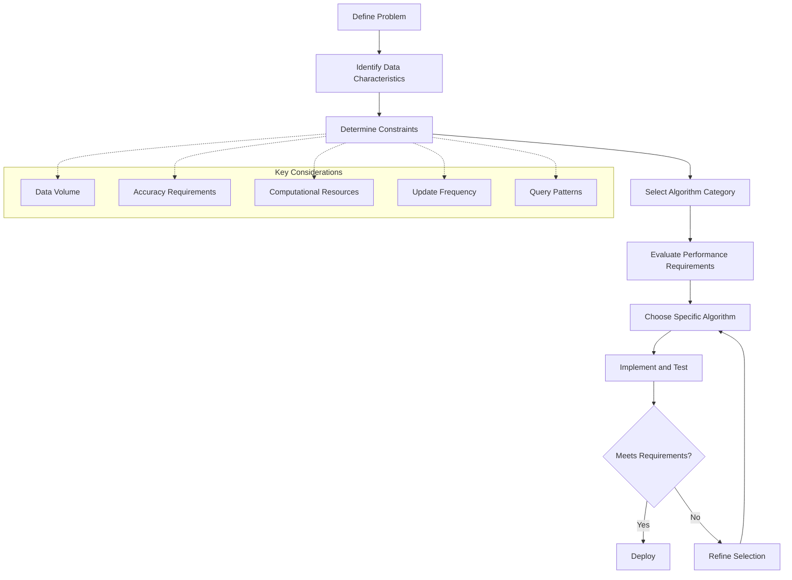

# Geospatial Algorithms

This section provides information about computational algorithms and methods specific to geospatial data processing, analysis, and modeling.

## Contents

- [Spatial Indexing](spatial_indexing.md) - Algorithms for efficient spatial queries and data organization
- [Geometric Algorithms](geometric_algorithms.md) - Computational geometry in geospatial applications
- [Routing Algorithms](routing_algorithms.md) - Algorithms for path finding and network analysis
- [Spatial Interpolation](spatial_interpolation.md) - Methods for estimating values at unmeasured locations
- [Terrain Analysis](terrain_analysis.md) - Algorithms for processing elevation data
- [Spatial Statistics](spatial_statistics.md) - Statistical methods for spatial data
- [Machine Learning](machine_learning.md) - ML applications in geospatial analysis
- [Computational Optimization](computational_optimization.md) - Optimizing geospatial computations
- [Cartographic Algorithms](cartographic_algorithms.md) - Algorithms for map generation and rendering
- [Image Processing](image_processing.md) - Algorithms for geospatial imagery analysis
- [Point Cloud Processing](point_cloud_processing.md) - Algorithms for LiDAR and 3D point data
- [Temporal Algorithms](temporal_algorithms.md) - Algorithms for time-series geospatial data

## Core Algorithm Categories

### Spatial Indexing

Techniques for organizing spatial data to enable efficient queries:

- **[R-Trees](spatial_indexing.md#r-trees)** - Tree structure using minimum bounding rectangles
- **[Quadtrees](spatial_indexing.md#quadtrees-2d-and-octrees-3d)** - Hierarchical spatial subdivision
- **[H3 Indexing](spatial_indexing.md#h3-hexagonal-hierarchical-geospatial-indexing-system)** - Hexagonal hierarchical system
- **[Space-filling Curves](spatial_indexing.md#space-filling-curves)** - Linearizing multidimensional space
- **[Grid-based Systems](spatial_indexing.md#grid-based-indexing)** - Regular and irregular grids

### Computational Geometry

Algorithms for geometric operations:

- **Point-in-Polygon** - Determining if a point lies within a polygon
- **Line Intersection** - Finding intersections between line segments
- **Polygon Overlay** - Computing geometric unions, intersections, etc.
- **Voronoi Diagrams** - Partitioning space based on distance to points
- **Delaunay Triangulation** - Triangulating a set of points
- **Convex Hull** - Finding the smallest convex set containing points
- **Douglas-Peucker Algorithm** - Line simplification
- **Buffer Generation** - Creating zones of specified distance

### Network Analysis

Algorithms for graph and network operations:

- **Shortest Path** - Dijkstra's, A*, Bellman-Ford algorithms
- **Traveling Salesperson** - Finding optimal routes through multiple points
- **Network Flow** - Modeling flow through a network
- **Location-Allocation** - Optimizing facility locations
- **Route Optimization** - Finding optimal paths with constraints
- **Isochrone Generation** - Areas reachable within time/distance

### Spatial Interpolation

Methods for estimating continuous surfaces:

- **Inverse Distance Weighting (IDW)** - Weighted average based on distance
- **Kriging** - Geostatistical method using spatial correlation
- **Spline** - Piecewise polynomial interpolation
- **Natural Neighbor** - Area-based interpolation method
- **Trend Surface Analysis** - Polynomial regression for trend fitting
- **Triangulated Irregular Network (TIN)** - Interpolation based on triangulation

### Terrain Analysis

Algorithms for digital elevation model (DEM) processing:

- **Slope and Aspect Calculation** - Surface derivatives
- **Viewshed Analysis** - Visibility determination
- **Flow Direction and Accumulation** - Hydrological modeling
- **Watershed Delineation** - Identifying drainage basins
- **Terrain Classification** - Identifying landforms and features
- **Solar Radiation Analysis** - Modeling sun exposure

### Spatial Statistics

Statistical methods with spatial components:

- **Spatial Autocorrelation** - Moran's I, Geary's C
- **Hot Spot Analysis** - Getis-Ord Gi*
- **Spatial Regression** - Models accounting for spatial dependence
- **Kernel Density Estimation** - Non-parametric density estimation
- **Cluster Analysis** - Identifying spatial clusters
- **Point Pattern Analysis** - Analyzing point distributions

### Machine Learning in Geospatial

ML applications for spatial data:

- **Spatial Classification** - Land cover classification, feature extraction
- **Spatial Clustering** - Identifying spatial patterns and groupings
- **Spatial Regression** - Modeling relationships with spatial dependency
- **Deep Learning** - Convolutional neural networks for geospatial imagery
- **Object Detection** - Feature identification in satellite/aerial imagery
- **Semantic Segmentation** - Pixel-level classification of images

## Algorithm Selection Process



## Implementation in GEO-INFER

The GEO-INFER framework provides implementations of many of these algorithms through the following components:

- **geo_infer.spatial.algorithms** - Core spatial algorithm implementations
- **geo_infer.spatial.indexing** - Spatial indexing structures
- **geo_infer.spatial.geometry** - Computational geometry operations
- **geo_infer.spatial.interpolation** - Spatial interpolation methods
- **geo_infer.spatial.statistics** - Spatial statistical methods
- **geo_infer.spatial.network** - Network analysis algorithms
- **geo_infer.spatial.terrain** - Terrain analysis functions
- **geo_infer.spatial.ml** - Machine learning for spatial data

## Algorithm Complexity

Understanding the computational complexity of geospatial algorithms is critical for scalable applications:

| Algorithm Type | Time Complexity | Space Complexity | Parallelizable | Example |
|---------------|-----------------|------------------|---------------|---------|
| Point-in-Polygon | O(n) | O(1) | Partially | Ray casting algorithm |
| R-Tree Search | O(log n) | O(n) | Partially | Spatial database query |
| Kriging | O(n³) | O(n²) | Yes | Geostatistical interpolation |
| Shortest Path | O(E + V log V) | O(V) | Partially | Dijkstra's with priority queue |
| Viewshed | O(n²) | O(n) | Yes | Line-of-sight analysis |
| K-means Clustering | O(k·n·i) | O(n + k) | Yes | Spatial clustering |

*Where n = number of points/features, V = vertices, E = edges, k = clusters, i = iterations*

## Integration with Workflows

Geospatial algorithms can be incorporated into GEO-INFER workflows:

- As individual processing nodes
- As part of analysis chains
- Within custom Python functions
- Through external service connections

See the [Workflow System](../../workflows/index.md) documentation for details on integrating these algorithms into processing chains.

## GEO-INFER Algorithm API

Example API usage for common algorithms:

```python
# Spatial indexing example
from geo_infer.spatial.indexing import RTreeIndex

# Create and query an R-Tree index
index = RTreeIndex()
index.insert_features(features)
results = index.query_bbox(bbox)

# Interpolation example
from geo_infer.spatial.interpolation import IDW

# Create an IDW interpolator
interpolator = IDW(power=2, search_radius=5000)
interpolator.fit(sample_points, sample_values)
grid = interpolator.predict(grid_points)

# Network analysis example
from geo_infer.spatial.network import ShortestPath

# Find shortest path in a network
router = ShortestPath(network_graph)
path, cost = router.find_path(start_node, end_node)
```

## Related Resources

- [Spatial Analysis](../analysis/index.md)
- [Workflow System](../../workflows/index.md)
- [Implementation Examples](../../examples/algorithms/index.md)
- [Performance Optimization](../../developer_guide/performance.md)
- [API Reference](../../api/geo_infer_spatial.md) 