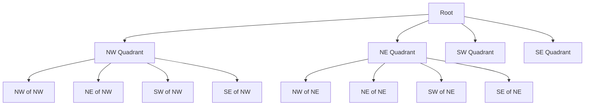
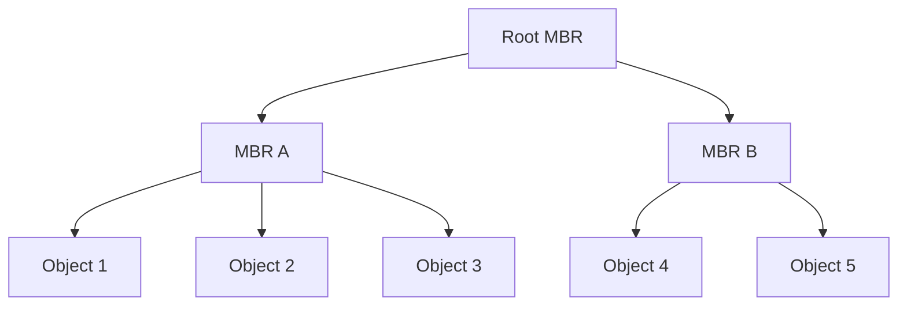
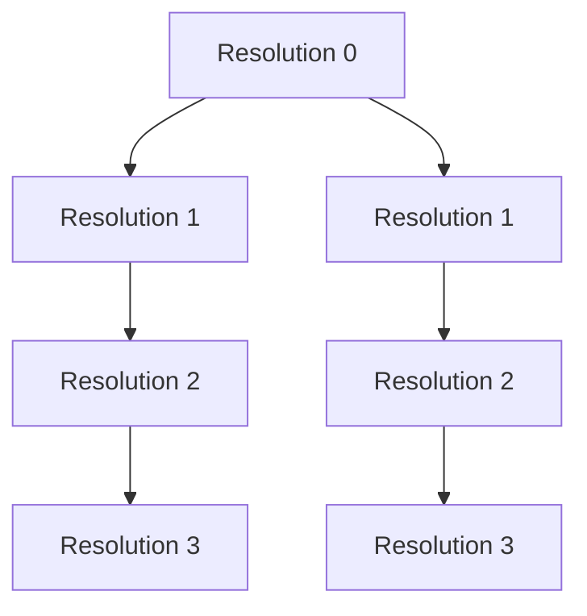

# Spatial Indexing

Spatial indexing algorithms and data structures provide efficient methods for querying, retrieving, and analyzing spatial data. This document explains common spatial indexing approaches, their properties, use cases, and implementation considerations within the GEO-INFER framework.

## Overview

Spatial indexes organize data in multidimensional space to allow for efficient spatial queries such as:

- Point queries: "What is at this location?"
- Range queries: "What features are within this bounding box?"
- Nearest neighbor queries: "What are the 5 closest features to this point?"
- Distance queries: "What features are within 500 meters of this line?"

Effective spatial indexing is critical for performance when working with large geospatial datasets.

## Common Spatial Indexing Methods

### Grid-Based Indexing

Grid-based approaches divide space into regular cells or bins.

#### Regular Grids

- **Description**: Divides space into equally sized cells
- **Strengths**: Simple implementation, fast point queries
- **Weaknesses**: Inefficient for non-uniform data distributions
- **Applications**: Raster data, simple point datasets with uniform distribution

#### Quadtrees (2D) and Octrees (3D)

- **Description**: Hierarchical tree structures that recursively subdivide space into quadrants or octants
- **Strengths**: Adapts to data density, efficient for clustered data
- **Weaknesses**: Can be imbalanced, complex to update dynamically
- **Applications**: Point clouds, terrain data, heterogeneous datasets



### Tree-Based Indexing

Tree-based structures organize spatial data in hierarchical arrangements.

#### R-Trees

- **Description**: Tree structure that groups nearby objects using minimum bounding rectangles (MBRs)
- **Strengths**: Well-suited for disk-based storage, handles varying object sizes
- **Weaknesses**: Overlap between nodes can reduce query efficiency
- **Applications**: Database systems, vector data, complex polygons



#### R*-Trees and R+-Trees

- **Description**: Optimized variants of R-Trees with improved insertion and splitting strategies
- **Strengths**: Reduced overlap, better query performance
- **Weaknesses**: More complex insertion algorithms
- **Applications**: GIS systems, spatial databases with frequent queries

#### KD-Trees

- **Description**: Binary trees that recursively partition space along coordinate axes
- **Strengths**: Efficient for point data, nearest neighbor searches
- **Weaknesses**: Less suited for extended objects, rebalancing is complex
- **Applications**: Point datasets, nearest neighbor searches, computational geometry

### Space-Filling Curves

#### Z-Order Curves (Z-curves)

- **Description**: Maps multidimensional data to one dimension using bit interleaving
- **Strengths**: Preserves locality well, simple to implement
- **Weaknesses**: Not optimal for all query patterns
- **Applications**: Database indexing, geohashing

#### Hilbert Curves

- **Description**: Space-filling curve with better locality preservation than Z-curves
- **Strengths**: Excellent locality, minimizes clustering
- **Weaknesses**: More complex to compute than Z-curves
- **Applications**: Advanced geospatial indexing, image processing

### Hierarchical Grid Systems

#### S2 Geometry

- **Description**: Hierarchical system mapping Earth to a cube, then to a quadtree
- **Strengths**: Global coverage, well-defined levels, good for spherical geometry
- **Weaknesses**: Complex implementation
- **Applications**: Global datasets, mobile applications, Google Maps/Earth

#### H3 (Hexagonal Hierarchical Geospatial Indexing System)

- **Description**: Hierarchical hexagonal tiling of the Earth
- **Strengths**: Equal-area cells, better neighborhood properties than squares
- **Weaknesses**: More complex geometrically than square grids
- **Applications**: Ridesharing, logistics, service area analysis



## Query Types and Indexing Performance

Different index structures perform differently depending on the query type:

| Index Type | Point Query | Range Query | NN Query | Update Performance |
|------------|-------------|-------------|----------|-------------------|
| Regular Grid | ★★★★★ | ★★☆☆☆ | ★★☆☆☆ | ★★★★★ |
| Quadtree | ★★★★☆ | ★★★☆☆ | ★★★☆☆ | ★★★★☆ |
| R-Tree | ★★★☆☆ | ★★★★☆ | ★★★★☆ | ★★★☆☆ |
| KD-Tree | ★★★★☆ | ★★★☆☆ | ★★★★★ | ★★☆☆☆ |
| Z-Order | ★★★★☆ | ★★★☆☆ | ★★★☆☆ | ★★★★☆ |
| H3 | ★★★★☆ | ★★★★☆ | ★★★★☆ | ★★★★☆ |

## Implementation Considerations

### Choosing an Index Structure

Consider these factors when selecting a spatial index:

- **Data characteristics**: Points, lines, polygons, size of objects
- **Query patterns**: Most frequent query types
- **Update frequency**: Static vs. dynamic data
- **Data distribution**: Uniform vs. clustered
- **Memory constraints**: In-memory vs. disk-based
- **Implementation complexity**: Development resources available

### Optimization Strategies

- **Bulk loading**: Building indexes in batch for better organization
- **Buffering**: Adding margins to query regions to reduce edge effects
- **Caching**: Keeping frequently accessed index nodes in memory
- **Parallel processing**: Distributing queries across multiple cores/nodes
- **Hybrid approaches**: Combining multiple index types for different data subsets

## Implementation in GEO-INFER

The GEO-INFER framework provides multiple spatial indexing implementations:

```python
# Example: Creating a spatial index using the GEO-INFER framework
from geo_infer.spatial.indexing import RTreeIndex, QuadtreeIndex, H3Index

# Create an R-Tree index for vector data
rtree_index = RTreeIndex(dimension=2)
for feature in vector_dataset:
    rtree_index.insert(feature.id, feature.bounds)
    
# Query the index
results = rtree_index.query(bbox=(x_min, y_min, x_max, y_max))

# Create an H3 index for global point data
h3_index = H3Index(resolution=9)  # ~100m cells
for point in point_dataset:
    h3_cell = h3_index.point_to_cell(point.lat, point.lon)
    h3_index.insert(h3_cell, point.id)
    
# Find points within radius
center_lat, center_lon = 37.7749, -122.4194  # San Francisco
points_within_radius = h3_index.radius_search(center_lat, center_lon, 
                                             radius_km=5)
```

## Performance Benchmarks

The following chart shows comparative performance for different indexing methods on a dataset of 1 million points:

| Index Type | Build Time (s) | Point Query (ms) | Range Query (ms) | Memory Usage (MB) |
|------------|----------------|------------------|-----------------|-------------------|
| R-Tree | 3.2 | 0.8 | 12.5 | 82 |
| Quadtree | 2.1 | 0.5 | 18.2 | 64 |
| KD-Tree | 1.8 | 0.4 | 22.3 | 45 |
| H3 (res 9) | 2.5 | 0.3 | 15.7 | 72 |
| Z-curve | 1.5 | 0.6 | 19.1 | 38 |

*Note: Actual performance depends on hardware, implementation details, and data characteristics.*

## Related Resources

- [Spatial Analysis Methods](../analysis/index.md)
- [Algorithms Overview](index.md)
- [Geometric Algorithms](geometric_algorithms.md)
- [GEO-INFER-SPACE API Documentation](../../api/geo_infer_space.md)
- [Performance Optimization](../../developer_guide/performance.md) 