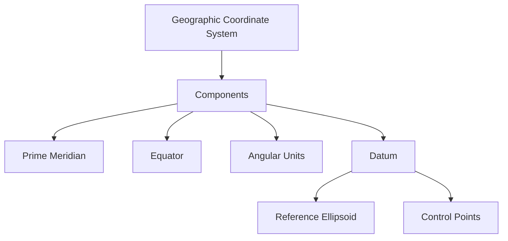
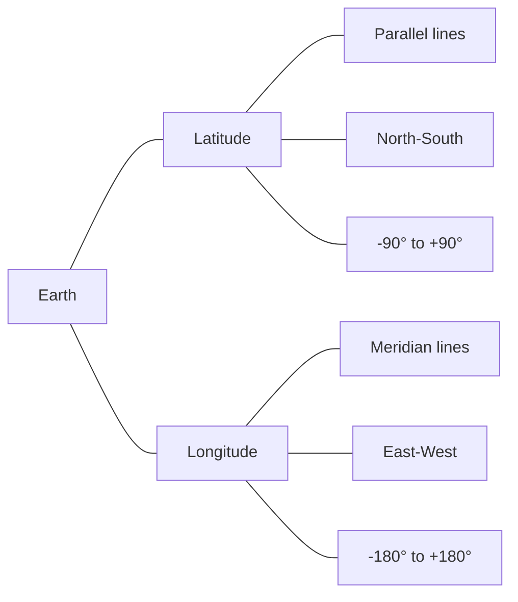
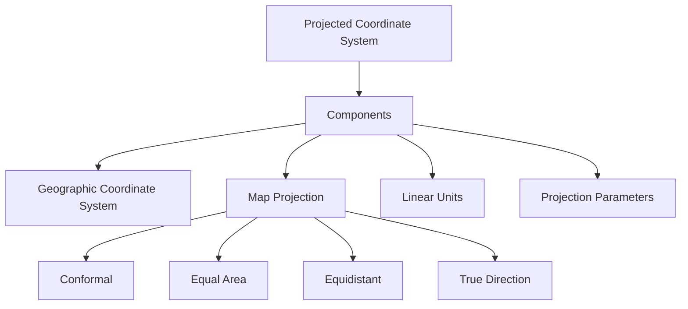
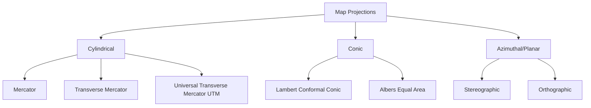
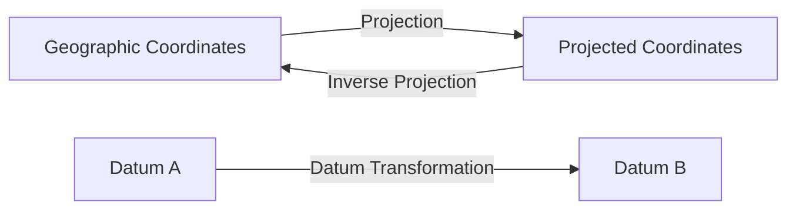

# Coordinate Systems

Coordinate systems provide the mathematical framework for defining locations on the Earth's surface. They are fundamental to all geospatial operations, from data collection to analysis and visualization.

## Types of Coordinate Systems

### Geographic Coordinate Systems (GCS)

Geographic coordinate systems define locations on the Earth's surface using angular measurements (latitude and longitude) from the center of the Earth.



#### Key Components
- **Prime Meridian**: The reference line for measuring longitude (typically passes through Greenwich, UK)
- **Equator**: The reference line for measuring latitude
- **Angular Units**: Typically degrees, minutes, and seconds
- **Datum**: A mathematical model of the Earth's shape that defines the origin and orientation of the coordinate system

#### Common Geographic Datums
- **WGS84**: World Geodetic System 1984 - Used by GPS
- **NAD83**: North American Datum 1983 - Used in North America
- **GDA2020**: Geocentric Datum of Australia 2020
- **ETRS89**: European Terrestrial Reference System 1989

#### Latitude and Longitude



- **Latitude**: Measures the angle north or south of the equator
  - Ranges from -90° (South Pole) to +90° (North Pole)
  - Lines of constant latitude are called parallels
- **Longitude**: Measures the angle east or west of the Prime Meridian
  - Ranges from -180° to +180°
  - Lines of constant longitude are called meridians

### Projected Coordinate Systems (PCS)

Projected coordinate systems transform the curved surface of the Earth onto a flat plane, allowing for measurements in linear units (e.g., meters).



#### Map Projection Properties

Every map projection distorts at least one of these properties:
- **Shape (Conformal)**: Preserves local angles and shapes
- **Area (Equal-area)**: Preserves the proportional areas of features
- **Distance (Equidistant)**: Preserves distances from one or two points
- **Direction (Azimuthal)**: Preserves directions from a central point

#### Common Map Projections



1. **Cylindrical Projections**
   - **Mercator**: Conformal projection that preserves shape, widely used for navigation
   - **Universal Transverse Mercator (UTM)**: Division of the world into 60 zones, each with its own projection

2. **Conic Projections**
   - **Lambert Conformal Conic**: Preserves shape, commonly used for regional maps of mid-latitudes
   - **Albers Equal-Area**: Preserves area, used for country or continental maps

3. **Azimuthal Projections**
   - **Stereographic**: Conformal projection often used for polar regions
   - **Orthographic**: Shows the Earth as it appears from space

## Coordinate System Transformations



Transformation between coordinate systems involves mathematical operations that convert coordinates from one system to another:

- **Projection/Inverse Projection**: Converts between geographic and projected coordinates
- **Datum Transformation**: Converts between different geographic datums
- **Map Projection Transformation**: Converts between different projected coordinate systems

## Practical Applications

### Code Example: Transforming Coordinates with Python

```python
from pyproj import Transformer

# Initialize a transformer from WGS84 to UTM Zone 32N
transformer = Transformer.from_crs("EPSG:4326", "EPSG:32632", always_xy=True)

# Define a point in WGS84 (longitude, latitude)
lon, lat = 9.0, 48.0

# Transform to UTM Zone 32N (easting, northing)
east, north = transformer.transform(lon, lat)

print(f"Geographic: {lon}, {lat}")
print(f"Projected: {east}, {north}")
```

### Real-World Use Cases

- **Navigation Systems**: GPS devices use WGS84 for global positioning
- **GIS Analysis**: Various projections based on analysis needs (equal-area for area calculations, conformal for preserving shapes)
- **Web Mapping**: Web Mercator (EPSG:3857) is standard for online maps
- **Remote Sensing**: Satellite imagery often uses UTM projections

## Best Practices

1. **Always Document the Coordinate System**: Include metadata about the coordinate system in all geospatial datasets
2. **Choose Appropriate Projections**: Select projections based on:
   - The geographic region of interest
   - The type of analysis being performed
   - The properties that need to be preserved
3. **Understand Distortion**: Recognize the distortions inherent in your chosen projection
4. **Use Standard EPSG Codes**: Reference coordinate systems using EPSG codes for clarity

## Common Challenges and Solutions

| Challenge | Solution |
|-----------|----------|
| Data in different coordinate systems | Reproject to a common system before analysis |
| Distortion in global maps | Use appropriate projections for specific regions |
| Confusion between geographic and projected coordinates | Clear documentation and validation of coordinate units |
| Datum shifts causing misalignment | Apply proper datum transformations |

## Further Reading

- [EPSG Registry](https://epsg.org/home.html)
- [Proj.4 Documentation](https://proj.org/en/9.3/)
- [Coordinate Systems in GIS - ESRI](https://www.esri.com/en-us/what-is-gis/coordinate-systems)
- [Map Projections - Choosing a Map Projection](https://en.wikipedia.org/wiki/Map_projection#Choosing_a_projection) 