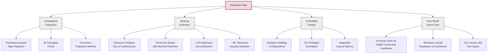
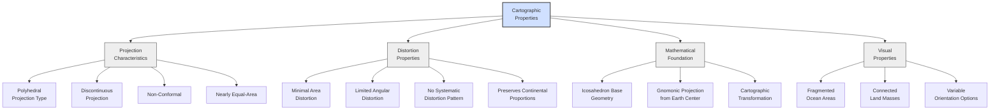
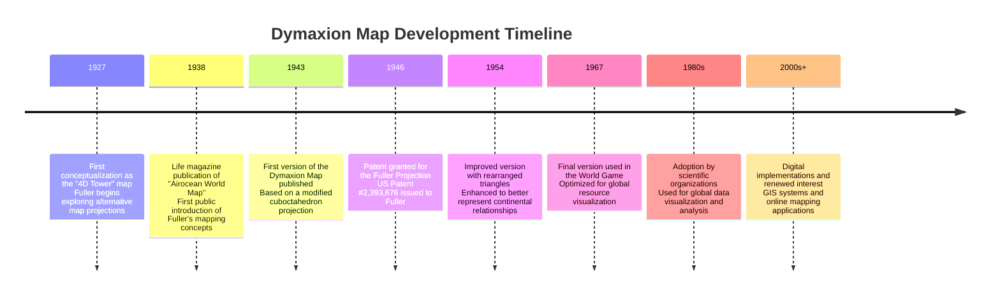
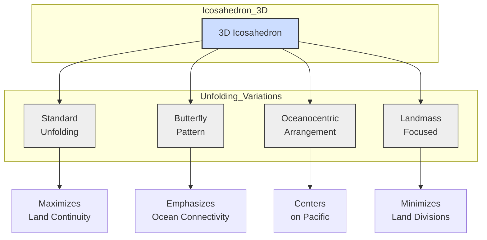
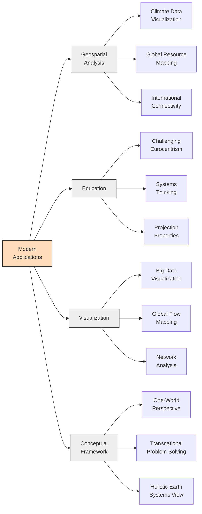
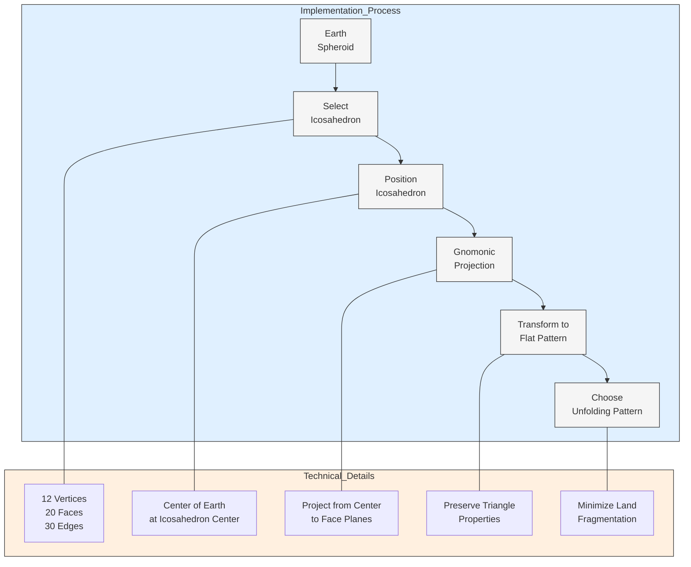
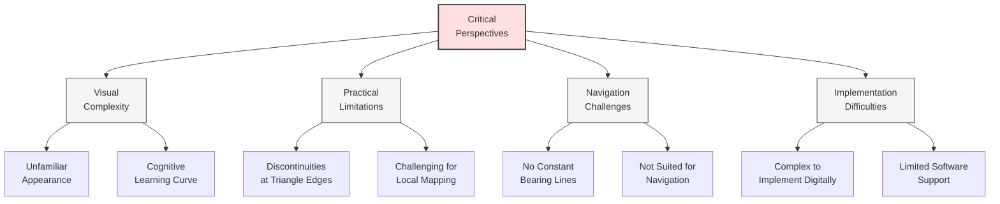
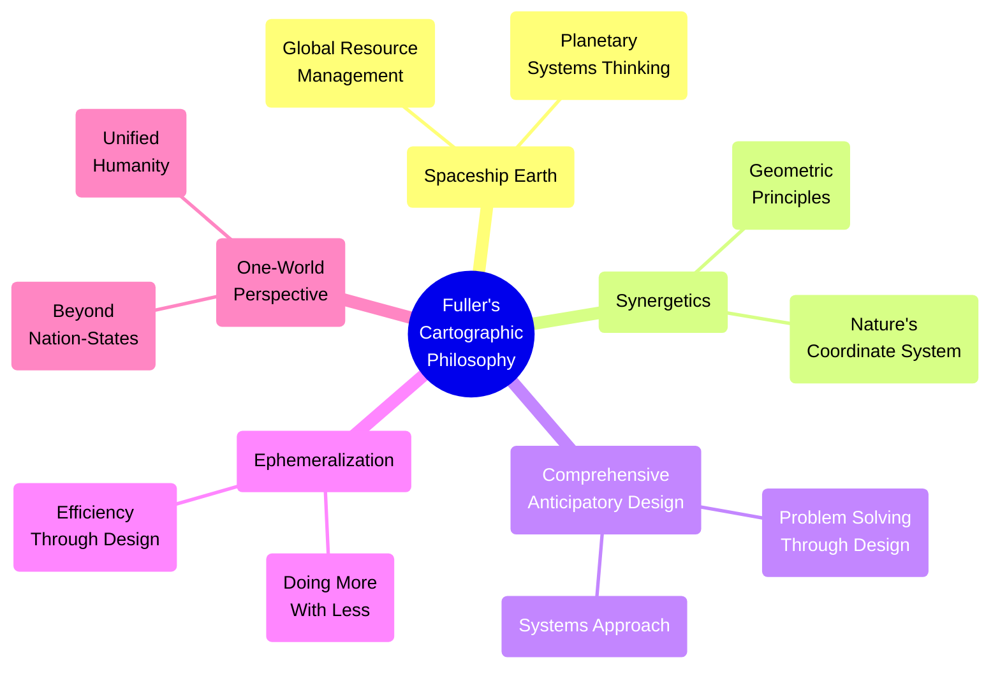

# Dymaxion Map (Fuller Projection)

The Dymaxion Map, officially named the "Fuller Projection," represents a revolutionary approach to world map design developed by R. Buckminster Fuller (1895-1983), an American architect, systems theorist, inventor, and futurist who sought to address humanity's global challenges through design science.

## Concept Overview



### Key Principles

The Dymaxion Map was first introduced by Buckminster Fuller in 1943 and patented in 1946, embodying several revolutionary principles:

1. **Icosahedral Projection**: The Earth's surface is projected onto the faces of a twenty-sided icosahedron, which can then be unfolded in various ways to create a flat map.

2. **Minimal Distortion**: Unlike traditional projections (e.g., Mercator), the Dymaxion Map preserves both relative size and shape of landmasses with minimal distortion.

3. **No "Correct" Orientation**: The map has no inherent up, down, or center, challenging the traditional north-up orientation of world maps.

4. **One-World Island Visualization**: By strategically placing the icosahedron, Fuller's map presents Earth's landmasses as nearly contiguous, visualizing our planet as "one island in one ocean."

## Cartographic Properties



### Mathematical Foundations

The Dymaxion Map utilizes a polyhedral projection:

1. **Base Polyhedron**: An icosahedron (20 equilateral triangular faces)
2. **Gnomonic Projection**: Earth's surface is projected from its center onto the faces
3. **Cartographic Transformation**: Each triangular face maintains proportional relationships

This approach results in:
- Area distortion limited to approximately 1.5% maximum
- Angular distortion limited to about 35° maximum
- No continuous hemispheric distortions as found in many traditional projections

## Historical Development



Fuller's development of the map evolved over decades:
- Early versions used a cuboctahedron rather than an icosahedron
- The term "Dymaxion" (dynamic + maximum + tension) was coined by a friend
- Several arrangements of the triangular faces were explored to find optimal configurations

## Unfolding Variations



The icosahedron can be unfolded in various ways, each offering different visual perspectives of Earth:

1. **Standard Unfolding**: Fuller's most common arrangement that maximizes land continuity
2. **Butterfly Pattern**: An alternative that creates a more symmetrical layout
3. **Oceanocentric Arrangement**: Focuses on ocean connectivity and maritime routes
4. **Landmass Focused**: Minimizes cuts between major landmasses

## Comparison with Traditional Projections

```mermaid
graph TD
    subgraph Projection_Comparison
        P1[Dymaxion<br>Map]
        P2[Mercator<br>Projection]
        P3[Robinson<br>Projection]
        P4[Gall-Peters<br>Projection]
    end
    
    P1 -->|"Shape Distortion"| D1[Minimal]
    P2 -->|"Shape Distortion"| D2[Severe at poles]
    P3 -->|"Shape Distortion"| D3[Moderate]
    P4 -->|"Shape Distortion"| D4[Moderate]
    
    P1 -->|"Area Distortion"| A1[Minimal ~1.5%]
    P2 -->|"Area Distortion"| A2[Extreme towards poles]
    P3 -->|"Area Distortion"| A3[Moderate]
    P4 -->|"Area Distortion"| A4[Minimal]
    
    P1 -->|"Preserves Direction"| R1[No]
    P2 -->|"Preserves Direction"| R2[Yes - constant bearing]
    P3 -->|"Preserves Direction"| R3[No]
    P4 -->|"Preserves Direction"| R4[No]
    
    P1 -->|"Primary Use"| U1[Systems thinking]
    P2 -->|"Primary Use"| U2[Navigation]
    P3 -->|"Primary Use"| U3[General reference]
    P4 -->|"Primary Use"| U4[Equal area representation]
    
    style P1 fill:#d0f0d0,stroke:#333,stroke-width:2px
    style P2 fill:#eeeeee,stroke:#333,stroke-width:1px
    style P3 fill:#eeeeee,stroke:#333,stroke-width:1px
    style P4 fill:#eeeeee,stroke:#333,stroke-width:1px
```



| Aspect | Dymaxion Map | Mercator | Robinson | Gall-Peters |
|--------|--------------|----------|----------|-------------|
| Shape Distortion | Minimal | Severe at poles | Moderate | Moderate |
| Area Distortion | Minimal (~1.5%) | Extreme towards poles | Moderate | Minimal |
| Preserves Direction | No | Yes (constant bearing) | No | No |
| Visual Impact | No visual privileging | Enlarges Europe/N. America | Compromise | Emphasizes tropical regions |
| Primary Use | Systems thinking | Navigation | General reference | Equal area representation |

## Modern Applications



1. **GIS and Data Visualization**: The Dymaxion projection is used in specialized GIS applications for global data visualization.

2. **Global Systems Thinking**: Organizations focused on global issues use the map to avoid cultural/political biases inherent in traditional projections.

3. **Digital Cartography**: Modern digital tools have implemented the Fuller projection for interactive maps and visualizations.

4. **Educational Context**: Used to challenge students' perceptions of geopolitical space and to demonstrate projection properties.

## Code Example: Creating a Dymaxion Map with Python

```python
import numpy as np
import matplotlib.pyplot as plt
import cartopy
import cartopy.crs as ccrs
from cartopy.feature import LAND, OCEAN, COASTLINE, BORDERS

# Create a figure with Fuller projection
plt.figure(figsize=(12, 12))
ax = plt.axes(projection=ccrs.Fuller())

# Add map features
ax.add_feature(LAND, facecolor='lightgray')
ax.add_feature(OCEAN, facecolor='lightblue')
ax.add_feature(COASTLINE, linewidth=0.5)
ax.add_feature(BORDERS, linestyle=':', linewidth=0.5)

# Add gridlines
ax.gridlines(linewidth=0.5, color='gray', alpha=0.5, linestyle='-')

# Add title
plt.title('Fuller Projection (Dymaxion Map)', fontsize=15)

# Save the figure
plt.savefig('dymaxion_map.png', dpi=300, bbox_inches='tight')
plt.close()

# Alternative implementation using PyDymaxion library (requires installation)
try:
    import pydymaxion as pyd
    
    # Create a figure
    plt.figure(figsize=(15, 10))
    
    # Generate a dymaxion map with customization
    dymaxion_map = pyd.DymaxionMap()
    dymaxion_map.draw_map(
        graticule_step=15,
        land_color='lightgreen',
        ocean_color='lightblue',
        graticule_color='gray',
        border_color='darkgray'
    )
    
    plt.title('Customized Dymaxion Map', fontsize=15)
    plt.savefig('custom_dymaxion.png', dpi=300, bbox_inches='tight')
    plt.close()
except ImportError:
    print("PyDymaxion library not installed")
```

## Technical Implementation



### Implementation Steps

1. **Select Polyhedron**: An icosahedron with 20 equilateral triangular faces
2. **Position Polyhedron**: Orient it to minimize land area crossing edges
3. **Project Earth**: Use gnomonic projection from Earth's center
4. **Transform**: Maintain proportional relationships while flattening
5. **Arrange Faces**: Unfold the icosahedron to optimize visual presentation

## Critical Perspectives



Despite its innovative nature, several critiques have emerged:

1. **Cognitive Challenges**: The unusual appearance requires adjustment for viewers accustomed to traditional maps

2. **Practical Limitations**: The discontinuities at triangle edges can be problematic for certain applications

3. **Navigation Difficulties**: Unlike the Mercator projection, the Dymaxion Map doesn't preserve constant bearing lines useful for navigation

4. **Implementation Complexity**: Creating and working with the projection digitally is more complex than with traditional projections

## Philosophical Significance



The Dymaxion Map embodies Fuller's broader philosophical principles:

1. **"Spaceship Earth"**: Viewing our planet as a single integrated system with finite resources

2. **Synergetics**: Fuller's exploration of geometric principles and systems thinking

3. **Design Science Revolution**: Using design to solve global challenges rather than politics or economics

4. **Non-Zero-Sum Thinking**: Promoting cooperation over competition for global resources

## Educational Resources and Further Reading

- [The Buckminster Fuller Institute](https://www.bfi.org/)
- [Fuller, R. B. (1969). Operating Manual for Spaceship Earth](https://www.lars-mueller-publishers.com/operating-manual-spaceship-earth)
- [Fuller, R. B. (1981). Critical Path](https://www.goodreads.com/book/show/123899.Critical_Path)
- [The Dymaxion Map - Design Museum](https://collections.vam.ac.uk/item/O121761/dymaxion-map-map-fuller-r-buckminster/)
- [Geodesic, Inc. - Official Fuller Map Resources](https://www.genekeyes.com/FULLER/BF-7-Internet.html) 