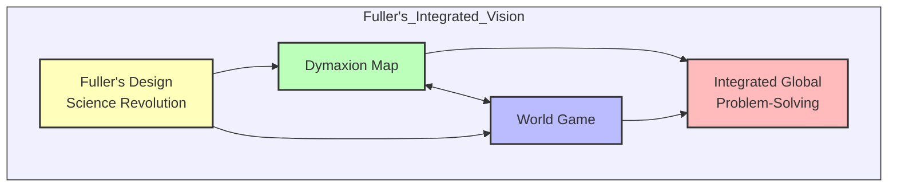
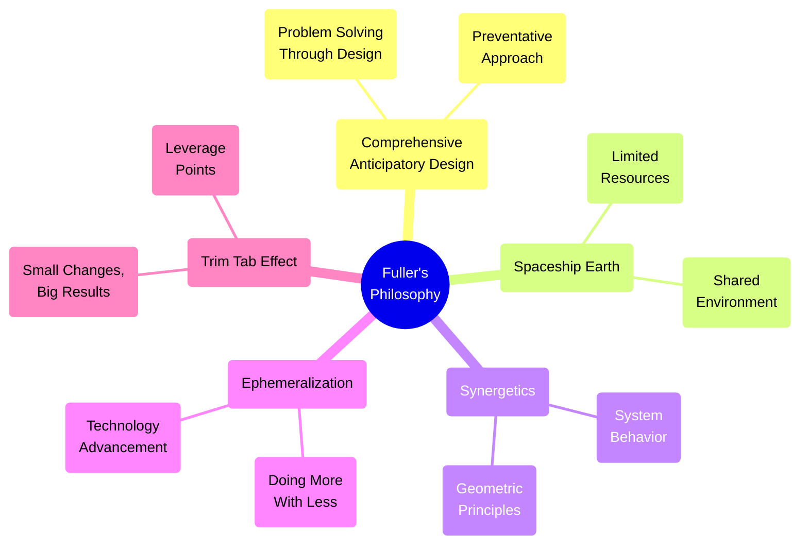
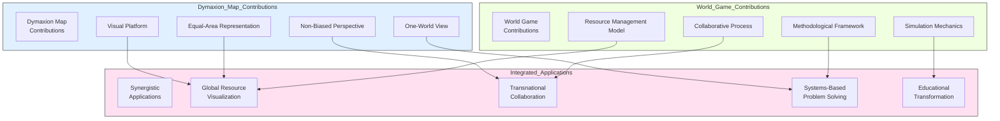
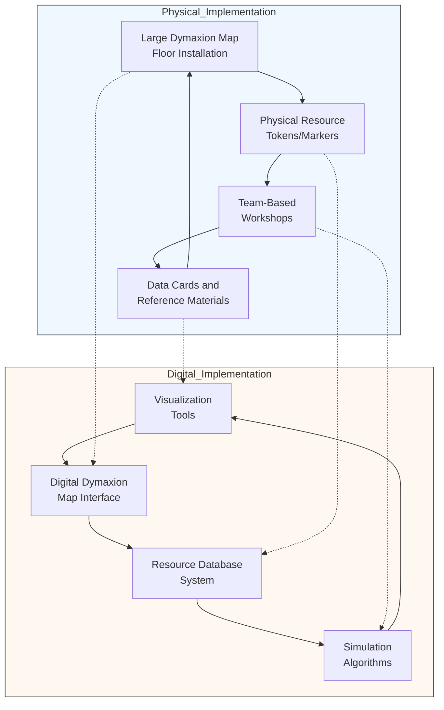
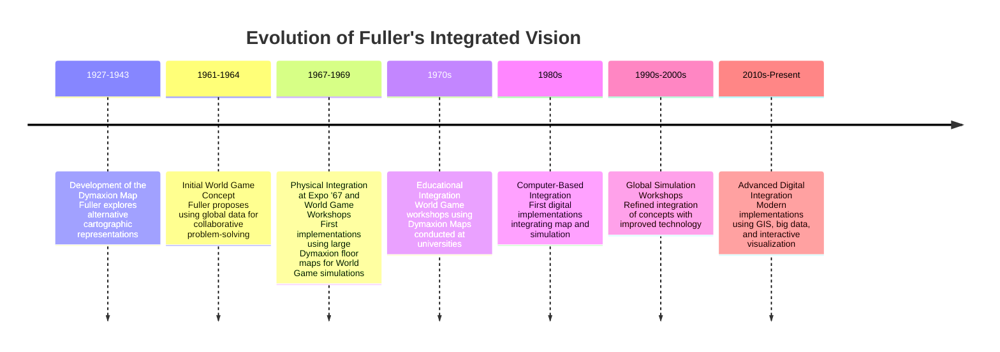
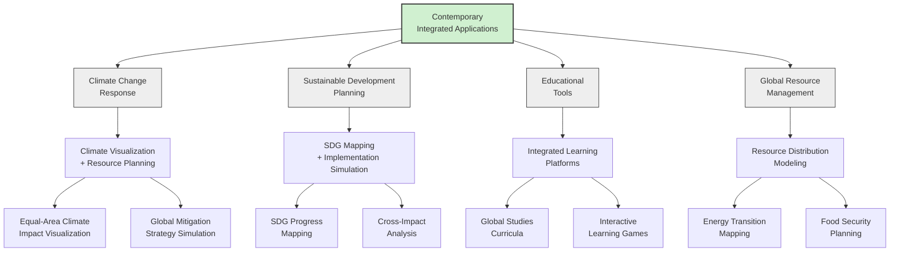
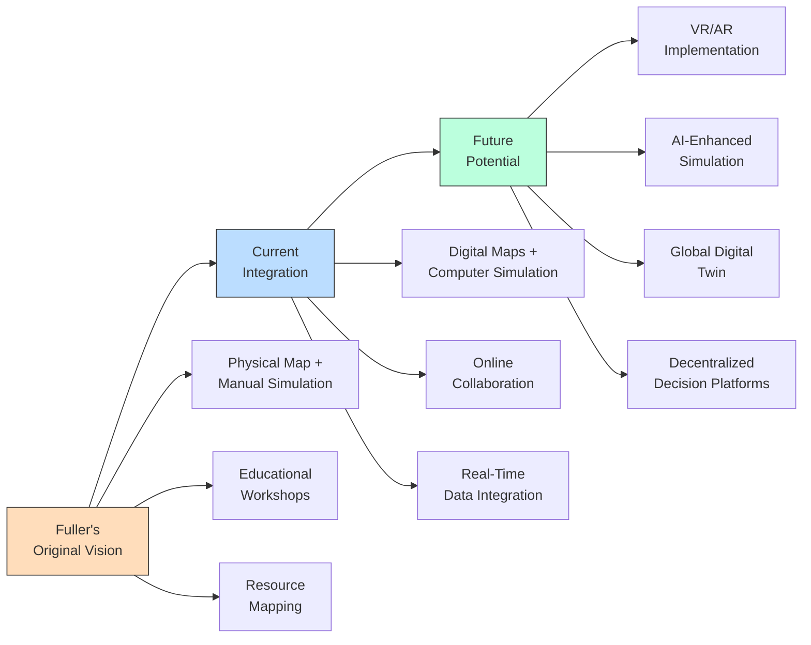

# Dymaxion Map and World Game: Fuller's Integrated Vision

This article explores the interconnected relationship between two of Buckminster Fuller's most significant innovations: the Dymaxion Map and the World Game. While each concept has its own distinct characteristics and applications (detailed in their respective articles: [Dymaxion Map](dymaxion_map.md) and [World Game](world_game.md)), they were conceived by Fuller as complementary elements of a unified approach to global problem-solving.



## Philosophical Foundation



Both the Dymaxion Map and World Game emerge from Fuller's broader philosophical framework, which includes:

1. **"Spaceship Earth"**: The concept that our planet is a single integrated system with finite resources that must be managed holistically

2. **Comprehensive Anticipatory Design Science**: Using design to solve global challenges proactively rather than reactively addressing problems

3. **Synergetics**: Fuller's exploration of geometric principles, systems thinking, and the behavior of complex systems

4. **Ephemeralization**: The principle of "doing more with less" through technological advancement and efficient design

5. **Non-Zero-Sum Thinking**: Promoting cooperation over competition for global resources

## Synergistic Relationship



The Dymaxion Map and World Game each contributed essential elements to Fuller's integrated approach:

### Dymaxion Map Contributions

1. **Visual Foundation**: Provided a minimally distorted representation of Earth's surface that served as the literal platform for the World Game

2. **Perspective Shift**: Challenged conventional North-up, Eurocentric map orientations to provide a less biased view of global relationships

3. **Equal-Area Representation**: Ensured accurate proportional representation of landmasses, critical for resource assessment

4. **One-World Island View**: Visualized Earth's continents as a nearly connected whole, reinforcing the idea of global unity

### World Game Contributions

1. **Methodological Framework**: Established processes for collaborative problem-solving on a global scale

2. **Resource Inventory System**: Developed methods for cataloging and visualizing global resources and needs

3. **Participatory Process**: Created structured approaches for diverse stakeholders to engage in global planning

4. **Simulation Mechanics**: Provided systems for modeling complex global dynamics and testing proposed solutions

## Implementation Integration



In practical implementation, the integration took several forms:

1. **Physical Integration**: Early World Game workshops featured large Dymaxion Map floor displays where participants physically stood, representing different regions and working with physical markers representing resources

2. **Conceptual Integration**: The World Game methodology incorporated the Dymaxion Map's unbiased perspective and accurate area representation into its approach to global problem-solving

3. **Educational Integration**: Both tools were used together in educational contexts to help students understand global systems and relationships

4. **Digital Integration**: Later computer-based implementations used digital Dymaxion Map interfaces as the visual foundation for World Game simulations

## Historical Progression of Integration



## Contemporary Integrated Applications



Today, the integration of Fuller's Dymaxion Map and World Game concepts continues in various forms:

1. **Climate Change Response**: Using unbiased map visualizations combined with World Game-inspired collaborative processes to address global climate challenges

2. **Sustainable Development**: UN Sustainable Development Goals implementation utilizes both accurate geographic representation and systems-based planning approaches

3. **Modern Educational Tools**: Digital platforms that combine accurate global visualization with simulation-based learning experiences

4. **Global Resource Management**: Integrated approaches to energy transition planning, food security, and other resource challenges

## Code Example: Integrated Dymaxion-World Game Visualization

```python
import numpy as np
import matplotlib.pyplot as plt
import cartopy
import cartopy.crs as ccrs
from cartopy.feature import LAND, OCEAN, COASTLINE, BORDERS
import pandas as pd
import seaborn as sns
from matplotlib.colors import LinearSegmentedColormap

# Create a simple integrated visualization using the Dymaxion Map with World Game data

# Sample data: Global resource distribution by region
# This could represent energy, food, water, or other resources
regions = ['North America', 'South America', 'Europe', 'Africa', 
           'Asia', 'Oceania', 'Antarctica']
           
resources = {
    'Production': [25, 15, 20, 10, 40, 5, 0],
    'Consumption': [30, 10, 25, 8, 35, 7, 0],
    'Renewable_Capacity': [15, 20, 18, 30, 25, 10, 5],
    'Population_Share': [5, 6, 10, 16, 60, 0.5, 0]
}

# Calculate surplus/deficit
resources['Balance'] = [p-c for p, c in zip(resources['Production'], 
                                          resources['Consumption'])]

# Create a DataFrame                                        
df = pd.DataFrame(resources, index=regions)

# Create custom colormap for balance (red for deficit, green for surplus)
cmap = LinearSegmentedColormap.from_list('balance_cmap', 
                                        ['red', 'white', 'green'], 
                                        N=100)

# 1. Create Dymaxion Map
fig = plt.figure(figsize=(15, 10))
ax1 = plt.subplot(121, projection=ccrs.Fuller())

# Add base map features
ax1.add_feature(LAND, facecolor='lightgray')
ax1.add_feature(OCEAN, facecolor='lightblue')
ax1.add_feature(COASTLINE, linewidth=0.5)
ax1.add_feature(BORDERS, linestyle=':', linewidth=0.5)

# Add title
ax1.set_title('Dymaxion Map Foundation', fontsize=12)

# 2. Create World Game resource visualization
ax2 = plt.subplot(122)
sns.heatmap(df[['Production', 'Consumption', 'Balance']], 
            cmap=cmap, center=0, annot=True, fmt=".1f", 
            linewidths=.5, ax=ax2)
ax2.set_title('World Game Resource Analysis', fontsize=12)

# Overall title
fig.suptitle('Integrated Dymaxion-World Game Visualization', 
             fontsize=16, y=0.98)

# Add explanatory text
plt.figtext(0.5, 0.01, 
           "Fuller's integrated approach combines accurate geographic representation\n"
           "with systems-based resource analysis for global problem-solving.", 
           ha="center", fontsize=10, 
           bbox={"facecolor":"lightgray", "alpha":0.5, "pad":5})

plt.tight_layout()
plt.subplots_adjust(top=0.90, bottom=0.15)
plt.savefig("integrated_dymaxion_worldgame.png", dpi=300, bbox_inches='tight')
plt.close()

# Create a more advanced integration simulation
try:
    # This would be a more complex implementation integrating
    # the World Game resource optimization with Dymaxion visualization
    # Requires specialized libraries that might not be available
    
    from mpl_toolkits.mplot3d import Axes3D
    
    # Create figure with 3D projection to simulate resource flows
    fig = plt.figure(figsize=(15, 10))
    ax = fig.add_subplot(111, projection='3d')
    
    # Simplified world regions as points in 3D space (x, y coordinates on Dymaxion projection)
    # This is a simplified representation
    region_coords = {
        'North America': [0.2, 0.7, 0],
        'South America': [0.3, 0.3, 0],
        'Europe': [0.5, 0.7, 0],
        'Africa': [0.5, 0.4, 0],
        'Asia': [0.7, 0.6, 0],
        'Oceania': [0.8, 0.3, 0],
        'Antarctica': [0.5, 0.1, 0]
    }
    
    # Extract coordinates
    x = [coords[0] for coords in region_coords.values()]
    y = [coords[1] for coords in region_coords.values()]
    z = [coords[2] for coords in region_coords.values()]
    
    # Plot regions as points
    ax.scatter(x, y, z, c='blue', s=df['Production']*20, alpha=0.6, 
               edgecolors='black', label='Regions')
    
    # Add region labels
    for i, region in enumerate(regions):
        ax.text(x[i], y[i], z[i], region, fontsize=8)
    
    # Plot resource flows as lines between regions with surplus and deficit
    surplus_regions = df[df['Balance'] > 0].index
    deficit_regions = df[df['Balance'] < 0].index
    
    for s_region in surplus_regions:
        s_x, s_y, s_z = region_coords[s_region]
        surplus = df.loc[s_region, 'Balance']
        
        for d_region in deficit_regions:
            d_x, d_y, d_z = region_coords[d_region]
            deficit = -df.loc[d_region, 'Balance']
            
            # Calculate trade volume based on surplus and deficit
            trade = min(surplus, deficit) / 5
            
            # Plot connecting line with width proportional to trade
            ax.plot([s_x, d_x], [s_y, d_y], [s_z, d_z], 
                   linewidth=trade*2, color='green', alpha=0.5)
    
    ax.set_title('World Game Resource Flow Simulation on Dymaxion Framework')
    ax.set_xlabel('X')
    ax.set_ylabel('Y')
    ax.set_zlabel('Z')
    
    plt.savefig("advanced_integration.png", dpi=300, bbox_inches='tight')
    plt.close()
    
except ImportError:
    print("Advanced visualization requires additional libraries")
```

## Legacy and Future Integration



The integration of the Dymaxion Map and World Game concepts continues to evolve:

1. **Digital Transformation**: From physical maps and manual simulations to sophisticated digital platforms

2. **Data Integration**: Incorporating real-time global data flows into integrated visualization and simulation

3. **AI and Machine Learning**: Enhancing the World Game's simulation capabilities with advanced predictive models

4. **Immersive Technologies**: VR/AR implementations that allow participants to engage with Fuller's concepts in new ways

5. **Distributed Collaboration**: Online platforms that enable global participation in World Game-style simulations

## Conclusion: The Continued Relevance of Fuller's Integrated Vision

Fuller's integrated approach, combining the Dymaxion Map and World Game, remains relevant for addressing contemporary global challenges. The integration of accurate visual representation with systems-based problem-solving continues to offer valuable frameworks for:

1. **Transnational Collaboration**: Facilitating cooperation across national boundaries

2. **Systems Thinking Education**: Teaching integrated approaches to complex global challenges

3. **Resource Optimization**: Finding efficient distribution patterns for limited global resources

4. **Climate Response**: Developing holistic approaches to climate change mitigation and adaptation

5. **Sustainable Development**: Supporting implementation of global sustainability initiatives

By understanding how these concepts work together, rather than as isolated innovations, we can better appreciate and implement Fuller's comprehensive vision for addressing humanity's most pressing challenges.

## Further Resources

- [The Buckminster Fuller Institute](https://www.bfi.org/)
- [Fuller, R. B. (1969). Operating Manual for Spaceship Earth](https://www.lars-mueller-publishers.com/operating-manual-spaceship-earth)
- [Fuller, R. B. (1981). Critical Path](https://www.goodreads.com/book/show/123899.Critical_Path)
- [The Buckminster Fuller Challenge](https://www.bfi.org/challenge/)
- [World Game Workshop Documentation - Buckminster Fuller Institute Archives](https://www.bfi.org/about-fuller/resources/archives/) 