# Scale and Resolution

Scale and resolution are fundamental concepts in geospatial data that determine the level of detail, accuracy, and usability of geographic information. These concepts affect every aspect of geospatial analysis, from data collection to visualization.

## Understanding Scale

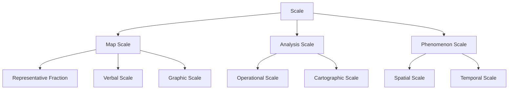

### Map Scale

Map scale describes the mathematical relationship between distances or areas on a map and the corresponding distances or areas on the Earth's surface.

#### Types of Map Scale

1. **Representative Fraction (RF)**
   - Expressed as a ratio or fraction (e.g., 1:24,000 or 1/24,000)
   - The numerator (1) represents distance on the map
   - The denominator represents the corresponding distance on the ground
   - Scale-independent (can be used with any unit of measurement)

2. **Verbal Scale**
   - Expresses the relationship in words
   - Example: "1 inch represents 1 mile" or "1 centimeter represents 1 kilometer"
   - Dependent on specific units

3. **Graphic Scale (Bar Scale)**
   - A line or bar marked with distances
   - Maintains accuracy even when the map is resized
   - Visual representation of distance

#### Scale Categories

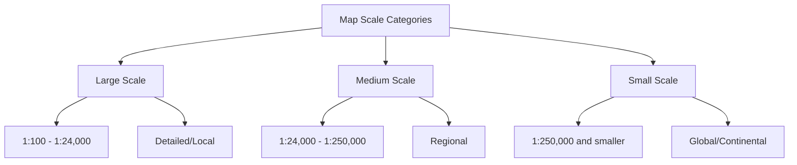

1. **Large Scale Maps** (smaller denominator)
   - Show smaller areas in greater detail
   - Examples: 1:1,200 (site plans), 1:24,000 (USGS topographic quadrangles)
   - Used for: Property mapping, urban planning, facility management

2. **Medium Scale Maps**
   - Balance between detail and coverage
   - Examples: 1:50,000, 1:100,000 (regional maps)
   - Used for: County planning, transportation networks

3. **Small Scale Maps** (larger denominator)
   - Show larger areas with less detail
   - Examples: 1:1,000,000 (national maps), 1:50,000,000 (world maps)
   - Used for: National/global patterns, thematic mapping

### The Scale Paradox

In cartography, there's a terminological paradox:
- "Large scale" maps show small areas with high detail
- "Small scale" maps show large areas with low detail

This can be explained by thinking of the representative fraction: 1/10,000 is mathematically larger than 1/1,000,000.

### Analysis Scale vs. Cartographic Scale

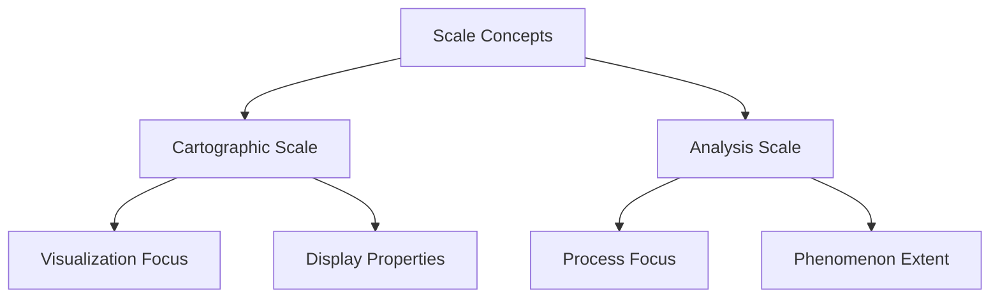

1. **Cartographic Scale**: Related to visualization
   - Concerns how features are displayed on maps
   - Affects symbol sizes, line weights, text placement
   - Guides map generalization decisions

2. **Analysis Scale**: Related to geographic phenomena
   - The spatial extent at which processes operate
   - Determines appropriate methods and data
   - Example: Watershed analysis at local vs. regional scales

## Resolution Concepts

Resolution refers to the level of detail or granularity in geospatial data. It's the minimum size at which features or changes can be detected.

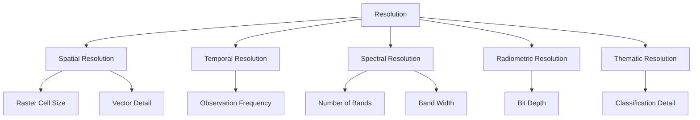

### Spatial Resolution

Spatial resolution refers to the smallest discernible detail in an image or the minimum size of features that can be represented in a dataset.

#### Raster Spatial Resolution

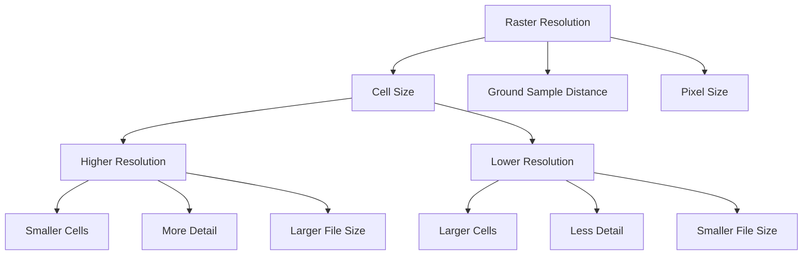

- **Cell Size**: The dimensions of each raster cell in ground units (e.g., 30m x 30m)
- **Ground Sample Distance (GSD)**: The distance between pixel centers measured on the ground
- **Pixel Resolution**: Often expressed as a single value (e.g., "30-meter resolution")

Examples of common raster resolutions:
- Very high resolution: < 1 meter (aerial imagery, satellite imagery like WorldView)
- High resolution: 1-10 meters (Sentinel-2, SPOT)
- Medium resolution: 10-100 meters (Landsat, MODIS)
- Low resolution: > 100 meters (Climate data, global datasets)

#### Vector Spatial Resolution

For vector data, resolution relates to:
- **Vertex Density**: Number of vertices used to represent linear or polygon features
- **Minimum Mapping Unit**: Smallest area that can be represented as a distinct feature
- **Coordinate Precision**: Number of decimal places used to store coordinates

### Temporal Resolution

Temporal resolution refers to the frequency of data collection or the time interval between observations.

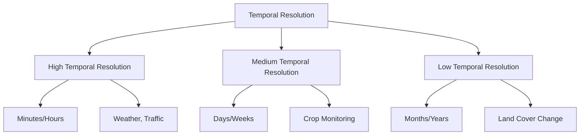

Examples:
- **High temporal resolution**: 
  - Weather satellites (15-minute intervals)
  - Traffic sensors (real-time)
  - Geostationary satellites (hourly)
  
- **Medium temporal resolution**:
  - Landsat (16-day revisit)
  - Sentinel-2 (5-day revisit with two satellites)
  
- **Low temporal resolution**:
  - Annual land cover maps
  - Census data (10-year intervals)
  - Historical imagery (sporadic collection)

### Other Resolution Types

1. **Spectral Resolution**
   - Number and width of spectral bands in remote sensing data
   - Higher spectral resolution = more bands or narrower bandwidths
   - Examples: 
     - Low: RGB (3 bands)
     - Medium: Landsat 8 (11 bands)
     - High: Hyperspectral sensors (hundreds of bands)

2. **Radiometric Resolution**
   - The number of possible brightness values in each band
   - Measured in bits (e.g., 8-bit = 256 values, 16-bit = 65,536 values)
   - Higher radiometric resolution allows detection of subtler differences

3. **Thematic Resolution**
   - Level of detail in classification or categorization
   - Example: Land cover classified into 4 classes vs. 16 classes

## Scale and Resolution Relationships

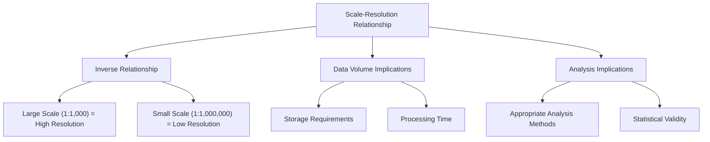

Key relationships:
- Large scale maps typically represent data with high spatial resolution
- Small scale maps typically represent data with low spatial resolution
- Higher resolution data requires more storage and processing power
- The appropriate resolution depends on the scale of analysis

## Generalization and Scale

Generalization is the process of reducing the complexity of geographic data to match the target scale and purpose of a map or analysis.

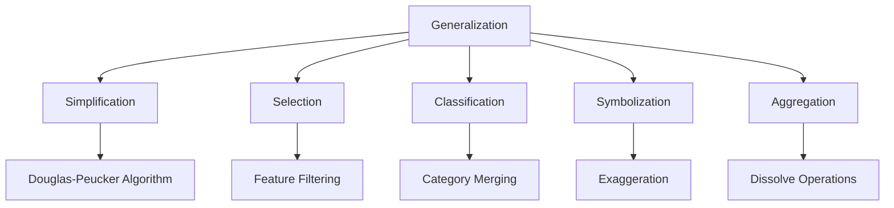

### Generalization Operators

1. **Simplification**: Reducing the number of vertices in lines or polygons
   - Example: Douglas-Peucker algorithm reduces detail while preserving shape

2. **Selection**: Choosing which features to include based on importance
   - Example: Showing only major roads on a small-scale map

3. **Classification**: Grouping features into broader categories
   - Example: Detailed land use classes combined into general categories

4. **Symbolization**: Adapting symbols to match scale
   - Example: Roads shown as lines vs. roads shown to scale

5. **Aggregation**: Combining multiple features into single features
   - Example: Individual buildings becoming urban area polygons

### Generalization Challenges

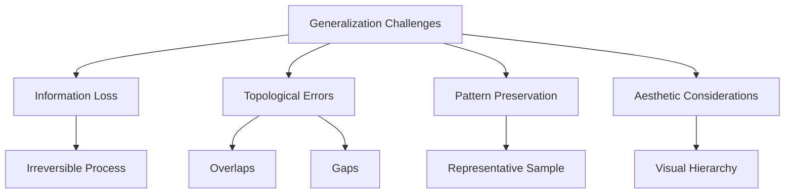

- **Information Loss**: Generalization inevitably removes detail
- **Topological Consistency**: Maintaining spatial relationships during simplification
- **Representativeness**: Ensuring the generalized data still represents the underlying pattern
- **Automation vs. Manual Work**: Finding the right balance between automated processes and cartographic judgment

## Scale and Resolution in GIS Analysis

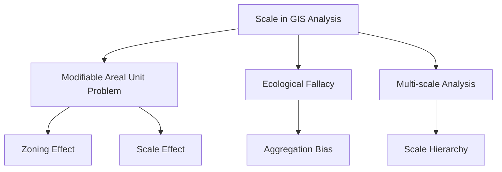

### The Modifiable Areal Unit Problem (MAUP)

The MAUP refers to how statistical results can vary when the same data is aggregated in different ways:

1. **Scale Effect**: Results change when data is aggregated to larger or smaller units
   - Example: Analysis at census block vs. county vs. state level yields different patterns

2. **Zoning Effect**: Results change when the boundaries of units are redrawn
   - Example: Electoral districts can be redrawn to influence voting outcomes

### Scale-Dependent Analysis

Different geographic processes operate at different scales:
- **Micro-scale**: Individual behavior, site-specific processes
- **Meso-scale**: Neighborhood effects, local patterns
- **Macro-scale**: Regional trends, global patterns

### Choosing Appropriate Resolution for Analysis

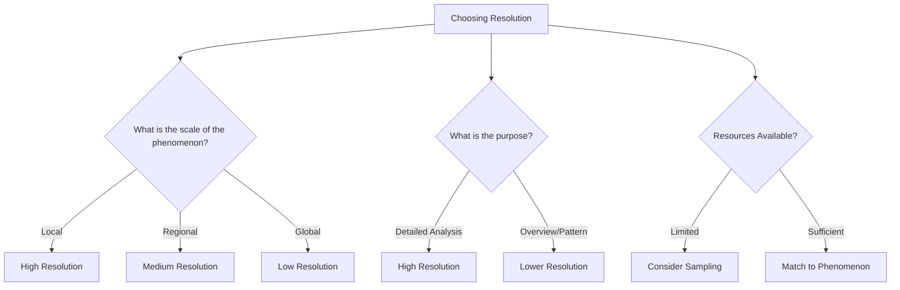

Factors to consider:
1. **Purpose of analysis**: What questions are you trying to answer?
2. **Scale of the phenomenon**: What is the natural scale of what you're studying?
3. **Data availability**: What is the finest resolution data available?
4. **Computing resources**: Can you process very high-resolution data?
5. **Time constraints**: How quickly do you need results?

## Practical Applications and Code Examples

### Resampling Raster Data in Python

```python
import rasterio
from rasterio.enums import Resampling

# Open the input raster
with rasterio.open('input.tif') as src:
    # Calculate the new dimensions
    # Resample to 50% of the original resolution
    new_width = src.width // 2
    new_height = src.height // 2
    
    # Define the scaling factors
    scale_factor_x = src.width / new_width
    scale_factor_y = src.height / new_height
    
    # Create a new transformation for the output
    transform = src.transform * src.transform.scale(
        (scale_factor_x, scale_factor_y)
    )
    
    # Resample the raster
    data = src.read(
        out_shape=(src.count, new_height, new_width),
        resampling=Resampling.bilinear
    )
    
    # Update the metadata
    profile = src.profile
    profile.update({
        'height': new_height,
        'width': new_width,
        'transform': transform
    })
    
    # Write the resampled raster to a new file
    with rasterio.open('resampled.tif', 'w', **profile) as dst:
        dst.write(data)
```

### Simplifying Vector Data with GeoPandas

```python
import geopandas as gpd
import matplotlib.pyplot as plt

# Load a complex shapefile
complex_shapes = gpd.read_file('complex_boundaries.shp')

# Create simplified versions at different tolerances
simplified_light = complex_shapes.copy()
simplified_medium = complex_shapes.copy()
simplified_heavy = complex_shapes.copy()

# Apply simplification with different tolerances
# (tolerance in the same units as the CRS)
simplified_light['geometry'] = simplified_light.simplify(100)
simplified_medium['geometry'] = simplified_medium.simplify(500)
simplified_heavy['geometry'] = simplified_heavy.simplify(1000)

# Calculate the reduction in vertices
def count_vertices(gdf):
    return sum(len(geom.exterior.coords) for geom in gdf.geometry)

original_vertices = count_vertices(complex_shapes)
light_vertices = count_vertices(simplified_light)
medium_vertices = count_vertices(simplified_medium)
heavy_vertices = count_vertices(simplified_heavy)

print(f"Original: {original_vertices} vertices")
print(f"Light simplification: {light_vertices} vertices ({light_vertices/original_vertices:.1%})")
print(f"Medium simplification: {medium_vertices} vertices ({medium_vertices/original_vertices:.1%})")
print(f"Heavy simplification: {heavy_vertices} vertices ({heavy_vertices/original_vertices:.1%})")

# Plot the results
fig, axs = plt.subplots(2, 2, figsize=(10, 10))
complex_shapes.plot(ax=axs[0, 0])
axs[0, 0].set_title('Original')
simplified_light.plot(ax=axs[0, 1])
axs[0, 1].set_title('Light Simplification')
simplified_medium.plot(ax=axs[1, 0])
axs[1, 0].set_title('Medium Simplification')
simplified_heavy.plot(ax=axs[1, 1])
axs[1, 1].set_title('Heavy Simplification')
plt.tight_layout()
plt.savefig('simplification_comparison.png')
```

## Best Practices for Working with Scale and Resolution

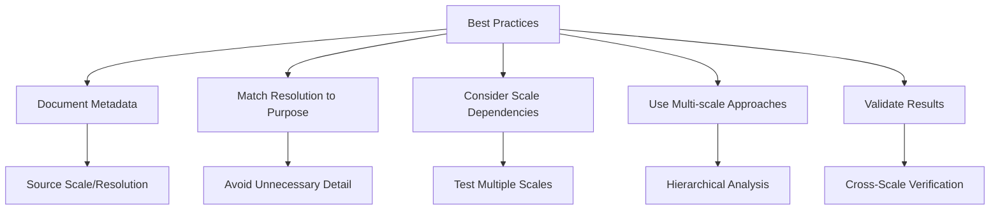

1. **Document Scale and Resolution in Metadata**
   - Always record the scale of source materials
   - Document any resampling or generalization applied
   - Note the intended scale range for use

2. **Match Resolution to Purpose**
   - Higher resolution isn't always better
   - Consider purpose, accuracy requirements, and resources
   - Balance detail with processing requirements

3. **Be Aware of Scale Dependencies**
   - Recognize that some patterns only emerge at specific scales
   - Test analyses at multiple scales when appropriate
   - Report the scale at which results are valid

4. **Apply Appropriate Generalization**
   - Use accepted generalization algorithms
   - Validate results to ensure they represent the original data
   - Preserve important topological relationships

5. **Consider Multi-scale Approaches**
   - Represent data at multiple scales for different uses
   - Use scale-dependent rendering in web maps
   - Consider hierarchical data structures (quadtrees, pyramids)

## Future Trends in Scale and Resolution

- **Adaptive Resolution**: Data structures that adapt detail based on importance
- **On-the-fly Generalization**: Real-time simplification for web mapping
- **Multi-scale Databases**: Storing data once but serving at multiple scales
- **Deep Learning for Generalization**: Using AI to create cartographically pleasing generalizations
- **Scale-Aware Analytics**: Methods that automatically adjust to the scale of analysis

## Further Reading

- [Scale and Geographic Inquiry](https://www.wiley.com/en-us/Scale+and+Geographic+Inquiry%3A+Nature%2C+Society%2C+and+Method-p-9780631230687)
- [ESRI: Map Generalization in GIS](https://www.esri.com/en-us/smart-mapping/overview)
- [The Modifiable Areal Unit Problem](https://www.routledge.com/The-Modifiable-Areal-Unit-Problem/Openshaw/p/book/9780860941347)
- [Multi-scale Spatial Databases](https://www.mdpi.com/2220-9964/8/6/273)
- [OGC Scale-Dependent Styling](https://www.ogc.org/standards/se) 