# Spatial Data Models

Spatial data models are conceptual frameworks for organizing and representing geographic features and their relationships. They provide the structure that determines how geographic information is stored, processed, and visualized in geographic information systems (GIS).

## Core Spatial Data Models

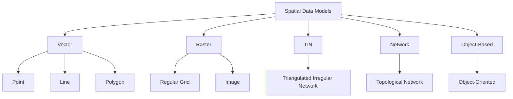

## Vector Data Model

The vector data model represents geographic features as discrete geometric objects with explicit coordinates.

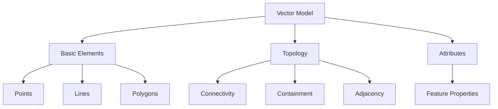

### Vector Primitives

1. **Points**
   - Represented by x,y coordinates (and potentially z for 3D)
   - Used for discrete locations (cities, wells, sampling sites)
   - No dimension; occupies no area

2. **Lines/Polylines**
   - Series of connected points forming a linear feature
   - Used for linear features (roads, rivers, contours)
   - Has length but no area

3. **Polygons**
   - Closed area bounded by lines
   - Used for area features (lakes, administrative boundaries, parcels)
   - Has perimeter and area

### Topological Vector Models

Topology in vector models explicitly stores spatial relationships between features:

- **Nodes**: Points where lines intersect
- **Edges**: Line segments between nodes
- **Faces**: Areas enclosed by edges

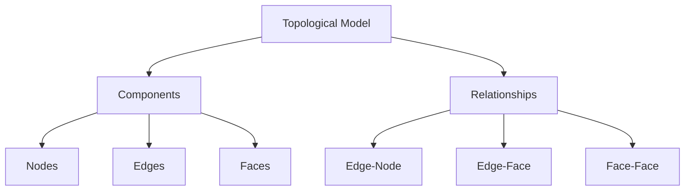

Advantages of topological models:
- Efficient spatial analysis
- Prevention of errors (gaps, overlaps)
- Reduced data redundancy

### Non-topological (Simple Features) Model

Simple feature models store geometries without explicit topological relationships:
- Each feature is independent
- Coordinates are stored redundantly
- Faster to render, simpler to implement
- Example: OGC Simple Features specification

### Common Vector Formats

| Format | Description | Use Cases |
|--------|-------------|-----------|
| Shapefile | Set of files (.shp, .dbf, .shx, etc.) | Standard for distributing vector data |
| GeoJSON | JSON-based open format | Web mapping, data interchange |
| KML/KMZ | XML-based format | Google Earth, visualization |
| GeoPackage | SQLite container | Comprehensive geodatabase |
| GML | Geography Markup Language | Data interchange, complex features |
| FileGDB | Esri's proprietary format | Enterprise GIS |

## Raster Data Model

The raster data model divides space into a regular grid of cells, each with one or more values.

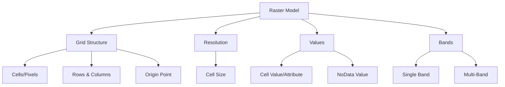

### Raster Components

1. **Cells/Pixels**: The fundamental unit of a raster
   - Each cell represents a portion of geographic space
   - Contains one value per band

2. **Resolution**: The size of each cell in ground units
   - Determines level of detail and file size
   - May be different in x and y directions

3. **Extent**: The geographic area covered by the raster
   - Defined by coordinates of corners

4. **Origin**: The reference point (typically upper-left or lower-left corner)

5. **Bands**: Layers of values in the raster
   - Single-band: One value per cell (e.g., elevation)
   - Multi-band: Multiple values per cell (e.g., RGB imagery)

### Raster Types

1. **Thematic Rasters**
   - Categorical data (land cover, soil types)
   - Integer values representing classes

2. **Continuous Rasters**
   - Numeric values representing continuous phenomena
   - Examples: Elevation, temperature, precipitation

3. **Imagery**
   - Aerial and satellite imagery
   - Multiple bands representing spectral information

### Common Raster Formats

| Format | Description | Use Cases |
|--------|-------------|-----------|
| GeoTIFF | Georeferenced Tagged Image File Format | Standard for raster data |
| NetCDF | Network Common Data Form | Scientific data, multidimensional data |
| JPEG2000 | Compressed image format with georeference | Efficient storage of imagery |
| ASCII Grid | Simple text format | Terrain data, compatibility |
| HDF | Hierarchical Data Format | Remote sensing, complex datasets |
| Cloud Optimized GeoTIFF | Web-optimized GeoTIFF | Cloud/web access to large rasters |

## TIN (Triangulated Irregular Network)

A TIN is a vector-based model for representing continuous surfaces, particularly terrain.

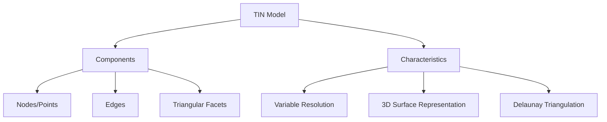

- **Nodes**: Points with x,y,z coordinates
- **Edges**: Lines connecting nodes
- **Triangular Facets**: Planar triangles formed by edges

Advantages of TINs:
- Variable resolution (more detail in complex areas)
- Accurate representation of features like ridges and valleys
- More efficient storage for terrain than equivalent raster

Use cases:
- Digital Elevation Models (DEMs)
- Hydrology modeling
- Visibility analysis
- 3D visualization

## Network Data Model

The network data model represents connected linear features and their relationships.

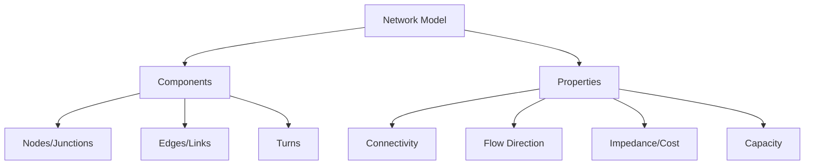

- **Nodes**: Junctions where multiple edges meet
- **Edges**: Connections between nodes with properties
- **Turn**: Restrictions or costs for moving between edges

Types of networks:
- **Geometric Networks**: Represent water, electrical, or other utility systems
- **Transportation Networks**: Roads, railways, transit systems
- **Hydrological Networks**: River systems and watersheds

Use cases:
- Routing and navigation
- Network analysis (shortest path, closest facility)
- Flow modeling and capacity analysis
- Service area delineation

## Object-Based Models

Object-based models organize spatial data as discrete objects with properties, behaviors, and relationships.

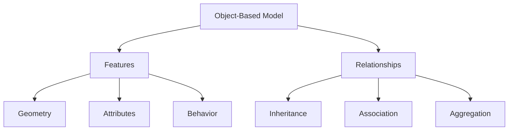

Key concepts:
- **Encapsulation**: Objects combine data and functionality
- **Inheritance**: Objects can inherit properties from parent classes
- **Polymorphism**: Different implementations for different object types

Examples:
- **OGC Simple Features**: Standard object model for spatial data
- **ArcGIS Geodatabase**: Esri's object-based data storage model
- **Oracle Spatial**: Object-relational spatial database

## Voxel Data Model

The voxel data model extends the raster concept to 3D space, representing data as a 3D grid of volume elements.

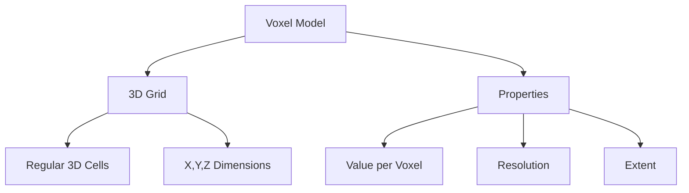

Applications:
- Geological modeling
- Atmospheric and oceanographic data
- Medical imaging
- 3D visualization of subsurface features

## Point Cloud Data Model

Point clouds are collections of 3D points, often generated by LiDAR or photogrammetry.

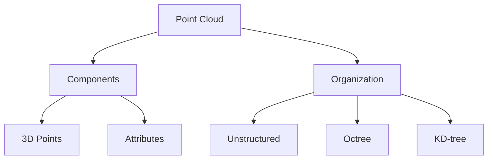

Each point typically includes:
- X, Y, Z coordinates
- Intensity/return value
- Classification
- RGB color (in some cases)
- Time stamp

Common formats:
- LAS/LAZ (industry standard)
- E57 (for 3D imaging data)
- PLY, XYZ, PTS (simpler formats)

## Comparison of Spatial Data Models

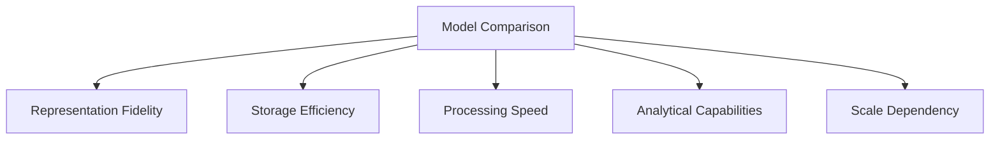

| Aspect | Vector | Raster | TIN | Network | Point Cloud |
|--------|--------|--------|-----|---------|-------------|
| Best for | Discrete features | Continuous phenomena | Terrain with variable detail | Connected systems | 3D surface capture |
| Storage Efficiency | High for sparse data | Lower (fixed resolution) | Moderate | High | Very low |
| Analysis Capabilities | Topology, networks | Map algebra, surface analysis | 3D analysis, visibility | Routing, allocation | 3D surface measurement |
| Scale Dependency | Less scale-dependent | Resolution-dependent | Adaptive resolution | Moderate | Resolution-dependent |
| Visualization | Crisp boundaries | Pixelated at high zoom | Smooth surfaces | Network diagrams | Realistic 3D scenes |

## Data Model Integration

Modern GIS often combines multiple data models:

- **Hybrid Models**: Combining vector and raster for different analysis
- **Multi-resolution Models**: Different detail levels for different scales
- **Integrated Databases**: Storing multiple data types in a single system

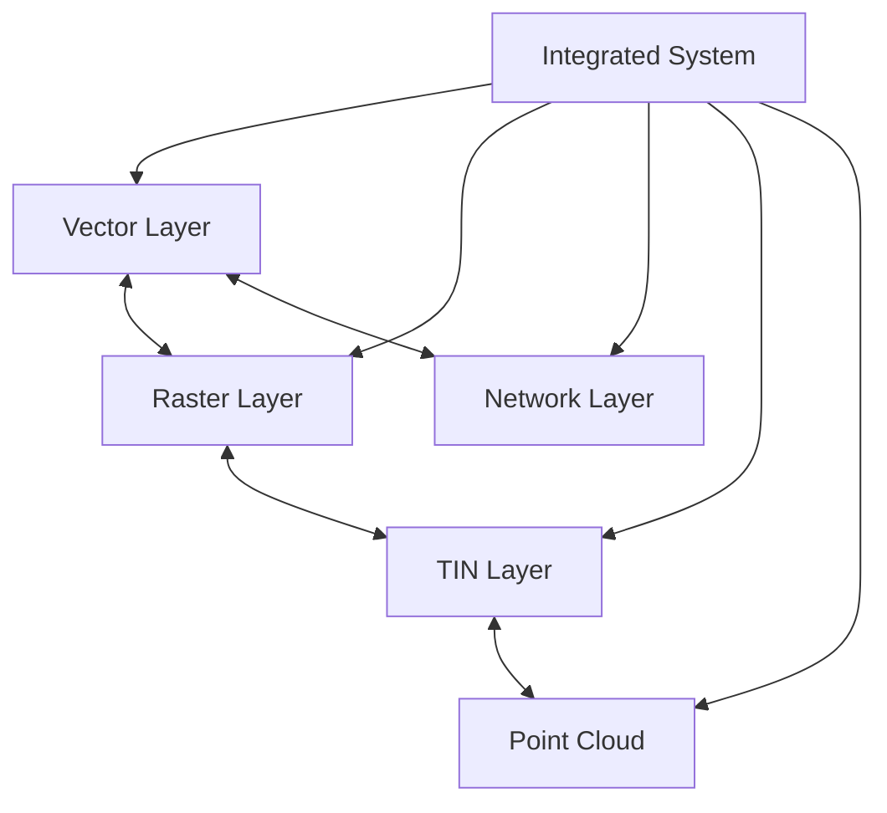

## Practical Considerations

### Model Selection Criteria

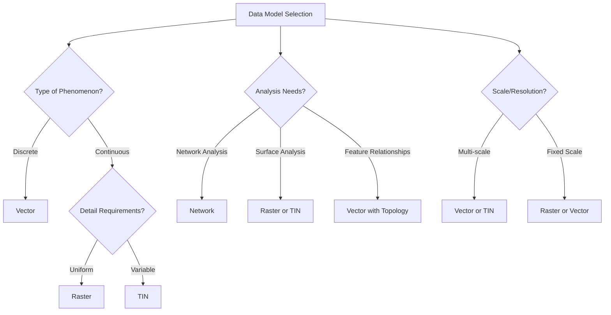

Factors to consider when selecting a data model:
1. Nature of the phenomena being represented
2. Analysis requirements
3. Data volume and storage constraints
4. Visualization requirements
5. Performance requirements

### Code Example: Working with Different Data Models in Python

```python
# Working with vector data using GeoPandas
import geopandas as gpd

# Read a shapefile
vector_data = gpd.read_file("boundaries.shp")
print(vector_data.head())

# Basic spatial operations
buffered = vector_data.buffer(1000)  # Buffer polygons by 1km
dissolved = vector_data.dissolve(by="region")  # Dissolve by attribute

# Working with raster data using Rasterio
import rasterio
import numpy as np

# Open a raster file
with rasterio.open("elevation.tif") as src:
    # Read the data and metadata
    elevation = src.read(1)  # Read first band
    transform = src.transform
    
    # Get statistics
    min_elev = np.min(elevation)
    max_elev = np.max(elevation)
    mean_elev = np.mean(elevation)
    
    # Sample a point
    value = next(src.sample([(345000, 4745000)]))

# Working with network data using NetworkX
import networkx as nx

# Create a road network
G = nx.DiGraph()

# Add nodes (intersections)
G.add_node(1, pos=(0, 0))
G.add_node(2, pos=(1, 1))
G.add_node(3, pos=(0, 2))

# Add edges (road segments) with attributes
G.add_edge(1, 2, weight=5, road_type="highway")
G.add_edge(2, 3, weight=3, road_type="local")
G.add_edge(1, 3, weight=7, road_type="highway")

# Find shortest path
shortest_path = nx.shortest_path(G, 1, 3, weight="weight")
```

## Future Trends in Spatial Data Models

- **Integration of Space and Time**: Moving from static to dynamic spatiotemporal models
- **3D/4D Modeling**: Increasing adoption of full 3D and 4D (space + time) data models
- **Indoor Mapping Models**: Specialized models for interior spaces and navigation
- **Voxel-based Analysis**: Growing use of voxels for environmental and urban modeling
- **Graph-based Models**: Network representations for complex spatial relationships
- **Big Data Optimizations**: Models designed for distributed processing
- **Cloud-native Data Models**: Optimized for cloud storage and processing

## Further Reading

- [ESRI: Understanding GIS Data Models](https://www.esri.com/en-us/what-is-gis/spatial-data-infrastructure/data-models)
- [OGC Simple Features Specification](https://www.ogc.org/standards/sfa)
- [The Nature of Geographic Information](https://www.e-education.psu.edu/natureofgeoinfo/)
- [GDAL Documentation](https://gdal.org/user/raster_data_model.html)
- [GeoTools Data Model](https://docs.geotools.org/latest/userguide/library/main/feature.html) 