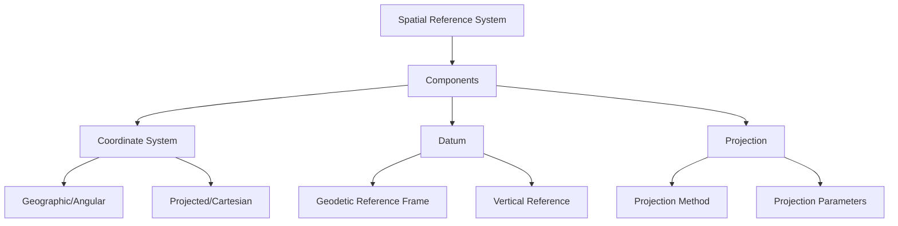
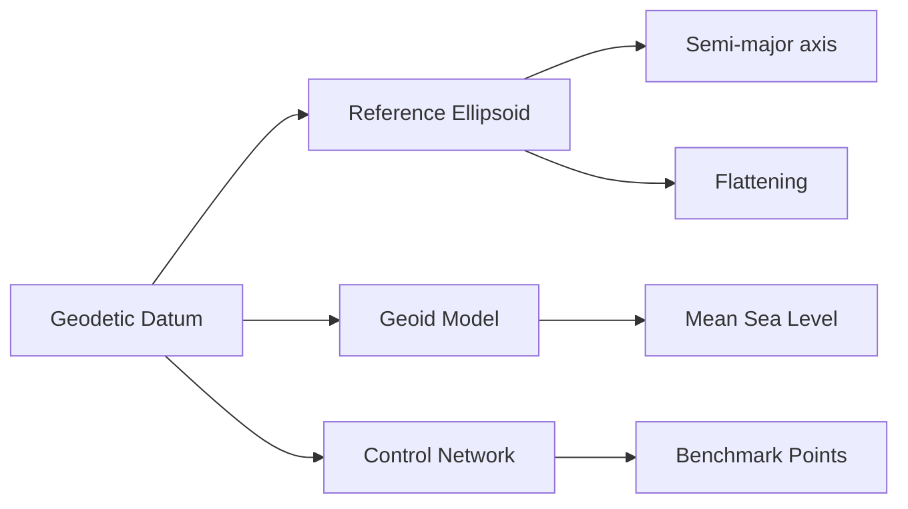
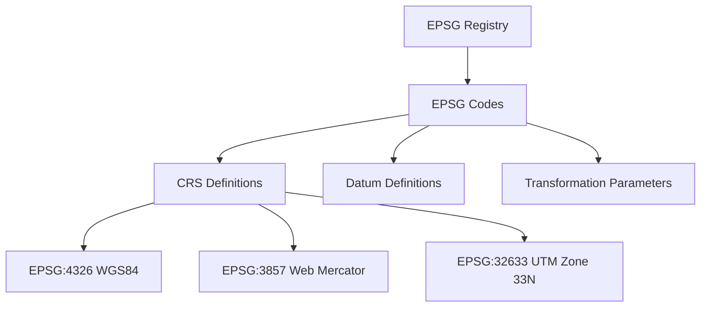
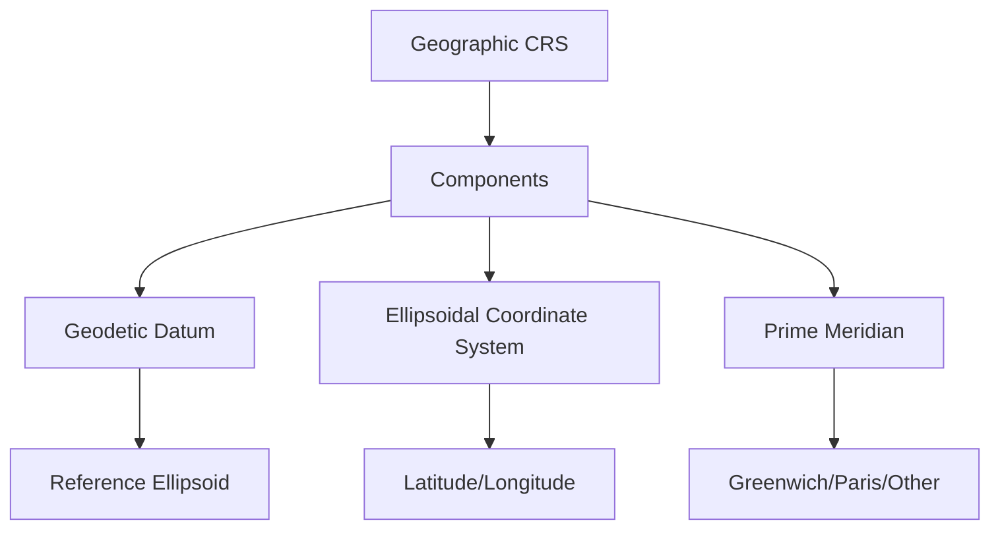
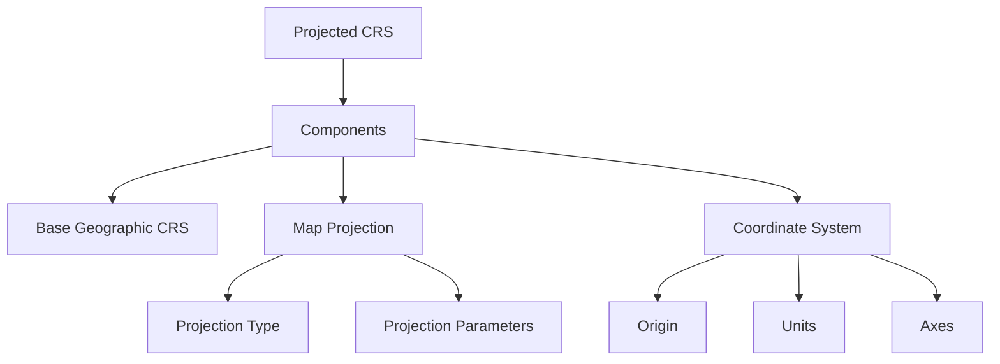
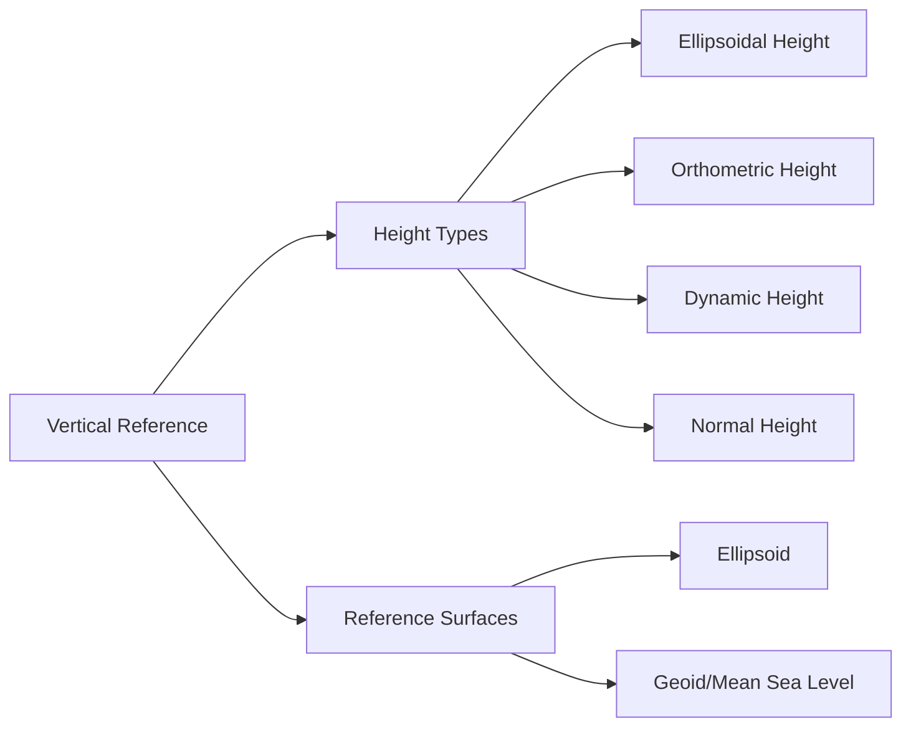
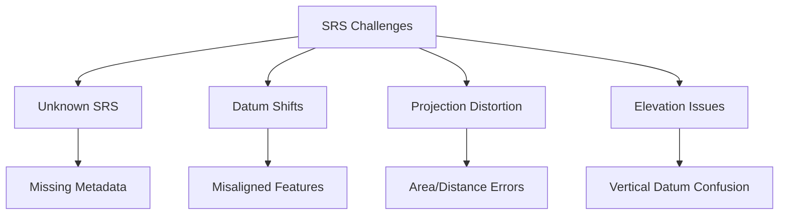
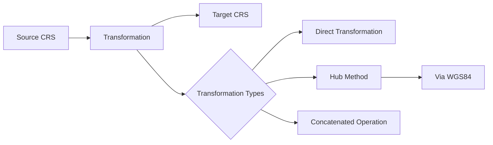

# Spatial Reference Systems

Spatial Reference Systems (SRS), also known as Coordinate Reference Systems (CRS), provide standardized frameworks for defining locations in geographic space. They are the foundation for all spatial data and ensure consistency in how locations are recorded, analyzed, and visualized.

## Understanding Spatial Reference Systems



A complete Spatial Reference System consists of:

1. **Coordinate System**: The mathematical framework (geographic or projected)
2. **Datum**: The model of the Earth's shape and its orientation in space
3. **Projection Parameters**: For projected systems, the mathematical transformations applied

## Geodetic Datums



- **Reference Ellipsoid**: A mathematical approximation of the Earth's shape
  - Defined by parameters such as semi-major axis and flattening
  - Examples: GRS80, WGS84 ellipsoid, Clarke 1866
  
- **Geoid**: The equipotential surface of the Earth's gravity field that approximates mean sea level
  - Serves as the reference for orthometric heights (elevations)
  - Varies from the ellipsoid by up to ±100 meters globally

- **Control Network**: A set of physical points with precisely measured coordinates
  - Provides the foundation for accurate positioning
  - Examples: NGS control points in the US, IGS stations globally

### Reference Frames vs. Datums

While often used interchangeably, there is a distinction:

- **Datum**: The mathematical model of the Earth
- **Reference Frame**: The physical realization of a datum through a network of control points

Examples of reference frames:
- ITRF2014 (International Terrestrial Reference Frame 2014)
- NAD83(2011) - North American Datum of 1983, 2011 adjustment

## Standardization and Identification

### EPSG Registry

The EPSG Registry (European Petroleum Survey Group, now maintained by the International Association of Oil & Gas Producers) provides a comprehensive database of coordinate reference systems, datums, and transformations.



Common EPSG codes:
- **EPSG:4326**: WGS84 geographic coordinate system (latitude/longitude)
- **EPSG:3857**: Web Mercator projection used by online mapping services
- **EPSG:4269**: NAD83 geographic coordinate system for North America
- **EPSG:326xx**: UTM zones (North)
- **EPSG:327xx**: UTM zones (South)

### Other Standards

- **OGC WKT (Well-Known Text)**: Text representation of spatial reference systems
- **PROJ Strings**: Compact string notation used by the PROJ library
- **ISO 19111**: Geographic information — Spatial referencing by coordinates

## Types of Spatial Reference Systems

### Geographic Coordinate Reference Systems



Geographic CRS uses angular units (degrees) to define positions on the Earth's surface:
- Coordinates are expressed as latitude and longitude
- Doesn't address the Earth's curvature for measurement purposes
- Examples: WGS84 (EPSG:4326), NAD83 (EPSG:4269)

### Projected Coordinate Reference Systems



Projected CRS transforms the curved Earth surface to a flat plane:
- Coordinates are expressed in linear units (meters, feet)
- Allows for direct measurement of distances, areas, and angles
- Examples: UTM zones (EPSG:326xx), State Plane (US), National Grids (UK, France)

### Vertical Reference Systems



Vertical reference systems define heights:
- **Orthometric Height**: Height above the geoid (approximately mean sea level)
- **Ellipsoidal Height**: Height above the reference ellipsoid
- **Dynamic Height**: Based on geopotential numbers
- **Normal Height**: Theoretical height above the quasigeoid

Examples: NAVD88 (North American Vertical Datum 1988), EGM96 geoid model

### Compound Coordinate Reference Systems

Combines horizontal and vertical reference systems:
- Defines both horizontal position and height
- Example: NAD83 + NAVD88 for complete 3D positioning in North America

## Practical Applications

### Code Example: Working with CRS in Python

```python
import pyproj
from pyproj import CRS
from pyproj import Transformer

# Create a CRS object from an EPSG code
wgs84 = CRS.from_epsg(4326)
utm33n = CRS.from_epsg(32633)

# Get information about a CRS
print(wgs84.name)  # "WGS 84"
print(wgs84.is_geographic)  # True
print(utm33n.is_projected)  # True

# Transform coordinates between CRS
transformer = Transformer.from_crs(wgs84, utm33n, always_xy=True)
lng, lat = 15.0, 52.0
easting, northing = transformer.transform(lng, lat)
print(f"Easting: {easting}, Northing: {northing}")

# Get the WKT representation of a CRS
wkt = wgs84.to_wkt(pretty=True)
print(wkt)
```

### Real-World Use Cases

| Application | Typical SRS Used | Reason |
|-------------|------------------|--------|
| GPS Navigation | WGS84 (EPSG:4326) | Global standard for GPS satellite system |
| Web Mapping | Web Mercator (EPSG:3857) | Optimized for global web display, preserves shape |
| Cadastral Mapping | Local projected systems | Minimizes distortion in local areas |
| Aviation | WGS84 + various vertical datums | International standard for air navigation |
| Marine Navigation | WGS84 + chart datums | Global standard with local tide-based references |
| National Mapping | National projected systems | Optimized for each country's extent |

## Common Issues and Best Practices

### Challenges with Spatial Reference Systems



### Best Practices

1. **Always Document the SRS**: Include complete metadata with all spatial datasets
2. **Validate Source Data**: Verify the SRS before combining datasets
3. **Choose Appropriate SRS**: Select based on:
   - Geographic extent of the study area
   - Analysis requirements (area, distance, direction preservation)
   - Industry standards for your domain
4. **Transform Correctly**: Use established libraries and tools for coordinate transformations
5. **Test and Verify**: Check transformed data with known control points

## Transformation Between Reference Systems



### Transformation Methods

- **Direct Transformation**: Directly converts between two CRS
- **Hub Method**: Uses a common intermediate CRS (often WGS84)
- **Grid-based Transformations**: Uses interpolation with transformation grids for higher accuracy
- **Time-dependent Transformations**: Accounts for tectonic plate motion over time

### Transformation Parameters

- **Helmert Transformation**: 7-parameter transformation (3 translations, 3 rotations, 1 scale)
- **Molodensky Transformation**: Converts directly between ellipsoids
- **NTv2 Grids**: Grid-based transformations for higher accuracy (common in Canada, Australia)

## Future Trends

- **Dynamic Reference Frames**: Accounting for tectonic motion over time
- **Global Height System Unification**: Efforts to standardize vertical datums worldwide
- **Improved Geoid Models**: Higher accuracy geoid models for better vertical referencing
- **Time-dependent Transformations**: Standard methods for accounting for crustal motion

## Further Reading

- [EPSG Registry](https://epsg.org/)
- [OGC Coordinate Transformation Standards](https://www.ogc.org/standards/ct)
- [PROJ Documentation](https://proj.org/en/stable/)
- [ICSM Fundamentals of Mapping - Datums](https://www.icsm.gov.au/education/fundamentals-mapping/datums)
- [NOAA Geodetic Datums](https://geodesy.noaa.gov/datums/) 