# Spatial Relationships

Spatial relationships describe the ways geographic features relate to each other in space. Understanding these relationships is fundamental to spatial analysis, query operations, and data validation in geographic information systems (GIS).

## Types of Spatial Relationships

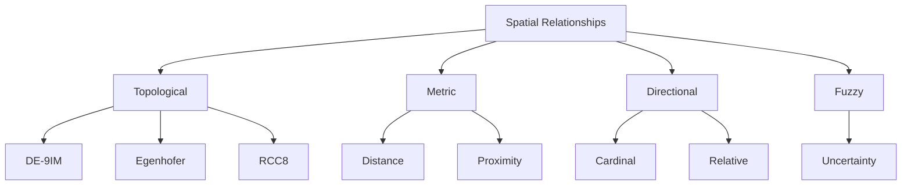

## Topological Relationships

Topological relationships describe how features share space, independent of distance or direction. They are invariant under continuous transformations (stretching, bending).

### DE-9IM (Dimensionally Extended 9-Intersection Model)

The DE-9IM is a mathematical framework for describing how two geometries relate to each other.

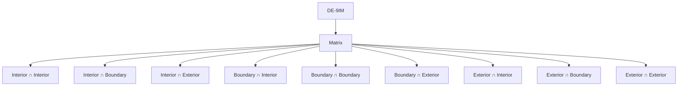

The DE-9IM matrix encodes the dimensionality of the intersection between:
- Interiors of the two geometries
- Boundaries of the two geometries
- Exteriors of the two geometries

### Common Topological Relationships

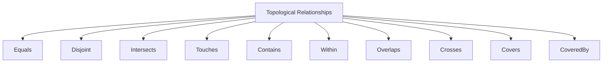

#### Equals
Two geometries that represent the same spatial extent.

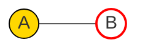

Example: Two different representations of the same country boundary.

#### Disjoint
Two geometries that have no points in common.

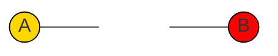

Example: Two separate cities that don't share any common area.

#### Intersects
Two geometries that have at least one point in common (the opposite of disjoint).

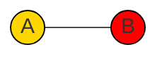

Example: A road that passes through a protected area.

#### Touches
Two geometries that have at least one point in common, but their interiors don't intersect.


Example: Two neighboring countries sharing a border.

#### Contains / Within
Feature A contains Feature B if B is completely inside A. Within is the inverse of contains (B is within A).

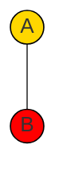

Example: A city completely within a state boundary.

#### Overlaps
Two geometries of the same dimension that share some but not all space, and the intersection has the same dimension.


Example: Two overlapping flood zones.

#### Crosses
Two geometries that share some interior points, but not all, and the intersection has lower dimension than the maximum dimension of the two geometries.

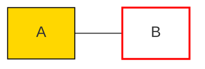

Example: A river crossing a road.

#### Covers / CoveredBy
Similar to contains/within, but allows the features to share boundary points.

## Metric Relationships

Metric relationships involve measurements of distance, size, and shape.

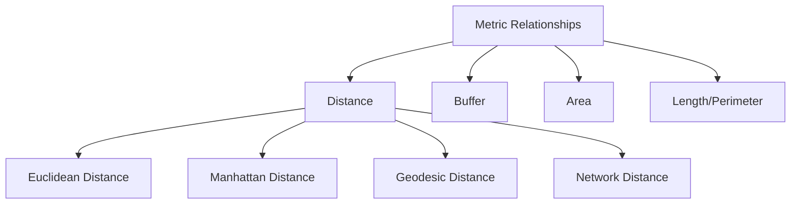

### Distance Measurements

Distance between features can be measured in various ways:

- **Euclidean Distance**: Straight-line distance in a 2D plane
  - Simple to calculate: √((x₂-x₁)² + (y₂-y₁)²)
  - Appropriate for smaller geographic areas

- **Geodesic Distance**: Distance along the Earth's surface
  - Accounts for the Earth's curvature
  - More accurate for longer distances
  - Calculated using methods like the Haversine formula or Vincenty's formula

- **Manhattan Distance**: Sum of horizontal and vertical distances
  - Used in grid-based or network-based analyses
  - Distance = |x₂-x₁| + |y₂-y₁|

- **Network Distance**: Distance along a network (like roads)
  - Requires a network dataset
  - More realistic for transportation analyses

### Proximity Relationships

Proximity describes how close features are to each other:

- **Nearest Neighbor**: Identification of the closest feature
- **Within Distance**: Features located within a specified distance
- **K-Nearest Neighbors**: The k closest features
- **Buffer**: Area within a specified distance of a feature

### Code Example: Distance Calculations

```python
from shapely.geometry import Point
import geopandas as gpd
import pyproj
from pyproj import Geod

# Euclidean distance between two points
point1 = Point(0, 0)
point2 = Point(3, 4)
euclidean_distance = point1.distance(point2)  # 5.0

# Geodesic distance between two coordinates
# Paris (2.35, 48.85) and New York (-74.00, 40.71)
geod = Geod(ellps="WGS84")
lon1, lat1 = 2.35, 48.85
lon2, lat2 = -74.00, 40.71
_, _, distance_meters = geod.inv(lon1, lat1, lon2, lat2)
distance_km = distance_meters / 1000  # Convert to kilometers

# Create a buffer of 10 km around a point
point = Point(lon1, lat1)
point_gdf = gpd.GeoDataFrame(geometry=[point], crs="EPSG:4326")
# Project to a projected CRS for accurate buffer
point_projected = point_gdf.to_crs("EPSG:3857")
buffer = point_projected.buffer(10000)  # 10 km buffer
buffer_wgs84 = gpd.GeoDataFrame(geometry=buffer, crs="EPSG:3857").to_crs("EPSG:4326")
```

## Directional Relationships

Directional relationships describe the relative orientation between features.

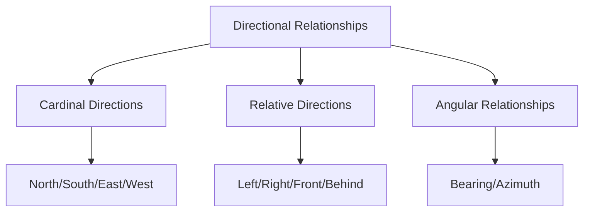

### Cardinal Directions

The fundamental directional relationships based on compass directions:
- North (N), South (S), East (E), West (W)
- Combinations: Northeast (NE), Northwest (NW), Southeast (SE), Southwest (SW)

These can be further refined into more granular directions (NNE, ENE, etc.).

### Relative Directions

Directions relative to a given orientation or perspective:
- Left/Right
- In front of/Behind
- Above/Below

### Angular Relationships

- **Bearing**: Angle measured clockwise from North (0-360°)
- **Azimuth**: Similar to bearing, used in navigation and surveying
- **Aspect**: Direction a slope faces, important in terrain analysis

### Code Example: Calculating Bearing

```python
import math

def calculate_bearing(lat1, lon1, lat2, lon2):
    """Calculate the bearing from point 1 to point 2 in degrees."""
    # Convert to radians
    lat1_rad = math.radians(lat1)
    lon1_rad = math.radians(lon1)
    lat2_rad = math.radians(lat2)
    lon2_rad = math.radians(lon2)
    
    # Calculate the bearing
    y = math.sin(lon2_rad - lon1_rad) * math.cos(lat2_rad)
    x = math.cos(lat1_rad) * math.sin(lat2_rad) - \
        math.sin(lat1_rad) * math.cos(lat2_rad) * math.cos(lon2_rad - lon1_rad)
    bearing_rad = math.atan2(y, x)
    
    # Convert to degrees
    bearing_deg = math.degrees(bearing_rad)
    bearing = (bearing_deg + 360) % 360  # Normalize to 0-360
    
    return bearing

# Example: Bearing from Paris to New York
paris_lat, paris_lon = 48.85, 2.35
ny_lat, ny_lon = 40.71, -74.00
bearing = calculate_bearing(paris_lat, paris_lon, ny_lat, ny_lon)
print(f"Bearing from Paris to New York: {bearing:.1f}°")

# Convert bearing to cardinal direction
def bearing_to_cardinal(bearing):
    directions = ["N", "NNE", "NE", "ENE", "E", "ESE", "SE", "SSE", 
                  "S", "SSW", "SW", "WSW", "W", "WNW", "NW", "NNW"]
    index = round(bearing / 22.5) % 16
    return directions[index]

cardinal = bearing_to_cardinal(bearing)
print(f"Cardinal direction: {cardinal}")
```

## Temporal-Spatial Relationships

Geographic features can also have temporal relationships, combining space and time.

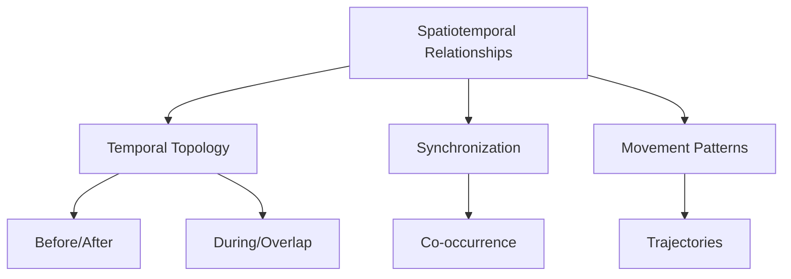

Examples of spatiotemporal relationships:
- **Co-location in time**: Features present at the same location at the same time
- **Sequential occupation**: Features present at the same location at different times
- **Tracking**: Following the movement of features over time
- **Changes in spatial relationships**: How topological relationships evolve over time

### Allen's Interval Algebra for Temporal Relations

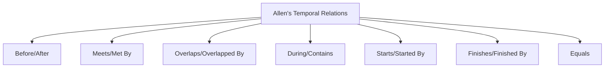

These temporal relationships can be combined with spatial relationships for complete spatiotemporal analysis.

## Fuzzy Spatial Relationships

In reality, spatial relationships are often not crisp but fuzzy, particularly when dealing with natural features or uncertainty.

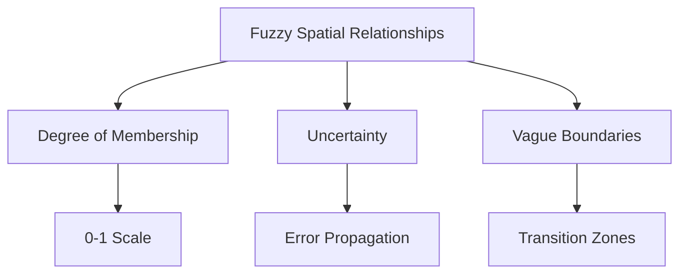

Examples:
- A lake "mostly within" a protected area
- A house "approximately 1 km" from a train station
- A river "partially overlapping" a floodplain

Fuzzy spatial relationships assign degrees of membership (typically 0-1) rather than binary yes/no values.

## Practical Applications of Spatial Relationships

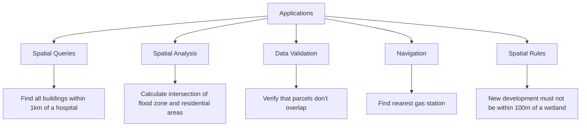

### GIS Operations Based on Spatial Relationships

| Operation | Description | Example |
|-----------|-------------|---------|
| Selection | Find features based on location | All houses in a flood zone |
| Join | Combine attributes based on spatial relationship | Add census tract data to points |
| Overlay | Create new features from intersections | Areas where soil type A overlaps with slope > 10% |
| Buffer Analysis | Create zones around features | 500m zones around schools |
| Network Analysis | Find paths, service areas | Closest facility, route planning |
| Spatial Statistics | Analyze patterns and distributions | Clustering analysis, spatial autocorrelation |

### Implementation in Common GIS Systems

#### SQL Implementation (PostGIS)

```sql
-- Find all buildings within 500m of rivers
SELECT b.building_id, b.name
FROM buildings b, rivers r
WHERE ST_DWithin(b.geom, r.geom, 500);

-- Find intersections between roads and flood zones
SELECT r.road_id, f.zone_id
FROM roads r, flood_zones f
WHERE ST_Intersects(r.geom, f.geom);

-- Find the city that contains a point of interest
SELECT c.city_name
FROM cities c, points_of_interest p
WHERE p.poi_id = 'POI123'
AND ST_Contains(c.geom, p.geom);
```

#### Python Implementation (GeoPandas)

```python
import geopandas as gpd

# Load datasets
cities = gpd.read_file("cities.shp")
rivers = gpd.read_file("rivers.shp")
points = gpd.read_file("points.shp")

# Find cities intersected by rivers
intersect_result = gpd.sjoin(cities, rivers, how="inner", predicate="intersects")

# Find the distance from each point to the nearest city
points['nearest_city'] = None
points['distance'] = None

for idx, point in points.iterrows():
    # Calculate distance to all cities
    distances = cities.geometry.distance(point.geometry)
    # Find the minimum distance and corresponding city
    min_idx = distances.idxmin()
    min_distance = distances[min_idx]
    nearest_city = cities.loc[min_idx, 'city_name']
    
    # Store results
    points.at[idx, 'nearest_city'] = nearest_city
    points.at[idx, 'distance'] = min_distance
```

## Challenges in Working with Spatial Relationships

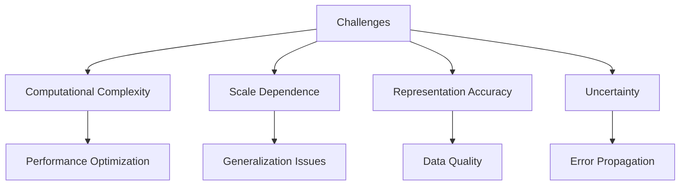

### Computational Complexity

Spatial relationship computations can be computationally intensive:
- Testing all pairs of features is O(n²) complexity
- Spatial indexing (R-trees, Quadtrees) helps improve performance
- Parallel processing for large datasets

### Scale and Precision Issues

Spatial relationships can vary depending on the scale and precision:
- Features that appear to touch at one scale may overlap at another
- Digital representation introduces quantization errors
- Floating-point precision affects calculations

### Uncertainty and Fuzziness

Real-world geographic features often have:
- Uncertain boundaries (e.g., wetlands, soil types)
- Positional accuracy limitations
- Temporal variability

## Best Practices

1. **Choose Appropriate Relationship Models**:
   - Use topological relationships for boundary analysis
   - Use distance-based relationships for proximity analysis
   - Consider fuzzy relationships for natural features

2. **Consider Computational Efficiency**:
   - Implement spatial indexing for large datasets
   - Filter data before performing expensive operations
   - Use simplification where appropriate

3. **Account for Data Quality**:
   - Validate topology before analysis
   - Consider positional accuracy in distance calculations
   - Document uncertainty in results

4. **Choose Appropriate Distance Measures**:
   - Use geodesic distances for large areas
   - Consider network distances for transportation analysis
   - Use 3D distances when elevation matters

## Further Reading

- [OGC Simple Features Specification](https://www.ogc.org/standards/sfa)
- [PostGIS Spatial Relationships](https://postgis.net/docs/reference.html#Spatial_Relationships)
- [ESRI: Understanding Spatial Relationships](https://desktop.arcgis.com/en/arcmap/latest/tools/coverage-toolbox/spatial-relationships.htm)
- [Egenhofer & Franzosa: Point-Set Topological Spatial Relations](https://www.researchgate.net/publication/220195745_Point-Set_Topological_Spatial_Relations)
- [Fuzzy Spatial Concepts](https://www.sciencedirect.com/science/article/abs/pii/S0169023X0000021X) 