# Temporal Dimensions in Geospatial Data

Time is a fundamental dimension in geospatial data and analysis, adding depth and complexity to our understanding of geographic phenomena. Incorporating temporal aspects allows us to model, analyze, and visualize how spatial patterns and relationships change over time, from milliseconds to millennia.

## Conceptualizing Space-Time

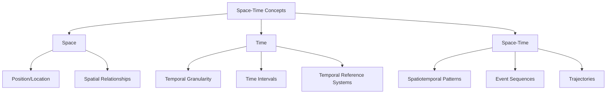

### Space-Time Frameworks

1. **Hägerstrand's Time Geography**
   - Represents individual movements through space and time
   - Key concepts: Space-time path, prism, station, bundle
   - Visualized as space-time cubes where vertical axis represents time

2. **Sinton's Framework**
   - Categorizes components as fixed, controlled, or measured
   - In spatiotemporal analysis, time can be any of these roles:
     - Fixed time, measure space (traditional maps)
     - Fixed space, measure time (site chronology)
     - Control both time and space (animation)

3. **Peuquet's Triad Framework**
   - Integrates three perspectives: what, where, and when
   - WHEN + WHERE → WHAT: What exists at a given location and time?
   - WHEN + WHAT → WHERE: Where is a given object at a specified time?
   - WHERE + WHAT → WHEN: When was a given object at a specific location?

## Temporal Aspects of Geospatial Data

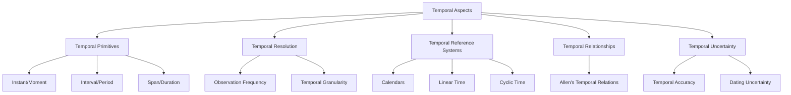

### Temporal Primitives

1. **Instant/Moment**
   - A point in time with no duration (theoretically)
   - Example: Timestamp of an earthquake event (2023-06-15T14:30:45Z)

2. **Interval/Period**
   - Time between two instants with a beginning and end
   - Example: Duration of a flood event (2023-03-10 to 2023-03-15)

3. **Span/Duration**
   - Length of time without specific anchoring
   - Example: A 30-minute rainfall event (without specifying when it occurred)

### Temporal Reference Systems

1. **Calendars and Clocks**
   - Gregorian calendar, Julian day, Unix time
   - International standards: ISO 8601 (YYYY-MM-DDThh:mm:ss.sssZ)

2. **Linear vs. Cyclic Time**
   - Linear: Continuous progression (historical events)
   - Cyclic: Recurring patterns (seasons, daily cycles, tides)

3. **Specialized Temporal References**
   - Geological time scale
   - Archaeological periods
   - Fiscal years, academic semesters

### Allen's Temporal Relations

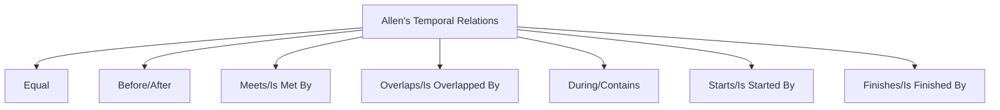

These 13 basic relations describe all possible relationships between time intervals:
- **Equal**: Intervals have same start and end times
- **Before/After**: One interval completely precedes another
- **Meets/Is Met By**: End of one interval coincides with start of another
- **Overlaps/Is Overlapped By**: Intervals overlap partially
- **During/Contains**: One interval falls completely within another
- **Starts/Is Started By**: Intervals start together but end differently
- **Finishes/Is Finished By**: Intervals end together but start differently

## Types of Temporal Geospatial Data

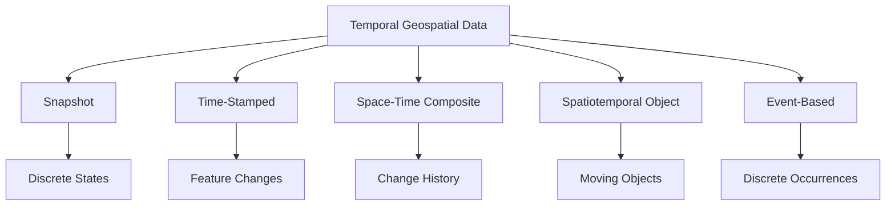

### Snapshot Model

- Series of complete spatial datasets at different time points
- Each snapshot represents state of entire study area at a specific time
- Simple but often storage-intensive
- Example: Land cover maps from different years

### Time-Stamped/Base State with Amendments

- Initial base state plus recorded changes
- Timestamps associated with features or attributes
- Efficient for sparse temporal changes
- Example: Parcel database with transaction dates

### Space-Time Composite

- Features split whenever any attribute changes
- Each unit has consistent history
- Efficient for analyzing change
- Example: Administrative boundaries with valid time periods

### Spatiotemporal Object/Moving Object

- Objects with continuously changing spatial properties
- Often represented as trajectories or functions
- Example: GPS tracks of vehicles, animal movements

### Event-Based Model

- Discrete occurrences with location and time
- Often point-based with attributes
- Example: Crime incidents, disease outbreaks, earthquakes

## Temporal Resolution and Sampling

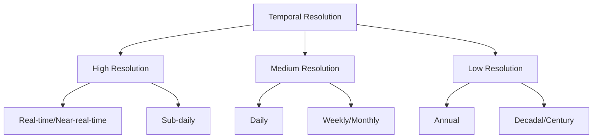

### Temporal Resolution Considerations

1. **Phenomenon Rate of Change**
   - Match resolution to speed of change
   - Fast processes (weather): Minutes to hours
   - Medium processes (vegetation growth): Days to months
   - Slow processes (geomorphology): Years to centuries

2. **Nyquist Frequency Principle**
   - Sampling rate must be at least twice the highest frequency component
   - Prevents temporal aliasing (misrepresenting change patterns)

3. **Regular vs. Irregular Sampling**
   - Regular: Fixed time intervals
   - Irregular: Event-driven or opportunistic
   - Trade-offs between consistency and information value

## Spatiotemporal Analysis Techniques

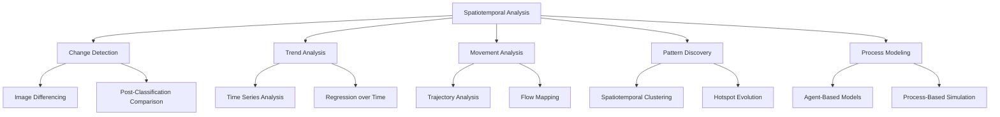

### Change Detection

Identifying differences between datasets from different times:
- **Binary Change Detection**: What changed vs. what didn't
- **From-To Change Analysis**: Transition between states
- **Continuous Change Variables**: Quantifying amount of change

### Temporal Trend Analysis

Analyzing patterns over time:
- **Simple Trends**: Linear, exponential, seasonal
- **Breakpoint Detection**: Identifying when significant changes occur
- **Spatial Variation of Temporal Trends**: Where is change happening fastest?

### Movement Analysis

Studying objects that change position:
- **Trajectory Mining**: Extracting patterns from movement data
- **Flow Analysis**: Aggregate movements between locations
- **Origin-Destination Analysis**: Understanding movement patterns

### Spatiotemporal Pattern Discovery

Finding patterns in both space and time:
- **Spatiotemporal Clustering**: Grouping similar events in space and time
- **Emerging Hot Spots**: Areas becoming more active
- **Spatiotemporal Autocorrelation**: How patterns of similarity evolve

### Process-Based Models

Simulating systems with temporal dynamics:
- **Cellular Automata**: Grid-based models with transition rules
- **Agent-Based Models**: Simulating individual entity behaviors
- **System Dynamics**: Modeling feedback loops and stocks/flows

## Code Example: Time Series Analysis of Satellite Data

```python
import rioxarray
import xarray as xr
import matplotlib.pyplot as plt
import numpy as np
from datetime import datetime
import pandas as pd
import seaborn as sns

# Load a time series of satellite images (NetCDF format)
# This example assumes we have NDVI data for an area over time
ds = xr.open_dataset('ndvi_timeseries.nc')

# Basic information about the dataset
print(f"Dataset dimensions: {ds.dims}")
print(f"Time range: {ds.time.values[0]} to {ds.time.values[-1]}")
print(f"Variables: {list(ds.data_vars)}")

# Extract NDVI values for a specific location (lat=30.5, lon=-95.0)
location = ds.sel(lat=30.5, lon=-95.0, method='nearest')
ndvi_ts = location['ndvi'].to_dataframe()

# Resample to monthly means if data is higher frequency
ndvi_monthly = ndvi_ts.resample('M').mean()

# Plot the NDVI time series
plt.figure(figsize=(12, 6))
plt.plot(ndvi_monthly.index, ndvi_monthly['ndvi'], 'g-')
plt.title('NDVI Time Series at Lat 30.5, Lon -95.0')
plt.ylabel('NDVI Value')
plt.grid(True, alpha=0.3)
plt.savefig('ndvi_timeseries.png')

# Calculate seasonal averages
ndvi_monthly['month'] = ndvi_monthly.index.month
ndvi_seasonal = ndvi_monthly.groupby('month')['ndvi'].mean()

plt.figure(figsize=(10, 6))
sns.barplot(x=ndvi_seasonal.index, y=ndvi_seasonal.values)
plt.title('Average NDVI by Month')
plt.xlabel('Month')
plt.ylabel('Average NDVI')
plt.savefig('ndvi_seasonal.png')

# Create a simple trend analysis
# Convert to pandas Series with datetime index
ts = pd.Series(ndvi_monthly['ndvi'].values, index=ndvi_monthly.index)

# Calculate 12-month rolling average
rolling_avg = ts.rolling(window=12, center=True).mean()

# Linear regression for trend
from scipy import stats
x = np.arange(len(ts))
slope, intercept, r_value, p_value, std_err = stats.linregress(x, ts)
trend_line = intercept + slope * x

# Plot with trend
plt.figure(figsize=(12, 6))
plt.plot(ts.index, ts.values, 'g-', alpha=0.5, label='Monthly NDVI')
plt.plot(ts.index, rolling_avg, 'b-', label='12-month Rolling Average')
plt.plot(ts.index, trend_line, 'r--', label=f'Trend (slope={slope:.4f})')
plt.title('NDVI Trend Analysis')
plt.ylabel('NDVI Value')
plt.legend()
plt.grid(True, alpha=0.3)
plt.savefig('ndvi_trend.png')

# Calculate change between first and last year
first_year = ts[ts.index.year == ts.index.year[0]].mean()
last_year = ts[ts.index.year == ts.index.year[-1]].mean()
percent_change = ((last_year - first_year) / first_year) * 100

print(f"Change from {ts.index.year[0]} to {ts.index.year[-1]}: {percent_change:.2f}%")

# Create a simple anomaly detection
# Calculate the z-score for each month
mean_ndvi = ts.mean()
std_ndvi = ts.std()
z_scores = (ts - mean_ndvi) / std_ndvi

# Identify anomalies (z-score > 2 or < -2)
anomalies = ts[abs(z_scores) > 2]

plt.figure(figsize=(12, 6))
plt.plot(ts.index, ts.values, 'g-', label='NDVI')
plt.scatter(anomalies.index, anomalies.values, color='red', s=50, label='Anomalies')
plt.title('NDVI Anomalies (Z-score > 2)')
plt.ylabel('NDVI Value')
plt.legend()
plt.grid(True, alpha=0.3)
plt.savefig('ndvi_anomalies.png')
```

## Visualizing Spatiotemporal Data

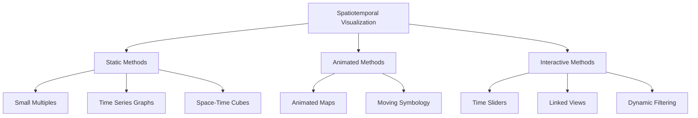

### Static Visualization Techniques

1. **Small Multiples**
   - Series of maps showing different time periods
   - Allows direct visual comparison
   - Effective for discrete time steps

2. **Space-Time Cubes**
   - 3D visualization with time as vertical axis
   - Shows trajectories and spatiotemporal patterns
   - Can reveal patterns difficult to see in 2D

3. **Change Maps**
   - Single map showing amount or type of change
   - Color or symbology indicates time or sequence
   - Effective for summarizing complex changes

### Dynamic Visualization Techniques

1. **Animated Maps**
   - Sequence of maps shown in temporal order
   - Effective for showing continuous processes
   - Supports perception of movement and change

2. **Interactive Timelines**
   - User controls time dimension
   - Often implemented with sliders or playback controls
   - Allows exploration at user's pace

3. **Linked Views**
   - Coordinated multiple visualizations
   - Temporal graphs linked to spatial displays
   - Helps understand relationships between time and space

## Temporal Data Structures and Storage

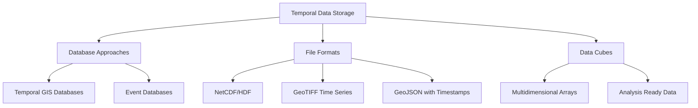

### Temporal Database Concepts

1. **Valid Time vs. Transaction Time**
   - **Valid Time**: When a fact is true in the real world
   - **Transaction Time**: When a fact is recorded in the database
   - **Bitemporal**: Tracking both valid and transaction time

2. **Temporal Database Operations**
   - Temporal queries (as-of, from-to, during)
   - Temporal joins
   - Temporal aggregation

3. **Implementation Approaches**
   - Timestamp attributes
   - Time ranges (start/end timestamps)
   - Temporal tables with versioning

### Common Temporal Data Formats

1. **NetCDF (Network Common Data Form)**
   - Multidimensional data format
   - Widely used for climate and earth science data
   - Supports array-oriented data with dimensions including time

2. **Spatiotemporal Asset Catalog (STAC)**
   - JSON-based specification for geospatial data
   - Designed for searching and discovering data across time
   - Supports cloud-native geospatial workflows

3. **Moving Features Encoding (OGC)**
   - Standards for representing moving objects (trajectories)
   - Includes Moving Features XML and Moving Features JSON

## Data Cube Concept

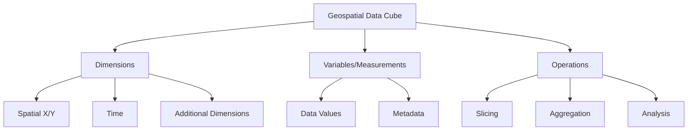

- **Concept**: Multidimensional array organizing data along spatial, temporal, and other dimensions
- **Implementations**: Earth Observation Data Cubes, Climate Data Store, Open Data Cube
- **Benefits**: Efficient analysis across space and time, consistent data structure

## Challenges in Spatiotemporal Data

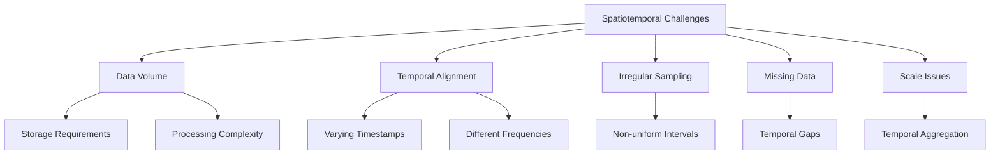

### Common Challenges

1. **Data Volume and Performance**
   - High-resolution spatiotemporal data can be massive
   - Efficient storage and indexing strategies required
   - Cloud computing and distributed processing solutions

2. **Temporal Alignment Issues**
   - Different data sources with different collection times
   - Various temporal resolutions requiring harmonization
   - Synchronization of data from multiple sensors

3. **Interpolation and Estimation**
   - Filling gaps in temporal records
   - Estimating values between observations
   - Accounting for temporal autocorrelation

4. **Varying Temporal Scales**
   - Handling phenomena that operate at different time scales
   - Upscaling and downscaling temporal resolution
   - Cross-scale analysis methods

## Applications of Spatiotemporal Analysis

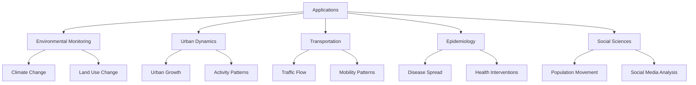

### Environmental Applications

- **Climate Change Analysis**: Tracking temperature and precipitation trends
- **Land Cover Change**: Monitoring deforestation, urbanization, desertification
- **Ecosystem Dynamics**: Phenology, migration patterns, biodiversity shifts

### Urban and Transportation Applications

- **Urban Growth Modeling**: Simulating city expansion over time
- **Human Mobility Analysis**: Daily movement patterns, commuting, tourism
- **Traffic Flow Analysis**: Congestion patterns, travel time variability

### Public Health and Epidemiology

- **Disease Outbreak Tracking**: Spatiotemporal patterns of disease spread
- **Health Service Optimization**: Temporal demand for healthcare
- **Environmental Health**: Relating pollution patterns to health outcomes

## Best Practices for Temporal Geospatial Data

1. **Consistent Temporal References**
   - Use standardized time formats (ISO 8601)
   - Document time zones and daylight saving time handling
   - Maintain consistent temporal granularity where possible

2. **Temporal Metadata**
   - Document observation times vs. processing times
   - Record temporal resolution and coverage
   - Note any temporal gaps or irregularities

3. **Appropriate Temporal Resolution**
   - Match temporal resolution to phenomenon being studied
   - Consider storage and processing requirements
   - Balance between detail and manageability

4. **Time Series Quality Control**
   - Check for temporal outliers and anomalies
   - Validate temporal consistency
   - Document temporal uncertainty

5. **Efficient Storage and Indexing**
   - Use appropriate data structures for temporal data
   - Implement temporal indexing for efficient queries
   - Consider compression for long time series

## Future Trends in Temporal Geospatial Analysis

- **Real-time Geospatial Analytics**: Processing streams of spatiotemporal data
- **Predictive Spatiotemporal Modeling**: Forecasting future states and patterns
- **Big Data Approaches**: Handling extremely large time series
- **AI and Machine Learning**: Extracting patterns from complex spatiotemporal data
- **Digital Twins**: Real-time virtual representations of physical systems

## Further Reading

- [Time in GIS and Geographical Databases](https://www.wiley.com/en-us/Geographical+Information+Systems%3A+Principles%2C+Techniques%2C+Management+and+Applications-p-9780471735458)
- [OGC Moving Features Standard](https://www.ogc.org/standards/movingfeatures)
- [Spatiotemporal Analysis using R](https://cran.r-project.org/web/views/SpatioTemporal.html)
- [NASA Earth Observatory Time Series](https://earthobservatory.nasa.gov/global-maps)
- [Space-Time Research in GIScience](https://link.springer.com/article/10.1007/s10708-018-9878-z) 