# Uncertainty and Accuracy in Geospatial Data

Uncertainty and accuracy are critical concepts in geospatial data that affect how we collect, analyze, interpret, and communicate geographic information. Understanding these concepts is essential for making informed decisions based on geospatial data and analyses.

## Core Concepts and Terminology

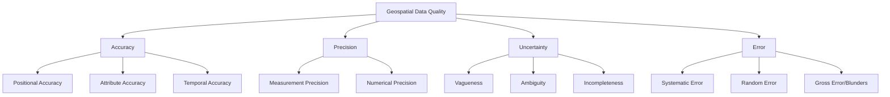

### Accuracy vs. Precision

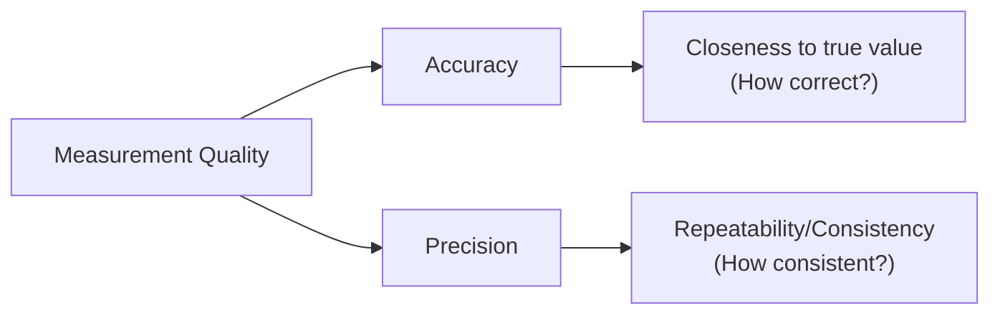

- **Accuracy**: The closeness of a measurement to its true value
  - A measurement can be accurate but not precise, precise but not accurate, both, or neither
  - Example: The true coordinates of a point are (10,10). Measurements of (9,11), (11,9), and (10,10) are accurate on average but not precise.

- **Precision**: The level of detail or exactness of a measurement
  - Related to repeatability and consistency
  - Example: Repeated measurements yield (12.32, 12.33, 12.32) - very precise but not accurate if the true value is 10.

### Types of Accuracy in Geospatial Data

1. **Positional Accuracy**: How closely reported coordinates match true positions
   - **Absolute Accuracy**: Closeness to a known reference system (e.g., WGS84)
   - **Relative Accuracy**: Correctness of spatial relationships between features
   - **Vertical Accuracy**: Accuracy of elevation or depth values

2. **Attribute Accuracy**: Correctness of non-spatial information
   - **Qualitative Accuracy**: Correctness of classifications or categories
   - **Quantitative Accuracy**: Correctness of numerical values

3. **Temporal Accuracy**: Correctness of time-related information
   - **Date/Time Accuracy**: Is the reported collection time correct?
   - **Temporal Consistency**: Do temporal relationships make sense?
   - **Temporal Validity**: Is the data current for its intended use?

4. **Logical Consistency**: Adherence to logical rules of data structure
   - **Topological Consistency**: Do features maintain proper relationships?
   - **Format Consistency**: Does data comply with its specified format?
   - **Domain Consistency**: Are attributes within allowed ranges?

### Types of Errors

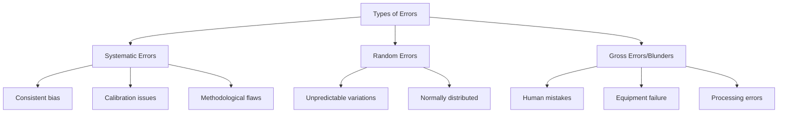

1. **Systematic Errors**
   - Consistent, predictable deviations
   - Often due to measurement method or equipment
   - Example: Uncalibrated GPS that consistently reports positions 10m north of true location

2. **Random Errors**
   - Unpredictable fluctuations
   - Often follow a normal distribution
   - Example: Minor variations in GPS readings due to atmospheric conditions

3. **Gross Errors/Blunders**
   - Major mistakes in data collection, processing, or recording
   - Example: Entering wrong coordinates, equipment failure, transcription errors

## Sources of Uncertainty in Geospatial Data

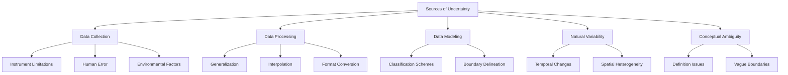

### Data Collection Uncertainties

- **Instrument Limitations**: Sensors have inherent accuracy limitations
  - GPS devices (consumer-grade vs. survey-grade)
  - Remote sensing resolution constraints
  - LiDAR point spacing and accuracy

- **Measurement Conditions**: Environmental factors affecting measurements
  - GPS multipath error in urban canyons
  - Satellite imagery affected by atmospheric conditions
  - LiDAR affected by vegetation

- **Human Factors**: Observer bias, interpretation differences
  - Field survey judgments
  - Photo interpretation subjectivity
  - Data entry errors

### Data Processing Uncertainties

- **Coordinate Transformations**: Error propagation during reprojection
- **Digitizing Error**: Manual or automated vector extraction
- **Geometric Corrections**: Orthorectification, rubber-sheeting
- **Classification Error**: Automated or manual categorization of features
- **Interpolation**: Creating continuous surfaces from sample points

### Conceptual Uncertainties

- **Boundary Problems**: Many geographic entities have fuzzy boundaries
  - Example: Where exactly does a mountain start and end?
  - Example: The gradual transition between vegetation types
  
- **Temporal Ambiguity**: Change over time creates uncertainty
  - Example: Seasonal variation in water bodies
  - Example: Urban growth boundaries changing over months/years

- **Classification Ambiguity**: Features may fit multiple categories
  - Example: Is a feature a wetland or a lake during different seasons?
  - Example: Mixed land use classifications

## Measuring and Quantifying Uncertainty

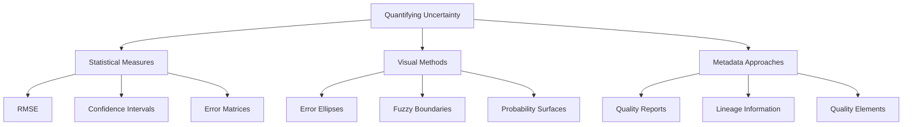

### Statistical Measures of Accuracy

1. **Root Mean Square Error (RMSE)**
   - Widely used metric for positional accuracy
   - RMSE = √(Σ(measured - true)²/n)
   - Lower values indicate higher accuracy

2. **Circular Error Probable (CEP)**
   - Radius of circle containing 50% of points
   - Used for horizontal positional accuracy
   - Common in GPS and military applications

3. **Linear Error Probable (LEP)**
   - Similar to CEP but for vertical accuracy
   - Radius of circle containing 50% of elevation errors

4. **Confidence Intervals**
   - Range within which the true value lies with specific probability
   - Example: "The true position lies within 5m with 95% confidence"

### Error Matrices and Classification Accuracy

For categorical data (e.g., land cover maps):

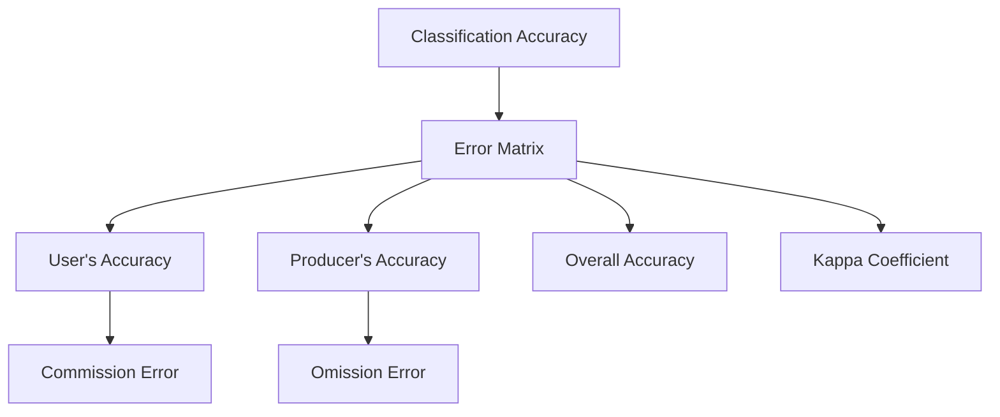

- **Error Matrix (Confusion Matrix)**: Table comparing classified data to reference data
- **User's Accuracy**: Percentage of correctly classified pixels for a given map category (reliability)
- **Producer's Accuracy**: Percentage of reference pixels correctly classified (completeness)
- **Overall Accuracy**: Percentage of all correctly classified pixels
- **Kappa Coefficient**: Measure of agreement accounting for chance

### Visual Representation of Uncertainty

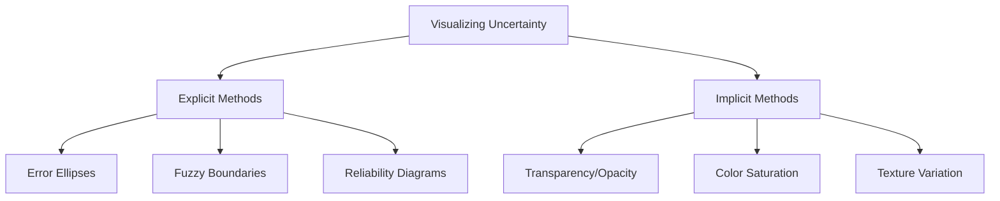

- **Error Ellipses**: Visual representation of positional uncertainty
- **Probability Surfaces**: Raster showing likelihood of correct classification
- **Fuzzy Boundaries**: Gradual transitions instead of hard edges
- **Visual Variables**: Using transparency, texture, or color to indicate uncertainty

## Error Propagation in GIS Analysis

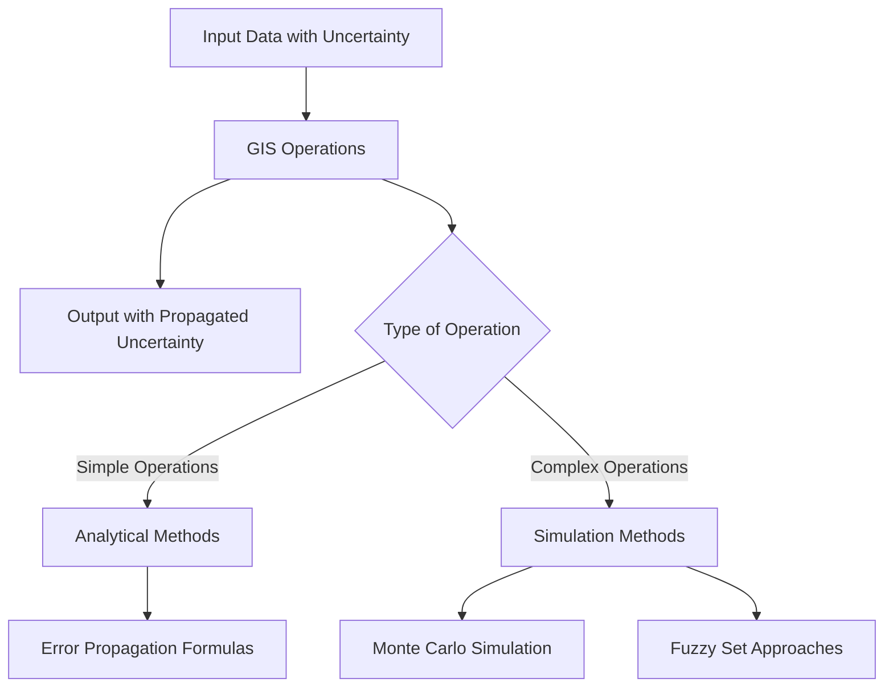

### Analytical Error Propagation

For simple operations, error can be calculated analytically:

- **Addition/Subtraction**: σ²result = σ²A + σ²B
- **Multiplication/Division**: More complex formulas based on partial derivatives

Example: Calculating area
- If length error is ±2m and width error is ±3m
- The error in area calculation can be determined mathematically

### Simulation Approaches to Error Propagation

For complex operations where analytical solutions are difficult:

- **Monte Carlo Simulation**:
  1. Generate multiple realizations of input data based on error distributions
  2. Run the analysis on each realization
  3. Analyze the distribution of results

- **Fuzzy Set Approaches**:
  1. Define membership functions for input data
  2. Perform fuzzy arithmetic
  3. Interpret fuzzy results

### Code Example: Monte Carlo Simulation for Error Propagation

```python
import numpy as np
import matplotlib.pyplot as plt
from scipy.stats import norm

# Function to calculate area (simple example)
def calculate_area(length, width):
    return length * width

# Define true values and their uncertainties
true_length = 100  # meters
length_std = 2     # meters, standard deviation of error
true_width = 50    # meters
width_std = 3      # meters, standard deviation of error

# Number of Monte Carlo simulations
n_simulations = 10000

# Generate random samples based on error distributions
# Assuming normally distributed errors
length_samples = np.random.normal(true_length, length_std, n_simulations)
width_samples = np.random.normal(true_width, width_std, n_simulations)

# Calculate areas for all samples
area_samples = calculate_area(length_samples, width_samples)

# Calculate statistics
mean_area = np.mean(area_samples)
std_area = np.std(area_samples)
ci_95 = np.percentile(area_samples, [2.5, 97.5])

# Theoretical area and its error (for comparison)
theoretical_area = true_length * true_width
theoretical_std = np.sqrt((true_width * length_std)**2 + 
                         (true_length * width_std)**2)

print(f"Monte Carlo Results:")
print(f"Mean Area: {mean_area:.2f} sq meters")
print(f"Standard Deviation: {std_area:.2f} sq meters")
print(f"95% Confidence Interval: [{ci_95[0]:.2f}, {ci_95[1]:.2f}] sq meters")
print(f"\nTheoretical Results:")
print(f"True Area: {theoretical_area} sq meters")
print(f"Theoretical Std Dev: {theoretical_std:.2f} sq meters")

# Plot the distribution of calculated areas
plt.figure(figsize=(10, 6))
plt.hist(area_samples, bins=50, alpha=0.7, density=True)
plt.axvline(theoretical_area, color='r', linestyle='--', label='True Area')
plt.axvline(mean_area, color='g', linestyle='-', label='Mean Simulated Area')
plt.axvline(ci_95[0], color='k', linestyle=':', label='95% CI')
plt.axvline(ci_95[1], color='k', linestyle=':')

# Plot the theoretical normal distribution
x = np.linspace(mean_area - 4*std_area, mean_area + 4*std_area, 100)
plt.plot(x, norm.pdf(x, mean_area, std_area), 'r-', lw=2, 
         label='Normal Distribution')

plt.title('Distribution of Area Calculations with Uncertainty')
plt.xlabel('Area (sq meters)')
plt.ylabel('Probability Density')
plt.legend()
plt.grid(True, alpha=0.3)
plt.savefig('area_uncertainty.png')
plt.close()
```

## Documenting and Communicating Uncertainty

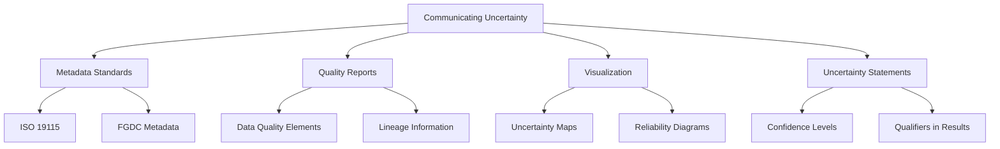

### Metadata Standards for Quality Information

ISO 19157 defines data quality elements:
- **Completeness**: Presence/absence of features, attributes, and relationships
- **Logical Consistency**: Degree of adherence to logical rules
- **Positional Accuracy**: Accuracy of position of features
- **Temporal Accuracy**: Accuracy of temporal attributes and relationships
- **Thematic Accuracy**: Accuracy of quantitative attributes and correctness of classifications

### Quality Reports and Documentation

Key information to include:
- **Lineage**: Data sources, collection methods, processing steps
- **Positional Accuracy Measures**: RMSE, CEP, confidence intervals
- **Classification Accuracy**: Error matrices, overall accuracy, Kappa
- **Completeness Assessment**: What's included/excluded
- **Known Issues or Limitations**: Documented problems or edge cases

### Communicating Uncertainty in Results

Best practices:
- Provide quantitative measures of uncertainty where possible
- Include visual indicators of uncertainty in maps and diagrams
- Use clear terminology when describing uncertainty
- Match the level of detail in uncertainty reporting to the audience
- Clearly state assumptions and limitations

Example statement:
"The landslide risk areas shown in red have 95% confidence of being high-risk zones, while yellow areas represent medium-risk zones (80% confidence). Gray zones indicate areas where insufficient data exists to make a reliable risk assessment."

## Uncertainty in Different Geospatial Applications

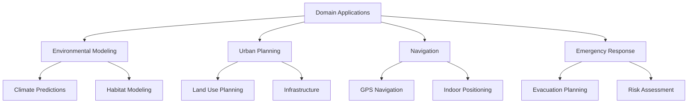

### Environmental Applications

- **Climate Modeling**: Cascade of uncertainties from input data, parameterization, model structure
- **Habitat Suitability**: Uncertainty in species presence data, environmental variables
- **Pollution Dispersion**: Uncertainty in emission sources, meteorological data, transport models

### Urban and Infrastructure Planning

- **Land Use Planning**: Classification uncertainty, boundary uncertainty
- **Infrastructure Planning**: Positional uncertainty of existing utilities
- **Population Estimation**: Uncertainty in demographic data, interpolation

### Navigation and Location-Based Services

- **GPS Navigation**: Position uncertainty in urban canyons, multipath errors
- **Indoor Positioning**: Signal variability, map matching uncertainty
- **Location-Based Services**: Service area uncertainty

### Emergency Management

- **Risk Assessment**: Compound uncertainties in hazard, vulnerability, and exposure data
- **Evacuation Planning**: Uncertainty in population distribution, road capacity
- **Response Operations**: Real-time uncertainty in incident locations and extents

## Strategies for Managing Uncertainty

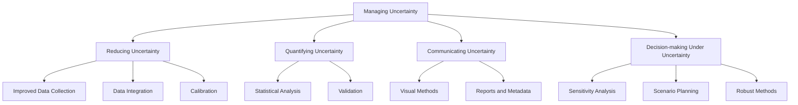

### Reducing Uncertainty

- **Improved Measurement Techniques**: Higher-grade equipment, better calibration
- **Multiple Independent Measurements**: Cross-validation of results
- **Standardized Procedures**: Consistent methodology to reduce variability
- **Data Integration**: Combining multiple data sources
- **Filtering and Cleaning**: Removing outliers and systematic errors

### Decision-Making Under Uncertainty

- **Sensitivity Analysis**: How much do results change with different inputs?
- **Scenario Planning**: Exploring multiple possible outcomes
- **Adaptive Management**: Iterative approach that updates as new data arrives
- **Conservative Approaches**: Planning for worst-case scenarios
- **Value of Information Analysis**: Determining when to collect additional data

### Code Example: Sensitivity Analysis

```python
import numpy as np
import matplotlib.pyplot as plt
from scipy.stats import norm, uniform

# A function that models flood extent based on:
# - precipitation (mm)
# - soil saturation (%)
# - terrain slope (degrees)
def flood_model(precipitation, soil_saturation, slope):
    # Simplified model: higher values = larger flood extent
    return (0.6 * precipitation + 0.3 * soil_saturation - 0.2 * slope)

# Base values
base_precip = 100       # mm
base_soil_sat = 80      # %
base_slope = 5          # degrees

# Ranges for sensitivity analysis (±20% of base values)
precip_range = (80, 120)
soil_sat_range = (64, 96)
slope_range = (4, 6)

# Number of samples for each parameter
n_samples = 100

# Generate parameter ranges
precip_values = np.linspace(precip_range[0], precip_range[1], n_samples)
soil_values = np.linspace(soil_sat_range[0], soil_sat_range[1], n_samples)
slope_values = np.linspace(slope_range[0], slope_range[1], n_samples)

# Calculate model outputs varying one parameter at a time
precip_results = [flood_model(p, base_soil_sat, base_slope) for p in precip_values]
soil_results = [flood_model(base_precip, s, base_slope) for s in soil_values]
slope_results = [flood_model(base_precip, base_soil_sat, s) for s in slope_values]

# Calculate sensitivity metrics
precip_sensitivity = (max(precip_results) - min(precip_results)) / np.mean(precip_results)
soil_sensitivity = (max(soil_results) - min(soil_results)) / np.mean(soil_results)
slope_sensitivity = (max(slope_results) - min(slope_results)) / np.mean(slope_results)

# Plot results
plt.figure(figsize=(15, 10))

# Precipitation sensitivity
plt.subplot(3, 1, 1)
plt.plot(precip_values, precip_results)
plt.axvline(base_precip, color='r', linestyle='--', label='Base Value')
plt.title(f'Sensitivity to Precipitation (Relative Range: {precip_sensitivity:.2f})')
plt.xlabel('Precipitation (mm)')
plt.ylabel('Flood Extent')
plt.grid(True, alpha=0.3)
plt.legend()

# Soil saturation sensitivity
plt.subplot(3, 1, 2)
plt.plot(soil_values, soil_results)
plt.axvline(base_soil_sat, color='r', linestyle='--', label='Base Value')
plt.title(f'Sensitivity to Soil Saturation (Relative Range: {soil_sensitivity:.2f})')
plt.xlabel('Soil Saturation (%)')
plt.ylabel('Flood Extent')
plt.grid(True, alpha=0.3)
plt.legend()

# Slope sensitivity
plt.subplot(3, 1, 3)
plt.plot(slope_values, slope_results)
plt.axvline(base_slope, color='r', linestyle='--', label='Base Value')
plt.title(f'Sensitivity to Terrain Slope (Relative Range: {slope_sensitivity:.2f})')
plt.xlabel('Slope (degrees)')
plt.ylabel('Flood Extent')
plt.grid(True, alpha=0.3)
plt.legend()

plt.tight_layout()
plt.savefig('sensitivity_analysis.png')
plt.close()

# Print sensitivity ranking
sensitivities = [
    ('Precipitation', precip_sensitivity),
    ('Soil Saturation', soil_sensitivity),
    ('Terrain Slope', slope_sensitivity)
]
sensitivities.sort(key=lambda x: x[1], reverse=True)

print("Parameter Sensitivity Ranking:")
for i, (param, sens) in enumerate(sensitivities, 1):
    print(f"{i}. {param}: {sens:.4f}")
```

## Emerging Trends and Technologies

- **Uncertainty-Aware Algorithms**: Methods that explicitly account for input uncertainty
- **Machine Learning for Error Prediction**: Using AI to model and predict errors
- **Real-Time Uncertainty Visualization**: Dynamic representation of uncertainty
- **Volunteer Geographic Information (VGI) Quality Assessment**: Methods for evaluating crowdsourced data quality
- **Blockchain for Data Provenance**: Immutable records of data lineage and quality

## Best Practices and Recommendations

1. **Acknowledge Uncertainty**: Recognize and document uncertainties in all geospatial work
2. **Quantify Where Possible**: Use statistical measures to express uncertainty
3. **Communicate Clearly**: Use appropriate visualizations and language for the audience
4. **Consider Multiple Scenarios**: Avoid single deterministic outcomes
5. **Match Precision to Accuracy**: Don't report results with more precision than their accuracy warrants
6. **Document Data Quality**: Include comprehensive metadata about accuracy and limitations
7. **Validate Results**: Use independent data sources to validate findings
8. **Apply Appropriate Methods**: Select analysis methods appropriate for the data quality

## Further Reading

- [ISO 19157 - Geographic Information - Data Quality](https://www.iso.org/standard/32575.html)
- [FGDC Geospatial Positioning Accuracy Standards](https://www.fgdc.gov/standards/projects/accuracy)
- [USGS Standards for Digital Elevation Models](https://www.usgs.gov/core-science-systems/ngp/ss/accuracy)
- [Visualizing Uncertainty in Natural Hazards](https://www.sciencedirect.com/science/article/pii/S0169555X17300090)
- [Spatial Data Quality: From Process to Decisions](https://www.crcpress.com/Spatial-Data-Quality-From-Process-to-Decisions/Devillers-Jeansoulin/p/book/9780367571344) 