# World Game (World Peace Game)

The World Game, also known as the World Peace Game, was an ambitious educational simulation developed by R. Buckminster Fuller (1895-1983) as a tool for solving global problems and fostering cooperative global strategies, representing a counterpoint to war games played by military strategists.

## Concept Overview

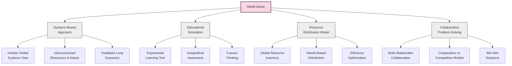

### Core Concept

Fuller proposed the World Game with a revolutionary mission:

> "Make the world work for 100% of humanity in the shortest possible time through spontaneous cooperation without ecological damage or disadvantage to anyone."

This represented a dramatic shift from the dominant zero-sum thinking of the Cold War era to a positive-sum collaborative approach to global challenges.

## Fundamental Principles

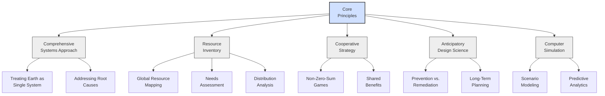

The World Game was built on five key principles:

1. **Comprehensive Approach**: Treating the entire world as a single system with interconnected resources and needs

2. **Resource Inventory**: Cataloging all physical resources, energy flows, and human needs globally

3. **Cooperative Strategy**: Designing solutions based on cooperation rather than competition

4. **Anticipatory Design Science**: Using design thinking to anticipate and prevent problems before they arise

5. **Computer Simulation**: Leveraging computing technology to model complex global systems

## Historical Development

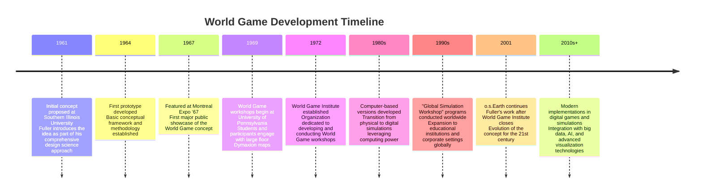

## Methodology and Implementation

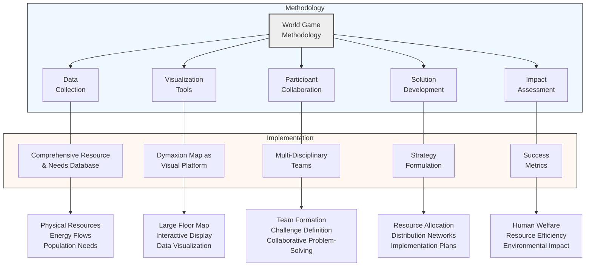

### Implementation Components

The World Game typically involved:

1. **Massive Data Collection**: Comprehensive inventory of world resources, population needs, and production capabilities

2. **Visualization Tools**: The Dymaxion Map served as the primary visualization platform, usually as a large floor map that participants would stand on

3. **Participant Collaboration**: Teams worked together to address global challenges:
   - How to feed everyone on Earth
   - How to provide clean energy for all
   - How to ensure adequate housing and healthcare
   - How to manage climate and environmental issues

4. **Real-World Constraints**: Solutions had to work within actual resource limitations, technological capabilities, and ecological boundaries

5. **Success Metrics**: Measured by how successfully strategies met human needs without warfare, pollution, or resource depletion

## Global Challenges Addressed

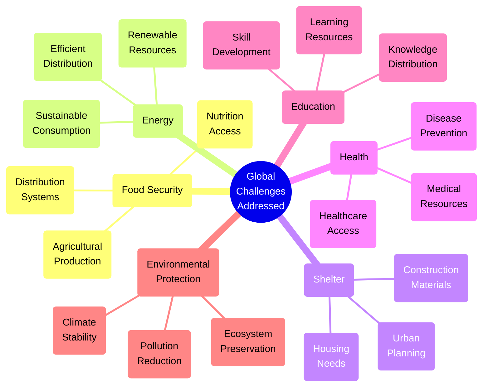

The World Game was designed to address fundamental global challenges through integrated solutions rather than isolated interventions, focusing on both immediate needs and long-term sustainability.

## Impact and Legacy

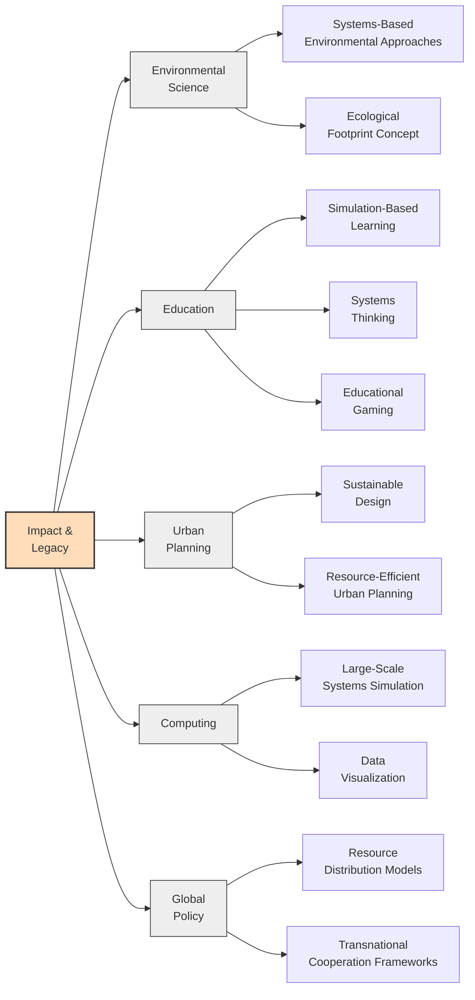

The World Game has influenced several domains:

1. **Environmental Science**: Contributed to systems-based approaches to global environmental challenges

2. **Education**: Inspired simulation-based learning and educational gaming

3. **Urban Planning**: Influenced sustainable design thinking in architectural and urban contexts

4. **Computing**: Early example of large-scale systems simulation

5. **Global Policy**: Provided methodologies for examining global resource distribution issues

## Modern Implementations and Derivatives

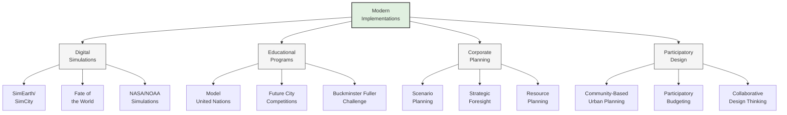

1. **Digital Simulations**: Various computer games and simulations have incorporated World Game principles:
   - SimEarth/SimCity (Maxis)
   - Fate of the World
   - Educational simulations by agencies like NASA and NOAA

2. **Global Educational Programs**:
   - Model United Nations programs
   - Various "Future City" competitions
   - The Buckminster Fuller Challenge

3. **Corporate Strategic Planning**: Scenario planning methodologies used by major corporations derive concepts from Fuller's approach

4. **Participatory Design**: Community-based urban planning initiatives that use collaborative decision-making

## Code Example: Simple World Game Resource Allocation Simulation

```python
import numpy as np
import pandas as pd
import matplotlib.pyplot as plt
import seaborn as sns

# Simplified World Game resource allocation simulation
class WorldGameSimulation:
    def __init__(self, regions=5, resources=4, population_distribution=None):
        self.regions = regions
        self.resources = resources
        
        # Set up initial conditions
        if population_distribution is None:
            self.population = np.random.randint(100, 1000, size=regions)
        else:
            self.population = np.array(population_distribution)
            
        # Resource distribution - randomly allocated initially
        self.resource_distribution = np.random.randint(1, 100, size=(regions, resources))
        
        # Resource needs per capita
        self.resource_needs = np.random.uniform(0.5, 2.0, size=resources)
        
        # Resource names for display
        self.resource_names = [f"Resource {i+1}" for i in range(resources)]
        self.region_names = [f"Region {i+1}" for i in range(regions)]
        
    def calculate_needs(self):
        """Calculate total needs based on population"""
        total_needs = np.outer(self.population, self.resource_needs)
        return total_needs
    
    def calculate_surplus_deficit(self):
        """Calculate surplus or deficit for each resource in each region"""
        needs = self.calculate_needs()
        return self.resource_distribution - needs
    
    def optimize_distribution(self, iterations=5):
        """Simulate resource redistribution to optimize for human needs"""
        results_history = []
        
        # Store initial state
        surplus_deficit = self.calculate_surplus_deficit()
        total_unmet_needs = np.sum(np.where(surplus_deficit < 0, -surplus_deficit, 0))
        results_history.append(total_unmet_needs)
        
        for i in range(iterations):
            # Find surpluses and deficits
            surplus_deficit = self.calculate_surplus_deficit()
            
            # For each resource, redistribute from surplus regions to deficit regions
            for r in range(self.resources):
                surplus_regions = np.where(surplus_deficit[:, r] > 0)[0]
                deficit_regions = np.where(surplus_deficit[:, r] < 0)[0]
                
                if len(surplus_regions) > 0 and len(deficit_regions) > 0:
                    total_surplus = np.sum(surplus_deficit[surplus_regions, r])
                    total_deficit = np.sum(-surplus_deficit[deficit_regions, r])
                    
                    # How much can be redistributed
                    redistribute_amount = min(total_surplus, total_deficit)
                    
                    # Redistribute proportionally
                    for deficit_idx in deficit_regions:
                        deficit = -surplus_deficit[deficit_idx, r]
                        proportion = deficit / total_deficit
                        allocation = redistribute_amount * proportion
                        
                        # Update the resource distribution
                        self.resource_distribution[deficit_idx, r] += allocation
                    
                    # Remove from surplus regions proportionally
                    for surplus_idx in surplus_regions:
                        surplus = surplus_deficit[surplus_idx, r]
                        proportion = surplus / total_surplus
                        reduction = redistribute_amount * proportion
                        
                        # Update the resource distribution
                        self.resource_distribution[surplus_idx, r] -= reduction
            
            # Calculate new results
            surplus_deficit = self.calculate_surplus_deficit()
            total_unmet_needs = np.sum(np.where(surplus_deficit < 0, -surplus_deficit, 0))
            results_history.append(total_unmet_needs)
        
        return results_history
    
    def visualize_distribution(self):
        """Visualize the current resource distribution"""
        surplus_deficit = self.calculate_surplus_deficit()
        
        plt.figure(figsize=(12, 8))
        sns.heatmap(surplus_deficit, cmap="RdYlGn", center=0, 
                    annot=True, fmt=".1f", 
                    xticklabels=self.resource_names,
                    yticklabels=self.region_names)
        plt.title("Resource Surplus/Deficit by Region")
        plt.tight_layout()
        plt.savefig("resource_distribution.png")
        plt.close()
        
        # Plot optimization progress
        iterations = self.optimize_distribution(iterations=10)
        plt.figure(figsize=(10, 6))
        plt.plot(range(len(iterations)), iterations, marker='o')
        plt.title("Reduction in Unmet Needs Over Iterations")
        plt.xlabel("Iteration")
        plt.ylabel("Total Unmet Needs")
        plt.grid(True, alpha=0.3)
        plt.savefig("optimization_progress.png")
        plt.close()
        
        return "Visualization complete. Files saved: resource_distribution.png, optimization_progress.png"

# Create and run a simple simulation
sim = WorldGameSimulation(regions=6, resources=5)
sim.visualize_distribution()
```

## Workshop Structure and Participant Experience

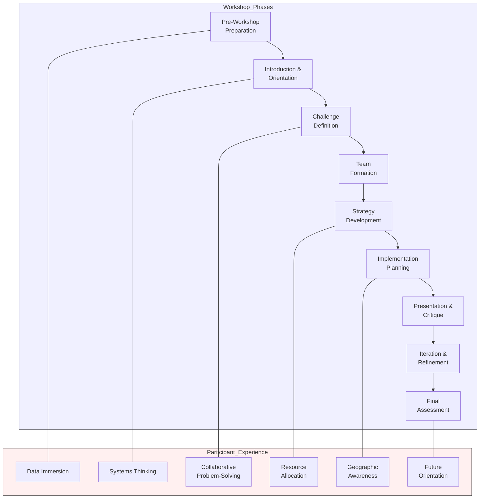

### Typical Workshop Structure

1. **Preparation**: Participants were briefed on world resources, needs, and the simulation methodology

2. **Map Interaction**: Participants physically stood on a large Dymaxion Map floor projection, representing different regions

3. **Challenge Assignment**: Teams were given specific global challenges to address

4. **Resource Analysis**: Teams analyzed available resources, distribution patterns, and needs

5. **Solution Development**: Collaborative development of strategies to optimize resource allocation

6. **Testing**: Proposed solutions were tested against simulation models

7. **Iteration**: Solutions were refined based on feedback and testing results

## Integration with the Dymaxion Map

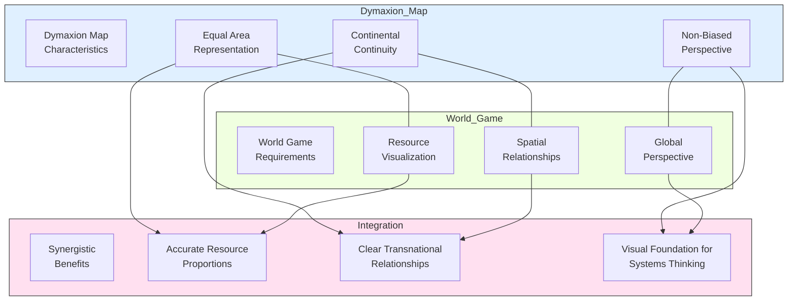

Fuller integrated the Dymaxion Map and World Game to create a comprehensive approach to global problem-solving:

1. **Visual Foundation**: The Dymaxion Map provided the visual and conceptual foundation for the World Game by representing Earth without visual bias

2. **Spatial Understanding**: The map helped participants understand spatial relationships between resources, production centers, and consumption needs

3. **Systems Thinking**: Both innovations promoted whole-systems thinking about planetary challenges

4. **Design Science Approach**: Each exemplified Fuller's "anticipatory design science" philosophy—addressing problems through comprehensive design rather than through politics or conflict

5. **Educational Tools**: Both served primarily as educational tools to help people understand global systems and relationships

## Contemporary Relevance

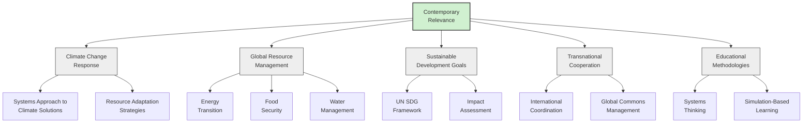

### Modern Applications

1. **Climate Science**: World Game methodologies inform collaborative approaches to climate change mitigation and adaptation

2. **Sustainable Development Planning**: Influences global development planning, including UN Sustainable Development Goals

3. **Interactive Technology**: Digital implementations in educational software and visualization tools

4. **Big Data Applications**: Using World Game principles for analyzing global data patterns in economics, migration, resource flows, and trade

5. **Transnational Collaboration**: Framework for addressing challenges that cross national boundaries

## Critical Perspectives

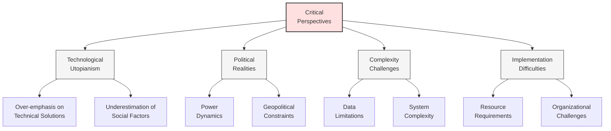

Despite its innovative nature, several critiques have emerged:

1. **Technological Utopianism**: Fuller's approach has been criticized for overemphasizing technological solutions to social and political problems

2. **Political Realities**: The World Game's emphasis on cooperation sometimes overlooked geopolitical realities and power dynamics

3. **Complexity Challenges**: Both concepts were arguably ahead of their time technologically, making implementation difficult

4. **Resource Intensity**: Full implementation requires significant data collection and computational resources

## Future Directions

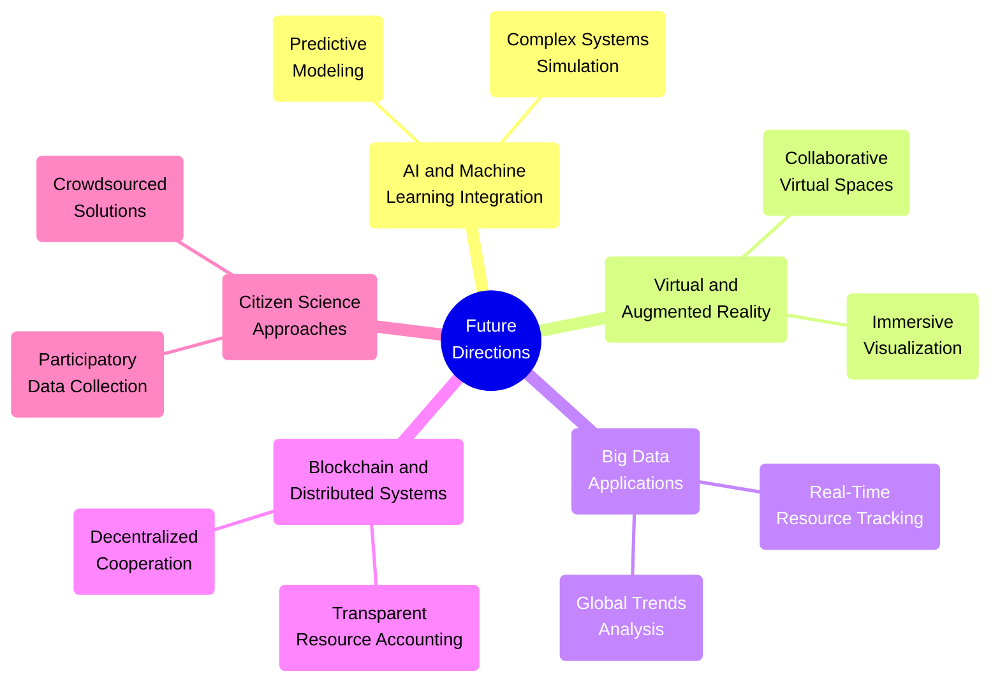

The World Game concept continues to evolve with emerging technologies:

1. **AI and Machine Learning**: Enhanced modeling capabilities for complex global systems

2. **Virtual Reality**: Immersive participation experiences for educational and planning purposes

3. **Big Data Analytics**: Real-time global resource and needs tracking

4. **Distributed Systems**: Blockchain and other technologies for transparent resource accounting

5. **Citizen Science**: Engaging broader populations in data collection and solution development

## Educational Resources and Further Reading

- [The Buckminster Fuller Institute](https://www.bfi.org/)
- [Fuller, R. B. (1969). Operating Manual for Spaceship Earth](https://www.lars-mueller-publishers.com/operating-manual-spaceship-earth)
- [Fuller, R. B. (1981). Critical Path](https://www.goodreads.com/book/show/123899.Critical_Path)
- [World Game Workshop Documentation - Buckminster Fuller Institute Archives](https://www.bfi.org/about-fuller/resources/archives/)
- [Medard Gabel - World Game Workshop Facilitator and Author](https://bigpicturesmallworld.com/about-us/)
- [The Buckminster Fuller Challenge](https://www.bfi.org/challenge/) 