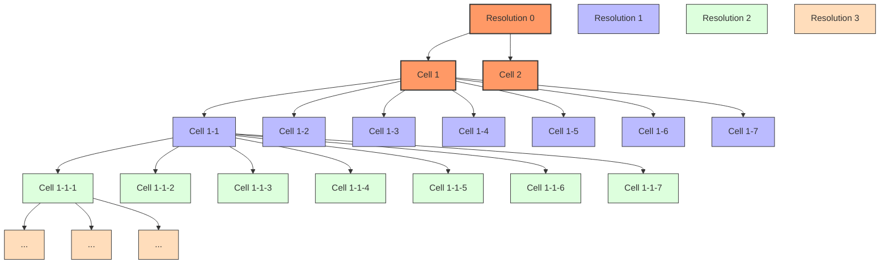
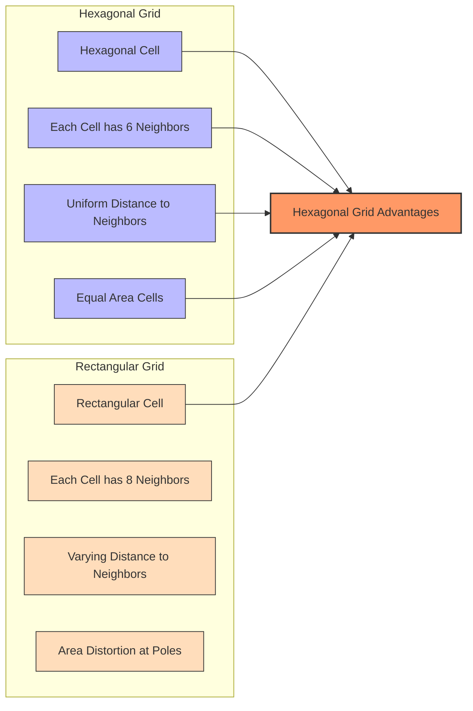
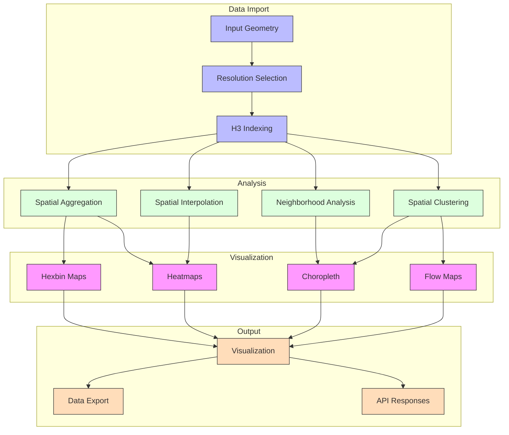
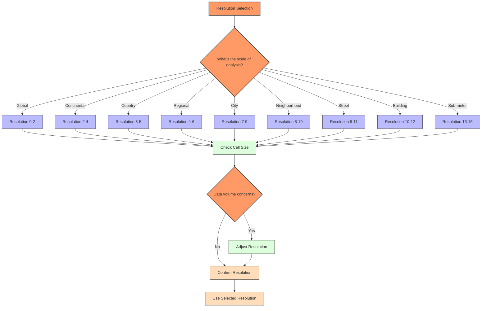
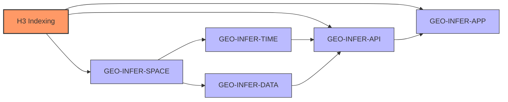

# H3 Spatial Indexing System

This document provides comprehensive information about the H3 hierarchical geospatial indexing system and its implementation in the GEO-INFER framework.

## Overview

H3 is a hierarchical hexagonal geospatial indexing system developed by Uber that provides multiple resolutions of hexagonal grids across the earth. The GEO-INFER framework uses H3 as a primary spatial indexing system for its uniform cell areas, efficient neighbor operations, and hierarchical structure.

```mermaid
graph TD
    H3[H3 Indexing System]
    
    GRID[Hexagonal Grid]
    RES[Multiple Resolutions]
    HIER[Hierarchical Structure]
    INDEX[64-bit Indices]
    EDGE[Edge Indexing]
    
    H3 --> GRID
    H3 --> RES
    H3 --> HIER
    H3 --> INDEX
    H3 --> EDGE
    
    GRID --> UNIFORM[Uniform Cell Size]
    GRID --> NEIGHBOR[Neighbor Operations]
    GRID --> DIST[Distance Functions]
    
    RES --> R0[Resolution 0: ~4,250km²]
    RES --> R1[Resolution 1: ~607km²]
    RES --> RDOTS[...]
    RES --> R15[Resolution 15: ~0.9m²]
    
    HIER --> PARENT[Parent-Child Relations]
    HIER --> COMP[Compaction]
    HIER --> UNCOMP[Uncompaction]
    
    INDEX --> GEO[Geo Conversion]
    INDEX --> BITS[Bit Operations]
    INDEX --> VALIDATE[Validation]
    
    EDGE --> ADJ[Adjacency]
    EDGE --> PATH[Line of Sight]
    EDGE --> BOUND[Boundary]
    
    classDef primary fill:#f96,stroke:#333,stroke-width:2px
    classDef features fill:#bbf,stroke:#333,stroke-width:1px
    classDef details fill:#dfd,stroke:#333,stroke-width:1px
    classDef advanced fill:#fdb,stroke:#333,stroke-width:1px
    
    class H3 primary
    class GRID,RES,HIER,INDEX,EDGE features
    class UNIFORM,NEIGHBOR,DIST,R0,R1,RDOTS,R15,PARENT,COMP,UNCOMP,GEO,BITS,VALIDATE details
    class ADJ,PATH,BOUND advanced
```



## Hierarchical Structure

The H3 system uses a hierarchical structure with cells at different resolutions nesting within each other:



## Cell Resolutions and Characteristics

Each H3 resolution has specific characteristics:

| Resolution | Average Hexagon Edge Length | Average Hexagon Area | Number of Unique Indexes |
|------------|------------------------------|----------------------|--------------------------|
| 0 | 1107.71 km | 4,250,546.85 km² | 122 |
| 1 | 418.68 km | 607,220.98 km² | 842 |
| 2 | 158.24 km | 86,745.85 km² | 5,882 |
| 3 | 59.81 km | 12,392.26 km² | 41,162 |
| 4 | 22.61 km | 1,770.32 km² | 288,122 |
| 5 | 8.54 km | 252.90 km² | 2,016,842 |
| 6 | 3.23 km | 36.13 km² | 14,117,882 |
| 7 | 1.22 km | 5.16 km² | 98,825,162 |
| 8 | 461.35 m | 0.74 km² | 691,776,122 |
| 9 | 174.38 m | 0.11 km² | 4,842,432,842 |
| 10 | 65.91 m | 14,989.82 m² | 33,897,029,882 |
| 11 | 24.91 m | 2,141.40 m² | 237,279,209,162 |
| 12 | 9.42 m | 305.91 m² | 1,660,954,464,122 |
| 13 | 3.56 m | 43.70 m² | 11,626,681,248,842 |
| 14 | 1.35 m | 6.24 m² | 81,386,768,741,882 |
| 15 | 0.51 m | 0.89 m² | 569,707,381,193,162 |

## H3 Cell Structure

Each H3 cell has specific properties and relationships with neighboring cells:

```mermaid
graph TD
    subgraph "H3 Cell Properties"
        HEX[Hexagon Shape]
        CENTER[Cell Center Point]
        EDGES[Cell Boundaries]
        RES[Cell Resolution]
        INDEX[H3 Index Value]
    end
    
    subgraph "Neighboring Cells"
        N0[Neighbor 0]
        N1[Neighbor 1]
        N2[Neighbor 2]
        N3[Neighbor 3]
        N4[Neighbor 4]
        N5[Neighbor 5]
    end
    
    subgraph "Hierarchical Relationships"
        PARENT[Parent Cell]
        CHILDREN[Child Cells]
        SIBLINGS[Sibling Cells]
    end
    
    HEX --> CENTER
    HEX --> EDGES
    HEX --> RES
    HEX --> INDEX
    
    HEX --> N0
    HEX --> N1
    HEX --> N2
    HEX --> N3
    HEX --> N4
    HEX --> N5
    
    HEX --> PARENT
    HEX --> CHILDREN
    HEX --> SIBLINGS
    
    classDef cell fill:#f96,stroke:#333,stroke-width:2px
    classDef props fill:#bbf,stroke:#333,stroke-width:1px
    classDef neighbors fill:#dfd,stroke:#333,stroke-width:1px
    classDef hierarchy fill:#fdb,stroke:#333,stroke-width:1px
    
    class HEX cell
    class CENTER,EDGES,RES,INDEX props
    class N0,N1,N2,N3,N4,N5 neighbors
    class PARENT,CHILDREN,SIBLINGS hierarchy
```



## Hexagonal vs Rectangular Grids

H3 uses hexagonal cells instead of rectangular cells for several advantages:



## H3 Index Structure

An H3 index is stored as a 64-bit integer with the following bit layout:

```mermaid
graph TD
    H3_BITS[H3 Index - 64 bits]
    
    H3_BITS --> MODE[Reserved (4 bits)]
    H3_BITS --> RES[Resolution (4 bits)]
    H3_BITS --> BASE_CELL[Base Cell (7 bits)]
    H3_BITS --> CELL_1[Cell 1 (3 bits)]
    H3_BITS --> CELL_2[Cell 2 (3 bits)]
    H3_BITS --> CELL_3[Cell 3 (3 bits)]
    H3_BITS --> CELL_4[Cell 4 (3 bits)]
    H3_BITS --> CELL_5[Cell 5 (3 bits)]
    H3_BITS --> CELL_6[Cell 6 (3 bits)]
    H3_BITS --> CELL_7[Cell 7 (3 bits)]
    H3_BITS --> CELL_8[Cell 8 (3 bits)]
    H3_BITS --> CELL_9[Cell 9 (3 bits)]
    H3_BITS --> CELL_10[Cell 10 (3 bits)]
    H3_BITS --> CELL_11[Cell 11 (3 bits)]
    H3_BITS --> CELL_12[Cell 12 (3 bits)]
    H3_BITS --> CELL_13[Cell 13 (3 bits)]
    H3_BITS --> CELL_14[Cell 14 (3 bits)]
    H3_BITS --> CELL_15[Cell 15 (3 bits)]
    H3_BITS --> RESERVED[Reserved (1 bit)]
    
    classDef main fill:#f96,stroke:#333,stroke-width:2px
    classDef header fill:#bbf,stroke:#333,stroke-width:1px
    classDef cells fill:#dfd,stroke:#333,stroke-width:1px
    classDef reserved fill:#fdb,stroke:#333,stroke-width:1px
    
    class H3_BITS main
    class MODE,RES,BASE_CELL header
    class CELL_1,CELL_2,CELL_3,CELL_4,CELL_5,CELL_6,CELL_7,CELL_8,CELL_9,CELL_10,CELL_11,CELL_12,CELL_13,CELL_14,CELL_15 cells
    class RESERVED reserved
```

## H3 Operations

H3 provides a variety of operations for working with the hexagonal grid:

```mermaid
classDiagram
    class H3API {
        +geoToH3(lat, lng, res) : h3Index
        +h3ToGeo(h3Index) : {lat, lng}
        +h3ToGeoBoundary(h3Index) : [{lat, lng}]
        +kRing(h3Index, k) : [h3Index]
        +hexRing(h3Index, k) : [h3Index]
        +h3Distance(h3Index1, h3Index2) : distance
        +h3Line(h3Index1, h3Index2) : [h3Index]
        +h3ToParent(h3Index, res) : h3Index
        +h3ToChildren(h3Index, res) : [h3Index]
        +compact(h3Set) : [h3Index]
        +uncompact(h3Set, res) : [h3Index]
        +polyfill(boundary, res) : [h3Index]
        +h3SetToMultiPolygon(h3Set) : [[[{lat, lng}]]]
    }
    
    class ConversionOps {
        +geoToH3()
        +h3ToGeo()
        +h3ToGeoBoundary()
    }
    
    class TraversalOps {
        +kRing()
        +hexRing()
        +h3Distance()
        +h3Line()
    }
    
    class HierarchyOps {
        +h3ToParent()
        +h3ToChildren()
        +compact()
        +uncompact()
    }
    
    class RegionOps {
        +polyfill()
        +h3SetToMultiPolygon()
    }
    
    class InspectionOps {
        +h3GetResolution()
        +h3IsValid()
        +h3IsResClassIII()
        +h3GetBaseCell()
    }
    
    H3API <|-- ConversionOps
    H3API <|-- TraversalOps
    H3API <|-- HierarchyOps
    H3API <|-- RegionOps
    H3API <|-- InspectionOps
```

## H3 Usage in GEO-INFER Framework

GEO-INFER uses H3 for a variety of geospatial operations:

```mermaid
graph TD
    H3_IN_GEO_INFER[H3 in GEO-INFER]
    
    H3_IN_GEO_INFER --> SPACE[GEO-INFER-SPACE]
    H3_IN_GEO_INFER --> RISK[GEO-INFER-RISK]
    H3_IN_GEO_INFER --> AG[GEO-INFER-AG]
    H3_IN_GEO_INFER --> CIV[GEO-INFER-CIV]
    
    SPACE --> SPACE_IO[Spatial Data Import/Export]
    SPACE --> SPACE_INDEX[Spatial Indexing]
    SPACE --> SPACE_QUERY[Spatial Queries]
    
    RISK --> RISK_ZONES[Risk Zone Definition]
    RISK --> RISK_AGG[Spatial Risk Aggregation]
    RISK --> RISK_VIZ[Risk Visualization]
    
    AG --> AG_FIELDS[Field Definition]
    AG --> AG_YIELD[Yield Analysis]
    AG --> AG_SAMPLING[Spatial Sampling]
    
    CIV --> CIV_ZONES[Urban Zoning]
    CIV --> CIV_MOBILITY[Mobility Analysis]
    CIV --> CIV_INFRA[Infrastructure Planning]
    
    classDef main fill:#f96,stroke:#333,stroke-width:2px
    classDef modules fill:#bbf,stroke:#333,stroke-width:1px
    classDef functions fill:#dfd,stroke:#333,stroke-width:1px
    
    class H3_IN_GEO_INFER main
    class SPACE,RISK,AG,CIV modules
    class SPACE_IO,SPACE_INDEX,SPACE_QUERY,RISK_ZONES,RISK_AGG,RISK_VIZ,AG_FIELDS,AG_YIELD,AG_SAMPLING,CIV_ZONES,CIV_MOBILITY,CIV_INFRA functions
```



## Spatial Analysis with H3

H3 enables powerful spatial analysis in the GEO-INFER framework:



## Resolution Selection Guidelines

Choosing the appropriate H3 resolution is critical for effective analysis:



## Hexagon Compaction and Uncompaction

H3 provides compaction and uncompaction operations for efficient representation:

```mermaid
graph TD
    subgraph "Original Cells (Resolution 9)"
        C1[Cell 1]
        C2[Cell 2]
        C3[Cell 3]
        C4[Cell 4]
        C5[Cell 5]
        C6[Cell 6]
        C7[Cell 7]
    end
    
    subgraph "Compacted Representation"
        P1[Parent Cell (Resolution 8)]
        C7_REMAIN[Cell 7 (Resolution 9)]
    end
    
    subgraph "Uncompacted Cells (Resolution 9)"
        U1[Cell 1]
        U2[Cell 2]
        U3[Cell 3]
        U4[Cell 4]
        U5[Cell 5]
        U6[Cell 6]
        U7[Cell 7]
    end
    
    C1 --> P1
    C2 --> P1
    C3 --> P1
    C4 --> P1
    C5 --> P1
    C6 --> P1
    C7 --> C7_REMAIN
    
    P1 --> U1
    P1 --> U2
    P1 --> U3
    P1 --> U4
    P1 --> U5
    P1 --> U6
    C7_REMAIN --> U7
    
    COMPACT[Compact Operation] -.-> P1
    COMPACT -.-> C7_REMAIN
    
    UNCOMPACT[Uncompact Operation] -.-> U1
    UNCOMPACT -.-> U2
    UNCOMPACT -.-> U3
    UNCOMPACT -.-> U4
    UNCOMPACT -.-> U5
    UNCOMPACT -.-> U6
    UNCOMPACT -.-> U7
    
    classDef original fill:#bbf,stroke:#333,stroke-width:1px
    classDef compacted fill:#f96,stroke:#333,stroke-width:2px
    classDef uncompacted fill:#dfd,stroke:#333,stroke-width:1px
    classDef operation fill:#fdb,stroke:#333,stroke-width:1px
    
    class C1,C2,C3,C4,C5,C6,C7 original
    class P1,C7_REMAIN compacted
    class U1,U2,U3,U4,U5,U6,U7 uncompacted
    class COMPACT,UNCOMPACT operation
```

## H3 Implementation in GEO-INFER

The GEO-INFER framework provides a Python wrapper around the H3 library:

```python
from geo_infer_space.index.h3 import H3Index

# Convert geographic coordinates to H3 index
h3_index = H3Index.from_geo(37.7749, -122.4194, resolution=9)

# Get the center point of an H3 cell
lat, lng = h3_index.to_geo()

# Get the boundary of an H3 cell
boundary = h3_index.to_boundary()

# Find all neighbors within distance k
neighbors = h3_index.k_ring(k=1)

# Get the parent cell at a lower resolution
parent = h3_index.to_parent(resolution=8)

# Get all child cells at a higher resolution
children = h3_index.to_children(resolution=10)

# Find the distance between two H3 indices
distance = h3_index.distance_to(other_h3_index)

# Convert a GeoJSON polygon to a set of H3 cells
from geo_infer_space.index.h3 import polyfill
h3_indices = polyfill(geojson_polygon, resolution=9)

# Convert a set of H3 cells back to a GeoJSON polygon
from geo_infer_space.index.h3 import h3_set_to_geojson
geojson = h3_set_to_geojson(h3_indices)
```

## Performance Benchmarks

H3 operations in GEO-INFER have been benchmarked for performance:

| Operation | Resolution | Time (ms) | Memory (MB) |
|-----------|------------|-----------|-------------|
| Point-to-H3 | 8 | 0.01 | 0.0001 |
| Point-to-H3 | 12 | 0.01 | 0.0001 |
| H3-to-Point | 8 | 0.01 | 0.0001 |
| H3-to-Boundary | 8 | 0.02 | 0.001 |
| k-ring (k=1) | 8 | 0.03 | 0.001 |
| k-ring (k=10) | 8 | 1.2 | 0.05 |
| Polyfill (1km²) | 8 | 5.0 | 0.1 |
| Polyfill (1km²) | 10 | 300.0 | 2.5 |
| H3-to-GeoJSON (100 cells) | 8 | 2.0 | 0.5 |
| Compact (1000 cells) | 8-10 | 10.0 | 2.0 |

## Best Practices for H3 in GEO-INFER

1. **Choose the right resolution** for your analysis based on the spatial scale of your features
2. **Use compaction** for efficient storage and transfer of H3 sets
3. **Consider hexagon edge effects** in your spatial algorithms
4. **Cache H3 indices** for frequently used geometries
5. **Be aware of pentagon cells** which have different connectivity properties
6. **Use appropriate resolution transitions** when moving between scales
7. **Benchmark memory usage** for large H3 sets, particularly at high resolutions

## H3 Integration with Other GEO-INFER Modules

H3 integrates with several other modules in the GEO-INFER framework:



## See Also

- [Geospatial Indexing Overview](../indexing_systems.md)
- [S2 Indexing](../s2/index.md)
- [Geohash Indexing](../geohash/index.md)
- [H3 Repository](https://github.com/uber/h3)
- [H3 Documentation](https://h3geo.org/) 