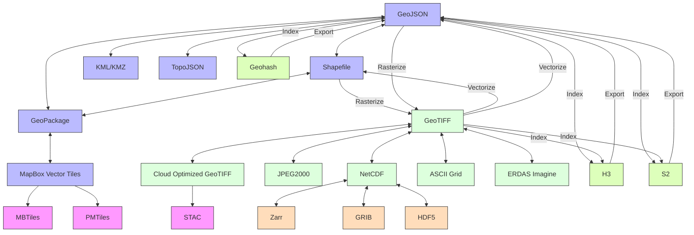
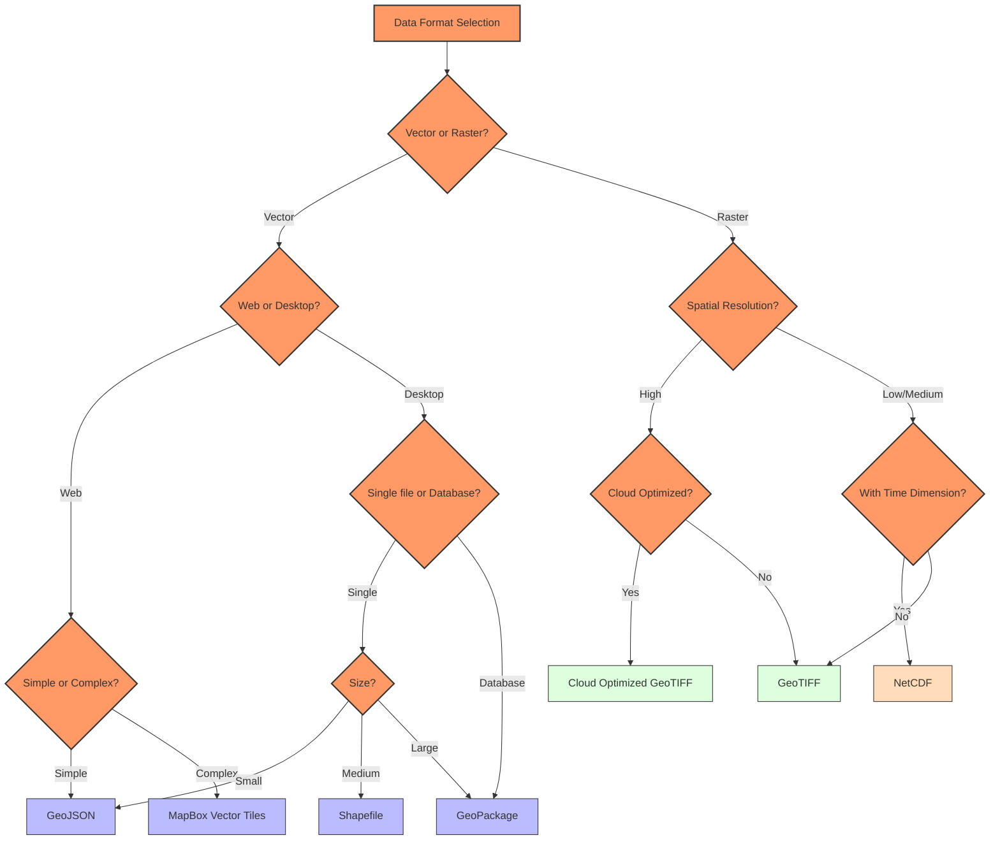
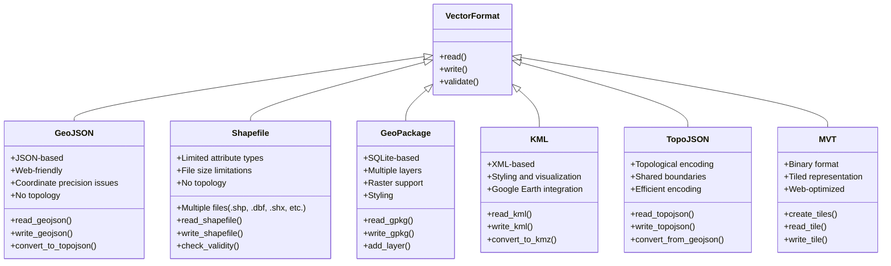
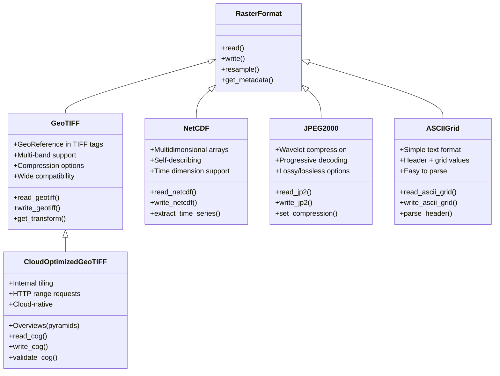

# Geospatial Data Formats

This document provides an overview of the geospatial data formats supported by the GEO-INFER framework, their relationships, and guidance on when to use each format.

## Supported Format Categories

Geospatial data formats fall into several categories:

```mermaid
graph TD
    GEO[Geospatial Data Formats]
    
    VECTOR[Vector Formats]
    RASTER[Raster Formats]
    TEMPORAL[Spatiotemporal Formats]
    CLOUD[Cloud-Optimized Formats]
    INDEX[Spatial Indices]
    META[Metadata Formats]
    
    GEO --> VECTOR
    GEO --> RASTER
    GEO --> TEMPORAL
    GEO --> CLOUD
    GEO --> INDEX
    GEO --> META
    
    %% Vector Formats
    GEOJSON[GeoJSON]
    SHAPE[Shapefile]
    GPKG[GeoPackage]
    KML[KML/KMZ]
    TOPO[TopoJSON]
    WKT[WKT/WKB]
    MVT[MapBox Vector Tiles]
    
    VECTOR --> GEOJSON
    VECTOR --> SHAPE
    VECTOR --> GPKG
    VECTOR --> KML
    VECTOR --> TOPO
    VECTOR --> WKT
    VECTOR --> MVT
    
    %% Raster Formats
    GEOTIFF[GeoTIFF]
    COG[Cloud Optimized GeoTIFF]
    JP2[JPEG2000]
    NETCDF[NetCDF]
    ASC[ASCII Grid]
    IMG[ERDAS Imagine]
    
    RASTER --> GEOTIFF
    RASTER --> COG
    RASTER --> JP2
    RASTER --> NETCDF
    RASTER --> ASC
    RASTER --> IMG
    
    %% Spatiotemporal Formats
    NCDF[NetCDF Time Series]
    ZARR[Zarr]
    GRIB[GRIB]
    HDF[HDF5]
    
    TEMPORAL --> NCDF
    TEMPORAL --> ZARR
    TEMPORAL --> GRIB
    TEMPORAL --> HDF
    
    %% Cloud-Optimized
    COGT[Cloud Optimized GeoTIFF]
    STAC[STAC]
    COGS[COG Store]
    MBTILES[MBTiles]
    PMTILES[PMTiles]
    
    CLOUD --> COGT
    CLOUD --> STAC
    CLOUD --> COGS
    CLOUD --> MBTILES
    CLOUD --> PMTILES
    
    %% Spatial Indices
    H3[H3]
    S2[S2]
    GEOHASH[Geohash]
    QTREE[QuadTree]
    RTREE[R-Tree]
    
    INDEX --> H3
    INDEX --> S2
    INDEX --> GEOHASH
    INDEX --> QTREE
    INDEX --> RTREE
    
    %% Metadata
    ISO[ISO 19115]
    FGDC[FGDC]
    DC[Dublin Core]
    
    META --> ISO
    META --> FGDC
    META --> DC
    
    %% Styling
    classDef category fill:#f96,stroke:#333,stroke-width:2px
    classDef vector fill:#bbf,stroke:#333,stroke-width:1px
    classDef raster fill:#dfd,stroke:#333,stroke-width:1px
    classDef temporal fill:#fdb,stroke:#333,stroke-width:1px
    classDef cloud fill:#f9f,stroke:#333,stroke-width:1px
    classDef index fill:#dfb,stroke:#333,stroke-width:1px
    classDef meta fill:#ddf,stroke:#333,stroke-width:1px
    
    class GEO,VECTOR,RASTER,TEMPORAL,CLOUD,INDEX,META category
    class GEOJSON,SHAPE,GPKG,KML,TOPO,WKT,MVT vector
    class GEOTIFF,COG,JP2,NETCDF,ASC,IMG raster
    class NCDF,ZARR,GRIB,HDF temporal
    class COGT,STAC,COGS,MBTILES,PMTILES cloud
    class H3,S2,GEOHASH,QTREE,RTREE index
    class ISO,FGDC,DC meta
```



## Format Relationships and Conversions

The following diagram shows how different formats can be converted to each other and their relationships:



## Format Usage Decision Tree

Use this decision tree to help select the appropriate format:



## Format Implementation Status in GEO-INFER

The following table shows the implementation status of each format in the GEO-INFER framework:

| Format | Read Support | Write Support | Optimization | Notes |
|--------|--------------|--------------|--------------|-------|
| GeoJSON | ✅ Full | ✅ Full | ✅ High | Primary interchange format |
| Shapefile | ✅ Full | ✅ Full | ⚠️ Medium | Legacy support |
| GeoPackage | ✅ Full | ✅ Full | ✅ High | Preferred for large datasets |
| KML/KMZ | ✅ Full | ✅ Full | ⚠️ Medium | Good for visualization |
| TopoJSON | ✅ Full | ✅ Full | ✅ High | Good for web visualization |
| WKT/WKB | ✅ Full | ✅ Full | ✅ High | Database integration |
| MapBox Vector Tiles | ✅ Full | ✅ Full | ✅ High | Web map support |
| GeoTIFF | ✅ Full | ✅ Full | ✅ High | Primary raster format |
| Cloud Optimized GeoTIFF | ✅ Full | ✅ Full | ✅ High | Preferred for cloud storage |
| JPEG2000 | ⚠️ Partial | ⚠️ Partial | ⚠️ Medium | Limited support |
| NetCDF | ✅ Full | ✅ Full | ✅ High | Primary for multidimensional |
| ASCII Grid | ✅ Full | ✅ Full | ❌ Low | Legacy support |
| ERDAS Imagine | ⚠️ Partial | ⚠️ Partial | ❌ Low | Limited support |
| Zarr | ✅ Full | ✅ Full | ✅ High | Cloud-native arrays |
| GRIB | ⚠️ Partial | ⚠️ Partial | ⚠️ Medium | Weather data format |
| HDF5 | ✅ Full | ✅ Full | ✅ High | Scientific data format |
| STAC | ✅ Full | ✅ Full | ✅ High | Metadata catalog |
| MBTiles | ✅ Full | ✅ Full | ✅ High | Mobile and web maps |
| PMTiles | ✅ Full | ✅ Full | ✅ High | New protocol tiles |
| H3 | ✅ Full | ✅ Full | ✅ High | Primary hierarchical index |
| S2 | ✅ Full | ✅ Full | ✅ High | Alternative hierarchical index |
| Geohash | ✅ Full | ✅ Full | ✅ High | String-based indexing |

## Vector Format Details

Vector formats represent discrete geographic features as points, lines, and polygons.



## Raster Format Details

Raster formats represent continuous geographic phenomena as gridded arrays of cells.



## Spatial Index Details

Spatial indices partition the Earth into addressable cells for efficient spatial operations.

```mermaid
graph TD
    subgraph "Global Discrete Grids"
        H3[H3 Hexagonal Grid]
        S2[S2 Quadrilateral Grid]
        GEOHASH[Geohash Grid]
    end
    
    subgraph "H3 Properties"
        H3_HEX[Hexagonal Cells]
        H3_HIER[Hierarchical]
        H3_ISO[Area Preservation]
        H3_EDGE[Edge Indexing]
        H3_DISK[Disk/Ring Operators]
        H3_RES[16 Resolutions]
    end
    
    subgraph "S2 Properties"
        S2_QUAD[Quad Cells]
        S2_HIER[Hierarchical]
        S2_COVERING[Shape Covering]
        S2_CS[Cell/Edge/Vertex]
        S2_RES[31 Levels]
        S2_HILBERT[Hilbert Curve]
    end
    
    subgraph "Geohash Properties"
        GH_RECT[Rectangular Cells]
        GH_PREFIX[Prefix Hierarchy]
        GH_CHARS[Base32 Encoding]
        GH_ADJ[Adjacency]
        GH_PREC[32 Precision Levels]
    end
    
    H3 --> H3_HEX
    H3 --> H3_HIER
    H3 --> H3_ISO
    H3 --> H3_EDGE
    H3 --> H3_DISK
    H3 --> H3_RES
    
    S2 --> S2_QUAD
    S2 --> S2_HIER
    S2 --> S2_COVERING
    S2 --> S2_CS
    S2 --> S2_RES
    S2 --> S2_HILBERT
    
    GEOHASH --> GH_RECT
    GEOHASH --> GH_PREFIX
    GEOHASH --> GH_CHARS
    GEOHASH --> GH_ADJ
    GEOHASH --> GH_PREC
    
    %% Use cases
    H3 --> H3_USE[Transportation]
    H3 --> H3_USE2[Delivery Zones]
    H3 --> H3_USE3[Mobility Analysis]
    
    S2 --> S2_USE[Point Indexing]
    S2 --> S2_USE2[Regional Analysis]
    S2 --> S2_USE3[Global Algorithms]
    
    GEOHASH --> GH_USE[Proximity Search]
    GEOHASH --> GH_USE2[Web Maps]
    GEOHASH --> GH_USE3[Geocoding]
    
    %% Styling
    classDef grid fill:#f96,stroke:#333,stroke-width:2px
    classDef h3prop fill:#bbf,stroke:#333,stroke-width:1px
    classDef s2prop fill:#dfd,stroke:#333,stroke-width:1px
    classDef ghprop fill:#fdb,stroke:#333,stroke-width:1px
    classDef usecase fill:#f9f,stroke:#333,stroke-width:1px
    
    class H3,S2,GEOHASH grid
    class H3_HEX,H3_HIER,H3_ISO,H3_EDGE,H3_DISK,H3_RES h3prop
    class S2_QUAD,S2_HIER,S2_COVERING,S2_CS,S2_RES,S2_HILBERT s2prop
    class GH_RECT,GH_PREFIX,GH_CHARS,GH_ADJ,GH_PREC ghprop
    class H3_USE,H3_USE2,H3_USE3,S2_USE,S2_USE2,S2_USE3,GH_USE,GH_USE2,GH_USE3 usecase
```



## Format Selection Guides

### Vector Format Selection

Choose the appropriate vector format based on the following considerations:

1. **GeoJSON**
   - Use for web applications
   - Use for data interchange
   - Use for simple datasets
   - Avoid for very large datasets
   - Avoid when topology is important

2. **Shapefile**
   - Use for compatibility with legacy systems
   - Use for medium-sized datasets
   - Avoid for web applications
   - Avoid for complex datasets

3. **GeoPackage**
   - Use for large datasets
   - Use when multiple layers are needed
   - Use for mixed vector/raster data
   - Preferred for database-like applications

4. **KML/KMZ**
   - Use for visualization in Google Earth
   - Use when styling is important
   - Avoid for data analysis

5. **TopoJSON**
   - Use for web visualizations requiring topology
   - Use for efficient encoding of administrative boundaries
   - Avoid when full GeoJSON compatibility is needed

6. **MapBox Vector Tiles**
   - Use for web maps
   - Use for large datasets that need tiling
   - Use for interactive applications
   - Avoid for simple data exchange

### Raster Format Selection

Choose the appropriate raster format based on the following considerations:

1. **GeoTIFF**
   - Use for general purpose raster storage
   - Use for imagery and DEMs
   - Good balance of features and compatibility
   
2. **Cloud Optimized GeoTIFF**
   - Use for cloud storage
   - Use when HTTP range requests are needed
   - Use for large datasets
   
3. **NetCDF**
   - Use for multidimensional data
   - Use when time is an important dimension
   - Use for scientific datasets
   
4. **JPEG2000**
   - Use when compression is critical
   - Use for large imagery datasets
   - Use when progressive loading is needed
   
5. **ASCII Grid**
   - Use for simple interchange
   - Use when human-readability is important
   - Avoid for large datasets
   
## Implementing Format Conversions

GEO-INFER provides a unified interface for format conversions through the `geo_infer_space.io` module:

```python
from geo_infer_space.io import converters

# Vector format conversion
vector_data = converters.convert_vector(
    source_file='input.shp',
    target_format='geojson',
    output_file='output.geojson'
)

# Raster format conversion
raster_data = converters.convert_raster(
    source_file='input.tif',
    target_format='netcdf',
    output_file='output.nc'
)

# Vector to raster conversion
raster_data = converters.vector_to_raster(
    vector_file='input.geojson',
    output_file='output.tif',
    resolution=30,
    attribute='population'
)

# Raster to vector conversion
vector_data = converters.raster_to_vector(
    raster_file='input.tif',
    output_file='output.geojson',
    band=1,
    threshold=100
)
```

## Performance Considerations

| Format | File Size | Read Speed | Write Speed | Random Access | Memory Usage |
|--------|-----------|------------|------------|---------------|--------------|
| GeoJSON | ⚠️ Large | ✅ Fast | ✅ Fast | ❌ Poor | ⚠️ High |
| Shapefile | ⚠️ Medium | ✅ Fast | ✅ Fast | ⚠️ Medium | ✅ Low |
| GeoPackage | ✅ Small | ⚠️ Medium | ⚠️ Medium | ✅ Good | ✅ Low |
| GeoTIFF | ⚠️ Medium | ✅ Fast | ✅ Fast | ⚠️ Medium | ⚠️ Medium |
| COG | ⚠️ Medium | ✅ Fast | ⚠️ Medium | ✅ Good | ✅ Low |
| NetCDF | ✅ Small | ⚠️ Medium | ⚠️ Medium | ✅ Good | ✅ Low |

## Best Practices

1. **Choose formats based on use case**, not just familiarity
2. **Convert only when necessary** to avoid data loss
3. **Use cloud-optimized formats** for data that needs to be accessed remotely
4. **Consider the entire workflow** when selecting formats
5. **Test performance** with representative datasets
6. **Document format decisions** for future reference
7. **Validate data** after conversion to ensure integrity

## See Also

- [H3 Integration Guide](h3/index.md)
- [Vector Data Guide](../concepts/vector_data.md)
- [Raster Data Guide](../concepts/raster_data.md)
- [Cloud Optimization](../concepts/cloud_optimization.md)
- [Spatiotemporal Data](../concepts/spatiotemporal_data.md) 