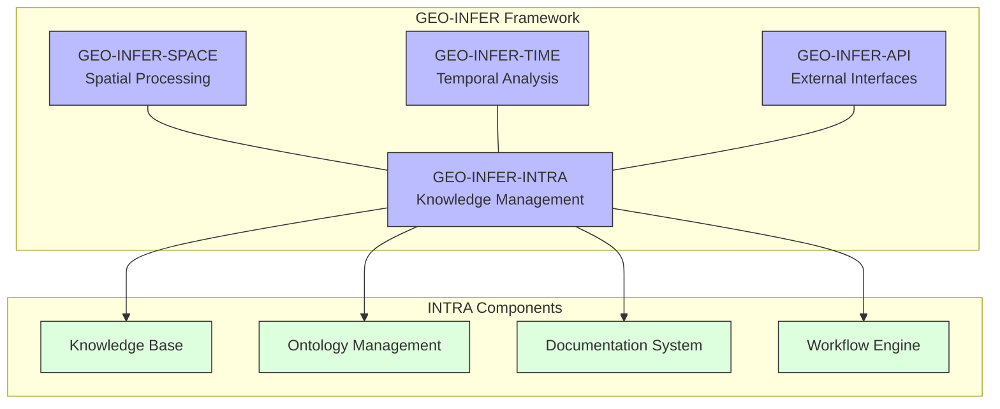
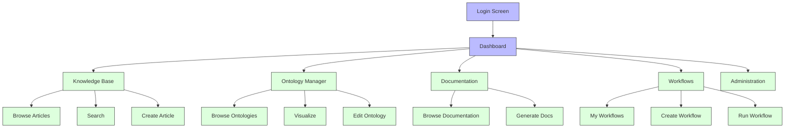
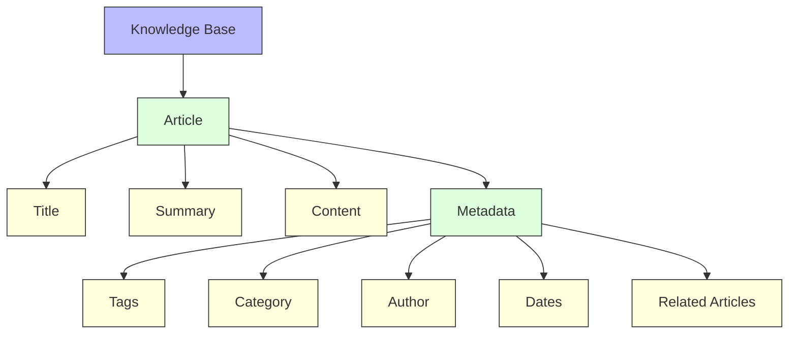
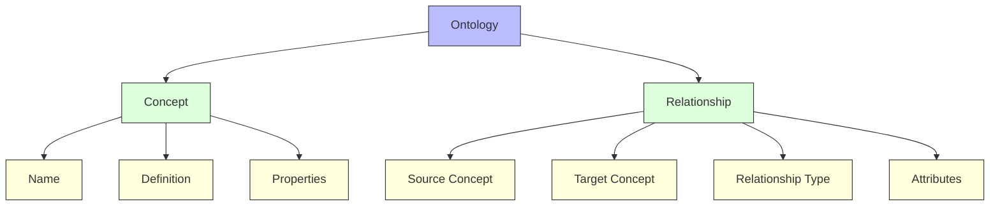
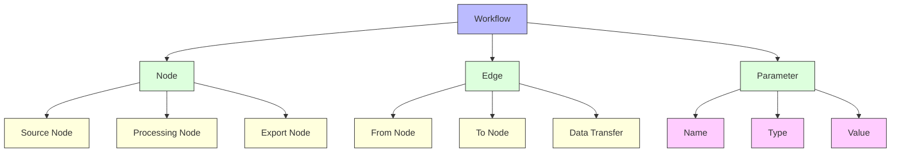

# Getting Started with GEO-INFER-INTRA

This guide will help you get started with GEO-INFER-INTRA, the knowledge management and integration component of the GEO-INFER framework. It covers installation, basic configuration, and common usage scenarios.

## Contents

- [What is GEO-INFER-INTRA?](#what-is-geo-infer-intra)
- [Installation](#installation)
- [Basic Configuration](#basic-configuration)
- [Quick Start Tutorials](#quick-start-tutorials)
- [Core Concepts](#core-concepts)
- [Integration with other GEO-INFER Modules](#integration-with-other-geo-infer-modules)
- [Next Steps](#next-steps)

## What is GEO-INFER-INTRA?

GEO-INFER-INTRA is the knowledge management and integration component of the GEO-INFER framework. It provides tools and services for organizing, accessing, and integrating geospatial knowledge across the framework.



### Key Features

- **Knowledge Base**: Centralized repository for geospatial knowledge, best practices, and reference materials
- **Ontology Management**: Tools for creating, managing, and utilizing geospatial ontologies
- **Documentation System**: Comprehensive documentation generation and management
- **Workflow Engine**: Design and execution of geospatial data processing workflows
- **Integration Layer**: Seamless integration with other GEO-INFER modules and external systems

## Installation

### Prerequisites

Before installing GEO-INFER-INTRA, ensure you have the following prerequisites:

- Python 3.8 or higher
- PostgreSQL 12 or higher
- Redis 6 or higher (optional, for caching)
- 4GB+ RAM, 2+ CPU cores
- 20GB+ available disk space

### Quick Installation (Development)

The simplest way to get started with GEO-INFER-INTRA for development is using pip:

```bash
# Create a virtual environment
python -m venv venv
source venv/bin/activate  # On Windows: venv\Scripts\activate

# Install GEO-INFER-INTRA
pip install geo-infer-intra

# Initialize the application
geo-infer-intra init

# Start the development server
geo-infer-intra run
```

### Docker Installation

For a containerized setup, you can use Docker:

```bash
# Clone the repository
git clone https://github.com/geo-infer/geo-infer-intra.git
cd geo-infer-intra

# Build and run using Docker Compose
docker-compose up -d
```

This will start GEO-INFER-INTRA and all required services (PostgreSQL, Redis, etc.).

### Production Installation

For production deployments, refer to the [Deployment Guide](../deployment/index.md) for detailed instructions.

## Basic Configuration

After installation, you'll need to configure GEO-INFER-INTRA for your environment.

### Configuration File

The main configuration file is located at `config/config.yaml`. Here's a basic configuration:

```yaml
app:
  name: GEO-INFER-INTRA
  environment: development
  debug: true

server:
  host: 0.0.0.0
  port: 5000

database:
  type: postgresql
  host: localhost
  port: 5432
  name: geo_infer_intra
  user: postgres
  password: password
  
storage:
  type: file
  path: ./data
```

### Environment Variables

You can also configure GEO-INFER-INTRA using environment variables:

```bash
export GEO_INFER_APP_ENVIRONMENT=development
export GEO_INFER_SERVER_PORT=5000
export GEO_INFER_DATABASE_HOST=localhost
export GEO_INFER_DATABASE_PASSWORD=password
```

### First-Time Setup

After configuration, initialize the application:

```bash
# Initialize the database
geo-infer-intra db init
geo-infer-intra db migrate
geo-infer-intra db upgrade

# Create an admin user
geo-infer-intra user create-admin
```

## Quick Start Tutorials

### 1. Accessing the Web Interface

After starting GEO-INFER-INTRA, access the web interface at `http://localhost:5000` (or your configured host/port). Log in with your admin credentials.

The web interface provides access to all features of GEO-INFER-INTRA:



### 2. Creating Your First Knowledge Base Article

Knowledge Base articles are the building blocks of GEO-INFER-INTRA's knowledge management system.

1. Navigate to Knowledge Base > Create Article
2. Fill in the article details:
   - Title: "Introduction to Spatial Indexing"
   - Summary: "An overview of spatial indexing methods and their applications"
   - Content: Write or paste the article content (supports Markdown)
   - Tags: "spatial", "indexing", "performance"
   - Category: "Algorithms"
3. Click "Save" to create the article

### 3. Creating a Simple Ontology

Ontologies in GEO-INFER-INTRA help organize and relate geospatial concepts.

1. Navigate to Ontology Manager > Create Ontology
2. Enter basic details:
   - Name: "Basic Geospatial Concepts"
   - Description: "A simple ontology of basic geospatial concepts"
3. Add concepts and relationships:
   - Add concept "Point" with definition "A zero-dimensional geometry"
   - Add concept "Line" with definition "A one-dimensional geometry"
   - Add concept "Polygon" with definition "A two-dimensional geometry"
   - Create relationship "contains" from "Polygon" to "Line"
   - Create relationship "contains" from "Line" to "Point"
4. Save the ontology

### 4. Creating a Simple Workflow

Workflows automate geospatial data processing tasks.

1. Navigate to Workflows > Create Workflow
2. Configure the workflow:
   - Name: "Basic Data Processing"
   - Description: "A simple workflow to process geospatial data"
3. Add workflow nodes:
   - Add "Data Source" node to load data
   - Add "Filter" node to filter features
   - Add "Transform" node to transform coordinates
   - Add "Export" node to save results
4. Connect the nodes:
   - Data Source → Filter → Transform → Export
5. Save the workflow
6. Run the workflow by clicking "Execute"

## Core Concepts

### Knowledge Base

The Knowledge Base is a centralized repository for geospatial knowledge, organized as articles with rich metadata.



### Ontology Management

Ontologies define concepts and relationships within a domain, enabling semantic understanding and reasoning.



### Documentation System

The Documentation System generates, manages, and serves comprehensive documentation for geospatial applications.

Key features:
- Markdown and structured document support
- Automatic API documentation
- Version control
- Search functionality
- Export to multiple formats (HTML, PDF, etc.)

### Workflow Engine

The Workflow Engine enables the design and execution of geospatial data processing workflows.



## Integration with other GEO-INFER Modules

GEO-INFER-INTRA integrates seamlessly with other GEO-INFER modules:

### GEO-INFER-SPACE Integration

```python
from geo_infer.intra import KnowledgeBase
from geo_infer.space import SpatialIndex

# Get knowledge about spatial indexing
kb = KnowledgeBase()
articles = kb.search("spatial indexing")

# Use that knowledge to configure a spatial index
index_type = articles[0].metadata.get("recommended_index_type", "quadtree")
spatial_index = SpatialIndex.create(index_type)
```

### GEO-INFER-TIME Integration

```python
from geo_infer.intra import WorkflowEngine
from geo_infer.time import TimeSeriesAnalysis

# Create a workflow that includes time series analysis
workflow = WorkflowEngine.create_workflow("Temporal Analysis")

# Add nodes to the workflow
data_source = workflow.add_node("DataSource", {"path": "data.csv"})
time_analysis = workflow.add_node("TimeSeriesAnalysis", {"method": "seasonal_decomposition"})
export = workflow.add_node("Export", {"path": "results.csv"})

# Connect nodes
workflow.connect(data_source, time_analysis)
workflow.connect(time_analysis, export)

# Execute the workflow
workflow.execute()
```

### GEO-INFER-API Integration

```python
from geo_infer.intra import OntologyManager
from geo_infer.api import APIBuilder

# Use ontology to build API endpoints
ontology = OntologyManager.load_ontology("geospatial_features")
api_builder = APIBuilder()

# Generate API endpoints based on ontology concepts
for concept in ontology.concepts:
    api_builder.add_resource(concept.name, {
        "methods": ["GET", "POST", "PUT", "DELETE"],
        "schema": concept.to_schema()
    })

# Generate API documentation
api_docs = api_builder.generate_documentation()
```

## Next Steps

Now that you've got started with GEO-INFER-INTRA, here are some next steps to explore:

1. [Advanced Configuration](../configuration/index.md): Learn how to configure GEO-INFER-INTRA for your specific needs
2. [API Documentation](../api/index.md): Explore the API for programmatic access
3. [Integration Guide](../integration/index.md): Integrate GEO-INFER-INTRA with other systems
4. [Workflow Examples](../workflows/examples.md): See examples of common geospatial workflows
5. [Ontology Guide](../ontology/index.md): Learn more about creating and using ontologies
6. [Deployment Guide](../deployment/index.md): Deploy GEO-INFER-INTRA in a production environment

## Troubleshooting

### Common Issues

#### Installation Problems

If you encounter issues during installation:

```bash
# Check Python version
python --version  # Should be 3.8+

# Check pip is updated
pip install --upgrade pip

# Install with verbose output
pip install -v geo-infer-intra
```

#### Database Connection Issues

If the application cannot connect to the database:

```bash
# Check PostgreSQL is running
sudo systemctl status postgresql

# Check connection manually
psql -U postgres -h localhost -d geo_infer_intra
```

#### Permission Errors

If you encounter permission errors:

```bash
# Check file permissions
ls -la /path/to/geo-infer-intra/data

# Fix permissions if needed
chmod -R 755 /path/to/geo-infer-intra/data
```

For more troubleshooting tips, see the [Troubleshooting Guide](../troubleshooting/index.md).

## Getting Help

If you need assistance with GEO-INFER-INTRA:

- [Documentation](../index.md): Comprehensive documentation
- [FAQ](../faq.md): Frequently asked questions
- [Community Forum](https://forum.geo-infer.org): Ask questions and share knowledge
- [GitHub Issues](https://github.com/geo-infer/geo-infer-intra/issues): Report bugs and request features
- [Contact Support](mailto:support@geo-infer.org): Contact the GEO-INFER team 