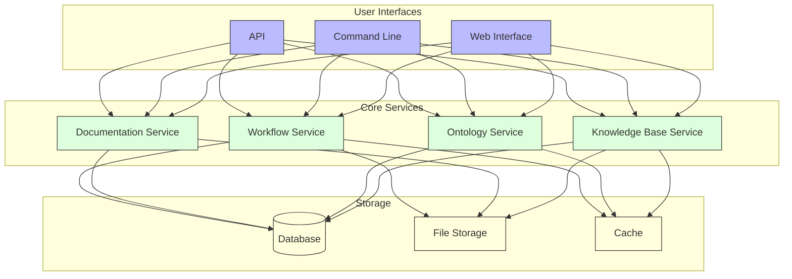

# GEO-INFER-INTRA Documentation

Welcome to the official documentation for GEO-INFER-INTRA, the knowledge management and integration component of the GEO-INFER framework. This documentation provides comprehensive information about the system's architecture, features, and usage.

## 🚀 Quick Start

New to GEO-INFER? Start here:

1. **[Getting Started](../getting_started/index.md)** - Complete onboarding guide
2. **[Installation Guide](../getting_started/installation_guide.md)** - Set up your environment
3. **[Your First Analysis](../getting_started/first_analysis.md)** - Complete a simple geospatial analysis
4. **[Active Inference Basics](../getting_started/active_inference_basics.md)** - Understand the core AI concepts

## 📚 Documentation Sections

### 🆕 Getting Started
- **[Getting Started Hub](../getting_started/index.md)** - Complete onboarding guide
- **[Installation Guide](../getting_started/installation_guide.md)** - Set up your environment
- **[Your First Analysis](../getting_started/first_analysis.md)** - Complete a simple geospatial analysis
- **[Active Inference Basics](../getting_started/active_inference_basics.md)** - Understand the core AI concepts
- **[Spatial Analysis Basics](../getting_started/spatial_analysis_basics.md)** - Learn core spatial concepts
- **[Your First Map](../getting_started/first_map.md)** - Create your first geospatial visualization

### 🏗️ Architecture
- **[Architecture Overview](architecture/index.md)** - System design and components
- **[Component Diagram](architecture/component_diagram.md)** - Visual system architecture
- **[Data Flow Diagram](architecture/data_flow.md)** - How data moves through the system
- **[Module Structure](architecture/module_structure.md)** - How modules are organized
- **[Cross-Module Interaction](architecture/cross_module_interaction.md)** - How modules communicate
- **[System Integration](architecture/system_integration.md)** - Integration patterns

### 🔧 Core Features
- **[Knowledge Base](knowledge_base/index.md)** - Centralized knowledge management
- **[Ontology Management](ontology/index.md)** - Domain-specific ontologies
- **[Documentation System](documentation_guide.md)** - Documentation standards
- **[Workflow Engine](workflows/index.md)** - Automated data processing
- **[Active Inference Guide](active_inference_guide.md)** - AI framework implementation

### 🔗 Integration
- **[Integration Guide](integration/index.md)** - Connect with external systems
- **[API Reference](api/index.md)** - Programming interface
- **[External Systems Integration](integration/external_systems.md)** - Third-party integrations
- **[GEO-INFER Module Integration](integration/geo_infer_modules.md)** - Framework integration

### 🚀 Deployment
- **[Deployment Guide](deployment/index.md)** - Production deployment
- **[Environment Setup](deployment/environment.md)** - Configuration management
- **[Security](security/index.md)** - Security best practices
- **[Scaling](deployment/scaling.md)** - Performance optimization

### 🗺️ Geospatial
- **[Geospatial Concepts](geospatial/index.md)** - Spatial data fundamentals
- **[Standards](geospatial/standards/index.md)** - Industry standards
- **[Data Formats](geospatial/data_formats/index.md)** - Supported formats
- **[Algorithms](geospatial/algorithms/index.md)** - Spatial analysis algorithms
- **[Visualization](geospatial/visualization/index.md)** - Mapping and visualization
- **[Analysis](geospatial/analysis/index.md)** - Spatial analysis techniques
- **[H3 Geospatial Indexing](h3_guide.md)** - H3 hexagonal indexing
- **[Coordinate Systems](geospatial/coordinate_systems.md)** - CRS and transformations
- **[Spatial Relationships](geospatial/spatial_relationships.md)** - Topological analysis

### 👥 User Guides
- **[User Guide](user_guide/index.md)** - End-user documentation
- **[Active Inference Principles](user_guide/active_inference_principles.md)** - AI concepts
- **[Cookbook](user_guide/cookbook.md)** - Practical examples
- **[Installation](user_guide/installation.md)** - User installation guide
- **[Knowledge Base Usage](user_guide/knowledge_base_usage.md)** - Using the knowledge system

### 🛠️ Development
- **[Development Guide](developer_guide/index.md)** - Developer documentation
- **[Contributing](developer_guide/contributing.md)** - How to contribute
- **[Code Structure](developer_guide/code_structure.md)** - Code organization
- **[Repository Guidelines](developer_guide/repo_guidelines.md)** - Development standards
- **[Autonomous Agent Guide](developer_guide/autonomous_agent_guide.md)** - Agent development

### 🚀 Advanced Topics
- **[Advanced Topics](advanced/index.md)** - Sophisticated techniques
- **[Performance Optimization](advanced/performance_optimization.md)** - Speed up your analyses
- **[Custom Models](advanced/custom_models.md)** - Build specialized models
- **[Scaling Guide](advanced/scaling_guide.md)** - Handle large datasets
- **[Production Architecture](advanced/production_architecture.md)** - Production deployment
- **[Module Integration](modules/index.md)** - Complete module overview
- **[Active Inference Deep Dive](active_inference_guide.md)** - Advanced AI concepts
- **[Bayesian Methods](bayesian_inference_guide.md)** - Statistical inference
- **[Temporal Analysis](temporal_analysis_guide.md)** - Time series analysis

### 🆘 Support & Troubleshooting
- **[Support Hub](support/index.md)** - Get help with issues
- **[FAQ](support/faq.md)** - Frequently asked questions
- **[Troubleshooting](support/troubleshooting.md)** - Common problems and solutions
- **[Installation Issues](support/installation_issues.md)** - Setup problems
- **[Performance Issues](support/performance_issues.md)** - Speed and scaling problems

### 📖 Reference
- **[API Reference](api/index.md)** - Complete API documentation
- **[Data Dictionary](data_dictionary.md)** - Data structures and formats
- **[Terminology](terminology.md)** - Glossary of terms
- **[Geospatial Standards](geospatial_standards.md)** - Industry standards
- **[Module README Template](module_readme_template.md)** - Documentation templates
- **[Module Documentation](modules/index.md)** - Complete module documentation
- **[GEO-INFER-ACT](modules/geo-infer-act.md)** - Active Inference Engine
- **[GEO-INFER-SPACE](modules/geo-infer-space.md)** - Spatial Analysis Engine
- **[GEO-INFER-TIME](modules/geo-infer-time.md)** - Temporal Analysis Engine
- **[Documentation Standards](DOCUMENTATION_STANDARDS.md)** - Documentation guidelines

## 🎯 Quick Navigation

### By User Type

**👤 New Users:**
1. [Getting Started](../getting_started/index.md)
2. [Installation Guide](../getting_started/installation_guide.md)
3. [Your First Analysis](../getting_started/first_analysis.md)

**🔧 Developers:**
1. [Development Guide](developer_guide/index.md)
2. [API Reference](api/index.md)
3. [Contributing](developer_guide/contributing.md)

**📊 Data Scientists:**
1. [Active Inference Guide](active_inference_guide.md)
2. [Spatial Analysis](geospatial/analysis/index.md)
3. [Temporal Analysis](workflows/active_inference_workflows.md)

**🏭 Production Users:**
1. [Deployment Guide](deployment/index.md)
2. [Advanced Topics](advanced/index.md)
3. [Performance Optimization](advanced/performance_optimization.md)

### By Task

**🚀 Getting Started:**
- [Installation](../getting_started/installation_guide.md)
- [First Analysis](../getting_started/first_analysis.md)
- [Basic Concepts](../getting_started/active_inference_basics.md)

**🔧 Building Applications:**
- [API Reference](api/index.md)
- [Integration Guide](integration/index.md)
- [Custom Models](advanced/custom_models.md)

**🚨 Troubleshooting:**
- [Support Hub](support/index.md)
- [FAQ](support/faq.md)
- [Troubleshooting](support/troubleshooting.md)

**📈 Performance:**
- [Performance Optimization](advanced/performance_optimization.md)
- [Scaling Guide](advanced/scaling_guide.md)
- [Memory Management](advanced/memory_management.md)

## 🔗 System Overview

GEO-INFER-INTRA consists of several core components that work together to provide comprehensive knowledge management and integration capabilities.

## 🌟 Key Features

- **🧠 Knowledge Management**: Centralized repository for geospatial knowledge, accessible through multiple interfaces
- **🔗 Ontology Support**: Tools for creating and managing domain-specific ontologies
- **📚 Documentation Generation**: Comprehensive documentation generation and management tools
- **⚙️ Workflow Automation**: Design and execution of complex geospatial data processing workflows
- **🔌 Integration Capabilities**: Seamless integration with other GEO-INFER modules and external systems
- **🌐 API Access**: RESTful and GraphQL APIs for programmatic access to all features
- **🤖 Active Inference**: AI-powered geospatial analysis using active inference principles
- **🗺️ Spatial Analysis**: Advanced spatial data processing and analysis capabilities
- **⏰ Temporal Analysis**: Time series analysis and forecasting capabilities

## 🔗 Integration with AlphaEarth

GEO-INFER-INTRA integrates with Google DeepMind's AlphaEarth Foundations for enhanced Earth observation capabilities:

- **[AlphaEarth Integration](alphaearth/alphaearth-geo-infer.md)** - Complete integration guide
- **[AlphaEarth Summary](alphaearth/alphaearth_summary.md)** - Technical overview
- **64-dimensional embeddings** - Process AlphaEarth's compact representations
- **Global 10m resolution** - Maintain AlphaEarth's high-resolution coverage
- **Continuous time modeling** - Leverage AlphaEarth's temporal capabilities

## 📊 Examples & Tutorials

### Basic Examples
- **[First Analysis](../getting_started/first_analysis.md)** - Complete beginner tutorial
- **[Spatial Analysis](geospatial/analysis/index.md)** - Spatial data processing
- **[Temporal Analysis](workflows/active_inference_workflows.md)** - Time series analysis

### Advanced Examples
- **[Environmental Monitoring](examples/environmental_monitoring.md)** - Climate and ecosystem analysis
- **[Urban Planning](examples/urban_planning.md)** - City and infrastructure analysis
- **[Agricultural Applications](examples/agricultural_applications.md)** - Crop and soil analysis

### Research Applications
- **[Climate Modeling](examples/climate_modeling.md)** - Environmental prediction
- **[Urban Analytics](examples/urban_analytics.md)** - Smart city applications
- **[Agricultural Intelligence](examples/agricultural_intelligence.md)** - Precision agriculture

## 🆘 Support and Community

### Getting Help
- **[Support Hub](support/index.md)** - One-stop help center
- **[FAQ](support/faq.md)** - Common questions and answers
- **[Troubleshooting](support/troubleshooting.md)** - Problem-solving guide

### Community Resources
- **[Community Forum](https://forum.geo-infer.org)** - Ask questions and share solutions
- **[GitHub Repository](https://github.com/geo-infer/geo-infer-intra)** - Source code and issues
- **[Discord Channel](https://discord.gg/geo-infer)** - Real-time chat support
- **[GitHub Issues](https://github.com/geo-infer/geo-infer-intra/issues)** - Report bugs and request features

### Professional Support
- **[Email Support](mailto:support@geo-infer.org)** - Direct support for complex issues
- **[Enterprise Support](https://geo-infer.org/enterprise)** - Commercial support options

## 📈 Progress Tracking

Track your learning and development progress:

### Getting Started Progress
- [ ] **Installation Complete** - Environment set up successfully
- [ ] **First Analysis Complete** - Successfully ran a basic analysis
- [ ] **Active Inference Understanding** - Grasped core AI concepts
- [ ] **Spatial Analysis Skills** - Can perform basic spatial operations
- [ ] **Temporal Analysis Skills** - Can analyze time series data

### Advanced Skills Progress
- [ ] **Custom Model Development** - Built specialized active inference models
- [ ] **Performance Optimization** - Applications running 10x faster
- [ ] **Production Deployment** - Successfully deployed to cloud environment
- [ ] **Integration Skills** - Can connect with external systems
- [ ] **Research Contribution** - Published or presented work using GEO-INFER

## 🔄 Continuous Learning

### Advanced Topics
- **[Performance Optimization](advanced/performance_optimization.md)** - Speed up your analyses
- **[Custom Model Development](advanced/custom_models.md)** - Build specialized models
- **[Large-scale Deployment](advanced/scaling_guide.md)** - Handle big data and high traffic

### Specialized Applications
- **[Climate Modeling](examples/climate_modeling.md)** - Environmental prediction
- **[Urban Analytics](examples/urban_analytics.md)** - Smart city applications
- **[Agricultural Intelligence](examples/agricultural_intelligence.md)** - Precision agriculture

### Contributing
- **[Development Guide](developer_guide/contributing.md)** - How to contribute code
- **[Documentation Guide](documentation_guide.md)** - How to improve docs
- **[Community Guidelines](https://github.com/geo-infer/geo-infer-intra/blob/main/CODE_OF_CONDUCT.md)** - Community standards

## 📄 License and Usage

GEO-INFER-INTRA is released under the [MIT License](https://opensource.org/licenses/MIT). See the [LICENSE](https://github.com/geo-infer/geo-infer-intra/blob/main/LICENSE) file for details.

For commercial applications, please contact [enterprise@geo-infer.org](mailto:enterprise@geo-infer.org).

---

**Ready to get started?** Begin with the [Getting Started Guide](../getting_started/index.md) or jump directly to [Your First Analysis](../getting_started/first_analysis.md)! 