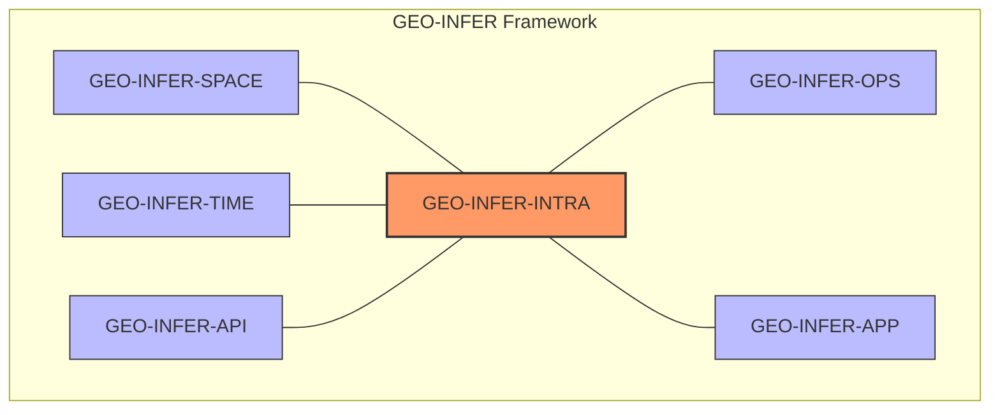
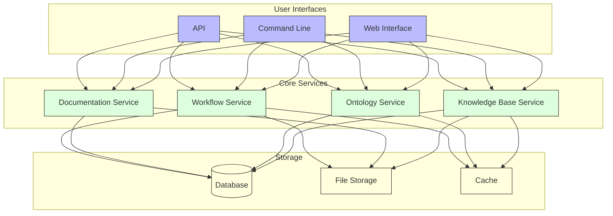

# GEO-INFER-INTRA Documentation

Welcome to the official documentation for GEO-INFER-INTRA, the knowledge management and integration component of the GEO-INFER framework. This documentation provides comprehensive information about the system's architecture, features, and usage.

## About GEO-INFER-INTRA

GEO-INFER-INTRA is designed to facilitate the organization, access, and integration of geospatial knowledge across the GEO-INFER framework. It serves as the central knowledge hub, connecting various modules and providing tools for ontology management, documentation, and workflow automation.

## Documentation Sections

### Getting Started
- [Introduction to GEO-INFER-INTRA](getting_started/index.md)
- [Installation Guide](getting_started/installation.md)
- [Quick Start Tutorials](getting_started/tutorials.md)

### Architecture
- [Architecture Overview](architecture/index.md)
- [Component Diagram](architecture/component_diagram.md)
- [Data Flow Diagram](architecture/data_flow.md)

### Core Features
- [Knowledge Base](knowledge_base/index.md)
- [Ontology Management](ontology/index.md)
- [Documentation System](documentation/index.md)
- [Workflow Engine](workflows/index.md)

### Integration
- [Integration Guide](integration/index.md)
- [API Reference](api/index.md)
- [External Systems Integration](integration/external_systems.md)
- [GEO-INFER Module Integration](integration/geo_infer_modules.md)

### Deployment
- [Deployment Guide](deployment/index.md)
- [Environment Setup](deployment/environment.md)
- [Configuration](deployment/configuration.md)
- [Security](deployment/security.md)
- [Scaling](deployment/scaling.md)

### Geospatial
- [Geospatial Concepts](geospatial/index.md)
- [Standards](geospatial/standards.md)
- [Data Formats](geospatial/data_formats.md)
- [Algorithms](geospatial/algorithms/index.md)
- [Visualization](geospatial/visualization.md)
- [Analysis](geospatial/analysis.md)

### Development
- [Development Guide](development/index.md)
- [Coding Standards](development/coding_standards.md)
- [Testing](development/testing.md)
- [Contributing](development/contributing.md)

### Operations
- [Operations Guide](operations/index.md)
- [Monitoring](operations/monitoring.md)
- [Logging](operations/logging.md)
- [Backup and Recovery](operations/backup_recovery.md)

### Reference
- [API Reference](api/index.md)
- [CLI Reference](reference/cli.md)
- [Configuration Reference](reference/configuration.md)
- [Glossary](reference/glossary.md)

## Quick Links

- [Getting Started](getting_started/index.md)
- [API Reference](api/index.md)
- [Integration Guide](integration/index.md)
- [Workflow Examples](workflows/examples.md)
- [Troubleshooting](troubleshooting/index.md)

## System Overview

GEO-INFER-INTRA consists of several core components that work together to provide comprehensive knowledge management and integration capabilities.

## Key Features

- **Knowledge Management**: Centralized repository for geospatial knowledge, accessible through multiple interfaces
- **Ontology Support**: Tools for creating and managing domain-specific ontologies
- **Documentation Generation**: Comprehensive documentation generation and management tools
- **Workflow Automation**: Design and execution of complex geospatial data processing workflows
- **Integration Capabilities**: Seamless integration with other GEO-INFER modules and external systems
- **API Access**: RESTful and GraphQL APIs for programmatic access to all features

## Support and Community

- [GitHub Repository](https://github.com/geo-infer/geo-infer-intra)
- [Issue Tracker](https://github.com/geo-infer/geo-infer-intra/issues)
- [Community Forum](https://forum.geo-infer.org)
- [Contact Support](mailto:support@geo-infer.org)

## License

GEO-INFER-INTRA is released under the [MIT License](https://opensource.org/licenses/MIT). See the [LICENSE](https://github.com/geo-infer/geo-infer-intra/blob/main/LICENSE) file for details. 