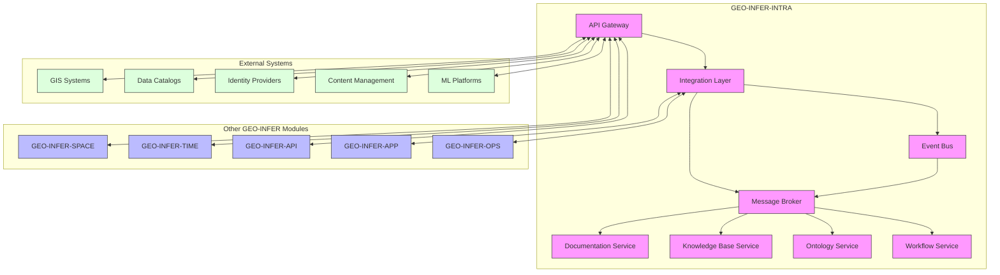
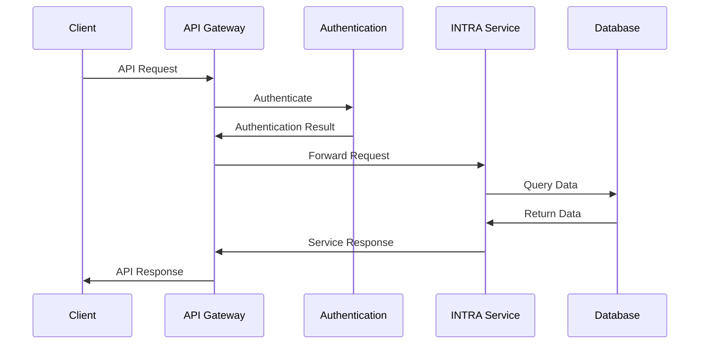
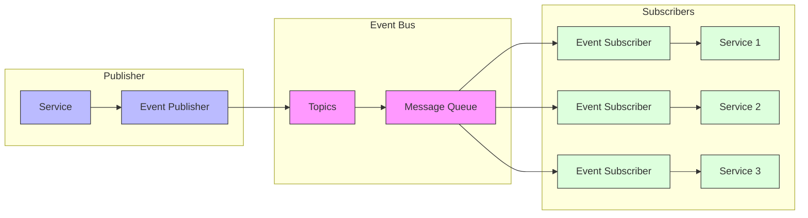
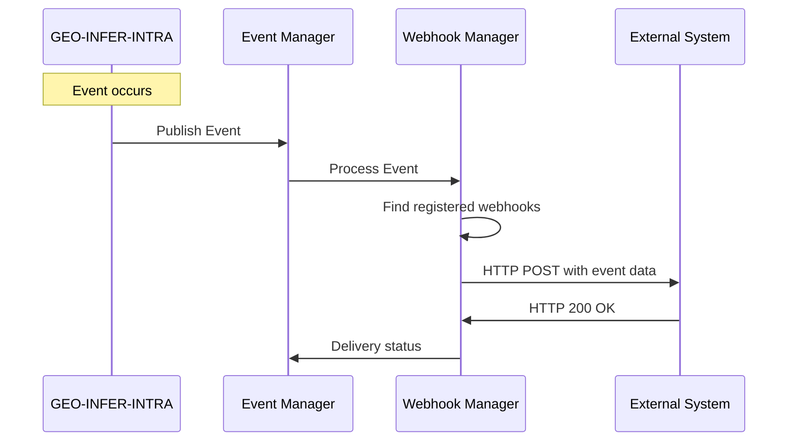
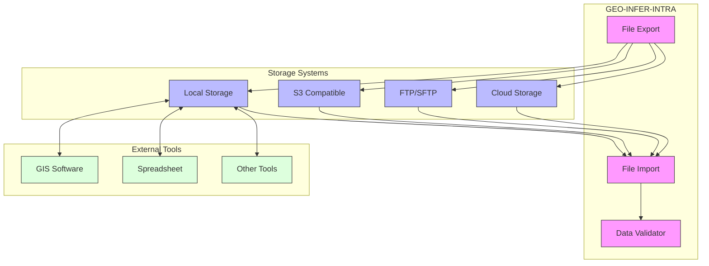
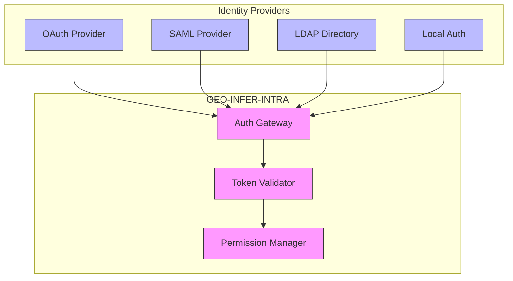
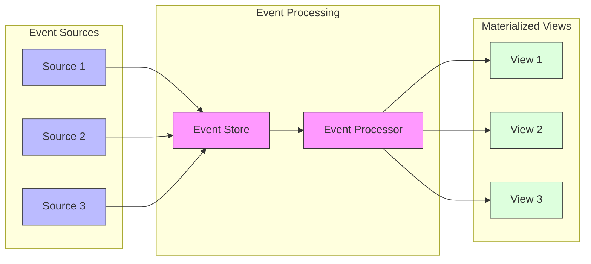

# Integration Guide

This document provides information about integrating GEO-INFER-INTRA with other GEO-INFER modules and external systems.

## Contents

- [Integration Overview](overview.md) - Introduction to integration capabilities
- [GEO-INFER Module Integration](geo_infer_modules.md) - Integration with other GEO-INFER modules
- [External System Integration](external_systems.md) - Integration with external systems
- [API Integration](api_integration.md) - Integrating via APIs
- [Data Integration](data_integration.md) - Integrating data from various sources
- [Authentication Integration](auth_integration.md) - Integrating authentication systems
- [Webhooks](webhooks.md) - Event-based integration with webhooks
- [Message Queues](message_queues.md) - Integration via message queues
- [Integration Patterns](patterns.md) - Common integration patterns and best practices

## Integration Architecture

The following diagram shows the high-level integration architecture of GEO-INFER-INTRA:



## Integration with GEO-INFER Modules

GEO-INFER-INTRA integrates with other GEO-INFER modules as follows:

```mermaid
graph TD
    subgraph "GEO-INFER-INTRA"
        INTRA_DOC[Documentation Service]
        INTRA_KB[Knowledge Base Service]
        INTRA_ONTO[Ontology Service]
        INTRA_WF[Workflow Service]
    end
    
    subgraph "GEO-INFER-SPACE"
        SPACE_DATA[Spatial Data Service]
        SPACE_PROC[Spatial Processing]
        SPACE_VIZ[Spatial Visualization]
    end
    
    subgraph "GEO-INFER-TIME"
        TIME_DATA[Temporal Data Service]
        TIME_PROC[Temporal Processing]
        TIME_VIZ[Temporal Visualization]
    end
    
    subgraph "GEO-INFER-API"
        API_REST[REST API]
        API_GRAPH[GraphQL API]
        API_DOC[API Documentation]
    end
    
    subgraph "GEO-INFER-APP"
        APP_UI[User Interface]
        APP_MOBILE[Mobile App]
        APP_COMP[UI Components]
    end
    
    subgraph "GEO-INFER-OPS"
        OPS_MONITOR[Monitoring]
        OPS_DEPLOY[Deployment]
        OPS_LOG[Logging]
    end
    
    %% INTRA to SPACE
    INTRA_DOC --> SPACE_DATA
    INTRA_ONTO --> SPACE_DATA
    INTRA_KB --> SPACE_PROC
    INTRA_WF --> SPACE_PROC
    
    %% INTRA to TIME
    INTRA_DOC --> TIME_DATA
    INTRA_ONTO --> TIME_DATA
    INTRA_KB --> TIME_PROC
    INTRA_WF --> TIME_PROC
    
    %% INTRA to API
    INTRA_DOC --> API_DOC
    INTRA_KB --> API_REST
    INTRA_ONTO --> API_GRAPH
    INTRA_WF --> API_REST
    
    %% INTRA to APP
    INTRA_DOC --> APP_UI
    INTRA_KB --> APP_UI
    INTRA_KB --> APP_MOBILE
    INTRA_ONTO --> APP_COMP
    INTRA_WF --> APP_UI
    
    %% INTRA to OPS
    INTRA_DOC --> OPS_DEPLOY
    INTRA_KB --> OPS_MONITOR
    INTRA_WF --> OPS_LOG
    OPS_MONITOR --> INTRA_WF
    
    %% SPACE to INTRA
    SPACE_DATA --> INTRA_DOC
    SPACE_DATA --> INTRA_ONTO
    SPACE_PROC --> INTRA_KB
    
    %% TIME to INTRA
    TIME_DATA --> INTRA_DOC
    TIME_DATA --> INTRA_ONTO
    TIME_PROC --> INTRA_KB
    
    classDef intra fill:#f9f,stroke:#333,stroke-width:1px
    classDef space fill:#bbf,stroke:#333,stroke-width:1px
    classDef time fill:#dfd,stroke:#333,stroke-width:1px
    classDef api fill:#ffd,stroke:#333,stroke-width:1px
    classDef app fill:#fdb,stroke:#333,stroke-width:1px
    classDef ops fill:#ddf,stroke:#333,stroke-width:1px
    
    class INTRA_DOC,INTRA_KB,INTRA_ONTO,INTRA_WF intra
    class SPACE_DATA,SPACE_PROC,SPACE_VIZ space
    class TIME_DATA,TIME_PROC,TIME_VIZ time
    class API_REST,API_GRAPH,API_DOC api
    class APP_UI,APP_MOBILE,APP_COMP app
    class OPS_MONITOR,OPS_DEPLOY,OPS_LOG ops
```



## Integration Mechanisms

GEO-INFER-INTRA provides several mechanisms for integration:

### API-Based Integration

The REST and GraphQL APIs allow for programmatic integration:



### Event-Based Integration

The event bus enables asynchronous, event-driven integration:



### Webhook Integration

Webhooks enable external systems to receive real-time notifications:



### File-Based Integration

Integration through file exchange:



## Authentication Integration

Integration with authentication systems:



## Data Integration Patterns

Common data integration patterns for GEO-INFER-INTRA:

### ETL (Extract, Transform, Load)

```mermaid
graph LR
    subgraph "Extract"
        DATA_SOURCE[Data Source]
        CONNECTOR[Connector]
        EXTRACT[Extraction Logic]
    end
    
    subgraph "Transform"
        CLEANING[Data Cleaning]
        VALIDATION[Data Validation]
        TRANSFORMATION[Transformation Logic]
        ENRICHMENT[Data Enrichment]
    end
    
    subgraph "Load"
        LOADER[Data Loader]
        TARGET[Target Store]
    end
    
    DATA_SOURCE --> CONNECTOR
    CONNECTOR --> EXTRACT
    EXTRACT --> CLEANING
    CLEANING --> VALIDATION
    VALIDATION --> TRANSFORMATION
    TRANSFORMATION --> ENRICHMENT
    ENRICHMENT --> LOADER
    LOADER --> TARGET
    
    classDef extract fill:#bbf,stroke:#333,stroke-width:1px
    classDef transform fill:#f9f,stroke:#333,stroke-width:1px
    classDef load fill:#dfd,stroke:#333,stroke-width:1px
    
    class DATA_SOURCE,CONNECTOR,EXTRACT extract
    class CLEANING,VALIDATION,TRANSFORMATION,ENRICHMENT transform
    class LOADER,TARGET load
```



### Event Sourcing



## Integration Examples

### Integrating GEO-INFER-INTRA with QGIS

```python
from qgis.core import QgsVectorLayer, QgsProject
import requests

# GEO-INFER-INTRA API endpoint
api_endpoint = "https://api.geo-infer.org/intra/v1"
auth_token = "your_api_token"

# Get workflow results from GEO-INFER-INTRA
headers = {
    "Authorization": f"Bearer {auth_token}",
    "Content-Type": "application/json"
}

response = requests.get(
    f"{api_endpoint}/workflows/results/123",
    headers=headers
)

if response.status_code == 200:
    # Save the GeoJSON result to a temporary file
    result_data = response.json()
    with open("/tmp/result.geojson", "w") as f:
        f.write(json.dumps(result_data))
    
    # Load the GeoJSON into QGIS
    layer = QgsVectorLayer("/tmp/result.geojson", "Workflow Result", "ogr")
    if layer.isValid():
        QgsProject.instance().addMapLayer(layer)
    else:
        print("Failed to load the layer")
else:
    print(f"Error: {response.status_code} - {response.text}")
```

### Integrating GEO-INFER-INTRA with Python Data Science Tools

```python
import pandas as pd
import geopandas as gpd
import requests
from geo_infer.client import IntraClient

# Initialize the GEO-INFER-INTRA client
client = IntraClient(api_url="https://api.geo-infer.org/intra/v1", api_key="your_api_key")

# Fetch a knowledge base article on spatial interpolation
article = client.knowledge_base.get_article("spatial_interpolation_kriging")
print(f"Article: {article.title}")
print(f"Content: {article.content[:100]}...")

# Get ontology concepts related to kriging
concepts = client.ontology.search("kriging")
for concept in concepts:
    print(f"Concept: {concept.name} - {concept.definition}")

# Load spatial data from GEO-INFER-SPACE through GEO-INFER-INTRA
dataset = client.space.get_dataset("rainfall_measurements")
gdf = gpd.GeoDataFrame.from_features(dataset.features)

# Perform analysis using Python data science tools
from sklearn.ensemble import RandomForestRegressor
import numpy as np

# Prepare data
X = np.column_stack([gdf.geometry.x, gdf.geometry.y])
y = gdf["rainfall"]

# Train a model
model = RandomForestRegressor(n_estimators=100)
model.fit(X, y)

# Make predictions on a grid
x_min, y_min, x_max, y_max = gdf.total_bounds
x_grid = np.linspace(x_min, x_max, 100)
y_grid = np.linspace(y_min, y_max, 100)
XX, YY = np.meshgrid(x_grid, y_grid)
grid_points = np.column_stack([XX.ravel(), YY.ravel()])
predictions = model.predict(grid_points)

# Create a result geodataframe
result_gdf = gpd.GeoDataFrame(
    {"predicted_rainfall": predictions},
    geometry=gpd.points_from_xy(grid_points[:, 0], grid_points[:, 1]),
    crs=gdf.crs
)

# Export the result
result_gdf.to_file("predicted_rainfall.geojson", driver="GeoJSON")

# Upload the result back to GEO-INFER-INTRA
with open("predicted_rainfall.geojson", "rb") as f:
    client.data.upload_dataset(
        name="Predicted Rainfall",
        description="Random Forest prediction of rainfall",
        data=f,
        format="geojson"
    )
```

## Integration Best Practices

- **Use standard protocols** - Prefer standard protocols like HTTP, MQTT, AMQP
- **Implement proper error handling** - Handle and report integration errors
- **Secure all integration points** - Use authentication and encryption
- **Design for resilience** - Implement retry logic and circuit breakers
- **Monitor integration health** - Track integration performance and errors
- **Version your APIs** - Use proper versioning for API endpoints
- **Document integration points** - Maintain clear documentation
- **Validate data** - Validate data at integration boundaries
- **Use message queues** - Decouple systems with message queues for reliability
- **Follow the principle of least privilege** - Restrict access to necessary resources only

## Related Resources

- [API Documentation](../api/index.md)
- [Authentication](../security/authentication.md)
- [Data Exchange Formats](../data/formats.md)
- [Integration Examples](examples/index.md)
- [Troubleshooting Guide](../troubleshooting/integration_issues.md) 