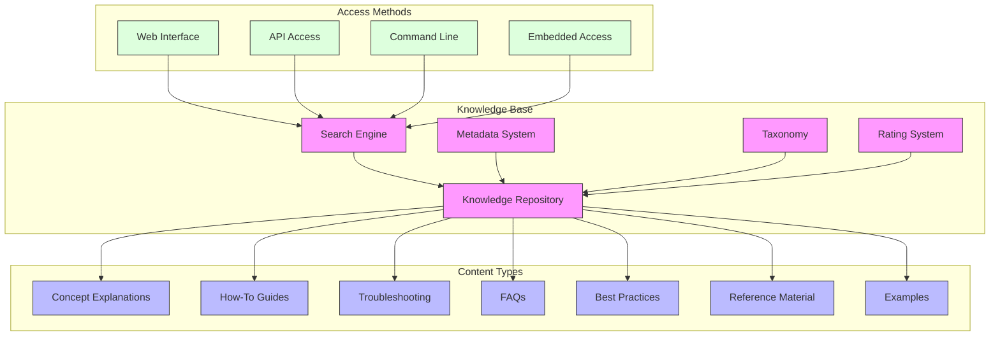
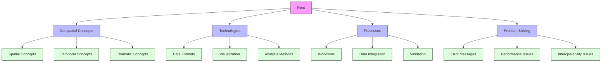
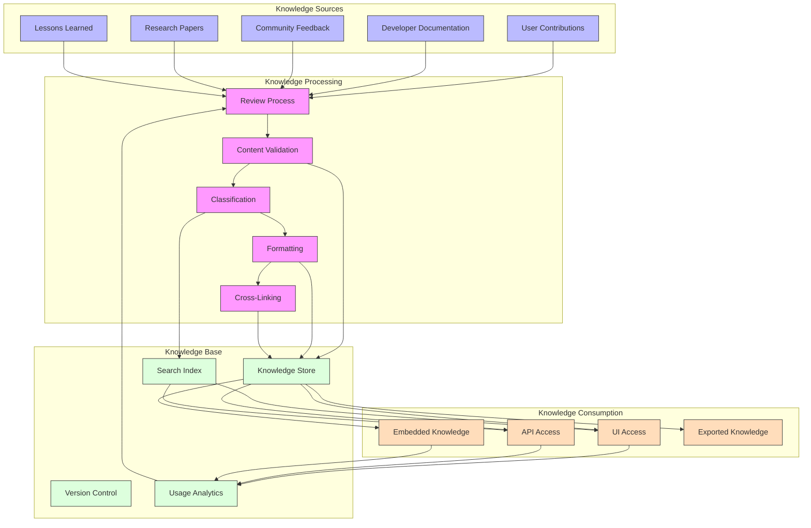

# Knowledge Base

The GEO-INFER Knowledge Base is a structured repository of geospatial knowledge, best practices, troubleshooting guides, and solutions. It serves as the central information store for the GEO-INFER framework, supporting users, developers, and automated systems.

## Contents

- [Knowledge Base Overview](overview.md) - Introduction to the knowledge base system
- [Knowledge Structure](structure.md) - Organization and taxonomy of knowledge articles
- [Article Types](article_types.md) - Different types of knowledge articles and their templates
- [Content Guidelines](content_guidelines.md) - Standards for creating knowledge content
- [Search and Discovery](search.md) - Finding relevant information in the knowledge base
- [Contribution Process](contribution.md) - How to contribute to the knowledge base
- [API Reference](api.md) - Programmatically accessing the knowledge base
- [Integration](integration.md) - How the knowledge base integrates with other components
- [Administration](administration.md) - Managing and maintaining the knowledge base

## Knowledge Base Architecture

The knowledge base is built on a structured, searchable repository of information organized into different categories:



## Knowledge Structure

The knowledge base content is organized hierarchically with semantic relationships:



## Article Structure

Each knowledge article follows a standardized structure:

### Metadata Section
- **Title**: Clear, concise article title
- **ID**: Unique identifier
- **Type**: Article type (concept, how-to, troubleshooting, etc.)
- **Categories**: Primary and secondary categorization
- **Tags**: Searchable keywords
- **Author**: Original creator(s)
- **Creation Date**: Initial publication date
- **Last Updated**: Most recent revision date
- **Version**: Article version number
- **Status**: Current state (draft, published, deprecated)

### Content Section
- **Summary**: Brief overview (1-2 sentences)
- **Description**: Detailed explanation
- **Body**: Main content, structured by article type
- **Related Articles**: Links to connected information
- **Examples**: Practical usage examples
- **References**: Citations and external resources

## Article Types

The knowledge base includes multiple article types to serve different purposes:

| Type | Purpose | Structure | Example |
|------|---------|-----------|---------|
| Concept | Explain theoretical ideas | Definition, Description, Examples, References | "What is Spatial Autocorrelation?" |
| How-To | Step-by-step instructions | Prerequisites, Steps, Verification, Troubleshooting | "How to Create a Heatmap" |
| Troubleshooting | Solve specific problems | Symptoms, Causes, Solutions, Prevention | "Fixing Projection Mismatches" |
| Reference | Technical specifications | Parameters, Returns, Examples, Notes | "GeoJSON Format Specification" |
| Best Practice | Recommended approaches | Context, Recommendation, Rationale, Examples | "Best Practices for Spatial Indexing" |
| FAQ | Common questions and answers | Question, Answer, Related Information | "FAQ: Coordinate Systems" |
| Case Study | Real-world examples | Background, Challenge, Solution, Results | "Urban Heat Island Analysis Case Study" |

## Knowledge Flow

The following diagram shows how knowledge flows through the GEO-INFER system:



## Knowledge Base API

The knowledge base provides a comprehensive API for programmatic access:

```python
from geo_infer.knowledge_base import KnowledgeBase

# Initialize the knowledge base client
kb = KnowledgeBase()

# Search for articles
results = kb.search(
    query="spatial interpolation kriging",
    categories=["Analysis Methods"],
    max_results=10,
    sort_by="relevance"
)

# Get a specific article by ID
article = kb.get_article("KBA-2023-0042")

# Get related articles
related = kb.get_related(article.id, max_results=5)

# Create a new article
new_article = kb.create_article(
    title="Understanding H3 Indexing",
    article_type="concept",
    categories=["Spatial Concepts", "Data Organization"],
    tags=["indexing", "H3", "hexagonal", "discrete global grid"],
    content="H3 is a hierarchical hexagonal geospatial indexing system...",
    author="jsmith"
)

# Update an existing article
kb.update_article(
    article_id="KBA-2023-0042",
    content="Updated content with new information...",
    status="published"
)

# Rate an article
kb.rate_article(
    article_id="KBA-2023-0042",
    rating=4,
    feedback="Very helpful explanation with good examples."
)
```

## Integration with Other Components

The knowledge base integrates with other GEO-INFER components:

- **Documentation System**: Links to relevant documentation
- **Ontology Management**: Uses standardized terminology and relationships
- **Workflow System**: Provides context-sensitive help for workflow steps
- **User Interfaces**: Powers help systems and contextual guidance
- **Search Services**: Enables natural language queries across all content

## Knowledge Contribution Process

```mermaid
flowchart LR
    START[Identify Knowledge Gap] --> DRAFT[Create Draft]
    DRAFT --> REVIEW[Peer Review]
    REVIEW --> REVISE[Revise Content]
    REVISE --> QA[Quality Assurance]
    QA --> PUBLISH[Publish]
    PUBLISH --> FEEDBACK[Collect Feedback]
    FEEDBACK --> UPDATE[Update Content]
    UPDATE --> QA
    
    classDef start fill:#bbf,stroke:#333,stroke-width:1px
    classDef process fill:#dfd,stroke:#333,stroke-width:1px
    classDef review fill:#f9f,stroke:#333,stroke-width:1px
    classDef publish fill:#fdb,stroke:#333,stroke-width:1px
    
    class START start
    class DRAFT,REVISE,UPDATE process
    class REVIEW,QA review
    class PUBLISH,FEEDBACK publish
```



## Knowledge Base Metrics

The GEO-INFER knowledge base tracks several metrics to measure effectiveness:

- **Article Coverage**: Percentage of key topics covered
- **Content Freshness**: Average age of articles
- **User Ratings**: Average rating across all articles
- **Search Success Rate**: Rate at which users find relevant information
- **Usage Patterns**: Most frequently accessed articles and categories
- **Contribution Metrics**: Number of new and updated articles

## Best Practices for Knowledge Management

- **Maintain clarity** - Use plain language and clear explanations
- **Ensure accuracy** - Verify information before publishing
- **Keep content current** - Regularly review and update articles
- **Focus on user needs** - Structure information to answer common questions
- **Provide examples** - Include practical examples and use cases
- **Use consistent formatting** - Follow templates and style guides
- **Add rich metadata** - Enable effective discovery through good tagging
- **Link related content** - Create connections between related articles
- **Gather feedback** - Continuously improve based on user input
- **Version appropriately** - Track changes and maintain history

## Related Resources

- [User Guide](../user_guide/index.md)
- [Ontology Management](../ontology/index.md)
- [Geospatial Knowledge](../geospatial/index.md)
- [Contributing Guide](../developer_guide/contributing.md)
- [API Documentation](../api/index.md) 