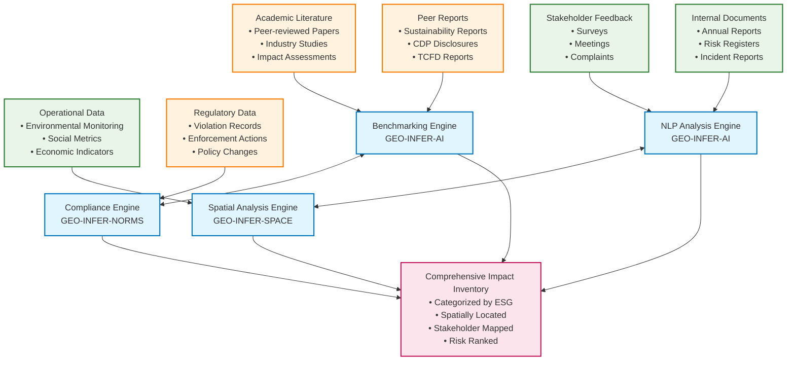
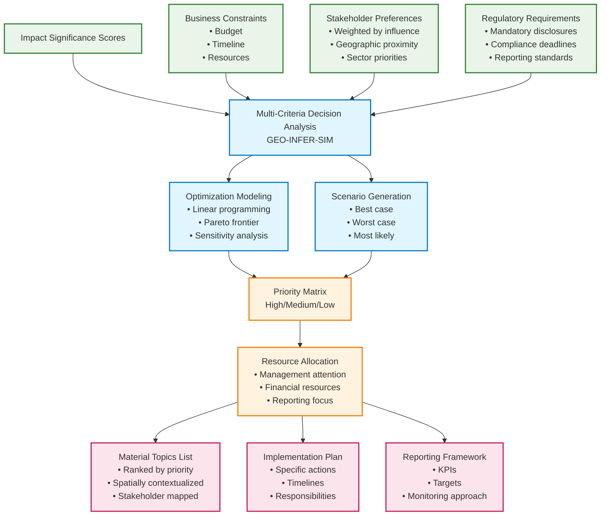
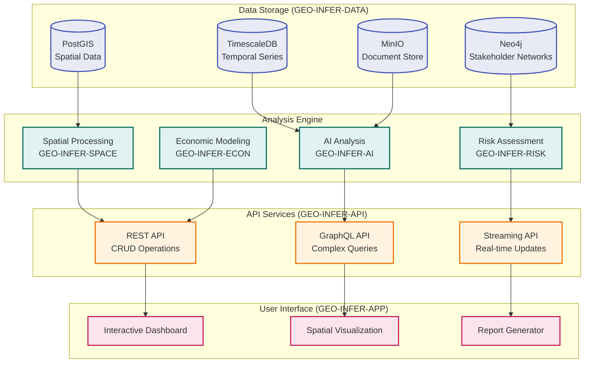

# GEO-INFER Framework for ESG Materiality Assessment

## Executive Summary

This document provides a comprehensive technical framework for implementing ESG materiality assessments using the GEO-INFER geospatial inference framework. It maps specific GEO-INFER modules to each step of the materiality assessment process, providing detailed implementation approaches, data flows, and technical specifications for spatially-aware ESG impact analysis.

## Table of Contents

1. [Framework Overview](#framework-overview)
2. [Module Mapping to Assessment Steps](#module-mapping-to-assessment-steps)
3. [Technical Implementation Guide](#technical-implementation-guide)
4. [Data Flow Architecture](#data-flow-architecture)
5. [Integration Patterns](#integration-patterns)
6. [Performance Considerations](#performance-considerations)
7. [Use Case Examples](#use-case-examples)

## Framework Overview

### Core Principle: Spatial-Temporal ESG Intelligence

GEO-INFER transforms traditional materiality assessments by introducing spatial-temporal intelligence, enabling organizations to:

- **Geospatially contextualize** ESG impacts across operational footprints
- **Temporally model** impact evolution and future scenarios
- **Quantitatively assess** stakeholder proximity and influence
- **Systematically integrate** multi-source ESG data streams
- **Dynamically visualize** impact networks and dependencies

### Architecture for Materiality Assessment

```mermaid
graph TB
    classDef assessment fill:#e1f5fe,stroke:#0277bd,stroke-width:2px
    classDef data fill:#f3e5f5,stroke:#7b1fa2,stroke-width:1px
    classDef analysis fill:#e8f5e8,stroke:#2e7d32,stroke-width:1px
    classDef engagement fill:#fff3e0,stroke:#ef6c00,stroke-width:1px
    classDef output fill:#fce4ec,stroke:#c2185b,stroke-width:1px

    %% Assessment Steps
    A1[1. Understand Context]:::assessment
    A2[2. Identify Impacts]:::assessment
    A3[3. Assess Significance]:::assessment
    A4[4. Prioritize Impacts]:::assessment

    %% GEO-INFER Data Modules
    DATA[GEO-INFER-DATA<br/>Data Integration]:::data
    SPACE[GEO-INFER-SPACE<br/>Spatial Analysis]:::data
    TIME[GEO-INFER-TIME<br/>Temporal Modeling]:::data
    IOT[GEO-INFER-IOT<br/>Real-time Sensors]:::data

    %% Analysis Modules
    AI[GEO-INFER-AI<br/>ML Analytics]:::analysis
    BAYES[GEO-INFER-BAYES<br/>Uncertainty Analysis]:::analysis
    RISK[GEO-INFER-RISK<br/>Risk Modeling]:::analysis
    ECON[GEO-INFER-ECON<br/>Economic Impact]:::analysis
    HEALTH[GEO-INFER-HEALTH<br/>Health Assessment]:::analysis
    AG[GEO-INFER-AG<br/>Agricultural Impact]:::analysis
    BIO[GEO-INFER-BIO<br/>Biodiversity Analysis]:::analysis

    %% Engagement Modules
    CIV[GEO-INFER-CIV<br/>Stakeholder Mapping]:::engagement
    COMMS[GEO-INFER-COMMS<br/>Communication]:::engagement
    PEP[GEO-INFER-PEP<br/>People Management]:::engagement
    ORG[GEO-INFER-ORG<br/>Governance]:::engagement

    %% Output Modules
    APP[GEO-INFER-APP<br/>Visualization]:::output
    API[GEO-INFER-API<br/>Integration]:::output
    SIM[GEO-INFER-SIM<br/>Scenario Planning]:::output
    NORMS[GEO-INFER-NORMS<br/>Compliance]:::output

    %% Connections
    A1 --> DATA
    A1 --> SPACE
    A1 --> CIV
    A1 --> ORG

    A2 --> DATA
    A2 --> AI
    A2 --> COMMS
    A2 --> NORMS

    A3 --> RISK
    A3 --> ECON
    A3 --> HEALTH
    A3 --> AG
    A3 --> BIO
    A3 --> BAYES

    A4 --> SIM
    A4 --> APP
    A4 --> API

    %% Cross-cutting connections
    SPACE --> AI
    SPACE --> RISK
    SPACE --> ECON
    SPACE --> HEALTH
    SPACE --> AG
    SPACE --> BIO
    
    TIME --> AI
    TIME --> RISK
    TIME --> SIM
    
    IOT --> DATA
    IOT --> HEALTH
    IOT --> AG
```



## Module Mapping to Assessment Steps

### Step 1: Understand the Organisation's Context

#### 1.1 Identify Operating Scope and Coverage

**Primary Modules: GEO-INFER-SPACE, GEO-INFER-DATA, GEO-INFER-ORG**

##### Technical Implementation:

```python
# Spatial boundary analysis
from geo_infer_space import SpatialAnalyzer
from geo_infer_data import DataIntegrator
from geo_infer_org import OrganizationalMapper

# Define operational footprint
spatial_analyzer = SpatialAnalyzer()
org_boundaries = spatial_analyzer.create_operational_footprint(
    facilities=facility_locations,
    supply_chain=supplier_network,
    market_areas=service_regions,
    buffer_zones={'environmental': 5000, 'social': 2000}  # meters
)

# Integrate multi-source geographic data
data_integrator = DataIntegrator()
context_data = data_integrator.aggregate_sources([
    'administrative_boundaries',
    'environmental_zones',
    'economic_indicators', 
    'social_demographics',
    'regulatory_frameworks'
], spatial_bounds=org_boundaries)
```

##### Key Capabilities:
- **Geospatial Footprint Mapping**: H3 hexagonal grid system for consistent spatial analysis
- **Multi-scale Boundary Analysis**: From facility-level to global supply chain mapping
- **Regulatory Landscape Mapping**: Automated jurisdiction identification and regulatory framework analysis
- **Environmental Zone Classification**: Biodiversity hotspots, water basins, climate zones
- **Socioeconomic Context Analysis**: Demographics, income levels, vulnerability indices

#### 1.2 Identify Stakeholders

**Primary Modules: GEO-INFER-CIV, GEO-INFER-PEP, GEO-INFER-COMMS**

##### Technical Implementation:

```python
# Stakeholder proximity and influence mapping
from geo_infer_civ import StakeholderMapper
from geo_infer_pep import PeopleAnalyzer
from geo_infer_comms import CommunicationAnalyzer

stakeholder_mapper = StakeholderMapper()
stakeholder_network = stakeholder_mapper.identify_stakeholders(
    spatial_bounds=org_boundaries,
    influence_radius={'community': 10000, 'indigenous': 50000, 'environmental': 25000},
    stakeholder_types=[
        'local_communities', 'indigenous_groups', 'environmental_groups',
        'regulatory_bodies', 'customers', 'suppliers', 'employees'
    ]
)

# Engagement pattern analysis
engagement_analyzer = CommunicationAnalyzer()
engagement_patterns = engagement_analyzer.analyze_interaction_patterns(
    stakeholder_network=stakeholder_network,
    communication_channels=['meetings', 'surveys', 'social_media', 'complaints'],
    temporal_range='5_years'
)
```

##### Stakeholder Mapping Architecture:

```mermaid
graph TD
    ORG[Organization Operations]
    
    %% Internal stakeholders
    EMP[Employees]
    SHARE[Shareholders]
    BOARD[Board]
    
    %% Community stakeholders
    LOCAL[Local Communities]
    INDIGE[Indigenous Groups]
    
    %% Environmental stakeholders
    ENV[Environmental NGOs]
    CONSERV[Conservation Groups]
    
    %% Economic stakeholders
    CUST[Customers]
    SUPP[Suppliers]
    FINAN[Financial Institutions]
    
    %% Regulatory stakeholders
    REGUL[Regulatory Bodies]
    GOVT[Government Agencies]
    
    %% Connections
    ORG --> EMP
    ORG --> SHARE
    ORG --> BOARD
    ORG --> LOCAL
    ORG --> INDIGE
    ORG --> ENV
    ORG --> CONSERV
    ORG --> CUST
    ORG --> SUPP
    ORG --> FINAN
    ORG --> REGUL
    ORG --> GOVT
    
    %% Styling
    classDef internal fill:#c8e6c9,stroke:#388e3c
    classDef community fill:#bbdefb,stroke:#1976d2
    classDef environmental fill:#ffcdd2,stroke:#d32f2f
    classDef economic fill:#fff3e0,stroke:#f57c00
    classDef regulatory fill:#fff9c4,stroke:#f57f17
    
    class EMP,SHARE,BOARD internal
    class LOCAL,INDIGE community
    class ENV,CONSERV environmental
    class CUST,SUPP,FINAN economic
    class REGUL,GOVT regulatory
```



### Step 2: Identify Actual and Potential Impacts

#### 2.1 Internal Review and Stakeholder Engagement

**Primary Modules: GEO-INFER-AI, GEO-INFER-COMMS, GEO-INFER-NORMS**

##### Technical Implementation:

```python
# AI-powered impact identification from documents
from geo_infer_ai import NLPAnalyzer, ImpactClassifier
from geo_infer_norms import ComplianceAnalyzer

# Analyze internal documents for ESG impact mentions
nlp_analyzer = NLPAnalyzer()
internal_impacts = nlp_analyzer.extract_esg_impacts(
    document_sources=[
        'annual_reports', 'sustainability_reports', 'risk_registers',
        'incident_reports', 'audit_findings', 'board_minutes'
    ],
    impact_taxonomy='SASB_GRI_aligned',
    spatial_context=org_boundaries
)

# Stakeholder engagement analysis
engagement_analyzer = CommunicationAnalyzer()
stakeholder_concerns = engagement_analyzer.analyze_stakeholder_feedback(
    feedback_sources=['surveys', 'consultation_meetings', 'complaints', 'social_media'],
    sentiment_analysis=True,
    impact_extraction=True,
    geographic_clustering=True
)
```

#### 2.2 External Benchmarking and Research

**Primary Modules: GEO-INFER-DATA, GEO-INFER-AI, GEO-INFER-NORMS**

##### Technical Implementation:

```python
# Automated peer analysis and benchmarking
from geo_infer_data import ExternalDataCollector
from geo_infer_ai import BenchmarkingEngine

# Collect peer sustainability reports and industry data
external_collector = ExternalDataCollector()
peer_data = external_collector.collect_peer_reports(
    industry_codes=['NAICS_2362', 'SIC_1311'],  # Example: Mining
    geographic_scope=org_boundaries.expand(buffer=100000),  # 100km buffer
    data_sources=['sustainability_reports', 'CDP_disclosures', 'TCFD_reports']
)

# Industry-wide impact pattern analysis
benchmarking_engine = BenchmarkingEngine()
industry_impacts = benchmarking_engine.analyze_industry_patterns(
    peer_data=peer_data,
    academic_sources=['scopus', 'web_of_science'],
    regulatory_sources=['EPA', 'SEC_filings'],
    spatial_analysis=True
)
```

##### Impact Identification Data Flow:



### Step 3: Assess the Significance of Impacts

#### 3.1 Impact Assessment Methodology

**Primary Modules: GEO-INFER-RISK, GEO-INFER-BAYES, GEO-INFER-ECON, GEO-INFER-HEALTH, GEO-INFER-AG, GEO-INFER-BIO**

##### Multi-dimensional Impact Significance Assessment:

```python
# Comprehensive impact significance modeling
from geo_infer_risk import ImpactSignificanceAnalyzer
from geo_infer_bayes import UncertaintyQuantifier
from geo_infer_econ import EconomicImpactModeler

# Define significance assessment framework
significance_analyzer = ImpactSignificanceAnalyzer()
significance_scores = significance_analyzer.calculate_significance(
    impacts=identified_impacts,
    dimensions={
        'magnitude': {'environmental': 'habitat_loss_area', 'social': 'people_affected', 'economic': 'financial_impact'},
        'likelihood': {'probability_distribution': 'beta', 'confidence_interval': 0.95},
        'reversibility': {'temporal_scale': ['immediate', 'short_term', 'long_term', 'permanent']},
        'geographic_scope': {'local': 5000, 'regional': 50000, 'national': 500000, 'global': 'unlimited'},
        'stakeholder_concern': {'weighted_by_proximity': True, 'influence_adjusted': True}
    }
)

# Bayesian uncertainty quantification
uncertainty_quantifier = UncertaintyQuantifier()
significance_uncertainty = uncertainty_quantifier.quantify_uncertainty(
    assessment_data=significance_scores,
    uncertainty_sources=['data_quality', 'model_uncertainty', 'expert_disagreement'],
    monte_carlo_simulations=10000
)
```

##### Domain-Specific Impact Assessment:

**Environmental Impacts (GEO-INFER-BIO, GEO-INFER-HEALTH):**
```python
# Biodiversity impact assessment
from geo_infer_bio import BiodiversityAnalyzer
from geo_infer_health import EnvironmentalHealthAnalyzer

bio_analyzer = BiodiversityAnalyzer()
biodiversity_impacts = bio_analyzer.assess_ecosystem_impacts(
    operational_footprint=org_boundaries,
    impact_types=['habitat_fragmentation', 'species_displacement', 'pollution'],
    spatial_resolution=100,  # meters
    temporal_horizon=30  # years
)

# Environmental health impact assessment
health_analyzer = EnvironmentalHealthAnalyzer()
health_impacts = health_analyzer.assess_population_exposure(
    pollution_sources=facility_locations,
    pollutant_types=['PM2.5', 'NOx', 'water_contamination'],
    population_density_data='worldpop',
    vulnerability_indices=['age', 'income', 'health_status']
)
```

**Economic Impacts (GEO-INFER-ECON):**
```python
# Economic impact valuation
from geo_infer_econ import EconomicValuationEngine

econ_valuator = EconomicValuationEngine()
economic_impacts = econ_valuator.calculate_economic_significance(
    direct_impacts={'jobs_created': 500, 'tax_revenue': 2000000, 'supply_chain_spend': 15000000},
    indirect_impacts={'multiplier_effects': True, 'induced_effects': True},
    ecosystem_services={'water_purification': 'replacement_cost', 'carbon_sequestration': 'social_cost_carbon'},
    spatial_spillovers={'distance_decay_function': 'exponential', 'max_distance': 50000}
)
```

**Agricultural Impacts (GEO-INFER-AG):**
```python
# Agricultural system impact assessment
from geo_infer_ag import AgriculturalImpactAnalyzer

ag_analyzer = AgriculturalImpactAnalyzer()
agricultural_impacts = ag_analyzer.assess_farming_impacts(
    land_use_changes=land_conversion_data,
    water_resource_impacts=water_usage_data,
    soil_health_impacts=soil_monitoring_data,
    food_security_implications={'local_food_systems': True, 'supply_chain_disruption': True}
)
```

##### Impact Significance Scoring Matrix:

```mermaid
graph TB
    classDef high fill:#ffcdd2,stroke:#d32f2f,stroke-width:2px
    classDef medium fill:#fff9c4,stroke:#f57c00,stroke-width:2px
    classDef low fill:#c8e6c9,stroke:#388e3c,stroke-width:2px

    subgraph "Impact Significance Matrix"
        direction TB
        
        subgraph "Magnitude"
            MAG_HIGH["High: >1000 people affected, >$10M economic impact, >100 ha habitat loss"]:::high
            MAG_MED["Medium: 100-1000 people, $1M-$10M economic, 10-100 ha habitat"]:::medium
            MAG_LOW["Low: <100 people, <$1M economic, <10 ha habitat"]:::low
        end

        subgraph "Likelihood"
            LIKE_HIGH["High: >70% probability, Historical precedent, Current trends"]:::high
            LIKE_MED["Medium: 30-70% probability, Some uncertainty, Mixed evidence"]:::medium
            LIKE_LOW["Low: <30% probability, Speculative, Weak evidence"]:::low
        end

        subgraph "Stakeholder Concern"
            STAKE_HIGH["High: Media attention, Regulatory pressure, Community mobilization"]:::high
            STAKE_MED["Medium: Moderate attention, Some complaints, NGO interest"]:::medium
            STAKE_LOW["Low: Limited awareness, Few complaints, Minimal attention"]:::low
        end

        subgraph "Geographic Scope"
            GEO_HIGH["Global/National: >500km impact, Multiple jurisdictions, Transboundary effects"]:::high
            GEO_MED["Regional: 50-500km impact, Multiple communities, Watershed/ecosystem scale"]:::medium
            GEO_LOW["Local: <50km impact, Single community, Site-specific"]:::low
        end
    end

    %% Significance calculation
    CALC["Significance Score = Function of Magnitude, Likelihood, Stakeholder Concern, Geographic Scope"]
    
    MAG_HIGH --> CALC
    MAG_MED --> CALC
    MAG_LOW --> CALC
    LIKE_HIGH --> CALC
    LIKE_MED --> CALC
    LIKE_LOW --> CALC
    STAKE_HIGH --> CALC
    STAKE_MED --> CALC
    STAKE_LOW --> CALC
    GEO_HIGH --> CALC
    GEO_MED --> CALC
    GEO_LOW --> CALC
```



### Step 4: Prioritize the Most Significant Impacts for Strategy and Reporting Focus

**Primary Modules: GEO-INFER-SIM, GEO-INFER-APP, GEO-INFER-API, GEO-INFER-NORMS**

##### Technical Implementation:

```python
# Multi-criteria decision analysis for impact prioritization
from geo_infer_sim import ScenarioModeler
from geo_infer_app import DashboardGenerator
from geo_infer_norms import ReportingFrameworkAligner

# Scenario modeling for impact prioritization
scenario_modeler = ScenarioModeler()
prioritization_scenarios = scenario_modeler.model_prioritization_scenarios(
    significance_scores=significance_scores,
    business_constraints={'budget': 5000000, 'timeline': 3, 'regulatory_deadlines': compliance_dates},
    stakeholder_preferences=stakeholder_priorities,
    optimization_criteria=['impact_reduction', 'cost_effectiveness', 'stakeholder_satisfaction']
)

# Interactive dashboard for decision support
dashboard_generator = DashboardGenerator()
materiality_dashboard = dashboard_generator.create_interactive_dashboard(
    impact_data=prioritized_impacts,
    spatial_visualizations=['heat_maps', 'stakeholder_networks', 'temporal_animations'],
    filtering_capabilities=['by_significance', 'by_geography', 'by_stakeholder', 'by_ESG_category'],
    export_formats=['PDF_report', 'Excel_data', 'API_endpoints']
)
```

##### Prioritization Decision Framework:



## Technical Implementation Guide

### Data Architecture for Materiality Assessment



### Implementation Patterns

#### Pattern 1: Rapid Assessment (3-6 months)

```python
# Minimal viable materiality assessment
modules = [
    'GEO-INFER-DATA',    # Core data management
    'GEO-INFER-SPACE',   # Basic spatial analysis
    'GEO-INFER-CIV',     # Stakeholder mapping
    'GEO-INFER-APP'      # Visualization
]

workflow = MaterialityWorkflow(modules)
results = workflow.run_rapid_assessment(
    organization_data=org_data,
    assessment_scope='tier_1_operations',
    automation_level='high',
    validation_level='basic'
)
```

#### Pattern 2: Comprehensive Assessment (6-12 months)

```python
# Full-featured materiality assessment
modules = [
    'GEO-INFER-DATA', 'GEO-INFER-SPACE', 'GEO-INFER-TIME',
    'GEO-INFER-AI', 'GEO-INFER-BAYES', 'GEO-INFER-RISK',
    'GEO-INFER-ECON', 'GEO-INFER-HEALTH', 'GEO-INFER-AG',
    'GEO-INFER-BIO', 'GEO-INFER-CIV', 'GEO-INFER-COMMS',
    'GEO-INFER-SIM', 'GEO-INFER-APP', 'GEO-INFER-NORMS'
]

workflow = ComprehensiveMaterialityWorkflow(modules)
results = workflow.run_comprehensive_assessment(
    organization_data=org_data,
    assessment_scope='full_value_chain',
    automation_level='medium',
    validation_level='extensive',
    stakeholder_engagement='deep'
)
```

#### Pattern 3: Continuous Monitoring (Ongoing)

```python
# Real-time materiality monitoring
from geo_infer_iot import SensorNetwork
from geo_infer_time import StreamProcessor

sensor_network = SensorNetwork()
monitoring_system = sensor_network.deploy_monitoring(
    monitoring_points=critical_locations,
    sensor_types=['environmental', 'social', 'economic'],
    update_frequency='hourly',
    alert_thresholds=materiality_thresholds
)

stream_processor = StreamProcessor()
continuous_assessment = stream_processor.process_streams(
    data_streams=monitoring_system.streams,
    analysis_pipeline=materiality_pipeline,
    update_dashboard=True,
    trigger_alerts=True
)
```

## Performance Considerations

### Optimization Strategies

1. **Spatial Indexing**: H3 hexagonal grid system for consistent spatial operations
2. **Temporal Partitioning**: Time-based data partitioning for efficient queries
3. **Caching Strategy**: Redis-based caching for frequently accessed assessments
4. **Parallel Processing**: Dask-based distributed computing for large-scale analysis
5. **Progressive Loading**: Incremental data loading for interactive dashboards

## Use Case Examples

### Case Study 1: Mining Company Global Operations

**Challenge**: Assess ESG materiality across 15 countries, 45 mine sites, complex supply chains

**GEO-INFER Implementation**:
```python
# Mining materiality assessment configuration
assessment_config = {
    'spatial_scope': 'global_operations',
    'temporal_scope': '30_year_projection',
    'modules': [
        'GEO-INFER-SPACE',    # Mine site spatial analysis
        'GEO-INFER-ECON',     # Economic impact modeling
        'GEO-INFER-HEALTH',   # Community health assessment
        'GEO-INFER-BIO',      # Biodiversity impact analysis
        'GEO-INFER-RISK',     # Environmental risk assessment
        'GEO-INFER-CIV',      # Indigenous community engagement
        'GEO-INFER-NORMS'     # Multi-jurisdictional compliance
    ],
    'impact_categories': [
        'water_contamination', 'air_quality', 'noise_pollution',
        'habitat_destruction', 'cultural_heritage', 'employment',
        'tax_revenue', 'infrastructure_development'
    ]
}
```

### Case Study 2: Agricultural Processor Supply Chain

**Challenge**: Assess deforestation risk and social impacts across 10,000 smallholder suppliers

**GEO-INFER Implementation**:
```python
# Agricultural supply chain assessment
supply_chain_assessment = {
    'supplier_network': '10000_smallholders',
    'geographic_scope': 'tropical_regions',
    'primary_modules': [
        'GEO-INFER-AG',       # Agricultural impact analysis
        'GEO-INFER-BIO',      # Deforestation monitoring
        'GEO-INFER-ECON',     # Farmer livelihood analysis
        'GEO-INFER-AI',       # Satellite imagery analysis
        'GEO-INFER-TIME'      # Temporal trend analysis
    ],
    'monitoring_frequency': 'monthly',
    'alert_system': 'real_time_deforestation'
}
```

## Conclusion

The GEO-INFER framework provides a comprehensive, technically robust platform for conducting spatially-aware ESG materiality assessments. By integrating geospatial intelligence with traditional materiality assessment methodologies, organizations can achieve:

- **Enhanced Precision**: Spatially-explicit impact quantification
- **Stakeholder Intelligence**: Proximity-based stakeholder influence modeling
- **Dynamic Assessment**: Real-time monitoring and updating of material topics
- **Evidence-Based Prioritization**: Quantitative, multi-criteria decision support
- **Regulatory Alignment**: Automated compliance with multiple reporting frameworks

This approach transforms materiality assessment from a periodic, qualitative exercise into a continuous, quantitative, and spatially-intelligent business process that drives more effective ESG strategy and reporting. 