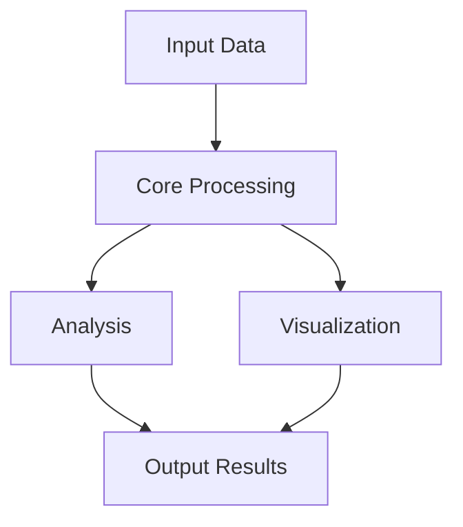

# GEO-INFER-{MODULE} 🌍

[](https://creativecommons.org/licenses/by-nc-sa/4.0/)
[](https://www.python.org/downloads/)
[]()
[]()

> Short, one-sentence description of this module's purpose within the GEO-INFER framework.

## Overview

A comprehensive 2-3 paragraph description of what this module does, its role in the GEO-INFER ecosystem, and what problems it solves. Include how this module relates to the broader goals of geospatial inference and active inference principles.

## Key Features

- **Feature Group 1**: Description of the first major feature group
  - Feature 1.1: Specific capability
  - Feature 1.2: Specific capability

- **Feature Group 2**: Description of the second major feature group
  - Feature 2.1: Specific capability
  - Feature 2.2: Specific capability

- **Feature Group 3**: Description of the third major feature group
  - Feature 3.1: Specific capability
  - Feature 3.2: Specific capability

## Installation

```bash
# Clone the repository
git clone https://github.com/activeinference/GEO-INFER.git
cd GEO-INFER/GEO-INFER-{MODULE}

# Create and activate virtual environment
python -m venv venv
source venv/bin/activate  # On Windows: venv\Scripts\activate

# Install this module
pip install -e .

# Install development dependencies
pip install -e ".[dev]"
```

## Usage Examples

### Basic Example

```python
from geo_infer_{module_lowercase} import SomeClass

# Initialize
instance = SomeClass(param1=value1, param2=value2)

# Use core functionality
result = instance.some_method()

# Process results
processed = result.process()
```

### Advanced Example

```python
import geo_infer_{module_lowercase} as gi{module_abbreviation}

# More complex workflow example
workflow = gi{module_abbreviation}.Workflow(
    input_data="path/to/data",
    parameters={
        "parameter1": value1,
        "parameter2": value2
    }
)

# Execute the workflow
results = workflow.run()

# Visualize the results
workflow.visualize(results)
```

## Architecture



*Describe the architecture diagram and the data flow through the module components.*

## API Reference

### Core Classes

#### `SomeClass`

Main class for handling core functionality.

```python
class SomeClass:
    """
    Brief description of the class purpose.
    
    Attributes:
        attr1: Description of attribute 1
        attr2: Description of attribute 2
    """
    
    def __init__(self, param1, param2=default_value):
        """
        Initialize the class.
        
        Args:
            param1: Description of parameter 1
            param2: Description of parameter 2
        """
        pass
    
    def some_method(self, input_data):
        """
        Description of the method functionality.
        
        Args:
            input_data: Description of input data
            
        Returns:
            Description of return value
            
        Raises:
            ExceptionType: When and why this exception is raised
        """
        pass
```

### Utility Functions

#### `utility_function()`

```python
def utility_function(param1, param2=default_value):
    """
    Description of utility function.
    
    Args:
        param1: Description of parameter 1
        param2: Description of parameter 2
        
    Returns:
        Description of return value
    """
    pass
```

## Integration with Other GEO-INFER Modules

This module integrates with the following GEO-INFER modules:

- **GEO-INFER-MODULE1**: Description of how this module interfaces with MODULE1
- **GEO-INFER-MODULE2**: Description of how this module interfaces with MODULE2
- **GEO-INFER-MODULE3**: Description of how this module interfaces with MODULE3

*Add specific code examples showing integration patterns.*

## Development

### Running Tests

```bash
# Run all tests
pytest

# Run specific test file
pytest tests/test_specific.py

# Run with coverage report
pytest --cov=geo_infer_{module_lowercase}
```

### Documentation

Documentation is generated using Sphinx and can be built locally:

```bash
cd docs
make html
```

The documentation will be available in the `docs/build/html` directory.

## Use Cases

### Use Case 1: Title

Description of a practical use case for this module, including problem statement, approach, and benefits.

### Use Case 2: Title

Description of a second practical use case.

## Tutorials

For step-by-step tutorials, see the [examples](./examples/) directory:

1. [Getting Started](./examples/getting_started.ipynb)
2. [Advanced Usage](./examples/advanced_usage.ipynb)
3. [Integration Example](./examples/integration_example.ipynb)

## Contributing

Contributions are welcome! Please see the [Contributing Guidelines](../CONTRIBUTING.md) for more information.

## License

This project is licensed under the Creative Commons Attribution-NonCommercial-ShareAlike 4.0 International License - see the [LICENSE](../LICENSE) file for details. 