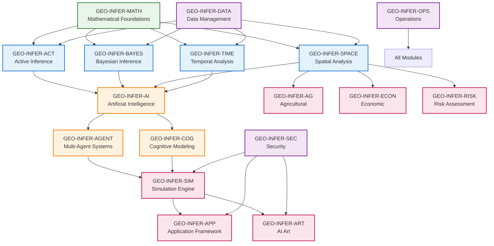
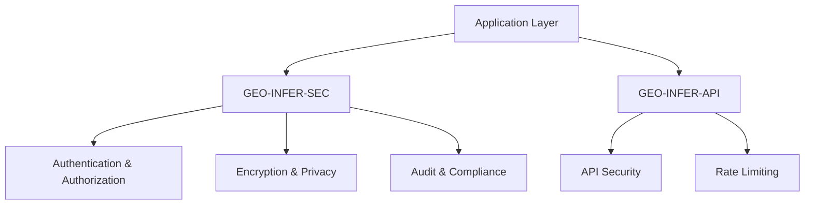
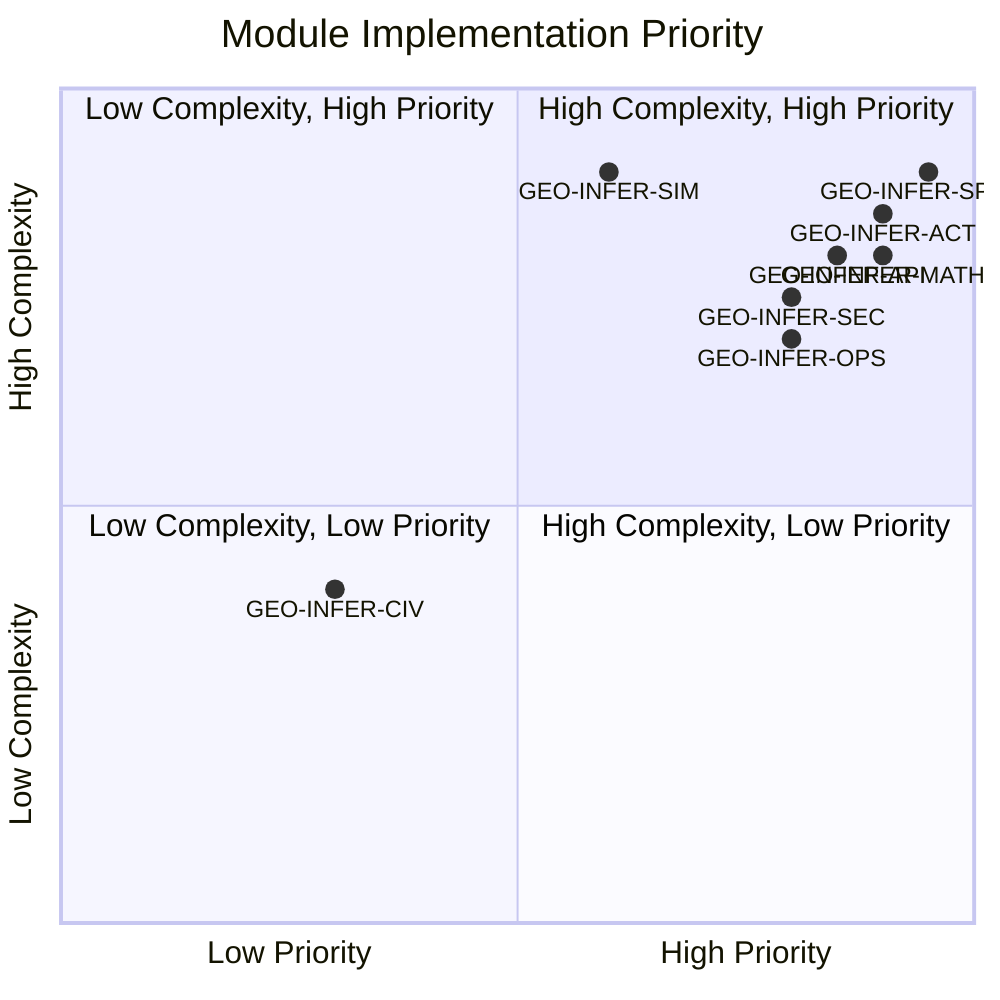

# GEO-INFER Modules Overview

> **Purpose**: Understanding the complete GEO-INFER framework
> 
> This overview provides a comprehensive guide to all GEO-INFER modules, their capabilities, dependencies, and integration patterns that enable advanced geospatial inference capabilities.

## Framework Architecture

GEO-INFER is a geospatial inference framework consisting of many modules organized into distinct categories with clear dependency relationships and data flow patterns.

## Documentation Conventions

### Content Standards
- **Language**: Concise, technical, and precise; avoid unverifiable claims
- **Examples**: Code examples are illustrative; see each module's `examples/` directory for runnable scripts
- **Workflow Conventions**:
  - Use `GEO-INFER-SPACE` for spatial analysis and H3 operations
  - Use `GEO-INFER-PLACE` for place-based and location intelligence
  - Use `GEO-INFER-TIME` for temporal analysis and time series
- **H3 Integration**: All H3 usage follows the H3 v4 API standard; see `GEO-INFER-SPACE` for implementation details

### Module Status Indicators
- ✅ **Complete**: Fully implemented with comprehensive documentation
- 🔄 **In Development**: Core functionality implemented, documentation in progress
- 📝 **Planning**: Module planned but not yet implemented
- 🔗 **Integration**: Module exists but needs better integration documentation

## Core Module Categories

### 🧠 Analytical Core
| Module | Description | Status | Dependencies |
|--------|-------------|--------|-------------|
| **[GEO-INFER-ACT](../modules/geo-infer-act.md)** | Active Inference Engine | ✅ Complete | MATH, BAYES, SPACE |
| **[GEO-INFER-BAYES](../modules/geo-infer-bayes.md)** | Bayesian Inference Engine | ✅ Complete | MATH, SPACE |
| **[GEO-INFER-AI](../modules/geo-infer-ai.md)** | Artificial Intelligence Engine | ✅ Complete | ACT, MATH, SPACE |
| **[GEO-INFER-MATH](../modules/geo-infer-math.md)** | Mathematical Foundations | ✅ Complete | None |
| **[GEO-INFER-COG](../modules/geo-infer-cog.md)** | Cognitive Modeling | 🔄 In Development | ACT, AI |
| **[GEO-INFER-AGENT](../modules/geo-infer-agent.md)** | Multi-Agent Systems | ✅ Complete | ACT, AI, SPACE |
| **[GEO-INFER-SPM](../modules/geo-infer-spm.md)** | Spatial Process Modeling | 🔄 In Development | SPACE, MATH |

### 🗺️ Spatial-Temporal
| Module | Description | Status | Dependencies |
|--------|-------------|--------|-------------|
| **[GEO-INFER-SPACE](../modules/geo-infer-space.md)** | Spatial Analysis Engine | ✅ Complete | MATH, H3 |
| **[GEO-INFER-TIME](../modules/geo-infer-time.md)** | Temporal Analysis Engine | ✅ Complete | MATH, AI |
| **[GEO-INFER-IOT](../modules/geo-infer-iot.md)** | Internet of Things Integration | 🔄 In Development | SPACE, TIME |

### 💾 Data Management
| Module | Description | Status | Dependencies |
|--------|-------------|--------|-------------|
| **[GEO-INFER-DATA](../modules/geo-infer-data.md)** | Data Management Engine | 🔄 In Development | None |
| **[GEO-INFER-API](../modules/geo-infer-api.md)** | API Management System | ✅ Complete | All modules |

### 🔒 Security & Governance
| Module | Description | Status | Dependencies |
|--------|-------------|--------|-------------|
| **[GEO-INFER-SEC](../modules/geo-infer-sec.md)** | Security Framework | 🔄 In Development | None |
| **[GEO-INFER-NORMS](../modules/geo-infer-norms.md)** | Normative Systems | 🔄 In Development | ACT |
| **[GEO-INFER-REQ](../modules/geo-infer-req.md)** | Requirements Management | 📝 Planning | None |

### 🧪 Simulation & Modeling
| Module | Description | Status | Dependencies |
|--------|-------------|--------|-------------|
| **[GEO-INFER-SIM](../modules/geo-infer-sim.md)** | Simulation Engine | 📝 Planning | AGENT, ACT |
| **[GEO-INFER-ANT](../modules/geo-infer-ant.md)** | Ant Colony Optimization | ✅ Complete | MATH, SPACE |

### 👥 People & Community
| Module | Description | Status | Dependencies |
|--------|-------------|--------|-------------|
| **[GEO-INFER-CIV](../modules/geo-infer-civ.md)** | Civic Engagement | 📝 Planning | ACT, AI |
| **[GEO-INFER-PEP](../modules/geo-infer-pep.md)** | People Management | 🔄 In Development | ACT, AI |
| **[GEO-INFER-ORG](../modules/geo-infer-org.md)** | Organizational Systems | 📝 Planning | AGENT, ACT |
| **[GEO-INFER-COMMS](../modules/geo-infer-comms.md)** | Communication Systems | 🔄 In Development | AGENT, API |

### 🖥️ Applications
| Module | Description | Status | Dependencies |
|--------|-------------|--------|-------------|
| **[GEO-INFER-APP](../modules/geo-infer-app.md)** | Application Framework | 🔄 In Development | API, SEC |
| **[GEO-INFER-ART](../modules/geo-infer-art.md)** | Artificial Intelligence Art | 🔄 In Development | AI, ACT |

### 🏢 Domain-Specific
| Module | Description | Status | Dependencies |
|--------|-------------|--------|-------------|
| **[GEO-INFER-AG](../modules/geo-infer-ag.md)** | Agricultural Systems | ✅ Complete | SPACE, TIME, ACT |
| **[GEO-INFER-ECON](../modules/geo-infer-econ.md)** | Economic Analysis | 🔄 In Development | BAYES, MATH |
| **[GEO-INFER-RISK](../modules/geo-infer-risk.md)** | Risk Assessment | 🔄 In Development | BAYES, ACT |
| **[GEO-INFER-LOG](../modules/geo-infer-log.md)** | Logistics Systems | 🔄 In Development | SPACE, TIME |
| **[GEO-INFER-BIO](../modules/geo-infer-bio.md)** | Biological Systems | 🔄 In Development | SPACE, MATH |
| **[GEO-INFER-HEALTH](../modules/geo-infer-health.md)** | Health Systems | 🔄 In Development | SPACE, TIME |

### 📍 Place-Based
| Module | Description | Status | Dependencies |
|--------|-------------|--------|-------------|
| **[GEO-INFER-PLACE](../modules/geo-infer-place.md)** | Place-Based Analysis | 🔄 In Development | SPACE, ACT |

### ⚙️ Operations
| Module | Description | Status | Dependencies |
|--------|-------------|--------|-------------|
| **[GEO-INFER-OPS](../modules/geo-infer-ops.md)** | Operations Management | 🔄 In Development | All modules |
| **[GEO-INFER-INTRA](../modules/geo-infer-intra.md)** | Knowledge Integration | 🔄 In Development | All modules |
| **[GEO-INFER-GIT](../modules/geo-infer-git.md)** | Version Control | 🔄 In Development | None |
| **[GEO-INFER-TEST](../modules/geo-infer-test.md)** | Testing Framework | 🔄 In Development | All modules |

## Module Dependencies & Architecture

### Core Dependency Graph



### Dependency Matrix

| Dependent → | MATH | ACT | BAYES | SPACE | TIME | AI | AGENT | DATA | SEC |
|-------------|------|-----|-------|-------|------|----|-------|------|-----|
| **ACT** | ✅ | - | - | - | - | - | - | - | - |
| **BAYES** | ✅ | - | - | - | - | - | - | - | - |
| **SPACE** | ✅ | - | - | - | - | - | - | ✅ | - |
| **TIME** | ✅ | - | - | - | - | - | - | ✅ | - |
| **AI** | - | ✅ | ✅ | ✅ | ✅ | - | - | - | - |
| **AGENT** | - | ✅ | - | ✅ | - | ✅ | - | - | - |
| **COG** | - | ✅ | - | - | - | ✅ | - | - | - |
| **SIM** | - | ✅ | - | - | - | ✅ | ✅ | - | ✅ |
| **AG** | - | ✅ | - | ✅ | ✅ | - | - | - | - |
| **API** | - | - | - | - | - | - | - | - | - |

**Legend**: ✅ Required dependency, 🔄 Optional dependency, - No dependency

## Data Flow & Integration Patterns

### Primary Data Flow Patterns

#### 🔄 Linear Pipeline Pattern
```
GEO-INFER-DATA → GEO-INFER-SPACE → GEO-INFER-TIME → GEO-INFER-ACT → Analysis Results
```
*Use for*: Sequential data processing workflows
*Example*: Environmental monitoring data → spatial analysis → temporal patterns → inference

#### 🎯 Hub and Spoke Pattern
```
GEO-INFER-API (Central Hub)
├── GEO-INFER-ACT (Active Inference)
├── GEO-INFER-SPACE (Spatial Analysis)
├── GEO-INFER-TIME (Temporal Analysis)
└── GEO-INFER-BAYES (Bayesian Inference)
```
*Use for*: API-driven applications with multiple analysis modules
*Example*: Web applications serving spatial-temporal analysis

#### ⚡ Event-Driven Pattern
```
GEO-INFER-IOT → GEO-INFER-ACT → GEO-INFER-SPACE → GEO-INFER-TIME → Response
```
*Use for*: Real-time IoT and sensor data processing
*Example*: Smart city sensors → real-time inference → automated responses

#### 🔁 Feedback Loop Pattern
```
GEO-INFER-ACT → GEO-INFER-BAYES → GEO-INFER-AI → GEO-INFER-ACT (Continuous Learning)
```
*Use for*: Adaptive systems with continuous model improvement
*Example*: Autonomous agents learning from environmental feedback

### Module Integration Quick Reference

| Integration Type | Primary Modules | Use Case |
|------------------|-----------------|----------|
| **Spatial Analysis** | SPACE + MATH | Geometric computations, coordinate transformations |
| **Temporal Intelligence** | TIME + AI | Time series forecasting, pattern recognition |
| **Probabilistic Reasoning** | BAYES + ACT | Uncertainty quantification, decision-making |
| **Multi-Agent Systems** | AGENT + ACT | Distributed autonomous systems |
| **Domain Applications** | AG + SPACE + TIME | Agriculture, economics, risk assessment |
| **API Integration** | API + Any Module | External system integration |

## Module Capabilities

### Analytical Core Modules

#### GEO-INFER-ACT: Active Inference Engine
- **Purpose**: Implements Active Inference principles for geospatial analysis
- **Key Features**:
  - Generative model building
  - Belief updating with observations
  - Policy selection and action optimization
  - Uncertainty quantification
  - Free energy minimization
 - **Use Cases**: Environmental monitoring, urban planning, climate analysis
 - **Integration**: Works with SPACE, TIME, and BAYES modules

#### GEO-INFER-BAYES: Bayesian Inference Engine
- **Purpose**: Provides Bayesian statistical analysis for geospatial data
- **Key Features**:
  - Bayesian parameter estimation
  - Uncertainty quantification
  - Model comparison and selection
  - Hierarchical modeling
  - MCMC sampling algorithms
- **Use Cases**: Risk assessment, environmental modeling, economic forecasting
- **Integration**: Enhances ACT and SPACE modules with statistical rigor
 

#### GEO-INFER-AI: Artificial Intelligence Engine
- **Purpose**: Provides machine learning and AI capabilities for geospatial analysis
- **Key Features**:
  - Deep learning models for spatial data
  - Neural network architectures
  - Transfer learning capabilities
  - Model interpretability tools
  - AutoML for spatial problems
- **Use Cases**: Pattern recognition, prediction, classification
- **Integration**: Powers analysis in ACT, SPACE, and TIME modules
 

### Spatial-Temporal Modules

#### GEO-INFER-SPACE: Spatial Analysis Engine
- **Purpose**: Provides comprehensive spatial analysis capabilities
- **Key Features**:
  - H3 geospatial indexing
  - Spatial statistics and clustering
  - Spatial interpolation and relationships
  - Coordinate system transformations
  - Spatial optimization algorithms
- **Use Cases**: Environmental monitoring, urban planning, transportation analysis
- **Integration**: Core spatial capabilities for all other modules
 

#### GEO-INFER-TIME: Temporal Analysis Engine
- **Purpose**: Provides time series analysis and temporal pattern recognition
- **Key Features**:
  - Time series decomposition
  - Temporal forecasting
  - Seasonal pattern detection
  - Spatiotemporal analysis
  - Real-time streaming analysis
- **Use Cases**: Climate analysis, environmental monitoring, urban mobility
- **Integration**: Enhances ACT and SPACE with temporal capabilities
 

#### GEO-INFER-IOT: Internet of Things Integration
- **Purpose**: Integrates IoT devices and sensor networks
- **Key Features**:
  - Real-time data ingestion
  - Sensor network management
  - Edge computing capabilities
  - Device communication protocols
  - Data quality monitoring
- **Use Cases**: Smart cities, environmental monitoring, industrial IoT
- **Integration**: Provides real-time data to ACT, SPACE, and TIME modules
 

### Data Management Modules

#### GEO-INFER-DATA: Data Management Engine
- **Purpose**: Manages data ingestion, storage, and processing
- **Key Features**:
  - Multi-format data support
  - Data validation and quality control
  - ETL pipelines
  - Data versioning and lineage
  - Real-time data streaming
- **Use Cases**: Data preprocessing, quality assurance, pipeline management
- **Integration**: Provides data services to all analytical modules
 

#### GEO-INFER-API: API Management System
- **Purpose**: Provides RESTful and GraphQL APIs for external integration
- **Key Features**:
  - RESTful API endpoints
  - GraphQL schema
  - Authentication and authorization
  - Rate limiting and monitoring
  - API versioning and documentation
- **Use Cases**: External integrations, web applications, mobile apps
- **Integration**: Exposes functionality from all modules
 

### Domain-Specific Modules

#### GEO-INFER-AG: Agricultural Systems
- **Purpose**: Specialized analysis for agricultural applications
- **Key Features**:
  - Crop modeling and prediction
  - Soil analysis and monitoring
  - Precision agriculture tools
  - Climate impact assessment
  - Yield optimization algorithms
- **Use Cases**: Precision agriculture, crop planning, climate adaptation
- **Integration**: Uses ACT, SPACE, and TIME for agricultural analysis
 

#### GEO-INFER-ECON: Economic Analysis
- **Purpose**: Economic modeling and analysis for geospatial contexts
- **Key Features**:
  - Economic impact assessment
  - Market analysis tools
  - Cost-benefit analysis
  - Economic forecasting
  - Spatial economic modeling
- **Use Cases**: Economic development, policy analysis, investment planning
- **Integration**: Combines with ACT and BAYES for economic modeling
 

#### GEO-INFER-RISK: Risk Assessment
- **Purpose**: Comprehensive risk assessment and management
- **Key Features**:
  - Multi-hazard risk modeling
  - Vulnerability assessment
  - Risk communication tools
  - Scenario analysis
  - Real-time risk monitoring
- **Use Cases**: Disaster preparedness, insurance, policy planning
- **Integration**: Uses BAYES, ACT, and SPACE for risk modeling
 

## Integration Patterns

### Common Integration Scenarios

#### Environmental Monitoring System
```
GEO-INFER-IOT → GEO-INFER-DATA → GEO-INFER-SPACE → GEO-INFER-TIME → GEO-INFER-ACT → Results
```

#### Urban Planning Analysis
```
GEO-INFER-SPACE → GEO-INFER-ACT → GEO-INFER-BAYES → GEO-INFER-ECON → Recommendations
```

#### Climate Change Assessment
```
GEO-INFER-TIME → GEO-INFER-ACT → GEO-INFER-BAYES → GEO-INFER-RISK → Impact Analysis
```

#### Smart City Operations
```
GEO-INFER-IOT → GEO-INFER-ACT → GEO-INFER-AGENT → GEO-INFER-APP → Automated Response
```

### Integration Patterns

#### Multi-Modal Analysis
```python
from geo_infer_act import ActiveInferenceModel
from geo_infer_space import SpatialAnalyzer
from geo_infer_time import TemporalAnalyzer
from geo_infer_bayes import BayesianAnalyzer

# Create integrated analysis pipeline
spatial_analyzer = SpatialAnalyzer()
temporal_analyzer = TemporalAnalyzer()
bayesian_analyzer = BayesianAnalyzer()
active_model = ActiveInferenceModel()

# Perform multi-modal analysis
spatial_features = spatial_analyzer.extract_features(spatial_data)
temporal_patterns = temporal_analyzer.analyze_patterns(temporal_data)
uncertainty = bayesian_analyzer.quantify_uncertainty(combined_data)

# Update active inference model
active_model.update_beliefs({
    'spatial_features': spatial_features,
    'temporal_patterns': temporal_patterns,
    'uncertainty': uncertainty
})
```

#### Real-Time Decision Making
```python
from geo_infer_agent import MultiAgentSystem
from geo_infer_act import ActiveInferenceModel
from geo_infer_iot import IoTManager

# Create real-time decision system
iot_manager = IoTManager()
agent_system = MultiAgentSystem()
active_model = ActiveInferenceModel()

# Set up real-time processing
iot_manager.setup_streaming_processing(
    data_sources=['sensors', 'cameras', 'weather_stations'],
    processing_pipeline=[active_model, agent_system]
)

# Enable real-time decision making
agent_system.enable_real_time_decisions(
    decision_threshold=0.8,
    response_time_ms=100
)
```

### Cross-Module Communication

#### Data Flow Standards
- **Standardized Data Models**: All modules use consistent data structures
- **API Versioning**: Backward-compatible API evolution
- **Error Handling**: Consistent error reporting across modules
- **Performance Monitoring**: Unified performance metrics
- **Security Protocols**: End-to-end encryption and authentication

#### Integration Best Practices
- **Loose Coupling**: Modules communicate through well-defined interfaces
- **High Cohesion**: Each module focuses on specific capabilities
- **Dependency Injection**: Flexible module composition
- **Event-Driven Architecture**: Asynchronous communication patterns
- **Circuit Breaker Pattern**: Fault tolerance and resilience

## Learning Paths & Getting Started

### 🚀 Quick Start Guide

#### For Beginners (15-30 minutes)
```bash
# 1. Install core framework
pip install geo-infer-math geo-infer-space geo-infer-act

# 2. Basic spatial analysis
from geo_infer_space import SpatialAnalyzer
from geo_infer_act import ActiveInferenceModel

analyzer = SpatialAnalyzer()
model = ActiveInferenceModel()

# 3. Run your first analysis
results = analyzer.cluster_points(your_data)
predictions = model.predict(results)
```

#### For Developers (30-60 minutes)
1. **Core Setup**: Install MATH, SPACE, ACT modules
2. **API Integration**: Add API module for external access
3. **Domain Focus**: Choose specific domain modules (AG, ECON, etc.)
4. **Production**: Add SEC, OPS modules for production deployment

### 📚 Learning Paths by Experience Level

#### 🟢 Beginner Path (Start Here)
| Step | Module | Duration | Learning Goal |
|------|--------|----------|---------------|
| 1 | [GEO-INFER-MATH](../modules/geo-infer-math.md) | 30 min | Mathematical foundations |
| 2 | [GEO-INFER-SPACE](../modules/geo-infer-space.md) | 45 min | Spatial analysis basics |
| 3 | [GEO-INFER-ACT](../modules/geo-infer-act.md) | 60 min | Active inference concepts |
| 4 | [GEO-INFER-API](../modules/geo-infer-api.md) | 30 min | API integration |

#### 🟡 Intermediate Path
| Step | Module | Duration | Learning Goal |
|------|--------|----------|---------------|
| 1 | [GEO-INFER-TIME](../modules/geo-infer-time.md) | 60 min | Temporal analysis |
| 2 | [GEO-INFER-BAYES](../modules/geo-infer-bayes.md) | 90 min | Probabilistic reasoning |
| 3 | [GEO-INFER-AI](../modules/geo-infer-ai.md) | 120 min | Machine learning integration |
| 4 | [GEO-INFER-AGENT](../modules/geo-infer-agent.md) | 90 min | Multi-agent systems |

#### 🟠 Advanced Path
| Step | Module | Duration | Learning Goal |
|------|--------|----------|---------------|
| 1 | [GEO-INFER-SIM](../modules/geo-infer-sim.md) | 180 min | Complex system simulation |
| 2 | [GEO-INFER-ANT](../modules/geo-infer-ant.md) | 120 min | Optimization algorithms |
| 3 | [GEO-INFER-SEC](../modules/geo-infer-sec.md) | 90 min | Security implementation |
| 4 | [GEO-INFER-OPS](../modules/geo-infer-ops.md) | 120 min | Production operations |

### 🎯 Domain-Specific Learning Paths

#### 🌱 Agricultural Applications
```
GEO-INFER-SPACE → GEO-INFER-TIME → GEO-INFER-ACT → GEO-INFER-AG
```
*Focus*: Precision agriculture, crop modeling, resource optimization
*Key Modules*: AG, SPACE, TIME, ACT

#### 🏙️ Urban Planning & Smart Cities
```
GEO-INFER-IOT → GEO-INFER-SPACE → GEO-INFER-ACT → GEO-INFER-AGENT → GEO-INFER-APP
```
*Focus*: Urban analytics, smart city management, infrastructure optimization
*Key Modules*: SPACE, AGENT, IOT, APP

#### 📊 Economic & Risk Analysis
```
GEO-INFER-BAYES → GEO-INFER-SPACE → GEO-INFER-TIME → GEO-INFER-ECON → GEO-INFER-RISK
```
*Focus*: Economic modeling, risk assessment, market analysis
*Key Modules*: BAYES, ECON, RISK, TIME

#### 🔬 Scientific Research
```
GEO-INFER-MATH → GEO-INFER-SPACE → GEO-INFER-TIME → GEO-INFER-BAYES → GEO-INFER-BIO
```
*Focus*: Environmental science, biological systems, climate research
*Key Modules*: MATH, SPACE, TIME, BIO

### 🛠️ Development Setup by Use Case

#### API Development
```python
# Essential modules for API development
from geo_infer_api import APIManager
from geo_infer_sec import SecurityManager
from geo_infer_space import SpatialAnalyzer
from geo_infer_act import ActiveInferenceModel
```

#### Data Science Workflows
```python
# Core data science stack
from geo_infer_math import MathematicalEngine
from geo_infer_space import SpatialAnalyzer
from geo_infer_time import TemporalAnalyzer
from geo_infer_ai import AIModel
```

#### Production Systems
```python
# Production-ready configuration
from geo_infer_ops import OperationsManager
from geo_infer_sec import SecurityManager
from geo_infer_api import APIManager
from geo_infer_test import TestFramework
```

## Documentation Maintenance & Standards

### 📋 Module Documentation Checklist

#### ✅ Required Sections for All Modules
- [ ] YAML front matter with metadata (title, description, version, last_updated)
- [ ] Overview and purpose statement
- [ ] Key features and capabilities
- [ ] API reference with examples
- [ ] Integration examples with other modules
- [ ] Use cases with practical examples
- [ ] Troubleshooting guide
- [ ] Performance optimization tips
- [ ] Related documentation links

#### 🔄 Quality Standards
- **Completeness**: All major features documented
- **Accuracy**: Technical details verified against implementation
- **Consistency**: Follows established documentation patterns
- **Cross-linking**: Proper references to related modules
- **Machine Readability**: Structured data and metadata included

### 🚀 Module Status Tracking

| Module | Documentation | Implementation | Tests | Examples |
|--------|---------------|----------------|-------|----------|
| GEO-INFER-MATH | ✅ Complete | ✅ Complete | 🔄 In Progress | ✅ Complete |
| GEO-INFER-SPACE | ✅ Complete | ✅ Complete | ✅ Complete | ✅ Complete |
| GEO-INFER-TIME | ✅ Complete | ✅ Complete | 🔄 In Progress | 🔄 In Progress |
| GEO-INFER-ACT | ✅ Complete | ✅ Complete | 🔄 In Progress | 🔄 In Progress |
| GEO-INFER-BAYES | ✅ Complete | 🔄 In Progress | 📝 Planning | 🔄 In Progress |
| GEO-INFER-AI | ✅ Complete | ✅ Complete | 🔄 In Progress | 🔄 In Progress |
| GEO-INFER-AGENT | ✅ Complete | 🔄 In Progress | 📝 Planning | 🔄 In Progress |
| GEO-INFER-API | ✅ Complete | 🔄 In Progress | 📝 Planning | 🔄 In Progress |
| GEO-INFER-ANT | ✅ Complete | 🔄 In Progress | 📝 Planning | 📝 Planning |

### 🔧 Performance & Scalability Guidelines

#### Quick Performance Setup
```python
# Enable basic performance optimizations
from geo_infer_ops import OperationsManager

ops_manager = OperationsManager()
ops_manager.enable_standard_optimizations(
    caching=True,
    parallel_processing=True,
    memory_optimization=True,
    monitoring=True
)
```

#### Production Deployment Template
```python
# Production-ready configuration
from geo_infer_ops import ProductionManager
from geo_infer_sec import SecurityManager
from geo_infer_api import APIManager

# Initialize production stack
production = ProductionManager()
security = SecurityManager()
api = APIManager()

# Configure for production
production.enable_production_mode(
    monitoring=True,
    logging=True,
    backup=True,
    scaling=True
)

security.enable_enterprise_security(
    authentication='multi_factor',
    encryption='end_to_end',
    audit_logging=True
)
```

## 🔒 Security & Compliance

### Security Architecture


### Security Implementation by Module
| Security Layer | Primary Module | Implementation |
|----------------|----------------|-----------------|
| **Data Encryption** | GEO-INFER-SEC | AES-256, TLS 1.3 |
| **Access Control** | GEO-INFER-SEC | RBAC, ABAC, MFA |
| **API Security** | GEO-INFER-API | OAuth2, JWT, API Keys |
| **Network Security** | GEO-INFER-OPS | Firewalls, IDS/IPS |
| **Audit Logging** | GEO-INFER-SEC | SIEM integration |

### Compliance Standards
- **GDPR**: Data protection and privacy compliance
- **HIPAA**: Healthcare data security (HEALTH module)
- **ISO 27001**: Information security management
- **NIST**: Cybersecurity framework standards

## 📚 Documentation Resources

### 🏁 Quick Start Resources
| Resource Type | Primary Links | Description |
|---------------|---------------|-------------|
| **Getting Started** | [Module Basics](../getting_started/module_basics.md) | Fundamental concepts and setup |
| **First Tutorial** | [Module Integration](../getting_started/module_integration.md) | Combining modules effectively |
| **Performance Guide** | [Optimization Guide](../getting_started/performance_optimization.md) | Performance best practices |

### 🎯 Use Case Examples
| Domain | Primary Example | Key Modules Used |
|--------|-----------------|------------------|
| **Environmental** | [Environmental Systems](../examples/environmental_system.md) | SPACE, TIME, ACT |
| **Urban Planning** | [Urban Planning](../examples/urban_planning_workflow.md) | SPACE, ACT, ECON |
| **Risk Assessment** | [Risk Pipeline](../examples/risk_assessment_pipeline.md) | BAYES, ACT, RISK |
| **Smart Cities** | [Smart City](../examples/smart_city_implementation.md) | IOT, AGENT, APP |

### 🔧 Technical Documentation
| Category | Key Resources | Purpose |
|----------|---------------|---------|
| **API Reference** | [Module APIs](../api/module_reference.md) | Complete API documentation |
| **Integration** | [Integration Patterns](../api/integration_patterns.md) | Module integration guides |
| **Performance** | [Performance Guidelines](../advanced/performance_guidelines.md) | Optimization techniques |
| **Security** | [Security Best Practices](../advanced/security_best_practices.md) | Security implementation |

### 📖 Advanced Learning
| Topic | Resource | Depth Level |
|-------|----------|-------------|
| **Architecture** | [Framework Overview](../architecture/framework_overview.md) | Intermediate |
| **Design** | [Module Design](../architecture/module_design.md) | Advanced |
| **Integration** | [Integration Theory](../architecture/integration_theory.md) | Advanced |
| **Performance** | [Performance Theory](../architecture/performance_theory.md) | Expert |

## 📊 Module Implementation Status

### Implementation Priority Matrix


### 📈 Development Roadmap
- **Phase 1 (Current)**: Core modules (MATH, SPACE, ACT, API)
- **Phase 2 (Next 6 months)**: AI, AGENT, TIME, BAYES
- **Phase 3 (6-12 months)**: Domain modules (AG, ECON, RISK, HEALTH)
- **Phase 4 (12+ months)**: Advanced modules (SIM, CIV, ART)

## 🚀 Getting Started Summary

### For Different User Types

#### 👨‍💻 Developers
```bash
# Quick setup for development
pip install geo-infer-math geo-infer-space geo-infer-act geo-infer-api
```

#### 🧪 Data Scientists
```bash
# Data science focused installation
pip install geo-infer-math geo-infer-space geo-infer-time geo-infer-ai
```

#### 🏢 Enterprise Users
```bash
# Production-ready installation
pip install geo-infer-ops geo-infer-sec geo-infer-api geo-infer-test
```

### 📞 Support & Community
- **Documentation**: [GEO-INFER Docs](../README.md)
- **Issues**: [GitHub Issues](../../issues)
- **Discussions**: [GitHub Discussions](../../discussions)
- **Contributing**: [CONTRIBUTING.md](../../CONTRIBUTING.md)

---

## 🎯 Next Steps

1. **Choose Your Learning Path** above based on your experience level
2. **Start with Core Modules**: MATH → SPACE → ACT
3. **Explore Use Cases** that match your domain
4. **Join the Community** for questions and contributions

**Ready to begin?** Visit **[Module Basics Tutorial](../getting_started/module_basics.md)** to get started!

---

*Last updated: 2025-01-19 | Framework Version: 1.0.0 | Documentation Version: 2.0.0* 